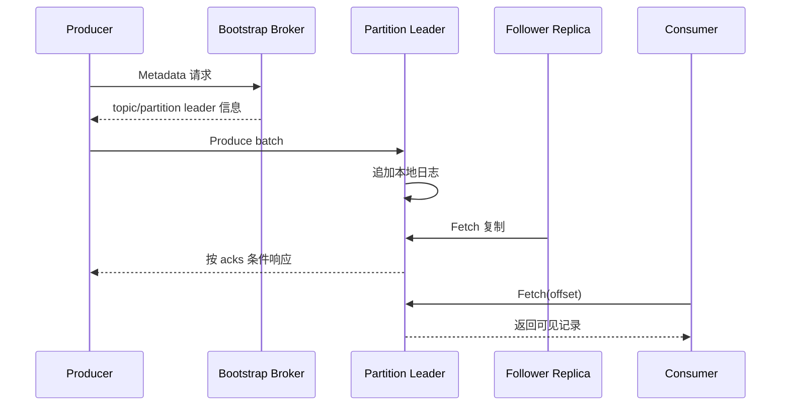
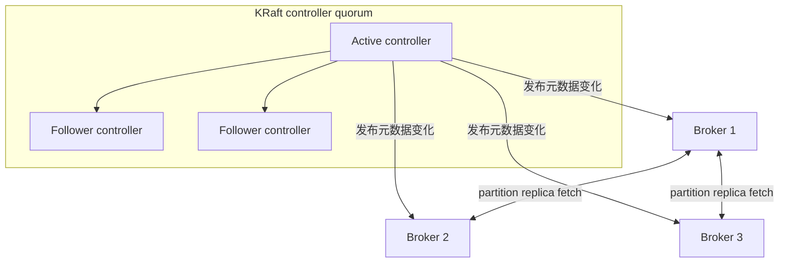

# 01｜核心模型与 KRaft 架构：先分清控制面与数据面

> 核心结论：Kafka 的基本抽象不是“消息被取走的队列”，而是“可按 offset 重复读取的分区追加日志”。扩展性来自 partition，容错来自 partition replica，集群元数据一致性来自 KRaft controller quorum。

## 1. 一条 event 的逻辑坐标

一条记录通常包含 key、value、timestamp、headers。写入后，它的逻辑坐标是：

```text
(topic, partition, offset)
```

- **topic** 是逻辑数据集；
- **partition** 是有序日志与并行单元；
- **offset** 是记录在该 partition 中的位置，不是全局 ID，也不是时间戳。

Kafka 只保证 partition 内的日志顺序。若 `accountId=A` 始终被映射到同一 partition，则 A 的事件可保持该 partition 内顺序；A 与 B 分属不同 partition 时没有全局先后保证。

### 三个容易漏掉的边界

1. 顺序是 broker 日志中的顺序，不自动等于业务事件发生时间顺序；迟到事件仍可能后写入。
2. key 到 partition 的映射依赖 partitioner 与 partition 数。扩分区可能改变映射。
3. 消费端并发处理可再次打乱完成顺序；按序拉取不等于按序完成副作用。

## 2. Kafka 为什么不是传统工作队列

传统队列常以“消息被某个消费者取走/确认后消失”为中心；Kafka 将消费位置与数据生命周期解耦：

- broker 按保留策略保存日志，不因某个 consumer 已读就立即删除；
- consumer 保存自己的位置，可 `seek` 回旧 offset 重放；
- 不同 consumer group 拥有独立进度，可同时读取相同数据；
- 同组内，一个 partition 在同一代 assignment 中只交给一个 member，借此实现负载分配。

所以同一个 topic 可同时服务实时计算、搜索索引、审计归档和离线回放，而无需复制四份生产流量。

## 3. 数据面：客户端直接找 partition leader



`bootstrap.servers` 只用于发现集群，不是永久代理。客户端拿到元数据后直接访问目标 leader。因此生产环境中 `advertised.listeners` 必须是客户端实际可达的地址；“能连 bootstrap 但发送失败”常是后续发现的 broker 地址不可达。

数据面主要包含：

- Producer 对 partition leader 的 Produce 请求；
- follower 对 leader 的 Fetch 请求以复制日志；
- Consumer 对 leader 的 Fetch 请求；
- group coordinator 处理组成员与位点协议。

## 4. 控制面：KRaft 元数据日志

现代 Kafka 使用 KRaft（Kafka Raft）管理集群元数据。若干 controller 组成 quorum，维护一份复制的元数据日志；其中 leader controller 处理元数据变更，其他 voter 复制并在故障时参与选举。

典型元数据包括：

- broker 注册与存活状态；
- topic、partition、replica assignment；
- partition leader 与 ISR 变化；
- 配置、ACL 等集群级对象。

关键分离：controller 决定“谁是 leader、有哪些副本”，broker leader 承担“记录如何读写”。元数据 quorum 正常不代表所有数据 partition 都健康；某数据盘损坏也不等于 controller quorum 失去多数派。



### 多数派的含义

3 个 controller voter 可容忍 1 个 voter 不可用，5 个可容忍 2 个。增加 voter 会提高可容忍数量，但也增加复制与运维复杂度。controller voter 数与 topic replication factor 是两套概念：前者保护元数据日志，后者保护业务 partition 数据。

## 5. broker、controller 与组合角色

节点角色由 `process.roles` 表达：broker 处理数据请求，controller 参与元数据 quorum。开发环境可将角色组合在同一进程；生产设计通常考虑将控制面与高负载数据面隔离，具体取决于规模与运维能力。

不要从“进程数”直接推导容错：

- 1 个组合节点仍无高可用；
- 3 个组合节点同时可形成 controller 多数派并放 3 份数据，但一次节点故障同时影响控制面 voter 和大量 partition replica；
- 独立 controller 不承载业务数据副本，它不能替代 broker 副本。

## 6. 元数据变化示例：leader 故障

假设 partition `payment-events-3` 的 replicas 为 `[B1, B2, B3]`，leader 是 B1：

1. B1 失联，controller 通过 broker 状态变化获知故障；
2. controller 从合格的同步副本中选择新 leader，例如 B2；
3. leader/epoch 等元数据被写入并提交到 KRaft 元数据日志；
4. broker 和客户端获得更新；
5. Producer/Consumer 对旧 leader 的请求收到错误或超时，刷新元数据后转向 B2。

这段窗口内短暂不可用是正常现象。客户端重试能恢复请求，但是否重复、是否超出业务 deadline，要结合幂等和超时设置讨论。

## 7. 设计 partition key 的方法

先写业务不变量，再选 key：

| 业务要求 | 候选 key | 风险 |
|---|---|---|
| 同一订单状态有序 | `orderId` | 大订单不会自然成为热点，通常较均匀 |
| 同一账户余额变化有序 | `accountId` | 头部账户可能形成热分区 |
| 同设备轨迹有序 | `deviceId` | 设备分布不均时需评估热点 |
| 只追求均匀吞吐 | null/粘性策略 | 不提供实体级顺序 |

key 设计是正确性和负载均衡的共同决策。发现热点后随意给 key 加随机后缀，会破坏同一实体顺序；更稳妥的办法可能是业务分片、两阶段聚合或单独隔离超级热点。

## 8. 必须掌握的不变量

1. offset 只在一个 partition 内单调定位。
2. 同一 consumer group 的一次稳定 assignment 中，一个 partition 最多归一个 member。
3. Producer/Consumer 的主要数据请求面向当前 leader，不通过 controller 转发。
4. controller quorum 保护集群元数据，replica set 保护业务日志。
5. 客户端元数据可能短暂过期，协议通过错误、epoch 与刷新完成收敛。

## 9. 深度检查题

1. 12 partition、3 broker、20 consumer 的组为什么最多 12 个 consumer 有活干？增加 broker 会改变这个上限吗？
2. bootstrap broker 宕机后，已经运行的客户端一定立刻停止吗？新客户端呢？
3. 把 controller 从 3 个扩到 5 个，能否让 replication factor=2 的业务数据容忍 2 台 broker 同时损坏？
4. topic 扩分区后，为何同一 key 的历史和新记录可能分居不同 partition？业务如何迁移？
5. 为什么“每个 topic 一个全局 offset”会限制水平扩展？

