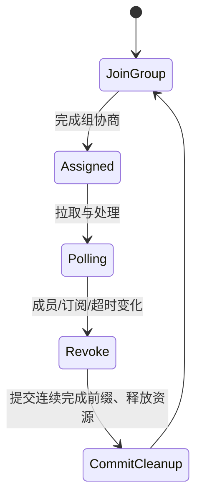

# 04｜Consumer Group、位点与再均衡：真正的难点是处理进度

> 核心结论：Consumer 拉取记录与提交进度是两件事。组协议解决 partition 归谁处理，committed offset 解决故障后从哪里恢复；重复或丢失通常来自“业务副作用”和“进度提交”的非原子窗口。

## 1. 三个位点不要混淆

对一个 partition，至少区分：

- **log end offset**：broker 当前日志末尾；
- **fetch position**：当前 consumer 下一次准备拉取的位置；
- **committed offset**：组故障恢复时持久化的下一条位置。

```text
committed=100       position=130                   logEnd=160
      | 已提交恢复点 | 已拉取、可能正在处理的区间 | 尚未拉取 |

lag 常近似观察 logEnd - committed（具体工具口径需确认）
```

position 前进不代表业务处理成功；poll 返回一批记录后，position 已可向后移动，但记录可能仍在内存队列或线程池中。

## 2. Consumer Group 如何获得并行度

一个 group 订阅若干 topic，coordinator 管理成员与代次，assignment 策略把 partition 分给 member。同一稳定代次中，一个 partition 不会同时交给两个有效成员正常消费。

并行度上限由 partition 数决定：12 partition、20 member，最多 12 个 member 获得 partition。增加 consumer 只能在已有 partition 间重新分配；不能把单个 partition 同时拆给两个普通组成员保持协议内顺序消费。

多个 group 互不分流：支付风控组和审计组可各自完整读取 payment-events。

## 3. poll loop 的职责

典型单线程模型：

```java
while (running) {
    ConsumerRecords<K, V> records = consumer.poll(timeout);
    for (ConsumerRecord<K, V> record : records) {
        process(record); // 业务副作用
    }
    consumer.commitSync();
}
```

这里至少有网络拉取、心跳/组管理、反序列化、业务处理和位点提交。若 `process` 太慢，poll 间隔超过组协议允许的处理间隔，coordinator 可认为成员不能正常推进并触发再均衡；旧 consumer 之后提交还可能面对代次/assignment 已变化。

不能只通过把 session timeout 调大掩盖慢处理，应区分：

- consumer 进程真的死亡；
- poll 线程被长业务阻塞；
- 下游依赖慢；
- 单批记录过多；
- GC/STW 或 CPU 饥饿。

## 4. 两个经典失败窗口

### 先提交，后处理：可能丢业务处理

```text
poll(offset 100)
commit(next=101) 成功
进程崩溃
process(100) 未发生
重启从 101 开始
```

Kafka 记录没有丢，但该 group 的业务跳过了 offset 100，形成 at-most-once 倾向。

### 先处理，后提交：可能重复业务处理

```text
poll(offset 100)
数据库更新成功
进程崩溃
commit(next=101) 未发生
重启仍从 100 开始
数据库再次更新
```

这是常见 at-least-once 模型。解决重点不是幻想没有崩溃窗口，而是让 `process(100)` 可幂等：例如以 `eventId` 唯一约束、状态版本 CAS 或 inbox 表拒绝重复。

## 5. 提交的是“下一条 offset”

处理完 offset 100 后通常提交 101，含义是“0～100 已完成，下次从 101 开始”。手工管理位点时 off-by-one 是高频错误。

批量并发时更危险：若 100、102 完成但 101 未完成，不能简单提交 103，否则崩溃后会跳过 101。安全提交点必须是**连续完成前缀**：

```text
完成集合 = {100, 102, 103}
可提交 next offset = 101
```

## 6. 自动、同步、异步提交

- **自动提交**：简化代码，但提交时机与实际业务完成常不严格一致，必须理解客户端在 poll 调用中的真实行为与间隔。
- **同步提交**：调用方等待结果，错误处理直观，但增加阻塞延迟。
- **异步提交**：吞吐更好，但回调可能乱序到达；旧 offset 的迟到成功/重试策略若处理不当会让进度倒退或语义混乱。

策略选择必须回答：一批中部分成功怎么办？partition 被 revoke 前如何提交？失败记录是阻塞、重试、旁路到 DLT，还是暂停该 partition？

## 7. 再均衡状态变化

成员加入、离开、超时，订阅 topic partition 变化等都可能触发 assignment 调整。



Eager 风格再均衡可能先撤销较多 assignment 再整体分配；cooperative/incremental 思路减少一次迁移范围，但不能消除业务处理与 revoke 的协调问题。静态成员身份可减少短暂重启引起的成员抖动，但实例标识必须唯一，且真正故障仍需超时接管。

### revoke 回调中的正确动作

1. 停止向即将撤销的 partition 接收新任务；
2. 等待或取消在途任务，必须有明确 deadline；
3. 计算每个 partition 的连续完成前缀；
4. 提交仍归自己且安全的位点；
5. 释放该 partition 的缓存、文件或数据库会话。

## 8. 并发处理模型

### 模型 A：一个 consumer 线程处理全部

最容易保证 partition 内顺序，但慢业务会拖慢 poll。适合处理轻、partition 数足够的场景。

### 模型 B：按 partition 建串行执行器

poll 线程分发到每 partition 队列，同 partition 串行、不同 partition 并行。需要背压、pause/resume、连续 offset 跟踪和 revoke 协议。

### 模型 C：记录级线程池

吞吐可能高，但同 partition 完成乱序、位点水位计算与错误隔离复杂。若业务要求 key 顺序，必须确保同 key 路由到同一串行 lane。

无论哪种模型，KafkaConsumer 客户端对象通常都不应被多个业务线程随意并发调用；采用单 owner 线程和受控命令队列更清晰。

## 9. lag 的正确诊断

lag 是结果，不是根因。至少拆成：

```text
流入速率 λin
可持续处理速率 λout
积压 L
预计追平时间 ≈ L / (λout - λin)，仅当 λout > λin
```

检查顺序：

1. 是全部 partition 还是少数热点？
2. committed offset 不动，fetch position 是否在动？
3. consumer CPU、GC、线程池队列、下游延迟如何？
4. 是否在反复再均衡或反序列化失败？
5. broker fetch latency、网络和磁盘是否异常？
6. 生产流量是否刚突增，处理能力是否仍大于流入？

只增加 consumer 在这些情况下无效：consumer 已多于 partition、热点集中单 partition、瓶颈在共享数据库、再均衡使有效工作时间下降。

## 10. 深度检查题

1. poll 已返回 100～199，处理到 149 后崩溃；自动/手动提交分别可能从哪里恢复？
2. 为什么批量并发不能提交“已完成记录中的最大 offset + 1”？
3. consumer lag 增长但 CPU 很低，列出至少五个假设及验证证据。
4. 把 `max.poll.interval` 无限调大，会损失什么故障恢复能力？
5. DLT 成功写入但原 partition offset 未提交，重启后会发生什么？如何让旁路操作可幂等？

