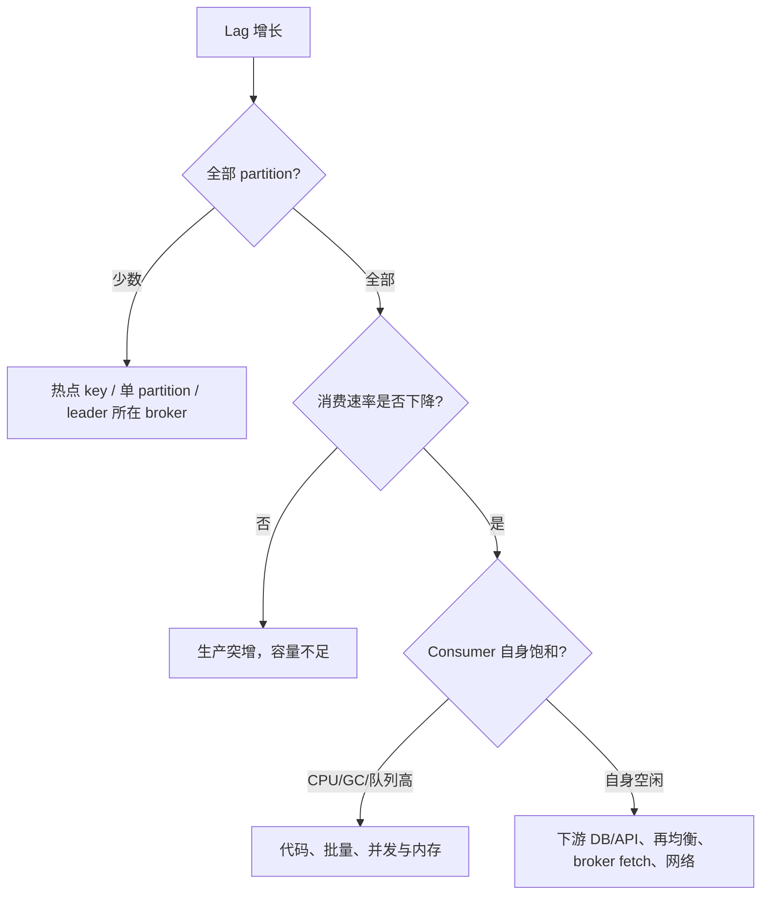

# 07｜生产设计、容量规划与排障：从 SLO 反推系统

> 核心结论：没有脱离 workload 与故障模型的“最佳参数”。先定义吞吐、尾延迟、保留期、恢复点、恢复时间和故障域，再用实测单 partition/单 broker 能力与安全系数规划。

## 1. 先写 SLO 和故障模型

示例：

```text
峰值写入：80,000 records/s
平均/峰值记录：1.5 KiB / 100 KiB
保留：7 天
端到端 p99：2 s
同 accountId 有序
允许重复投递，不允许重复扣款
容忍：任意 1 台 broker 或 1 个机架故障
积压恢复：流量恢复后 30 分钟内追平
```

还要说明不可同时保证的极端情况：整个地域丢失是否容忍数据丢失？跨地域复制是同步还是异步？网络分区时优先写可用还是拒绝不安全写？

## 2. 存储粗算

原始每日写入量：

```text
Vraw = records/s × avgBytes × 86400
```

以 80,000 × 1.5 KiB 计算，原始流量约 10 TiB/天量级。实际磁盘需求：

```text
Vdisk ≈ Vraw × retentionDays × replicationFactor
        × compressionRatio × (1 + indexAndSegmentOverhead)
        × headroom
```

其中 `compressionRatio` 若定义为“压缩后/压缩前”则小于 1。还需加入：

- 峰值而非仅平均值；
- segment 延迟删除与 compaction 临时空间；
- 副本重建期间的网络/磁盘余量；
- broker/机架故障后剩余节点承载能力；
- 操作系统与其他 topic 空间；
- 未来增长和重放读取。

不要用满盘作为容量目标。Kafka 在磁盘逼近耗尽时的恢复远比提前扩容危险。

## 3. 分区数推导

分区数至少受四个上限约束：

```text
Pwrite = 峰值总写入吞吐 / 实测单 partition 可持续写吞吐
Pread  = 峰值总消费吞吐 / 实测单 consumer-lane 可持续吞吐
Pparallel = 期望最大有效 consumer 并行度
P = max(Pwrite, Pread, Pparallel) × 安全系数
```

还要约束：

- partition 过少会形成吞吐/并行瓶颈，扩分区又可能改变 key 映射；
- partition 过多增加元数据、文件、选主、再均衡和客户端内存开销；
- 单 key 永远受单 partition 串行能力限制；
- broker 数增加不自动改变既有 partition 数与 key 热点。

必须在接近真实记录大小、压缩、acks、RF、磁盘和 consumer 逻辑的环境实测，不能引用网上“每 partition X MB/s”的常数。

## 4. 副本与故障域

常见生产起点是 replication factor=3，并配合跨机架分配与 `min.insync.replicas`，但是否足够取决于故障模型。

三份副本放在同一物理宿主/同一机架，并不能抵御该故障域。设计应验证：

- broker rack 标识是否正确；
- replicas 是否跨 rack 分布；
- 任一 rack 下线后 ISR 和容量是否仍满足目标；
- controller quorum voter 是否跨独立故障域；
- 维护时是否会与已有副本异常叠加。

滚动维护前要看当前 URP/ISR；已有一份落后时再主动停另一台，可能越过安全余量。

## 5. 吞吐、延迟与资源的因果图

```text
更大 batch/linger ─→ 更高吞吐与压缩率 ─→ 单条排队延迟可能上升
更多 partition   ─→ 更高并行潜力       ─→ 元数据/文件/再均衡成本上升
更多副本          ─→ 更强容灾           ─→ 写网络与磁盘放大
更严格 min ISR    ─→ 更强已确认安全性    ─→ 故障期可写性下降
更长 retention    ─→ 更强回放能力        ─→ 存储与恢复成本上升
```

参数调优必须标注改善哪个 SLI、牺牲什么、如何回滚。

## 6. 监控分四层

### 集群正确性

- offline/unavailable partition；
- under-replicated partition 与 ISR shrink/expand；
- controller/quorum 健康与 broker 注册；
- 不安全选主相关事件；
- 磁盘使用率和剩余时间预测。

### broker 饱和度

- Produce/Fetch 请求率、错误率、p95/p99 延迟；
- request queue、network/IO thread 饱和；
- 每 broker/partition bytes in/out；
- 磁盘延迟、吞吐、IO utilization、页缓存压力；
- JVM GC、heap、CPU、网络丢包/重传。

### Producer

- record error/retry rate；
- request latency、queue time；
- batch size、records per request、compression ratio；
- buffer available、阻塞时间；
- metadata refresh 与超时。

### Consumer/业务

- partition lag 与 lag 增长率；
- records consumed/processed rate；
- poll 间隔、再均衡次数与时长；
- 处理延迟、失败/重试/DLT；
- 下游 DB/API latency、连接池、锁等待；
- eventId 去重命中与业务对账差异。

仅看 broker 健康无法证明业务数据已正确落库。

## 7. 故障树一：Consumer lag 持续增长



证据链示例：lag 只集中 P7 → P7 输入是其他分区 8 倍 → key top-N 显示超级账户 → consumer CPU 并未全局饱和。结论应是热点模型问题，而不是“加 10 个 consumer”。

## 8. 故障树二：Producer p99 突升

按时间关联：

1. 是否发生 leader/ISR 变化？
2. retry/error/metadata refresh 是否上升？
3. record queue time 还是 broker request latency 上升？
4. 仅某 broker/partition 还是全局？
5. broker request queue、磁盘 p99、网络、GC 是否同步变化？
6. batch 是否突然变小（流量形态改变）或压缩 CPU 是否饱和？
7. 下游业务线程是否因 buffer 满而阻塞？

`TimeoutException` 是总时间预算耗尽的结果，根因可能是元数据不可用、排队、网络、broker 慢或 ISR 不满足，不能把 timeout 自身当根因。

## 9. 变更与应急原则

- topic 扩分区前评估 key 重映射和历史顺序；
- 降低 min ISR、启用不安全选主属于可靠性降级，必须有显式审批和数据风险说明；
- broker 滚动重启前确认没有现存 URP、磁盘告警和副本迁移；
- 大规模 reassignment 要限速并观察前台请求延迟；
- 磁盘告急优先控制流入、扩容/迁移和确认保留策略，不在未知影响下直接删除日志目录；
- 客户端参数分批灰度，比较 p99、错误率、吞吐和资源，不只看是否启动成功。

## 10. 订单案例设计骨架

针对 80k records/s 案例，合格方案应这样推导，而不是直接给分区数：

1. `accountId` 作为 key 保证账户内 partition 顺序，并评估超级账户热点；
2. 用真实 1.5 KiB/峰值记录、目标压缩、acks=all、RF=3 测单 partition 能力；
3. 用第 3 节公式得到初始 partition 数并留增长余量；
4. RF=3、跨 rack，min ISR 根据“坏 1 台仍可写且保留两份同步确认”的目标设计；
5. Producer 使用幂等安全配置和稳定 `eventId`；
6. Consumer 先完成 MySQL 本地事务（inbox 唯一键 + 余额更新）再提交 offset；
7. 以峰值积压和 `λout-λin` 验证 30 分钟恢复目标；
8. 监控 partition 热点、ISR、p99、lag、DB 去重与对账；
9. 演练 broker/rack 故障、响应超时、consumer 崩溃和 DB 慢查询。

## 11. 最终答辩题

1. 业务说“绝不丢”，你需要追问哪些故障范围和确认边界？
2. 为什么平均磁盘利用率 40% 仍可能有一个 broker 的 partition p99 很差？
3. topic 扩分区为何既是容量操作也是语义变更？
4. 当 `λout <= λin` 时，为什么扩容前计算的“追平时间”不存在？
5. 同时看到 ISR shrink、Producer retry、Consumer lag 上升，如何用时间线判断谁是原因、谁是结果？

