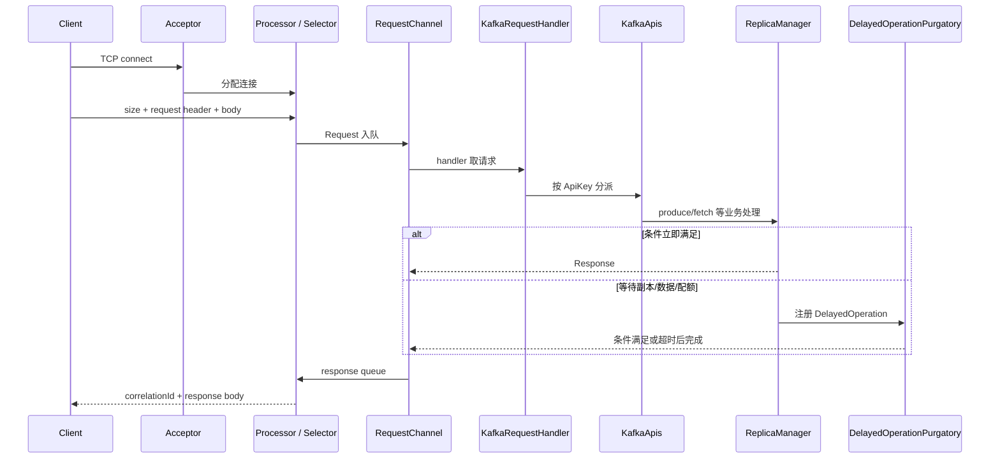

# 08｜Broker 网络层与请求处理流水线：一个请求如何穿过 Kafka

> 实现基线：Kafka 4.x。源码类与模块会重构，但“网络线程负责收发、请求线程负责业务、延迟条件不阻塞线程”的设计长期稳定。

## 1. 先看完整路径



核心目的：慢磁盘、等待 follower、长轮询或配额限流不能让有限的 request handler 线程原地睡眠，否则少量慢请求即可耗尽整个 broker 的处理能力。

## 2. 二进制协议的最小骨架

Kafka 协议运行在长连接 TCP 上。概念上一个请求包含：

```text
frameSize
requestHeader {
  apiKey, apiVersion, correlationId, clientId, ...
}
requestBody
```

响应带相同 `correlationId`，客户端据此把异步响应匹配到 in-flight request。`apiVersion` 允许同一 API 演进字段；客户端通常先通过 `ApiVersions` 协商 broker 支持范围。

必须区分三种兼容性：

- **线协议版本**：Produce/Fetch 等 API 的版本；
- **消息格式/record batch**：磁盘与传输记录布局；
- **集群 feature level**：集群启用哪些能力。

客户端 jar 版本与 broker 版本不同不必然失败，真正边界由双方支持的协议与 feature 决定。

## 3. Acceptor 与 Processor 为什么分开

Acceptor 监听端口并接收新连接，再把连接分配给某个 Processor。Processor 使用 Java NIO Selector 管理一组连接的读写就绪事件。

Processor 的热路径应该短：

1. 完成认证状态机和网络读；
2. 解析完整 frame，构造 request；
3. 放入 RequestChannel；
4. 从 response queue 取响应并异步写回；
5. 管理 mute/unmute、连接关闭和配额节流。

若把磁盘追加或复杂授权查询直接放在 Processor 上，一个慢请求会阻塞该 Processor 管理的许多连接。这正是网络线程与 IO/request 线程池解耦的原因。

## 4. RequestChannel 是背压边界

RequestChannel 连接网络层和业务处理层。请求队列持续增长说明进入速度大于 handler 消化速度，可能原因包括：

- handler 数量不足或被慢逻辑占用；
- Produce/Fetch 的本地处理变慢；
- 授权、配额或消息格式转换成本升高；
- 大请求造成单次 CPU/内存压力；
- 下游日志目录异常导致处理路径反复失败。

不要看到队列大就直接增加 `num.io.threads`。若瓶颈是磁盘，更多线程可能增加上下文切换和 IO 排队。应同时对照：

```text
RequestQueueTimeMs
LocalTimeMs
RemoteTimeMs
ResponseQueueTimeMs
ResponseSendTimeMs
KafkaRequestHandlerPool idle percent
NetworkProcessor idle percent
```

总延迟拆分比单个 p99 更能定位饱和层。

## 5. KafkaApis：协议入口，不是所有逻辑的终点

`KafkaApis` 按 ApiKey 分派，例如 Produce、Fetch、Metadata、ListOffsets。它负责协议级校验、授权、调用领域组件并组织 response；真正状态通常在下层：

| 请求 | 主要下钻方向 |
|---|---|
| Produce | `ReplicaManager → Partition → UnifiedLog` |
| FetchConsumer/FetchFollower | `ReplicaManager` 的 fetch 路径、partition log read |
| Metadata | 当前 metadata cache/image |
| OffsetCommit/Group APIs | Group coordinator |
| InitProducerId/Txn APIs | Transaction coordinator |
| Controller APIs | controller/raft 相关处理路径 |

读源码时不要在 `handleProduceRequest` 看见回调就停止。要继续追踪“何时追加”“何时满足 acks”“回调由谁触发”。

## 6. DelayedOperationPurgatory 解决什么

“炼狱”不是失败队列，而是等待条件的非阻塞注册表。典型场景：

- `acks=all` 的 Produce 等待足够副本推进；
- Fetch 等待累积到 `min.bytes` 或到达 `max.wait`；
- 某些 group/事务操作等待状态条件。

一个 delayed operation 具有：

```text
tryComplete(): 条件是否已经满足
onComplete(): 只执行一次的完成动作
onExpiration(): 超时时的动作
watchKeys: 哪些状态变化应触发重新检查
```

竞争点在于“状态刚变满足”和“刚注册 watcher”可能交错，所以实现通常要在注册前后检查，并保证完成动作幂等。源码阅读重点不是容器类型，而是避免 lost wakeup 与 double completion 的并发协议。

## 7. Produce 请求的等待时间如何形成

```text
TotalTime = QueueTime + LocalTime + RemoteTime
          + ResponseQueueTime + ResponseSendTime
```

- QueueTime 高：handler 来不及取请求；
- LocalTime 高：校验、追加、磁盘/锁等本地路径慢；
- RemoteTime 高：`acks=all` 等待 follower/ISR 条件；
- ResponseQueueTime 高：Processor 回写不及时；
- SendTime 高：客户端读慢、网络拥塞或大响应。

这也是为什么“Producer 请求慢”不等于“leader 磁盘慢”。

## 8. Fetch 长轮询为什么不浪费线程

Consumer 设置 fetch 最小数据量与最大等待时间。数据不足时，broker 注册 delayed fetch，handler 线程返回处理其他请求；新数据追加会触发相关 watch key 检查，条件满足即构造响应，超时则返回当前可用数据。

这实现了两件事：低流量时避免客户端空转轮询，高流量时数据一够就尽快响应。代价是 broker 需要维护等待操作和触发关系。

## 9. 源码阅读顺序

1. 从协议生成定义理解 ApiKey、request/response schema；
2. 看 `SocketServer`、Acceptor、Processor 的线程边界；
3. 看 `RequestChannel.Request/Response` 如何传递时间戳；
4. 看 `KafkaRequestHandler` 如何消费请求；
5. 选 Produce 进入 `KafkaApis`；
6. 跟到 `ReplicaManager.appendRecords` 类路径；
7. 最后看 delayed produce 的完成和 response 回送。

### 调试建议

先在方法入口记录：`correlationId/apiKey/clientId/threadName/topicPartition`。不要逐字节打印 payload；它会改变时序、泄露数据并淹没关键事件。

## 10. 检查题

1. 为什么增加 network threads 不能解决 request handler 被磁盘拖慢的问题？
2. Fetch 等待 500ms 时，为什么不会占住一个 handler 线程 500ms？
3. correlationId 解决什么问题？TCP 已有序为何还需要它？
4. `RemoteTimeMs` 上升时应优先检查哪些副本指标？
5. 请求队列和响应队列分别增长，根因方向有何不同？

