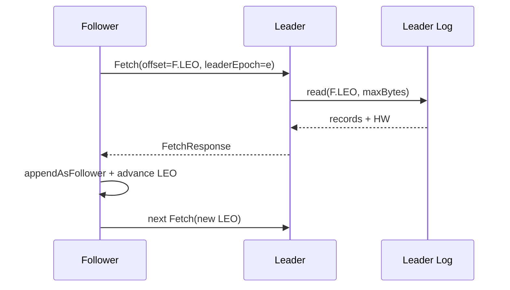

# 10｜副本复制、HW 与 Leader 切换：安全前缀如何形成

> 核心结论：Kafka follower 主动向 leader Fetch；leader 根据副本进度维护同步集合和可提交水位。确认、消费者可见性与故障选主都围绕“哪些副本拥有一致前缀”展开。

## 1. follower pull，而不是 leader push

每个 follower replica 周期性向 leader 发送 Fetch，请求从自身 LEO 开始的 batch：



pull 的好处是 follower 自己控制批量与节奏，leader 复用 Fetch 协议；代价是 leader 需要从后续 fetch 请求/确认中推断 follower 已经持久到哪里。

## 2. 四个位置

- **log start offset**：本地仍保留的最早位置；
- **LEO**：本副本下一写入位置；
- **HW**：已提交且普通 consumer 可见的边界；
- **LSO**：`read_committed` 下受未完成事务约束的稳定边界。

不能用 `leader LEO - follower LEO` 一项判断安全：副本是否仍在 ISR、最后 fetch/caught-up 时间、leader epoch 是否一致都影响资格。

## 3. ISR 的滞后判定

assignment 是期望副本集合，ISR 是动态同步集合。follower 持续 fetch 并在允许时间内追到 leader 的进度，才能留在 ISR。判断通常更关注“多久没有及时追上”，而不只是固定消息条数，因为不同流量下相同条数代表完全不同时间风险。

ISR 缩减时发生两个后果：

1. 可参与安全 leader 选择的副本减少；
2. `acks=all + min ISR` 的写入可用性可能下降。

ISR 扩张前 follower 必须先追平要求的日志边界，不能仅因进程重新上线就加入。

## 4. HW 推进不是取 leader LEO

简化理解：leader 根据合格副本的复制位置计算所有相关副本都已覆盖的安全前缀，HW 不能超过这个前缀。随后 follower 在 fetch response 中获知 leader HW，更新自身水位。

一个细节：leader 对 follower 复制位置的认识有网络时序延迟。follower 刚写完 batch 后，leader 通常要从后续交互才知道它已推进。因此 HW/确认推进可能多一个 fetch 往返，具体优化随版本变化。

## 5. `acks=all` 的 delayed produce

leader 本地 append 完成后，如果所需副本尚未覆盖该 batch，Produce 请求不会占着 handler 阻塞，而是注册 delayed produce：

```text
requiredOffset = 此次 append 后的 offset 边界
完成条件：目标 partition 的复制状态满足 required acks/min ISR
触发事件：follower fetch 进度、ISR 变化、超时
```

若等待期间 ISR 跌破最小值，返回副本不足类错误；若 deadline 到达仍未满足，返回 timeout。客户端看到超时时结果可能未知：日志稍后可能达到确认边界，也可能在 leader 切换中被截断，必须由幂等重试协议处理。

## 6. leader epoch 防止过期历史

只比较 offset 不足以判断两个日志是否来自同一 leader 历史：

```text
旧 leader epoch=7: offsets 0..120
新 leader epoch=8: offsets 0..115, 然后写入新 116..130
```

旧 leader 恢复时本地虽有到 120 的“更长日志”，但 116..120 可能是未提交分叉。leader epoch cache 记录各任期起始 offset；副本通过 epoch/末尾查询找到共同前缀，截断分叉后再复制当前 leader。

不变量：**更长不代表更新，任期与已提交前缀共同决定正确历史。**

## 7. controller 发起 leader 变化

数据 leader 故障时：

1. controller 获知 broker fencing/失联；
2. 根据 partition 状态和选主规则选择候选副本；
3. 在元数据日志中记录新 leader、leader epoch、ISR 等变化；
4. broker 应用新 metadata image/delta；
5. 新 leader 初始化 partition 状态，followers 切换 fetch source；
6. 客户端收到 not-leader/epoch 错误并刷新 metadata。

controller 决策和数据日志复制属于两条链路。controller 不把旧 leader 的业务数据复制给新 leader，它依赖候选副本本来就有安全日志。

## 8. clean 与 unclean 选主

从同步/合格副本中选 leader，目标是保持已确认前缀。若没有合格副本：

- 等待副本恢复：数据安全优先，但 partition 不可用；
- 允许落后副本成为 leader：可用性恢复，但可能丢失已确认/已可见尾部。

这不是免费容灾开关，而是明确的数据损失选择。现代版本还可能存在 eligible leader replica 等演进机制；阅读时以当前 feature level 和官方配置为准，不把新旧选主集合混成一个 ISR 概念。

## 9. 截断必须联动哪些状态

日志截断不只是删 `.log` 尾部，还要使这些状态一致回退：

- offset/time/transaction indexes；
- leader epoch cache；
- ProducerStateManager 与 producer snapshots；
- HW/LSO 等水位；
- remote/tiered storage 辅助状态（若启用）。

只修改日志文件会让幂等序列、事务可见性或索引指向不存在位置，因此绝不能手工删除单个 segment 来“修复副本”。

## 10. 故障推演

RF=3，ISR=[B1 leader, B2, B3]，min ISR=2：

1. B3 慢被移出 ISR，写仍可能成功，但安全余量已下降；
2. B2 随后故障，ISR 只剩 B1，`acks=all` 新写应失败；
3. 若应用降为 acks=1 继续写，B1 又永久损坏，尾部可能无其他副本；
4. B3 恢复并非自动拥有该尾部，它只持有落后历史；
5. 若强制让 B3 unclean 当 leader，以可用性换取数据缺口。

所以“RF=3 可坏两台”缺少并发故障、同步状态与写入策略条件，是不合格表述。

## 11. 源码阅读路线

1. follower fetcher 的 fetch state 与请求构造；
2. follower `appendAsFollower` 和 epoch 校验；
3. `Partition` 中 replica progress/ISR/HW 更新；
4. `ReplicaManager` delayed produce 完成检查；
5. controller partition change record 的生成；
6. broker metadata publisher 应用 leader/ISR 变化；
7. divergence 后的 epoch end offset 与 truncate 路径。

## 12. 检查题

1. follower 已 append 某 batch，leader 为什么可能还不能立刻确认它？
2. HW、LEO、LSO 分别限制哪类读写行为？
3. 旧 leader 恢复时日志更长，为何仍可能必须截断？
4. ISR 收缩但 Producer 尚无报错，运维为什么仍应告警？
5. unclean leader election 恢复了什么，又牺牲了什么？

