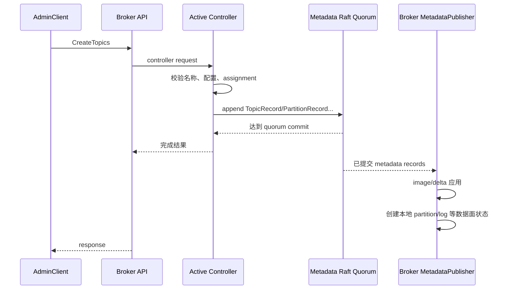

# 11｜KRaft 元数据日志与控制器：Kafka 如何让控制面一致

> 核心结论：KRaft 把集群元数据变化写成复制日志。Raft 层决定哪段元数据日志已提交，controller 层把管理请求转成元数据记录；broker 通过已发布的 metadata image 驱动数据面状态。

## 1. 三层不要混在一起

```text
Raft quorum layer
  负责 leader election、epoch、replication、commit high watermark、snapshot

Quorum controller layer
  负责 topic/partition/broker/config/ACL 等领域状态机和合法性校验

Broker metadata application layer
  订阅已提交元数据，构造 MetadataImage，驱动 ReplicaManager 等组件
```

Raft 只复制“记录”，并不理解创建 topic 是否合法；QuorumController 理解领域规则，但不自己实现多数派协议；broker 只应用已提交 image，不能自行宣布 partition leader。

## 2. 元数据写入时序

以创建 topic 为例：



管理请求成功的核心是元数据变化已进入提交历史，而不是每个 broker 都已完成所有本地异步动作。因此刚创建 topic 后的短窗口仍可能看到客户端元数据传播与本地初始化延迟。

## 3. Raft 角色与 epoch

controller voter 在不同时间可能处于 unattached/candidate/prospective/follower/leader 等实现状态。稳定不变量是：

- 一个 epoch 最多有一个合法 leader；
- 只有 leader 接受追加；
- follower 从 leader fetch 元数据日志；
- 多数 voter 覆盖的前缀才能提交；
- 新 leader 必须具备足够新的日志，不能靠更高 node id 获胜。

随机化 election timeout 用于减少多个候选者同时发起选举的碰撞。epoch 类似 fencing generation：来自旧 leader/旧 epoch 的请求必须被识别为过期。

## 4. 元数据日志 HW 与业务 partition HW

两者名字相似，但属于不同日志：

| 水位 | 日志 | 决定什么 |
|---|---|---|
| metadata log HW | `__cluster_metadata`/Raft 日志 | 哪些控制面记录已被 quorum 提交 |
| data partition HW | 业务 partition | 哪些业务记录进入已提交可见前缀 |

controller quorum 健康只证明控制面可继续提交元数据，不证明所有业务 partition ISR 健康。业务 broker 副本都丢失时，controller 仍可能完整知道“这个 partition 应该存在”，但无法凭元数据重建业务内容。

## 5. QuorumController 的单写者状态机

控制器需要原子地验证旧状态并生成一组记录。例如 broker 注销可能同时影响许多 partition leader/ISR。常见设计是把事件提交到 controller event queue，由单一逻辑线程顺序处理状态变更，降低大量共享锁复杂度。

概念过程：

```text
enqueue event
  → 从当前 committed/optimistic state 校验
  → 生成 metadata records
  → append 到 raft log
  → commit 后完成 future
  → failure 时回滚未提交的乐观状态/重新加载
```

阅读源码要找清楚 response Future 在“append”还是“commit”完成，以及 controller renounce leadership 时队列中未完成事件怎样失败。

## 6. MetadataImage 与 Delta

每次读取全部元数据重建 broker 状态成本过高。实现通常把已提交状态表示为不可变/可共享的 `MetadataImage`，新记录形成 `MetadataDelta`，应用后得到新 image。

好处：

- reader 可看到一致快照，减少在可变大 Map 上加锁；
- publisher 可按 delta 只处理变化部分；
- snapshot 可从某个 image 序列化；
- 测试可以对 records → image 状态机做确定性验证。

但 publisher 的副作用（创建日志、更新配额、ACL cache）不是 Raft 事务的一部分，必须设计成重复应用安全、按 offset/epoch 有序并可在重启时从 image 重建。

## 7. broker 注册、epoch 与 fencing

broker 启动向 controller 注册自身 node id、监听地址、rack、feature 等信息。controller 为注册生命周期维护 broker epoch/状态。旧进程即使网络恢复，也不能凭相同 node id 继续作为当前 broker；epoch/fencing 用于阻止“同 id 双活”。

这与 Producer fencing 思想相同：

```text
稳定逻辑身份 + 单调 generation/epoch
旧 generation 的写入或心跳必须拒绝
```

controller 根据 heartbeat/生命周期把 broker 标记 fenced/unfenced，并据此触发 partition leader 与 replica 状态变化。

## 8. snapshot 为什么必要

元数据日志会长期增长。新 controller 若从 offset 0 重放所有 topic、ACL、config 变更，启动时间不可控。snapshot 在某个已提交 offset/epoch 保存完整 metadata image；恢复时加载 snapshot，再重放之后的增量日志。

正确性约束：

- snapshot 必须对应已提交边界；
- 安装 snapshot 后日志起点可前移，但不能丢掉恢复所需状态；
- snapshot 写入应通过临时文件/原子完成标志避免半文件被当成有效；
- 旧 snapshot 清理要保留可恢复余量。

snapshot 不是备份替代品：多数故障域同时损坏时，本地 snapshots 也可能一起丢失。

## 9. controller 故障时发生什么

1. follower voter 超时未收到合法 leader 活动；
2. 发起新 election，epoch 增加；
3. 获得多数票且日志足够新的候选者成为 leader；
4. 新 active controller 从已提交 metadata image 接管；
5. 旧 controller 的未提交事件失败，旧 epoch 请求被 fencing；
6. broker 发现新 controller 并恢复心跳/管理通道。

短暂控制面不可用期间，已有 metadata 的数据面通常可继续处理许多 Produce/Fetch 请求；但 leader 选举、topic 创建、broker 注册等需要控制器推进的操作会受影响。这就是控制面/数据面分离的实际意义。

## 10. 源码阅读路线

1. `raft` 模块的 `KafkaRaftClient` 与 quorum state transitions；
2. metadata log append/fetch、HW 和 snapshot；
3. `QuorumController` 的 event queue 与 feature managers；
4. topic 创建如何生成 `TopicRecord/PartitionRecord`；
5. `MetadataImage/MetadataDelta` replay；
6. broker 侧 `BrokerMetadataPublisher` 如何更新 ReplicaManager；
7. broker heartbeat、epoch 与 fencing 状态机。

## 11. 检查题

1. controller leader 已选出，为何不能立即认为它知道所有已提交状态之外的旧 leader 内存事件？
2. metadata image 已包含某 partition，为何该 partition 仍可能 offline？
3. 3 voter quorum 丢 1 台和 RF=3 的 topic 丢 1 个 replica，分别影响什么？
4. publisher 为什么必须容忍重放/重复应用？
5. snapshot 能缩短恢复，为何不能替代跨故障域备份与演练？

