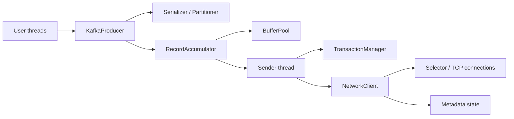

# 12｜Producer 客户端源码主线：业务线程与 Sender 如何协作

> 阅读目标：能从 `KafkaProducer.send()` 跟到 batch 完成，解释缓冲池耗尽、metadata 未就绪、in-flight 重试、幂等序列和 callback 线程上下文。

## 1. 组件关系



`KafkaProducer` 对多个业务线程提供线程安全入口；单个 Producer 通常应复用。Sender 是后台 IO 线程，负责 drain、发送、poll 网络、处理响应和重试。callback 常在该后台线程执行，慢 callback 会拖慢所有网络进展。

## 2. `send()` 的同步部分

虽然 API 异步，调用线程仍会完成很多工作：

1. 检查 Producer 是否关闭/遇到致命错误；
2. 序列化 key/value；
3. 等待或请求 topic metadata；
4. 估算 record size 并检查上限；
5. 选择 partition；
6. interceptor 链处理；
7. `RecordAccumulator.append`，必要时从 BufferPool 分配内存；
8. 唤醒 Sender；
9. 返回 Future。

因此 `send()` 可能因 metadata 未就绪或 buffer 不足阻塞，受总阻塞边界约束。异步不等于永不阻塞。

## 3. RecordAccumulator 的并发模型

Accumulator 按 `TopicPartition` 维护 batch deque。业务线程优先尝试向尾部 active batch 追加；容纳不下时申请新 buffer 创建 batch。

```text
P0 deque: [in-flight old] [ready batch] [active batch]
P1 deque: [ready batch] [active batch]
P2 deque: [active batch]
```

重要状态：

- batch 是否已满/linger 到期；
- partition 是否有 in-flight 限制；
- 对应 leader node 是否可发送；
- 是否正在 retry backoff；
- transaction manager 是否允许发送；
- delivery deadline 是否已过。

锁通常细化到 deque/batch 或短临界区，真正网络 IO 不在 append 锁内进行。

## 4. BufferPool 与背压

BufferPool 管理 Producer 用于 batch 的内存。申请失败时业务线程进入等待队列，其他 batch 完成并释放 buffer 后唤醒。

背压链：

```text
broker/网络变慢
→ in-flight 完成变慢
→ accumulator 待发 batch 增多
→ available buffer 降低
→ user thread 在 send 内等待
→ max block 到期后失败
```

盲目增大 `buffer.memory` 只会延迟背压并提高故障时内存/排队时间。应同时看 waiting threads、buffer available、record queue time 和 delivery timeout。

## 5. Sender 单次循环

简化为：

```text
runOnce
  → transactionManager.maybeResolveSequences / nextRequest
  → accumulator.ready(metadata, now)
  → metadata nodesReady / unknown leaders
  → accumulator.drain(nodes, maxRequestSize, now)
  → addToInflightBatches
  → NetworkClient.send(ClientRequest)
  → NetworkClient.poll(timeout)
  → handle responses/disconnects/timeouts
  → complete/retry/fail batch
```

`ready` 决定哪些 partition 达到发送条件；`drain` 按 leader node 聚合 batch，受单请求大小限制并考虑公平性，避免总从同一批 partition 开始导致饥饿。

## 6. NetworkClient 与 in-flight requests

NetworkClient 管理连接状态、ApiVersions、metadata 更新、请求超时与每 node 的 in-flight queue。请求发送后，response 通过 correlation id 匹配。

断连时不能简单把所有请求判为“broker 未执行”：

- 尚未真正写到 socket 的请求可明确重试；
- 已发送但响应未知的请求结果不确定；
- 可重试 batch 回到 accumulator，保留协议身份/序列；
- 不可重试或 delivery timeout 到期则完成 Future 异常。

## 7. metadata 的过期与刷新

Producer 缓存 topic partition → leader 映射。下列事件触发更新：

- 首次遇到未知 topic/partition；
- broker 返回 not leader、unknown topic、epoch 相关错误；
- 周期性刷新；
- partition 扩容或 leader 变化。

发送失败后的路径通常是：标记 metadata 需要更新 → 找可用 node 发 Metadata 请求 → 新 image 到达 → batch 重新按 leader drain。bootstrap 列表只负责初始发现。

## 8. 幂等序列在哪分配

TransactionManager 即使未显式开启跨 partition transaction，也可能负责幂等 Producer 的 PID/epoch 和 per-partition sequence。batch 首次发送前获得序列；可判定重试必须保持该序列，不能每次 retry 当新 batch 编号。

响应处理分类：

- 成功：推进已确认 sequence，完成 batch；
- duplicate sequence：在协议允许下视为已追加过；
- out-of-order/epoch invalid：触发 sequence 重置、PID 恢复或致命失败，取决于上下文；
- 可重试 leader/网络错误：re-enqueue；
- delivery timeout：batch 失败，但上层仍要面对未知结果边界。

## 9. 顺序与 in-flight 的联系

为了吞吐，单连接可有多个请求在途。若后发 batch 成功、先发 batch 失败重试，天然可能重排。幂等序列让 broker 拒绝非法跳序，并使客户端在错误后按状态恢复；这比简单强制 `max.in.flight=1` 更能兼顾吞吐。

但以下顺序不由单 Producer 状态机保证：

- 多 Producer 实例之间的业务发生顺序；
- partition 扩容后的 key 历史映射；
- Consumer 并发副作用完成顺序。

## 10. close 与 flush

`flush()` 等待此前已发送记录完成，不会把失败变成功，也不关闭 Producer。`close(timeout)` 尝试停止新发送、等待在途、关闭 Sender/网络和 serializer/interceptor。

若在 callback 的 Sender 线程内执行阻塞 close/flush，可能形成自我等待，因此实现通常需要特殊处理或明确禁止危险调用。最安全原则：callback 快速记录结果/投递到业务 executor，不做阻塞 IO。

## 11. 源码阅读断点

1. `KafkaProducer.doSend`；
2. metadata await/update 路径；
3. `RecordAccumulator.append/ready/drain/reenqueue`；
4. `BufferPool.allocate/deallocate`；
5. `Sender.runOnce/sendProducerData/handleProduceResponse`；
6. `NetworkClient.poll` 和 in-flight completion；
7. `TransactionManager` PID/epoch/sequence transitions；
8. Future/callback 完成与 buffer 释放顺序。

## 12. 检查题

1. Future 已返回但 callback 未执行，记录可能处于哪些状态？
2. broker 慢为什么最终会让业务线程阻塞在 `send()`？
3. callback 做 2 秒数据库查询会影响哪些其他 partition？
4. retry 时为何必须复用原 batch sequence？
5. metadata 过期与 broker 磁盘慢在指标上如何区分？

