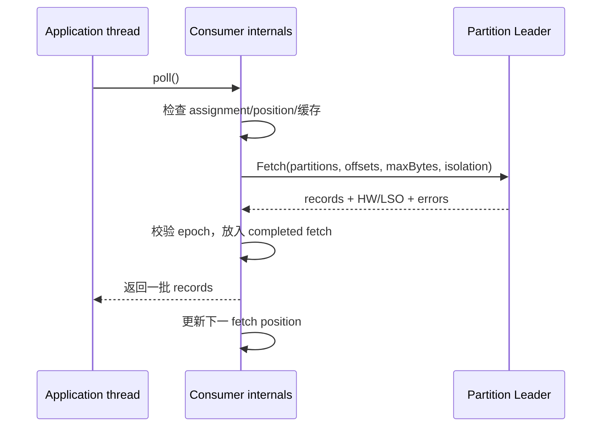

# 13｜Consumer 与 Group Coordinator 源码主线：位置、成员与分配状态机

> 核心结论：Consumer 不是“拉一条、提交一条”的薄客户端。它同时维护订阅、assignment、fetch position、缓存记录、组成员 generation/epoch 和 committed offset。客户端状态机与 broker coordinator 状态机通过协议共同收敛。

## 1. 客户端组件地图

Kafka 4.x Java client 中可见经典实现与较新的事件驱动 consumer internals；具体类会演进，但逻辑职责稳定：

```text
KafkaConsumer facade
├── SubscriptionState       订阅、assignment、position、pause
├── Fetch logic             构造 Fetch、缓存 records、更新 position
├── Coordinator logic       find/join/sync/heartbeat/leave/commit
├── Metadata                topic partitions 与 leader
├── NetworkClient           连接与请求
└── Background event loop   新实现中把网络/组协议与应用线程解耦
```

阅读时先识别当前配置选择的是哪套 group protocol/consumer delegate，再跟对应实现，不要把两套线程模型的方法拼成一个时序。

## 2. 五类位置状态

对每个 assigned partition，Consumer 至少维护：

- assignment 是否有效；
- fetch position：下一次向 broker 请求的 offset；
- 已返回给应用但未必处理的 records；
- committed offset 的本地缓存/查询结果；
- pause/reset pending 等控制状态。

`poll()` 返回 records 后 fetch position 可已经前进。若 records 还在业务线程池，不能用 position 直接当已处理水位。

### offset reset

当没有 committed offset，或目标 offset 已因保留被删除，客户端按 reset 策略请求 earliest/latest 等位置。`latest` 不等于跳到“最后一条”，而通常从当前 log end 之后等待新数据；选择策略是在定义无位点时丢历史还是重放历史。

## 3. Fetch pipeline



一个 Fetch request 可带同一 broker 上多个 partition。broker 可能受请求级和 partition 级 byte limit 影响；大 batch 需要有“即使超过常规上限也能取得首个完整 batch”的协议考虑，否则 consumer 可能永远卡在大 batch 前。

## 4. position 初始化

新 assignment 到来后：

1. 若应用显式 `seek`，使用指定位置；
2. 否则向 group coordinator 查询 committed offset；
3. 若有有效 commit，从该 next offset 开始；
4. 若无 commit/越界，根据 reset strategy 查询 ListOffsets；
5. position 可用后才构造 Fetch。

这解释了为什么刚分配 partition 时 poll 可能先做 coordinator/ListOffsets 请求而没有立即返回业务数据。

## 5. 经典 Group 状态机

经典协议可概念化为：

```text
Empty → PreparingRebalance → CompletingRebalance → Stable
  ↑             ↑                    ↓               |
  └──────────── Dead/Empty ← member leave/timeout ───┘
```

流程：FindCoordinator → JoinGroup → leader member 依据订阅和 assignor 计算方案 → SyncGroup 分发 assignment → heartbeat 保持 generation。

`generationId + memberId` 共同 fencing 旧成员。旧 generation consumer 即使仍在处理，也不能随意为已撤销 partition 提交 offset。

现代 consumer group protocol 可把更多分配工作放在 broker coordinator，并使用 member epoch 增量推进；它减少客户端 leader 依赖和某些全停式再均衡，但“旧 epoch 必须被 fencing、assignment 变更要协调 revoke”仍是不变量。

## 6. Group Coordinator 如何定位

group id 通过哈希映射到内部 offsets topic 的某个 partition，该 partition leader 所在 broker 充当该 group 的 coordinator。于是：

- group 状态可按 offsets partition 分片扩展；
- coordinator 迁移本质上常伴随内部 partition leader 变化；
- 新 coordinator 需加载该 partition 的 group/offset 状态；
- `NOT_COORDINATOR` 等错误驱动客户端重新发现。

所有 group 都用相同 id 会集中到一个 coordinator shard；大量 group 的分布与内部 topic partition 数会影响协调器负载。

## 7. `__consumer_offsets` 不只是 offset 表

内部 compacted topic 保存 group 相关记录。传统实现中包含 group metadata 与 offset commit 等键值；新协议会有相应成员/assignment/epoch 状态记录。compaction 让最新状态得以保留，replay 让 coordinator 故障后重建内存状态。

写 commit 的概念路径：

```text
OffsetCommitRequest
→ coordinator 校验 member/generation/assignment
→ 写 __consumer_offsets 对应 partition
→ 达到内部 topic 的复制确认
→ 更新/确认 coordinator state
→ OffsetCommitResponse
```

所以 commit 延迟可能来自 coordinator 请求排队、内部 topic leader/ISR、状态加载或网络，不一定是业务 topic broker 慢。

## 8. heartbeat 与 poll 处理超时

需要区分：

- **session liveness**：coordinator 多久没看到有效 heartbeat 后判成员失效；
- **processing liveness**：应用多久没有调用 poll/推进，客户端是否主动离组或停止 heartbeat；
- **rebalance timeout**：成员完成 revoke/join 的时间预算。

独立 heartbeat/network 线程并不意味着应用可以永远不 poll。否则“活着但永不处理”的成员会长期占有 partition。客户端会用最大处理间隔约束应用层活性。

## 9. cooperative revoke 的难点

增量再均衡不是“永远不暂停”。核心要求是 partition 不能在旧 owner 尚未撤销时被新 owner 同时激活：

```text
Round 1: 计算需要迁移 P3，先让 old member revoke P3
old member: 停止 fetch → drain/commit 安全前缀 → 确认放弃
Round 2: coordinator 才把 P3 assign 给 new member
```

若业务线程仍持有 P3 的在途任务，assignment 协议层已经安全也可能产生晚到副作用。因此应用 revoke listener/worker fencing 仍不可省。

## 10. commitAsync 乱序

假设提交 101 后又提交 201：

1. async(101) 网络慢；
2. async(201) 成功；
3. 101 回调失败；
4. 应用无条件重试 101；
5. committed offset 可能倒退，造成大量重复。

因此异步提交错误处理要跟踪单调提交代次/最大安全 offset；关闭或 revoke 时常以同步提交最终连续前缀收口。不能把每个回调当独立无状态 RPC。

## 11. 源码阅读路线

1. `KafkaConsumer.poll` 到当前 delegate；
2. `SubscriptionState` assignment/position transitions；
3. Fetch request preparation、completed fetch 与 record return；
4. coordinator discovery；
5. classic Join/Sync/Heartbeat 或 consumer heartbeat protocol；
6. broker `GroupCoordinatorService` 与 group state manager；
7. offsets topic record append/replay；
8. revoke、commit 与 generation/member epoch fencing。

## 12. 检查题

1. fetch position=500、committed=400，崩溃后从哪里恢复？
2. coordinator broker 迁移为什么不要求业务 topic partition leader 也迁移？
3. heartbeat 正常但应用不 poll，为什么仍必须被移出有效处理集合？
4. cooperative rebalance 为何可能需要多轮？
5. commitAsync 回调失败时为何不能总是直接重试原 offset？

