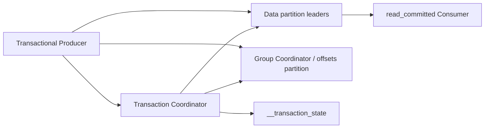
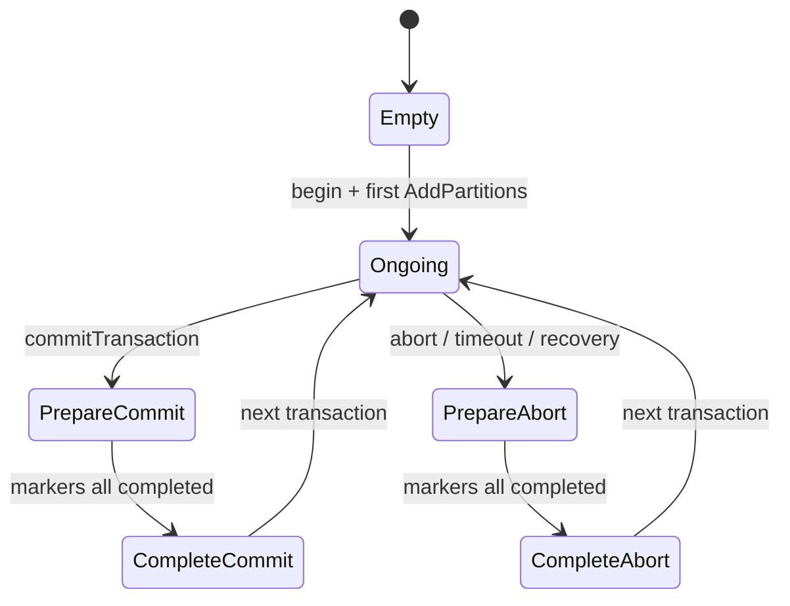
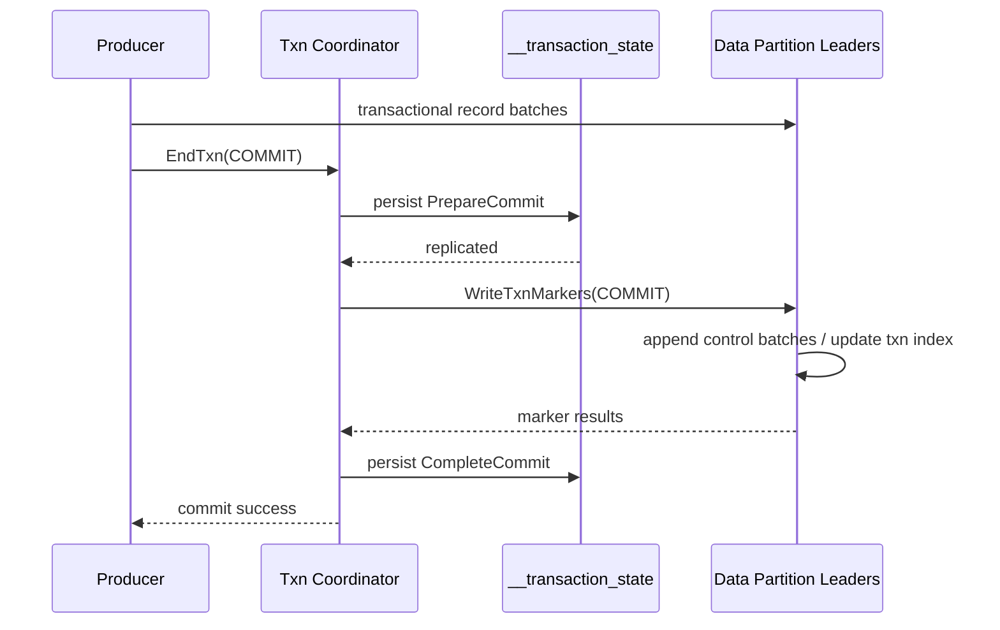

# 14｜事务协调器与 Exactly-Once 实现：PID、Marker 与 LSO

> 核心结论：Kafka 事务不是把所有 broker 锁在一起。Transaction Coordinator 持久化事务状态，Producer 向各 partition 正常写事务 batch，结束时 coordinator 驱动各 partition 写 commit/abort marker；consumer 依据 marker、事务索引与 LSO 控制可见性。

## 1. 参与者与持久状态



- Producer：持有 `transactional.id`，发起 begin/send/commit/abort；
- Transaction Coordinator：拥有该 transactional id 的状态机；
- `__transaction_state`：复制并压缩的内部状态日志；
- data partition leader：保存事务数据 batch 和 control marker；
- group coordinator：接收纳入事务的 consumed offsets；
- consumer：按 isolation level 决定是否暴露事务数据。

## 2. PID 与 epoch 如何 fencing

初始化事务 Producer 时，coordinator 为稳定 `transactional.id` 返回 Producer ID 和递增 epoch（具体升级边界随版本实现）。新实例使用同一 transactional id 初始化后，旧实例的 epoch 变旧；broker/coordinator 拒绝旧 epoch 后续写入或结束事务。

```text
transactional.id = payment-worker-shard-07
old: PID=42 epoch=3
new: PID=42 epoch=4
旧实例 epoch=3 的请求 → fenced
```

这要求 transactional id 稳定映射到逻辑处理分片，且同时只能有一个合法 owner。若每次重启随机生成 id，就失去跨会话 fencing 与未完成事务接管语义。

## 3. 事务状态机

名称随实现可能略调，核心转移可理解为：



`beginTransaction()` 在客户端主要切换本地状态；真正让 coordinator 知道事务涉及哪些 partition，通常发生在首次写入前后的 AddPartitionsToTxn 等协议。

## 4. 一次 commit 的底层时序



重要：数据先已写入各 partition，但在 commit marker 生效前，对 `read_committed` consumer 不可作为已提交事务结果暴露。若 coordinator 中途故障，新 coordinator 从 `__transaction_state` replay 出 Prepare 状态并继续补发 markers，操作必须幂等。

## 5. 为什么需要 Prepare 状态

若 coordinator 直接发 markers，再写“事务已提交”，可能在只给部分 partition 写 marker 后崩溃。PrepareCommit 先持久化最终决定，相当于记录不可反悔的 decision：恢复后无论重试多少次，都继续向所有参与 partition 写 COMMIT，而不能改成 ABORT。

这与两阶段提交思想相似，但边界限定在 Kafka 管理的日志/offset partition；它不是任意外部数据库的 XA。

## 6. transaction marker 是什么

Commit/Abort marker 是写入 partition 日志的 control batch，不作为普通业务 record 返回。partition leader 用它：

- 标记某 PID 的事务结束结果；
- 更新 aborted transaction index 等辅助状态；
- 推进可见性相关水位；
- 在 follower 复制后保持事务结果与数据同日志顺序。

marker 与事务数据走相同复制日志，leader 切换后新 leader 可从日志/索引恢复结果，而不是依赖某 broker 内存里的 boolean。

## 7. LSO 与长事务阻塞

`read_committed` 不能越过尚未确定的最早 open transaction。简化地说：

```text
LSO = min(HW, earliest open transaction first offset)
```

真实实现还需处理控制记录与 aborted transaction metadata，但核心是：offset 100 开始的事务未结束，即使 101～10000 的非事务/已提交数据已复制，`read_committed` 可见进度仍可能被 100 卡住。

这称为 head-of-line blocking。监控只有普通 lag 时，可能误判 consumer 处理慢；还要看事务持续时间、LSO 与 HW 的差距。

## 8. aborted transaction 如何过滤

不能物理删除 abort 数据，因为日志是追加复制的。Fetch 响应会提供与读取范围相关的 aborted transaction 信息，客户端在 `read_committed` 模式跳过对应事务 records，同时处理 control batches。

这意味着 abort 仍占网络/磁盘和扫描成本；高 abort 率不是“反正 consumer 看不见就没成本”。应监控事务失败、超时与 marker 延迟。

## 9. offsets 如何进入同一事务

read-process-write 场景中：

1. Consumer 读取 input partition；
2. Producer 在事务内写 output partitions；
3. `sendOffsetsToTransaction` 把 input 的下一 offset 与 group metadata 交给事务流程；
4. group coordinator 校验 group generation/member epoch；
5. offsets partition 也成为事务涉及的 Kafka 分区；
6. commit marker 使 output 和 consumed offsets 一起提交；
7. abort 时两者都不作为 committed 结果生效。

所以恢复后要么看到输出且从新 offset 继续，要么看不到输出并从旧 offset 重做。

## 10. 事务超时与恢复

coordinator 维护事务开始/最后更新时间和 timeout。超时后进入 abort 流程，避免失联 Producer 永久压住 LSO。Producer 的请求 deadline、事务 timeout、Consumer poll interval 和业务批处理时间必须协调：

- timeout 太短：正常慢批次频繁 abort/fencing；
- timeout 太长：故障事务长时间阻塞 read_committed 可见性；
- 大事务涉及 partition 多：marker fan-out 与恢复成本更高。

事务 coordinator 分片由 transactional id 映射到内部 transaction state topic partition。热点 transactional id、内部 topic ISR 异常或 coordinator 加载都会反映为事务初始化/提交延迟。

## 11. 不能跨越的边界

下面流程仍不是 Kafka EOS：

```text
Kafka transaction commit
→ HTTP 调用支付网关
→ 数据库 commit
```

Kafka 无法回滚已经发生的外部扣款。解决方案仍是外部系统支持幂等 key、数据库 inbox/outbox、状态机与对账补偿。不要把 `commitTransaction()` 当分布式万能事务。

## 12. 源码阅读路线

1. Producer `TransactionManager` 的本地状态与 request queue；
2. `InitProducerId/AddPartitionsToTxn/EndTxn/WriteTxnMarkers` 协议；
3. `TransactionCoordinatorService` 与 transaction metadata state；
4. `__transaction_state` append/replay；
5. marker channel/manager 的 fan-out 与 retry；
6. partition `ProducerStateManager` 与 transaction index；
7. Fetch 的 LSO/aborted transactions 与 consumer filtering；
8. offsets transaction 在 group coordinator 的校验与落盘。

## 13. 检查题

1. PrepareCommit 持久化后 coordinator 崩溃，新 controller/coordinator 能否改为 abort？
2. abort 数据为什么仍会占磁盘和复制带宽？
3. HW 已到 10000，read_committed consumer 为什么可能只能读到 100？
4. transactional id 每次启动随机生成会破坏什么？
5. Kafka 输出和 offset 原子提交后，为何 MySQL 写入仍需业务幂等？

