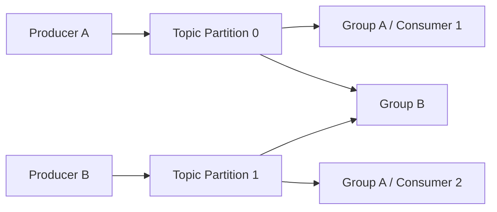
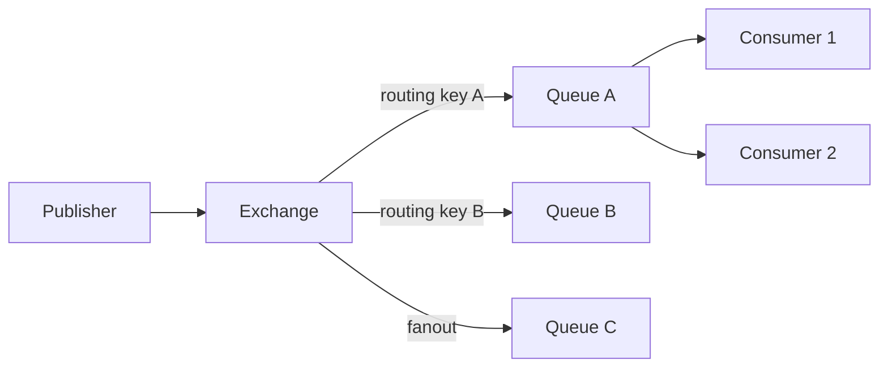
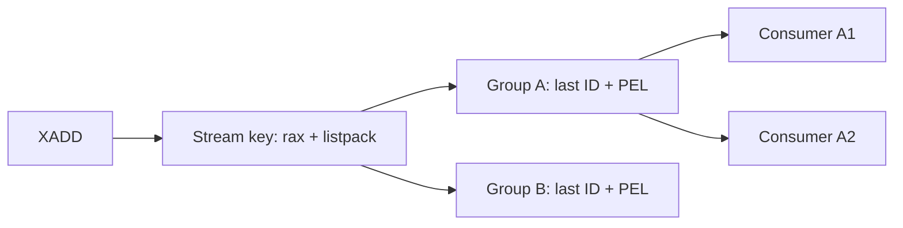
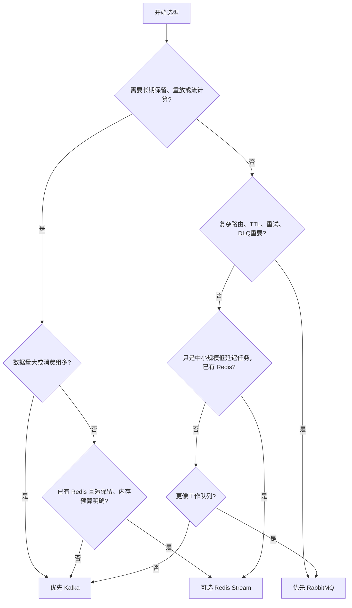
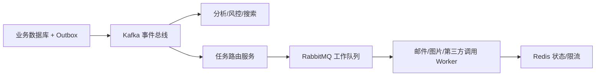

# MQ 选型深度指南：Kafka、RabbitMQ 与 Redis Stream

## 1. 先给结论

没有“最好的 MQ”，只有与业务约束更匹配的消息模型。

可以先用下面的短结论筛选：

- **Kafka**：优先用于高吞吐事件流、长时间保留、多消费组反复回放、CDC、日志聚合、流计算和事件驱动数据平台。
- **RabbitMQ**：优先用于业务命令、工作队列、复杂路由、低延迟任务分发、明确 ACK/重试/DLX 需求和多种投递拓扑。
- **Redis Stream**：优先用于已有 Redis 基础设施、中等规模、短保留、极低访问延迟、简单消费组和可接受自行建设可靠性治理的场景。

反过来说：

- 需要保存数天到数月、允许任意回放的数据，不要因为团队已经有 Redis 就默认选 Redis Stream。
- 需要 exchange、routing key、TTL、死信和队列隔离，不要在 Kafka 上大量模拟传统消息代理。
- 只需要短期低延迟任务分发，也不要因为 Kafka 吞吐高就承受完整 Kafka 集群与分区治理成本。

## 2. 选型必须先回答的 15 个问题

任何选型会议都应该先量化以下问题：

1. 峰值和平均消息速率分别是多少？
2. 消息平均、P95、P99 和最大字节数是多少？
3. 消息需要保留多久？是否需要反复回放？
4. 一个事件有多少个独立消费应用？
5. 同一消费组内是竞争消费还是广播？
6. 顺序要求是全局、同一实体、单分区还是完全不要求？
7. 允许重复吗？业务是否已经支持幂等？
8. 允许丢失吗？“成功返回后不丢”需要覆盖哪些故障？
9. 是否需要复杂路由、优先级、延迟、TTL 和死信？
10. 消费者离线几小时后是否必须继续处理历史？
11. 生产速度超过消费速度时，最大积压是多少？
12. 是否需要流式聚合、窗口、Join、CDC 或状态恢复？
13. 是否需要跨机房复制或灾备？RPO/RTO 是多少？
14. 团队能否运维新的分布式系统？
15. 三年成本更敏感的是内存、磁盘、机器数还是研发维护？

没有这些数据，“Kafka 性能最好”“RabbitMQ 功能最多”“Redis 最快”都无法构成选型依据。

## 3. 三种系统的核心抽象

### 3.1 Kafka：分区化的持久追加日志



Kafka 的核心不是“把一条消息推给某个消费者”，而是：

```text
Topic
  -> Partition
      -> 按 offset 排序的持久日志
          -> Consumer Group 保存每个 partition 的消费位置
```

消息被消费后通常不会立即物理删除。

保留由时间、大小或 compaction 策略决定。

因此同一数据可以被多个消费组独立读取，也可以主动 seek 回旧 offset 重放。

Kafka 的并行度、顺序范围和扩展单位都是 partition。

### 3.2 RabbitMQ：Exchange 路由到 Queue 的消息代理



RabbitMQ 的核心抽象是：

```text
Publisher -> Exchange -> Binding -> Queue -> Consumer
```

Exchange 决定路由，Queue 保存待投递消息，Consumer ACK 决定消息何时可以从队列移除。

一个消息要广播给三个独立业务，通常路由到三个 Queue，而不是让三个消费者竞争同一个 Queue。

RabbitMQ 擅长业务路由和工作分发，而不是无限期保留一份日志供任意回放。

### 3.3 Redis Stream：单 Redis key 的内存日志加消费状态



Redis Stream 的核心抽象是：

```text
Stream key
  -> 按 Stream ID 排序的 entry
  -> Consumer Group
       -> last-delivered-id
       -> Pending Entries List
       -> consumers
```

它比 Redis List/PubSub 多了历史、范围读取、消费组和待确认状态。

但单个 Stream key 不会自动分布到多个 Redis 节点；横向扩展需要应用拆多个 key。

## 4. 第一原则：消息是“事件日志”还是“待完成任务”

这是最重要的分界线。

### 事件日志

特征：

- 事件本身是需要保留的数据。
- 多个系统在不同时间读取同一份事件。
- 消费完成不意味着事件应删除。
- 需要按 offset/时间回放。
- 可能做流计算、审计或状态重建。

典型场景：订单事件、数据库 CDC、埋点、日志、指标、行为流。

首选通常是 Kafka。

Redis Stream 可处理规模较小、保留较短的事件流。

RabbitMQ Stream 也能提供日志式能力，但不能把它与传统 Queue 语义混为一谈。

### 待完成任务

特征：

- 任务只需由一个 worker 完成。
- 完成后通常不再保留在队列中。
- 失败后重试或转死信。
- 路由、优先级、过期时间和消费公平性重要。

典型场景：发邮件、生成报表、图片处理、调用下游接口、异步命令。

RabbitMQ 通常更自然。

Redis Stream 也能实现，但重试、延迟和 DLQ 往往需要应用自己建设。

Kafka 也能做任务，但 partition 顺序、offset 和毒消息治理会带来额外设计。

## 5. 核心能力对比

| 维度 | Kafka | RabbitMQ | Redis Stream |
|---|---|---|---|
| 核心模型 | 分区持久日志 | Exchange + Queue | 单 key 有序日志 + Group/PEL |
| 主要存储 | 磁盘日志和页缓存 | Queue 类型决定，内存与磁盘协作 | Redis 内存，RDB/AOF 持久化 |
| 消息消费后 | 按保留策略继续存在 | ACK 后通常可移除 | entry 继续存在，ACK 只清 PEL |
| 顺序范围 | 单 partition | 单 queue 的投递顺序，重投和并发会扰乱完成顺序 | 单 Stream key，组内并行会扰乱完成顺序 |
| 横向扩展 | 增加 partition/broker | 增加 queue、节点或使用特定队列类型 | 应用拆 Stream key/Cluster slot |
| 多订阅者 | 多 consumer group，共享一份日志 | 通常一个订阅者一条 Queue | 多 group，共享一份 Stream |
| 任意回放 | 强 | 传统 Queue 弱，Streams 另论 | 支持 ID 范围，但受保留/内存限制 |
| 路由能力 | Topic/partition 为主 | Exchange/binding 非常丰富 | 应用选择 key，原生路由较弱 |
| 单条 ACK/重投 | 传统 group 主要按 offset；新 Share Group 需注意版本 | 原生成熟 | PEL、XACK、XCLAIM/XAUTOCLAIM |
| 延迟/TTL/DLQ | 多由应用/topic 模式实现 | 原生能力更成熟 | 多由 ZSET/重试流/应用实现 |
| 长期大容量 | 强 | 取决于队列类型和使用方式 | 内存成本高，不适合超长大容量 |
| 流处理生态 | Kafka Streams、Connect 等成熟 | 相对弱 | 相对弱 |
| 运维复杂度 | 高 | 中到高 | 已有 Redis 时低，可靠 MQ 化后会上升 |

## 6. Kafka 的优势

### 6.1 高吞吐来自批量顺序 I/O

Kafka Producer 将记录批量发送，Broker 按 partition 追加日志。

消费者通过 Fetch 批量拉取。

顺序磁盘写、页缓存、批量压缩和零拷贝等机制，使其适合持续高吞吐事件流。

优势不只是“每秒消息多”，还包括：积压很大时吞吐不会像逐消息状态系统那样线性增加大量 broker 元数据。

### 6.2 长期保留和回放

Kafka offset 是 partition 内日志位置。

消费组只需保存每个 partition 的已提交位置。

消息是否删除由 retention/compaction 决定，与某个消费组是否读完解耦。

这特别适合：

- 新系统从历史重新构建状态。
- 修复 consumer bug 后重放。
- 多个下游以不同速度读取。
- 批处理与实时处理共用事件源。

### 6.3 原生分区扩展

Topic 拆为多个 partition，leader 分散在 Broker 上。

相同 key 可稳定进入同一 partition，从而保持实体内顺序。

partition 同时决定最大消费并行度。

### 6.4 复制与提交边界相对清晰

partition 有 leader 和 follower。

`acks=all` 配合合理的 `min.insync.replicas`，可以让 Producer 在满足 ISR 条件后收到确认。

未提交记录不会作为稳定数据暴露给普通消费者。

但错误配置 `acks=1`、允许不干净选主或副本因子不足，仍会降低可靠性。

### 6.5 事件生态成熟

Kafka Connect 适合连接数据库、搜索、对象存储等系统。

Kafka Streams 支持聚合、窗口、Join、状态存储和容错恢复。

如果业务未来很可能从“发消息”发展为“数据平台”，Kafka 的生态价值通常高于单纯 Broker 性能。

## 7. Kafka 的缺点

### 7.1 分区是能力也是约束

- 单 partition 才有严格顺序。
- Consumer Group 的传统并行度上限受 partition 数限制。
- partition 太少扩展不足。
- partition 太多会增加文件、元数据、选主、重分配和客户端开销。
- 修改 partition 数会改变默认 key 哈希映射，可能破坏实体路由连续性。

### 7.2 不擅长复杂单消息路由

Kafka 的主要路由是 Topic 和 partition。

如果需求是：

```text
根据多个 header 表达式路由
一条消息动态进入若干业务队列
每个队列有独立 TTL、优先级和死信策略
```

RabbitMQ exchange/binding 通常更直接。

在 Kafka 中往往需要增加 Topic、流处理器或应用路由层。

### 7.3 毒消息会阻塞分区式顺序

消费者在 offset 100 遇到永久失败消息。

如果必须保持顺序，就不能直接提交到 101。

若跳过并写 DLQ，则需要处理“写 DLQ + 提交 offset”的原子性或幂等问题。

高频任务重试需要 retry topic、延迟调度或 Share Group 等额外设计。

### 7.4 运维门槛高

需要治理：

- KRaft controller quorum。
- Broker 磁盘、网络和 page cache。
- partition 分布和副本 ISR。
- leader 倾斜与热点 partition。
- reassign、扩容和跨机房复制。
- Producer/Consumer 大量参数。
- schema、ACL、配额和数据生命周期。

对日均几万条简单异步任务，Kafka 可能是过度设计。

### 7.5 Exactly-once 有明确边界

Kafka transaction 能原子提交 Kafka 产出记录和消费 offset。

配合 `read_committed` 可在 Kafka 内构建 exactly-once 流程。

但“消费 Kafka 后调用第三方 HTTP 或修改普通数据库”并不会自动获得 exactly-once。

外部副作用仍需幂等、outbox、连接器协议或分布式事务。

## 8. RabbitMQ 的优势

### 8.1 路由模型丰富

常见 Exchange：

- Direct：routing key 精确匹配。
- Topic：通配符匹配层级 routing key。
- Fanout：广播到所有绑定队列。
- Headers：按消息头属性路由。

生产者不需要知道具体消费者和 Queue，只面向 Exchange 发布。

绑定关系可由基础设施定义，适合业务集成和多种投递拓扑。

### 8.2 工作队列语义自然

Queue 保存 ready 消息。

Broker 按消费者可用性和 prefetch 投递。

消息进入 unacked，消费者成功后 ACK；连接断开或 reject/requeue 后可重新投递。

这与“一个任务最终由一个 worker 完成”的模型高度一致。

### 8.3 Publisher Confirm 与 Consumer ACK 分工清晰

- Publisher Confirm：Publisher 到 RabbitMQ/目标队列接受与持久化边界。
- Consumer ACK：RabbitMQ 到 Consumer 的处理完成边界。

两者互相独立。

Producer 收到 confirm 不代表 Consumer 已处理。

Consumer ACK 也不能回答 Producer 当初是否看到 confirm。

### 8.4 Quorum Queue 提供复制安全

Quorum Queue 基于多数派复制。

Publisher Confirm 在消息被 quorum 接受后返回，可靠性语义比普通异步主从更适合关键工作队列。

代价是写放大、资源占用和网络分区时可用性下降。

### 8.5 传统消息功能成熟

RabbitMQ 对以下需求支持通常更直接：

- per-message/per-queue TTL。
- Dead Letter Exchange。
- 消费优先级和 Queue 优先级。
- Prefetch 背压。
- 自动/手动 ACK。
- Reject、Nack、Requeue。
- Alternate Exchange、Return 等不可路由处理。

## 9. RabbitMQ 的缺点

### 9.1 传统 Queue 不适合长期重复回放

消息 ACK 后通常从 Queue 生命周期中移除。

如果新系统想回放一个月历史，传统 Queue 没有 Kafka offset + retention 那种自然模型。

可以复制到多个 Queue、使用 RabbitMQ Streams 或外部归档，但系统模型和成本会变化。

### 9.2 大积压需要谨慎设计

RabbitMQ 可以处理持久消息和积压，但大量 Queue、unacked、索引和投递状态会占资源。

与 Kafka 的追加日志相比，逐消息投递/确认模型更强调消息状态管理。

长时间海量积压通常不是 RabbitMQ 传统 Queue 的最佳工作区间。

### 9.3 Queue 类型选择复杂

Classic Queue、Quorum Queue、Stream 的行为和取舍不同。

- Classic Queue 不应被想当然当成强一致复制队列。
- Quorum Queue 更可靠，但资源成本更高，某些传统特性受限制。
- Stream 适合大 fan-out 和重读，但消费模型不同于传统 Queue。

只写“我们使用 RabbitMQ”仍不足以说明可靠性，必须写明 Queue 类型和复制策略。

### 9.4 Requeue 可能形成热循环

消费者处理失败后立即 Nack + requeue：

```text
投递 -> 失败 -> requeue -> 立即再次投递 -> 再失败
```

这会占满消费者和 Broker。

应使用有界重试、延迟队列/TTL+DLX、退避与最终死信。

### 9.5 顺序容易被重投和并发破坏

Queue 的原始投递顺序不等于业务完成顺序。

多个消费者、prefetch、某条失败 requeue 都可能让后续消息先完成。

强实体顺序通常需要 Single Active Consumer、单消费者、业务分片 Queue 或版本栅栏，并接受吞吐下降。

## 10. Redis Stream 的优势

### 10.1 低延迟且接入简单

如果团队已有 Redis Cluster/Sentinel、监控和客户端体系，引入 Stream 的基础成本较低。

`XADD`、`XREADGROUP BLOCK`、`XACK` 可以快速构成消费闭环。

数据位于 Redis 内存结构，短消息和短保留通常能获得很低访问延迟。

### 10.2 兼有日志与消费组

Stream entry 在消费后不会自动删除。

可以：

- 用 XRANGE 按 ID 查询历史。
- 用 XREAD 做独立 reader。
- 用多个 Group 做 fan-out。
- 用同组多个 Consumer 做竞争消费。
- 用 PEL 观察未确认消息。

能力比 List 和 Pub/Sub 完整得多。

### 10.3 Pending 状态可观察

`XPENDING` 可查看 owner、idle 和 delivery count。

`XCLAIM/XAUTOCLAIM` 可以接管失联 Consumer 的消息。

这适合中等规模的工作分发和故障恢复。

### 10.4 与 Redis 内其他数据原子组合

同一 Redis 节点/slot 中可通过 Lua 或 Function 原子完成：

```text
检查 Redis 内幂等 key
更新 Redis 状态
XADD/XACK
```

但这种原子性只覆盖 Redis 内部，不能扩展到 MySQL 或 HTTP。

## 11. Redis Stream 的缺点

### 11.1 内存成本高

Stream 主体使用 rax + listpack，空间效率优于“一条消息一个 Redis 对象”，但数据仍主要占 Redis 内存。

还要计算：

- Group 和 Consumer 元数据。
- PEL 双索引。
- 复制缓冲。
- AOF/RDB fork Copy-on-Write。
- allocator 碎片。

数天海量保留的成本通常明显高于 Kafka 磁盘日志。

### 11.2 单 Stream key 不会自动分片

一个 key 落在一个 Redis Cluster slot 和一个主节点。

单 key 吞吐受单主线程、网络和内存限制。

要扩展需应用拆成多个 Stream key，并自行处理：

- 分片算法。
- 实体顺序。
- 多 key Group 初始化。
- 扩分片迁移。
- 跨 key 消费与监控。

### 11.3 复制默认异步

主节点 XADD 成功后，写可能尚未复制到副本。

故障切换可能丢最近已确认消息，也可能回退 XACK、Group 游标或 Claim 状态。

`WAIT` 能缩小窗口，但不保证副本 fsync，也不构成共识提交。

这与 RabbitMQ Quorum Queue 或正确配置的 Kafka ISR 提交边界不同。

### 11.4 PEL 需要主动治理

Consumer 宕机后消息不会自动被其他 Consumer 永久接管。

应用必须扫描 pending 并 claim。

Claim 只改变 Redis owner，不能终止旧 Consumer 已开始的外部副作用。

业务幂等仍然必需。

### 11.5 Retention 与 PEL 生命周期容易冲突

经典 KEEPREF 语义下，XTRIM/XDEL 可删除 payload 而保留 PEL 引用。

结果是 pending ID 还在，但消息内容已不存在。

新版本提供引用感知删除能力，但仍需管理多 Group 生命周期和版本兼容。

### 11.6 重试、延迟和 DLQ 多靠应用搭建

长期把失败消息留在 PEL 等待 Claim 不是好的延迟重试模型。

通常需要：

- ZSET 调度时间。
- Retry Stream。
- DLQ Stream。
- 指数退避与 jitter。
- 原消息 ACK 和重试写入的双写补偿。

当这些设施不断增加时，应重新评估 RabbitMQ。

## 12. 可靠性对比：不要只说“都支持持久化”

### 12.1 Producer 成功意味着什么

Kafka：

- `acks=0`：不等待 Broker。
- `acks=1`：Leader 接收。
- `acks=all`：等待 ISR 条件，仍需合理 replication factor 和 min ISR。

RabbitMQ：

- 仅写 Socket 不代表 Broker 已安全接收。
- Publisher Confirm 表示 RabbitMQ 接受边界。
- Quorum Queue Confirm 通常需要多数副本接受。

Redis Stream：

- XADD 成功通常表示主节点内存已修改并返回。
- AOF fsync 和副本传播取决于配置与时序。
- WAIT 只是等待指定副本 offset，不能保证选主或磁盘持久。

### 12.2 Consumer 完成意味着什么

Kafka：提交 offset 表示组下次通常从其后读取，不等于外部业务副作用与 offset 原子提交。

RabbitMQ：Consumer ACK 表示 Broker 可认为投递完成，不等于业务数据库一定提交，除非应用保证先提交业务再 ACK。

Redis Stream：XACK 只删除该 Group 的 PEL，不删除 entry，也不与外部 DB 原子。

### 12.3 三者都需要业务幂等

统一可靠消费顺序：

```text
收到消息
  -> 以 event_id 在业务数据库做幂等事务
  -> 事务成功
  -> 再提交 offset / ACK / XACK
```

如果事务成功后确认丢失，会重复投递。

幂等将“至少一次投递”收敛为“业务效果一次”。

如果先确认再提交业务，进程在两者之间崩溃会永久丢处理。

## 13. 顺序能力对比

### Kafka

单 partition 内按 offset 有序。

相同业务 key 进入同一 partition，可保持同一实体输入顺序。

但多个 partition 没有全局顺序，Consumer 并行处理也可能改变完成顺序。

### RabbitMQ

单 Queue 有投递序列，但多 Consumer、prefetch、redelivery 和异步业务会打乱完成顺序。

严格顺序需要限制并行或使用 Single Active Consumer 等策略。

### Redis Stream

单 key 按 Stream ID 有序。

一个 Group 多 Consumer 是动态工作分发，快 Consumer 会拿到更多消息。

同一实体的两条消息可能分给不同 Consumer 并乱序完成。

### 选型结论

如果要求“同一订单严格有序且需要高并行”：

- Kafka：按 order_id 分区，是最自然的模型。
- RabbitMQ：按 order_id 分片到多 Queue 或使用一致性哈希路由。
- Redis Stream：按 order_id 分片到多个 Stream key，或业务版本栅栏。

不要要求跨所有订单全局顺序，这会把吞吐压缩到单序列器。

## 14. 广播与竞争消费

| 需求 | Kafka | RabbitMQ | Redis Stream |
|---|---|---|---|
| 同一应用多实例分担 | 同 group 分区分配 | 同 Queue 多 Consumer | 同 Group 多 Consumer |
| 多个应用各收一份 | 多 group | 每个应用独立 Queue，Exchange 广播 | 多 Group |
| 临时在线订阅 | 独立 group/手工 offset | 临时 Queue | XREAD 或临时 Group |
| 消费者数超过分区数 | 传统 group 多余 Consumer 空闲 | 可以继续竞争 Queue | 可以继续竞争 Stream；收益受单 key 限制 |

Kafka 传统 Consumer Group 的并行度与 partition 数强绑定。

RabbitMQ 和 Redis Stream 的竞争消费更偏“谁空闲谁拿下一条”。

Kafka 新版 Share Group 提供不同模型，但属于版本相关能力，不能把预览/新特性当所有生产集群基线。

## 15. 延迟、吞吐与积压

### 低延迟

Redis Stream 在内存和短链路场景通常很有优势。

RabbitMQ 对低延迟业务命令也很合适。

Kafka 为吞吐进行 batch，调低 linger/batch 可降低延迟，但会牺牲吞吐效率。

### 高吞吐

Kafka 最擅长持续批量事件流和多消费者顺序读取。

RabbitMQ 吞吐受 Queue 类型、确认、路由和消息持久化影响。

Redis Stream 单 key 很快，但横向扩展需要多 key，内存与主线程成为边界。

### 大积压

Kafka 的磁盘追加日志通常最经济。

RabbitMQ 要根据 Quorum/Classic/Stream 和消息状态评估。

Redis Stream 大积压会直接消耗宝贵内存，并可能与 fork COW、淘汰策略冲突。

## 16. 延迟消息与重试

### RabbitMQ

常见实现：TTL + DLX、延迟交换插件、独立重试 Queue。

优点是路由模型自然。

需要防止消息头无限增长、DLX 配置错误和热 requeue。

### Kafka

常见实现：不同延迟级别的 retry Topic，调度消费者到期后转回主 Topic。

Kafka partition 本身不以“未来可见时间”作为核心队列语义。

重试 Topic 会增加拓扑、顺序与监控复杂度。

### Redis Stream

常见实现：ZSET score 保存 next-attempt-time，调度器到期后 XADD retry/main Stream。

PEL 适合故障接管，不适合长期精确延迟调度。

### 选型结论

如果大量业务天然依赖不同 TTL、重试次数、DLQ 路由，RabbitMQ 通常最省研发成本。

如果重试只是事件流处理的一部分且数据还要长期回放，Kafka 更合适。

如果规模小且 Redis 已是核心设施，Redis Stream + ZSET 可以接受，但必须计算自研治理成本。

## 17. 典型场景选型

### 17.1 数据库 CDC

推荐 Kafka。

原因：

- 数据量持续且可能很大。
- 多下游独立消费。
- 需要长保留和重放。
- Connect/CDC 生态成熟。
- 按表/主键分区便于顺序处理。

RabbitMQ 传统 Queue 不适合作为长期变更日志。

Redis Stream 适合小规模短期同步，但不应作为唯一长期变更历史。

### 17.2 订单状态事件

如果事件要被库存、积分、风控、分析等多个系统长期消费：Kafka。

如果只是把“取消超时订单”任务交给一个 worker：RabbitMQ。

如果系统规模不大、只需分钟级保留且已有独立 Redis MQ 实例：Redis Stream 可选。

同一个“订单系统”内部可能同时使用两种 MQ，因为事件和任务不是同一语义。

### 17.3 邮件、短信、图片处理

推荐 RabbitMQ。

原因：

- 明确工作队列。
- 失败重试和 DLQ 重要。
- 处理速度差异大，需要 prefetch。
- 完成后通常不需要重复回放一个月历史。

流量极大且需要保留发送事件用于分析时，可把业务事件写 Kafka，再由调度服务投递 RabbitMQ。

### 17.4 日志、埋点和指标流

推荐 Kafka。

吞吐、压缩、长保留、多消费组和批处理最匹配。

不要让 RabbitMQ 为每个分析应用复制巨量 Queue，也不要用 Redis 内存保存数天原始埋点。

### 17.5 秒杀库存异步削峰

不能仅凭“Redis 快”直接选 Redis Stream。

需要判断：

- 请求是否已经在 Redis 原子扣减库存？
- 订单事件是否必须长期审计？
- 峰值积压是否会吃光 Redis 内存？
- 主从切换允许丢多少确认写？

若 Redis 只负责前台库存状态，可将可靠事件通过 outbox/relay 进入 Kafka 或 RabbitMQ。

中小规模、可从数据库补偿时可使用 Redis Stream，但要独立实例和明确 RPO。

### 17.6 实时流计算

推荐 Kafka。

Kafka Streams/Flink 等可以基于 partition、offset 和 changelog 做状态恢复、窗口与 Join。

RabbitMQ/Redis Stream 能传递数据，但流处理状态和恢复生态需要额外建设。

### 17.7 在线通知

若只推在线连接且允许离线丢失，可能 Redis Pub/Sub/WebSocket 网关即可，不一定需要 Stream。

若离线回来需要补历史：Redis Stream 或 Kafka。

若通知需要复杂用户路由、重试和 TTL：RabbitMQ。

## 18. 决策树



决策树只是初筛。

最终必须用可靠性、容量和运维约束复核。

## 19. 加权评分方法

不要用每项等权的打分表。

先为业务设置权重：

| 指标 | 权重示例 |
|---|---:|
| 长期保留与回放 | 20 |
| 复杂路由与重试 | 15 |
| 峰值吞吐 | 15 |
| 可靠性/RPO | 15 |
| 单实体顺序 | 10 |
| 运维成熟度 | 10 |
| 成本 | 10 |
| 极低延迟 | 5 |

每种 MQ 按 1—5 分，再计算：

```text
total = Σ(weight_i × score_i)
```

但必须设置否决项：

- Redis Stream 估算需要 500GiB 内存，直接否决。
- RabbitMQ 传统 Queue 需要任意回放 90 天历史，直接否决或改用 Stream 类型重新评估。
- Kafka 需要每条动态复杂路由和毫秒级多级 TTL，若不接受自研路由层则否决。

加权总分不能覆盖硬约束。

## 20. 三年总成本

### Kafka 成本

- Broker 磁盘和网络。
- Controller/Broker 运维。
- partition 规划和再均衡。
- Schema Registry、Connect、监控等平台组件。
- 团队学习成本。

但长保留和多消费组的单位数据成本通常较优。

### RabbitMQ 成本

- 集群节点和 Quorum Queue 复制。
- Queue/Binding 数量治理。
- 重试、DLX 和消息堆积运维。
- 不同 Queue 类型的能力差异。

业务路由研发成本通常较低。

### Redis Stream 成本

- 高价值内存和副本翻倍。
- fork COW 安全余量。
- PEL recovery、重试、DLQ、分片和保留控制器的研发。
- 与缓存混部的故障风险。

“公司已经有 Redis，所以 Stream 没成本”通常是错误结论。

## 21. 混合架构何时合理

大型系统不必强制只用一种 MQ。

一种常见组合：



Kafka 保存事实事件和支持回放。

RabbitMQ 承担具体命令的重试、TTL 和工作分发。

Redis 用于状态、限流，必要时用 Stream 承担局部低延迟事件。

混合架构的代价是：

- 更多平台和链路。
- 跨 MQ 桥接的重复与丢失窗口。
- event_id、trace 和 schema 必须统一。
- 运维与责任边界更复杂。

业务规模不够时，不要为了“架构完整”强行混用。

## 22. 迁移信号

### Redis Stream 迁 Kafka

- 保留从分钟增长到数天/月。
- Stream 内存和副本成本过高。
- 单 key 达到主线程瓶颈。
- 应用自研分片、回放、归档和流处理越来越复杂。
- 消费组越来越多且速度差异大。

### Redis Stream 迁 RabbitMQ

- 重试 Stream、ZSET、DLQ、路由脚本不断增加。
- 业务主要是完成即删除的任务。
- 大量 TTL、优先级和不可路由处理需求。
- PEL recovery 成为主要运维负担。

### RabbitMQ 迁 Kafka

- Queue 长期积压成为常态。
- 多个下游各复制一份大量相同数据。
- 强烈需要历史回放、CDC 和流计算。
- 存储成本和数据平台能力成为核心。

### Kafka 迁 RabbitMQ

- 大量 retry Topic 和路由服务只为模拟传统任务代理。
- 消息规模不大但投递策略非常复杂。
- partition 顺序导致毒消息处理困难。
- 业务更关心单任务状态而不是事件历史。

## 23. 常见错误选型理由

### “Kafka 吞吐最高，所以统一 Kafka”

错误：忽略路由、任务 ACK、延迟重试、运维和小规模成本。

### “RabbitMQ 功能最多，所以什么都能做”

错误：传统 Queue 不等于适合长时间海量事件保留和任意回放。

### “Redis 最快，而且我们已经有”

错误：忽略内存成本、异步复制窗口、单 key 扩展和自研治理。

### “三者都支持 ACK 和持久化，差别不大”

错误：Kafka offset、RabbitMQ consumer ACK、Redis PEL/XACK 的状态模型完全不同；持久化提交边界也不同。

### “业务不允许重复，所以要求 MQ exactly-once”

错误：MQ 无法自动让普通数据库或第三方 HTTP 与消息确认成为同一事务。

正确做法是定义 event_id、幂等约束、状态机和补偿。

## 24. 推荐的选型验证实验

不要只跑生产和消费 TPS。

对候选系统统一测试：

1. 真实消息大小分布和压缩。
2. Producer 超时但服务端可能已写入。
3. Consumer 业务提交后、确认前崩溃。
4. Broker/主节点故障切换。
5. 一个消费者永久离线。
6. 下游数据库延迟增加 20 倍。
7. 生产速度持续高于完成速度。
8. 毒消息和无限重试。
9. 一个热点业务 key。
10. 保留窗口到期时仍有未完成消息。
11. 扩容/缩容和消费者重平衡。
12. 备份恢复后消息状态与业务库对账。

记录的不是只有吞吐：

```text
端到端完成 P99
重复和丢失数量
积压增长率
恢复到追平所需时间
故障期间可用性
内存/磁盘/网络峰值
人工操作数量
错误是否可诊断
```

## 25. 最终推荐模板

一份合格的选型结论应该类似：

> 订单领域产生峰值 30k/s、P99 2KB 的事实事件，需要保留 14 天，供 8 个独立应用回放；顺序范围是 order_id，允许至少一次投递但外部数据库必须业务幂等。因此选择 Kafka，按 order_id 分区，副本因子 3，Producer 使用 idempotence 与 `acks=all`，Topic 设置合理 min ISR；Consumer 以 event_id 建唯一约束。邮件发送不是事实日志，而是带三档退避、TTL 和 DLQ 的工作任务，因此由 Kafka 事件经路由服务转入 RabbitMQ Quorum Queue。Redis 不承担可靠事件主存储，只用于限流和短期状态。

它必须说明：

- 业务数据和峰值。
- 为什么该消息是事件或任务。
- 顺序范围。
- 保留和回放。
- 可靠性参数与仍存在的故障窗口。
- 幂等方案。
- 未选择另外两种 MQ 的具体原因。
- 容量、运维和迁移边界。

## 26. 本仓库深入阅读

Kafka：

- [Kafka 学习计划](Kafka/00_学习计划.md)
- [分区日志、索引与副本机制](Kafka/02_分区日志索引与副本机制.md)
- [Producer 发送链路与可靠性](Kafka/03_Producer发送链路与可靠性.md)
- [交付语义、事务与一致性边界](Kafka/05_交付语义事务与一致性边界.md)

RabbitMQ：

- [RabbitMQ 学习计划](RabbitMQ/00_学习计划.md)
- [AMQP、Exchange 与路由](RabbitMQ/01_AMQP模型Exchange与路由.md)
- [Publisher Confirm 与可靠发布](RabbitMQ/03_PublisherConfirmReturn与可靠发布.md)
- [Classic、Quorum 与 Stream 选型](RabbitMQ/05_ClassicQuorum与Stream选型.md)

Redis Stream：

- [Redis Stream 深度手册](RedisStream/README.md)
- [至少一次、幂等与 Exactly-Once 边界](RedisStream/07_至少一次幂等与ExactlyOnce边界.md)
- [复制偏移、WAIT 与 Failover](RedisStream/25_复制偏移_WAIT与Failover状态回退.md)
- [容量模型与压测方法](RedisStream/26_容量模型压测方法与参数推导.md)

## 27. 权威资料与版本说明

本文不把版本相关的新特性当作所有集群的默认能力。

- Kafka 以现代 KRaft 架构、partition/consumer group/ISR 为主；Share Group 等能力需按部署版本确认。
- RabbitMQ 必须明确使用 Classic、Quorum 还是 Stream，三者不能只按“RabbitMQ”统称。
- Redis Stream 的 XACKDEL/XDELEX 引用策略、生产幂等和 XNACK 等能力分别出现在较新版本，上线前检查 `COMMAND INFO`。

官方资料：

- [Apache Kafka Documentation](https://kafka.apache.org/documentation/)
- [Apache Kafka Design](https://kafka.apache.org/41/design/design/)
- [RabbitMQ Reliability Guide](https://www.rabbitmq.com/docs/reliability)
- [RabbitMQ Quorum Queues](https://www.rabbitmq.com/docs/quorum-queues)
- [RabbitMQ Streams](https://www.rabbitmq.com/docs/streams)
- [Redis Streams](https://redis.io/docs/latest/develop/data-types/streams/)

