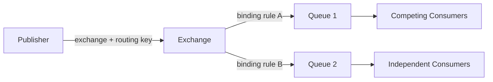

# 01｜AMQP 模型、Exchange 与路由：消息为什么会进入某个 Queue

> 核心结论：Publisher 将消息发布到 Exchange，并附 Routing Key；Exchange 根据类型和 Binding 决定路由到哪些 Queue。Exchange 通常不存储消息，路由不到 Queue 的消息也不会因为“发到了 Exchange”就自动保存。

## 1. 完整链路



同一消息匹配多个 Binding 时可复制路由到多个 Queue；同一 Queue 上多个 Consumer 通常竞争消费，而不是每个 Consumer 都收到一份。

## 2. 四种常用 Exchange

### Direct

Routing Key 与 Binding Key 精确匹配。适合明确命令/任务类型：

```text
exchange=payment.commands
routingKey=refund
bindingKey=refund
```

### Topic

按点分隔单词匹配：`*` 匹配一个词，`#` 匹配零个或多个词。

```text
order.*       匹配 order.created，不匹配 order.eu.created
order.#       匹配 order、order.created、order.eu.created
```

Routing Key 应是稳定领域分类，不要塞入高基数随机 ID 作为路由规则。

### Fanout

忽略 Routing Key，向所有 Binding Queue 广播。每个订阅方需要自己的 Queue；多个 Consumer 共用一个 Queue 仍是竞争关系。

### Headers

根据消息 headers 匹配，表达力强但配置和性能成本更高。能用清晰 Topic Key 表达时不必强行使用。

## 3. 默认 Exchange

空字符串名称代表默认 Direct Exchange。每个新 Queue 通常自动以 Queue 名作为 Routing Key 绑定到默认 Exchange，因此发布到 `exchange=""`、`routingKey=queueName` 可直达该 Queue。

这是一种便利路径，不代表 Publisher 绕过了 Exchange。

## 4. Binding 是路由规则

Binding 连接 Exchange 与 Queue，也可以连接 Exchange 与 Exchange。重复声明相同 Binding 通常应具有幂等拓扑语义，但应用要避免启动时大量无界拓扑变更。

一个消息匹配同一 Queue 的多条 Binding 时，不应简单推导一定入队多份；以协议和 Broker 去重路由语义为准。业务若确实需要多份独立处理，应绑定多个 Queue。

## 5. Vhost 的边界

Virtual Host 是逻辑隔离单元：Exchange、Queue、Binding、权限和部分策略在 vhost 内命名。跨 vhost 不能直接 Binding，需要应用/联邦/Shovel 等桥接。

Vhost 适合租户/环境隔离，但不是物理资源硬隔离；同一节点的 CPU、内存和磁盘仍共享，必须配额与监控。

## 6. Durable、Exclusive、Auto-delete

- `durable`：Broker 重启后拓扑实体是否保留；
- `exclusive`：Queue 绑定到声明它的 Connection 生命周期并限制其他连接使用；
- `auto-delete`：Queue 曾有 Consumer 后，最后一个 Consumer 离开时触发删除条件。

临时 Queue 常用服务端生成名称，避免固定名称在自动恢复/竞态中冲突。Durable Queue 不等于其中每条消息都具备相同恢复保证。

## 7. 声明等价性与 Channel 关闭

对已存在 Queue/Exchange 使用不等价属性重新声明，会产生 channel-level exception 并关闭 Channel。典型错误：同名 Queue 在一处声明 classic，另一处声明 quorum；durable 或 arguments 不一致。

拓扑参数应集中管理。TTL、DLX、长度等可变参数优先 Policy；硬编码 x-arguments 往往需要删队列才能改变，风险更高。

## 8. 不可路由消息

Publisher 发到存在的 Exchange，不代表一定命中 Queue：

- `mandatory=false`：不可路由消息可被丢弃；
- `mandatory=true`：Broker 通过 Return 将不可路由消息返回 Publisher；
- Alternate Exchange：可承接某 Exchange 的不可路由消息，但仍要确认其 Binding 与目标 Queue。

Publisher Confirm 和 Return 是正交信号：Confirm 说明发布处理结果，Return 说明路由失败。可靠发布必须同时建模。

## 9. 检查题

1. Fanout Exchange 绑定一个 Queue、Queue 上 10 个 Consumer，一条消息会处理几次？
2. Confirm 成功但消息不可路由是否可能？
3. Durable Exchange + Durable Queue 为什么仍可能丢 transient message？
4. 同名 Queue 参数不一致为什么关闭 Channel，而不是自动修改？
5. Vhost 能否阻止同节点其他租户占满磁盘？

