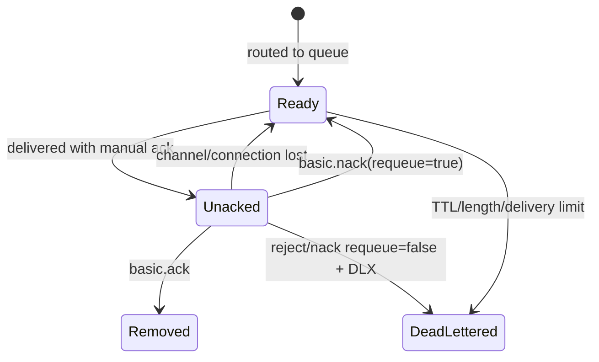

# 04｜Consumer Ack、Prefetch 与投递语义：Ready 与 Unacked 的状态机

> 核心结论：消息从 Ready 变为 Unacked 后仍由 Broker 跟踪；Ack 才允许 Broker 删除/推进状态。Consumer 或 Channel 断开时，未确认 Delivery 会重新入队/投递，从而形成 At-Least-Once 和重复窗口。

## 1. Delivery 状态



自动 Ack 模式下，Broker 在写出 Delivery 后不等待业务处理结果，吞吐高但 Consumer 崩溃可能丢处理，且无未确认窗口限制时容易压垮客户端。

## 2. Delivery Tag 作用域

Delivery tag 在 Channel 内单调标识 Delivery。Ack 必须在收到该消息的同一 Channel 上发送；跨 Channel Ack 会导致协议错误并关闭 Channel。

`multiple=true` 可确认截至 tag 的所有未确认 Delivery。并发 Worker 若错误地用最大完成 tag 批量 Ack，会跳过中间未完成消息，和 Kafka 提交最大 offset 的陷阱类似。

## 3. 两个崩溃窗口

### Ack 后处理

```text
Delivery → Ack → Consumer crash → DB 未更新
```

消息已从队列完成，业务漏处理，偏 At-Most-Once。

### 处理后 Ack

```text
Delivery → DB commit → Consumer crash → Ack 未到 Broker
```

消息重新投递，DB 可能重复更新，偏 At-Least-Once。常见选择是第二种 + `eventId` 唯一约束/状态版本。

## 4. Ack、Nack、Reject

- `basic.ack`：处理成功；
- `basic.reject`：单条拒绝，可选 requeue；
- `basic.nack`：可单条/批量拒绝，可选 requeue；
- requeue=false 且配置 DLX：进入死信路由；否则可能被丢弃。

requeue=true 的立即重试可能在多个 Consumer 间高速循环，消耗网络/CPU 而不让依赖恢复。应使用有退避的 Retry Queue/调度机制与最大次数。

## 5. Prefetch 是 Credit/背压

Prefetch 限制 Broker 向 Consumer 推送的未确认消息数量。RabbitMQ 对 AMQP 0-9-1 prefetch 的解释通常以 Consumer 为常用作用域，具体 global 参数语义需看客户端和队列类型。

Little's Law 可用于初始估算：

```text
inFlight ≈ throughput × processingLatency
prefetch ≈ 单 Consumer 目标吞吐 × p95处理时间 × 安全系数
```

Prefetch 太小：Consumer 等待下一批、吞吐不足；太大：公平性差、客户端内存高、故障时大量重投、慢 Consumer 囤消息。

## 6. 多 Consumer 与顺序

Queue 入队通常有顺序，但观察到的处理完成顺序会被以下因素改变：

- 多 Consumer 并行；
- prefetch > 1；
- 处理时长不同；
- nack/requeue；
- Consumer 故障重投；
- Priority Queue。

严格顺序可用 Single Active Consumer 或单 Consumer，并避免并发完成乱序；业务仍应携带 sequence/version 防御重投和故障切换。

## 7. Consumer Cancel 与恢复

Queue 删除、Leader 变化、权限/节点故障可能导致 Consumer Cancel 或 Channel 关闭。应用必须监听取消/关闭事件，区分正常取消与异常丢失，并避免自动恢复和业务自建重连同时创建重复 Consumer。

Consumer tag 只是订阅标识，不是业务幂等键。

## 8. Ready 与 Unacked 排障

- Ready 高、Unacked 低：消费能力不足、Consumer 缺失、路由到无人队列；
- Ready 低、Unacked 高：Broker 已投递但 Consumer 处理慢、Ack 丢失/线程池卡住、prefetch 过大；
- 两者都高：持续流入大于确认速率，且在途也已占满；
- 两者都低但业务缺失：查 Publisher Return/Confirm、过滤与 Ack 时机。

## 9. 检查题

1. Consumer 收到消息是否会立即从 Queue 删除？
2. 数据库成功后 Ack 前崩溃，如何避免重复扣款？
3. 为什么 prefetch=1000 可能降低公平性？
4. 多 Worker 能否用最大 delivery tag 做 multiple Ack？
5. requeue=true 为什么可能造成 CPU 很高但 Ready 不断波动？

