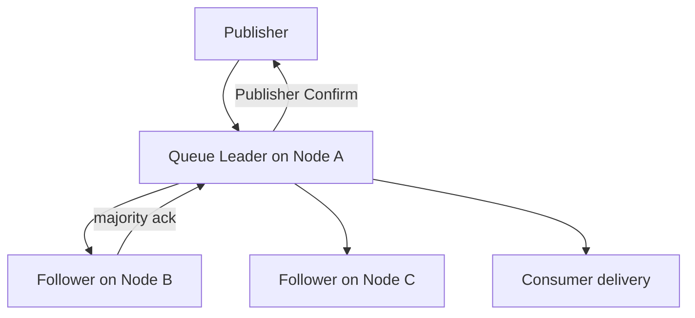

# 06｜集群、Khepri 与 Quorum Queue 原理：两套 Raft，两类状态

> RabbitMQ 4.2 新部署默认使用 Khepri 元数据存储。Khepri quorum 保护 Exchange/Queue/Binding 等元数据；每个 Quorum Queue 自己的 Raft Group 保护该队列的数据与投递状态。两者相互依赖但不是同一个日志。

## 1. Cluster 包含什么

RabbitMQ Cluster 让节点共享拓扑和用户可见的集群视图，客户端可连接某节点，操作被透明路由到 Queue Leader/宿主节点。Cluster 不是：

- 自动把所有 Queue 数据复制到每个节点；
- 跨高延迟 WAN 的默认灾备方案；
- 自动提供客户端负载均衡和连接重试；
- 替代 Publisher Confirm/Consumer Ack。

## 2. Khepri 元数据

Khepri 使用 Raft 复制元数据。创建 Exchange、Queue、Binding、Policy 等更新需要元数据多数派可用。三节点元数据 quorum 可容忍一个节点故障；两节点集群无法同时获得良好多数派容错，官方强烈不建议。

元数据存在只说明“Queue 应存在、属性是什么”，不代表 Queue 数据副本完整。反过来，某 Quorum Queue 多数派健康，也不表示所有集群元数据操作都能进行。

## 3. Quorum Queue Raft Group

每个 Quorum Queue 有成员集合和 Leader。Publish、Delivery/Ack 等状态被序列化为日志命令，经多数派复制后提交并应用。

三成员丢一台仍有两票；丢两台只剩一票，不能安全选 Leader/提交新命令。恢复可用性必须恢复多数成员或执行明确的灾难恢复流程，不能凭剩余单副本继续正常写。

## 4. Leader、数据本地性与透明路由

客户端可连任意 RabbitMQ 节点，Broker 转发对 Queue 的操作到 Leader。这样使用简单，但跨节点转发会增加网络跳数。高吞吐客户端可通过负载均衡和 Leader 放置优化本地性，但不要把客户端固定死在某节点而失去故障切换。

Stream 客户端对副本连接有更明确的数据本地性要求，应使用客户端的 metadata/leader discovery，而不是假设任意节点完全透明。

## 5. Membership 与扩容

新增 Cluster 节点不会自动让所有既有 Quorum Queue 增加成员。队列成员变更和 Leader rebalance 需要相应的运维机制/协调策略。更多成员意味着更高容错潜力，也意味着更多复制带宽、磁盘和多数派延迟；常见奇数成员而非无界复制。

扩容步骤应包括：节点加入 → 健康检查 → 队列成员协调/增长 → 数据追赶 → Leader 分布 → 前台延迟观察。

## 6. 网络分区

Raft Group 只有多数派一侧能继续推进，少数派不会成为合法 Leader。不同 Queue 的成员放置可能不同，因此同一次节点故障对各 Queue 的影响不同。

回答“Cluster 是否可用”必须具体到：Khepri 多数派、目标 Queue 成员多数派、目标节点/磁盘、客户端连接路径。

## 7. Confirm 与共识的连接

Quorum Queue Publisher Confirm 是客户端观察共识提交的重要边界。未使用 Confirm 时，客户端无法可靠区分消息尚在 socket/Leader 内存，还是已被多数副本接受。

但 Confirm 后 Consumer 仍可能重复处理；这是发布安全与消费语义的不同阶段。

## 8. 检查题

1. Khepri 有多数派但某 Queue 丢多数派，会怎样？
2. 新增第四节点后，旧 Quorum Queue 是否自动变四副本？
3. 客户端连接 Node A，Queue Leader 在 B，消息路径如何？
4. 为什么 Quorum Queue 成员通常选奇数？
5. Confirm Ack 能否替代 Consumer Ack？

