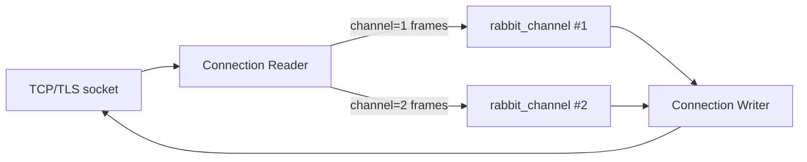
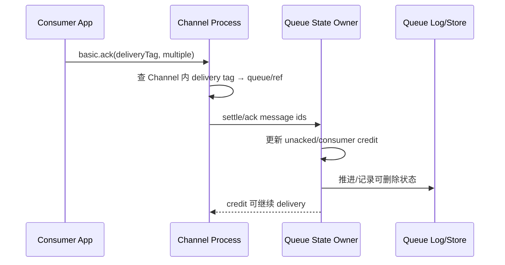

# 13｜BEAM 进程模型与消息处理流水线：一条 AMQP 消息如何穿过 Broker

> 实现基线：RabbitMQ 4.x。Erlang 模块名属于当前实现而非 AMQP 协议保证。阅读目标是建立“哪个进程拥有哪个状态、消息在哪里排队、背压如何反向传播”的模型。

## 1. 为什么先理解 BEAM

RabbitMQ Server 运行在 Erlang/OTP 的 BEAM 虚拟机上。它不是“每连接一个 OS 线程”的阻塞模型，而是大量轻量 Erlang Process 通过 mailbox 传消息，由少量 scheduler threads 调度。

Erlang Process 具备：

- 私有 heap 和 mailbox，默认不共享可变内存；
- 通过发送不可变 term 通信；
- reduction 预算与抢占式调度，避免单个进程永久占 scheduler；
- supervisor/link/monitor 故障传播；
- 独立 GC，减少全局停顿，但大 mailbox/大 binary 仍会制造内存和调度压力。

“轻量”不等于免费。百万级 Connection/Channel/Queue/Consumer 会转化为大量 Process、ETS、timer、socket 和 mailbox 状态。

## 2. AMQP 0-9-1 连接侧进程

源码阅读入口通常包括：

```text
rabbit_networking / ranch listener
  → connection reader (`rabbit_reader` 等)
  → connection writer
  → heartbeat sender/receiver
  → channel processes (`rabbit_channel`)
```

Reader 从 TCP/TLS 接收字节、解析 frame header/body，并按 channel number 把 method/content 交给对应 Channel Process。Writer 将多个 Channel 的 outbound frames 序列化到 socket。Connection 级认证、vhost、heartbeat 和 frame_max 属于连接状态；Exchange declare、basic.publish、basic.ack 等属于 Channel 命令。



## 3. Frame 组装不是一次 read

`basic.publish` 的逻辑消息至少包含：

1. Method frame：Exchange、Routing Key、mandatory 等；
2. Content header frame：body size、delivery mode、headers 等 properties；
3. 一个或多个 content body frames。

Reader 可能分多次 socket read 才得到完整 frame，一个消息 body 也可能按 negotiated `frame_max` 分割。Channel 必须维护内容组装状态，防止在尚未收完 body 时接受不合法的 method 序列。

因此多线程共享同一 Channel 的根本风险不是“两个 Java 方法同时运行”这么简单，而是属于两条 Publish 的 method/header/body frame 若交错，Broker 无法还原消息边界。

## 4. Channel 是协议状态机

`rabbit_channel` 一类模块持有：

- 当前用户/vhost 权限上下文；
- confirm mode、下一 Publisher sequence、待确认路由结果；
- transaction mode 与暂存状态；
- Consumer 注册、delivery tag、unacked delivery 记录；
- QoS/prefetch credit；
- topology 操作和 Channel exception 状态。

一个 Channel 命令出错通常由 Broker 发 `channel.close` 并终止 Channel Process。Connection Reader/Writer 仍可能服务其他 Channel。这就是协议错误作用域隔离。

## 5. Publish 的服务端路径

简化调用/消息流：

```text
Reader 组装 publish content
→ rabbit_channel 认证与参数校验
→ exchange lookup
→ exchange type route(binding table / router)
→ 得到目标 queue references
→ 按 queue type 调用 deliver
   ├─ classic: queue process / backing queue
   ├─ quorum: ra command to queue leader
   └─ stream: stream queue / Osiris writer
→ 收集各目标结果
→ mandatory Return / publisher confirm
```

Exchange 路由通常主要是元数据/匹配计算；真正的排队、复制和落盘在 Queue 类型实现中。一个 Publish 匹配 100 个 Queue，会产生 Fanout 写放大和 100 个目标的确认/故障耦合。

## 6. Classic Queue Process 的串行所有权

Classic Queue 通常由一个 Queue Process 串行拥有队列核心状态，通过 `rabbit_amqqueue_process`、`rabbit_variable_queue`、`rabbit_queue_consumers` 等模块协调：

- publish 入队；
- Ready 队列与 backing queue；
- Consumer 列表、priority、credit；
- delivery 和 unacked；
- ack/reject/requeue；
- TTL、max length、DLX；
- confirm 回传。

单所有者大幅减少共享锁，但意味着单个热点 Queue 的调度/消息处理最终受一个核心状态机约束。增加 Cluster 节点不会把同一个 Classic Queue 自动拆成多分区。

## 7. Quorum/Stream 为什么不同

Quorum Queue 的权威状态不是一个普通 Queue Process 的内存列表，而是 Ra 状态机日志；`rabbit_fifo` 一类纯状态机接收 enqueue、checkout、settle、return 等命令。Leader 把命令复制到多数成员后应用。

Stream 则把数据追加到 Osiris 日志，以 chunk/segment/offset 为核心。消费不是从 Ready 头部移除，而是从某 offset 读取。表面都可通过 Queue API 声明，内部所有权完全不同。

## 8. Ack 的反向路径



Channel 必须保存 delivery tag 到具体 Queue delivery 的映射；一个 Channel 可消费多个 Queue。跨 Channel Ack 找不到该 tag，因此触发 protocol exception。

## 9. Mailbox 与背压

BEAM Process 消息发送通常是异步的。如果 Producer/路由速度大于 Queue Process 处理速度，压力可能表现为：

- Queue Process mailbox 变长；
- process reductions/CPU 升高；
- Channel 等待 credit/flow；
- Connection writer send queue 增长；
- Publisher Confirm 延迟和 Pending 增长。

Mailbox 长不是“还有更多业务 Queue 消息 Ready”，而是内部尚未处理的 Erlang messages。Prometheus 的 queue process reductions、Erlang scheduler run queue、process/mailbox 诊断能区分 Broker 调度拥塞与业务积压。

## 10. Large Binary 与 GC

Erlang 对较大 binary 使用引用计数的 off-heap binary，跨 Process 发送可能共享引用而非复制整个 body。这有利于 Fanout，但一个 Process/消息仍持有引用就会阻止 binary 回收。大 Publisher Pending、Unacked、DLX worker 或 mailbox 都可能让大 binary 长寿。

因此排查内存不能只看 Process heap；还要看 binary memory、ETS、allocated-unused、page cache 和 client-side memory。

## 11. Supervisor 与恢复

Connection、Channel、Queue、vhost 组件位于 OTP supervision tree。子进程崩溃后是否重启、重启强度和状态从哪里恢复取决于组件：

- Channel 协议错误通常不透明重启，客户端收到关闭；
- Connection 断开由客户端重连；
- Classic Queue Process 可从 index/store 恢复；
- Quorum Queue member 从 Ra log/snapshot 恢复；
- Stream replica 从 Osiris segments/coordinator 恢复。

“Erlang Let It Crash”不等于忽略错误，而是把可恢复状态外置、定义监督边界和失败升级策略。

## 12. 源码阅读路线

1. Listener/acceptor 到 `rabbit_reader` frame parsing；
2. Channel 创建与 `rabbit_channel` method dispatch；
3. `basic.publish` 的 content assembly、权限和 Exchange route；
4. `rabbit_amqqueue:deliver` 如何按 Queue type dispatch；
5. Classic `rabbit_amqqueue_process` / Quorum `rabbit_quorum_queue` / Stream `rabbit_stream_queue`；
6. Confirm 和 Return 如何返回 Channel/Writer；
7. `basic.ack` 从 Channel delivery tag 回到 Queue settle；
8. 对照 Prometheus process reductions/mailbox/queue metrics。

## 13. 深度检查题

1. 一个 TCP Connection 上 Channel #1 协议错误，为何 Channel #2 可能继续工作？
2. 一个 Publish Fanout 到 100 Queue，消息 body 是否必然复制 100 份进 BEAM heap？磁盘写放大呢？
3. Ready=0 但 Queue Process mailbox 很长，说明什么？
4. 为什么同一 Classic Queue 加更多节点不能获得线性并行？
5. Ack 为什么必须经过原 Channel，而不是直接按 eventId Ack？

