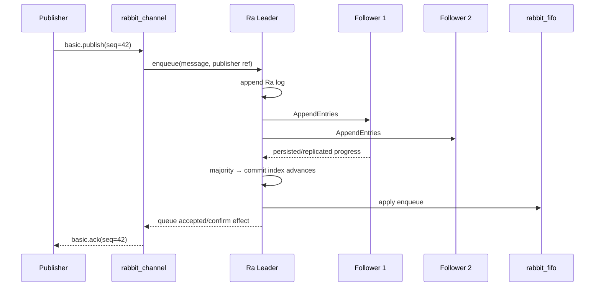

# 14｜Quorum Queue 的 Raft 日志与 FIFO 状态机：Confirm 与 Ack 如何进入共识

> Quorum Queue 不只是“Classic Queue 复制三份”。它把入队、Consumer checkout、settle、return、delivery-limit 等操作编码为 Raft 状态机命令。数据安全、可用性与磁盘成本由日志复制和多数派提交共同决定。

## 1. 两个层次：Ra 与 rabbit_fifo

RabbitMQ 使用 Ra 库实现 Raft 基础设施，Quorum Queue 的业务状态机由 `rabbit_fifo` 等模块表达：

```text
Ra layer
  election / term / leader / append entries / commit index / WAL / segment / snapshot

rabbit_fifo machine
  ready messages / consumers / checked-out deliveries / credit / settlement
  returns / delivery count / dead-letter actions / limits / priorities
```

Ra 不理解 `basic.ack`；它只复制命令。`rabbit_fifo` 不自行处理网络选举；它只按确定顺序应用已提交命令。

## 2. Publish 到 Confirm



官方保证的关键边界是：Publisher Confirm 成功的消息，在不永久丢失多数成员的条件下不应丢失。未确认消息没有这种安全保证。

## 3. Commit Index、Applied Index、Confirm

Raft 至少区分：

- log last index：Leader/Follower 已有的日志末尾；
- commit index：多数派复制、可安全提交的前缀；
- applied index：状态机已应用到的位置。

`last index` 高不等于消息已安全；Leader 崩溃后未提交尾部可被新 Leader 截断。Confirm 不能在只追加 Leader 本地后就宣告 quorum safe。

实现可通过流水线批量复制和应用提高吞吐，但不能破坏“先多数派提交，再产生安全确认效果”的顺序。

## 4. Consumer Delivery 也是状态

工作队列消费不只是读日志。Leader 要记录：

- Consumer identity/credit；
- 哪些 Message 已 checkout 给哪个 Consumer；
- delivery count；
- 哪些已 settle/ack；
- Consumer/Channel 消失时哪些要 return；
- Single Active Consumer 的 active owner。

因此 Ack 需要提交状态机命令。它不仅释放客户端 credit，还决定消息是否从逻辑 Queue 完成、日志何时可截断/compact。

## 5. Checkout 与 Settle

概念状态：

```text
enqueue(msgId=10)      → ready
checkout(c1, msgId=10) → checked_out(c1, deliveryId)
settle(c1, deliveryId) → completed
return(c1, deliveryId) → ready, deliveryCount+1
discard(...)           → dead-letter/drop action
```

Consumer Ack 与 Publisher Confirm 完全不同：前者 settle Queue 消费状态，后者确认 enqueue 已安全提交。

## 6. Leader 故障与重投

Leader 故障后新 Leader 从 committed log 恢复 `rabbit_fifo` 状态。某 Delivery 已发送到 Consumer 但 Ack 是否提交存在不确定窗口：

- Ack 已 commit：新 Leader 保持 completed；
- Ack 未 commit：Delivery 可能 return/redeliver；
- Consumer 已写 DB 但 Ack 未 commit：业务重复。

这就是 Quorum Queue 仍然是 At-Least-Once 消费，而不是 Raft 自动给外部数据库 Exactly-Once。

## 7. Snapshot 与 Log Compaction

如果永远重放从 index 1 开始的全部 enqueue/ack，恢复成本不可控。Ra 定期将状态机快照化，并截断已被 snapshot 覆盖且不再需要的日志前缀。

Snapshot 至少包含可恢复的 FIFO 状态：Ready/checked-out/consumer/limits 等逻辑信息，并与某 committed index/term 对齐。新成员可以安装 snapshot，再接收后续增量日志；短暂落后成员通常只追 delta，无需全量同步。

## 8. WAL、Segment 与 fsync

Ra log 通常先写 WAL，再整理为 segment/snapshot。Quorum Queue 为数据安全进行磁盘密集型写入；官方建议快速磁盘。一次 publish 的物理放大包括：

- Leader log/WAL；
- 多个 Follower log/WAL；
- segment/snapshot 重写；
- Ack/checkout 等状态命令；
- DLX/目标 Queue 的额外写入。

所以消息体越大、成员越多，吞吐一般越低；5/7 成员不是免费提高安全。

## 9. Election 与多数派

三成员 `[A,B,C]`：

- A Leader；A 故障，B/C 两票可选新 Leader；
- A、B 均故障，只剩 C 一票，不能形成多数派；
- 网络分区 A | B,C，B,C 一侧可继续，A 必须停止领导行为；
- 旧 A 恢复后接受新 term，截断冲突尾部并追赶。

Raft 保护的是同一个 Queue Group。不同 Quorum Queue 的 members/Leader 分布不同，同一节点故障对各 Queue 的影响需逐个评估。

## 10. Membership Change

新增 Cluster Node 不自动改每个 Queue 的 Ra Group。添加新 member 需要：

1. 创建/启动新 Ra member；
2. 传输 snapshot 或全量状态；
3. 追上 Leader 后进入成员配置；
4. 保证配置变更本身在安全共识下进行。

成员变更期间会有磁盘/网络恢复流量。批量 grow/shrink 必须限速，避免所有 Queue 同时同步拖垮节点。

## 11. Delivery Limit 与 Poison Message

每次消息 return/redelivery 可增加 delivery count。达到 delivery limit 后，状态机将其丢弃或 dead-letter，阻止无限重投。边界：

- delivery count 是 Broker 视角的投递尝试，不等于业务重试总数；
- DLX 目标不可用时要区分 At-Most-Once 与 At-Least-Once dead-letter strategy；
- 重试到目标可能重复，下游仍需幂等。

## 12. 两级优先级

现代 Quorum Queue 的消息优先级不是 Classic 的多级严格优先队列。它内部使用 high/normal 两类，并以公平比例偏向 high，避免 normal 永久饥饿。回答面试题时不能把 Classic `x-max-priority` 的实现直接套到 Quorum。

## 13. At-Least-Once Dead Lettering

启用符合条件的 At-Least-Once DLX 后，Leader 上内部 dead-letter Consumer：

1. checkout 源死信；
2. publish 到 DLX/目标 Queue；
3. 等待目标 Publisher Confirm；
4. 确认后 settle 源死信；
5. 失败则保留并周期重试。

这本质上复用了“消费后发布再 Ack”的 At-Least-Once 模式，因此目标可能重复，源侧还会占内存/磁盘，必须设置长度上限和监控 confirmed dead-letter counters。

## 14. 源码阅读路线

1. `rabbit_quorum_queue` 如何声明 Queue、定位 Ra server/Leader；
2. publish 如何变为 `rabbit_fifo` enqueue command；
3. Ra server append、replication、commit effect；
4. `rabbit_fifo` apply：enqueue、checkout、settle、return；
5. aux/effect 如何向 Channel 发送 Confirm/Delivery；
6. snapshot/recovery 与 member catch-up；
7. delivery limit、priority、DLX worker；
8. 用 property tests 理解 FIFO 状态机不变量。

## 15. 必须掌握的不变量

1. 只有多数派提交前缀可形成可靠状态；
2. 同一 term 最多一个合法 Leader，多数派交集阻止双写；
3. 状态机必须确定性：相同命令序列得到相同状态；
4. Confirm 对应安全 enqueue，不对应 Consumer 业务成功；
5. 外部副作用与 settle 非原子，重复不可避免，只能幂等闭环。

## 16. 深度检查题

1. Leader 本地已有消息但未 commit，为什么不能 Confirm？
2. Ack 已到旧 Leader但未多数派提交，故障后为何可能重投？
3. Snapshot 删除旧日志后，新 member 如何获得历史 Ready 状态？
4. 三成员增加到五成员为什么可能降低 p99？
5. DLX At-Least-Once 为什么仍无法保证目标只出现一次？

