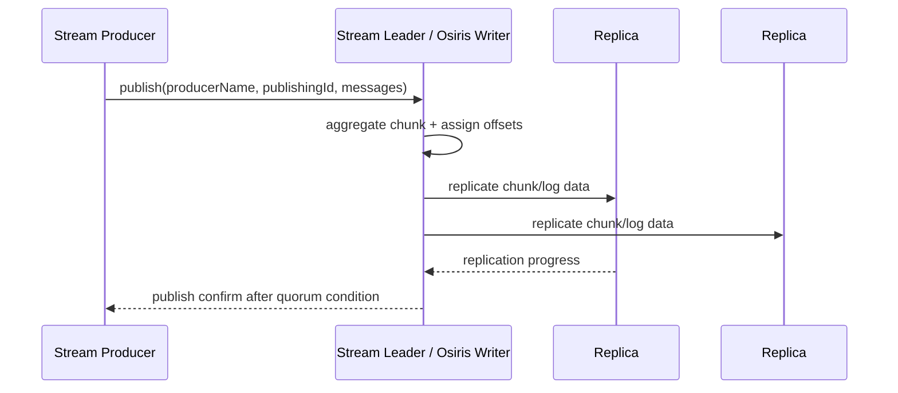

# 16｜RabbitMQ Stream 与 Osiris 日志存储：Chunk、Segment、Offset 和重复读取

> Stream 不是“不删除消息的 Queue”，而是基于 Osiris 的复制追加日志。它将存储、传输和消费位置围绕 offset/chunk 组织，适合高吞吐、长积压、重放和大 Fanout。

## 1. 数据模型

每条消息写入时获得单调 offset，日志按 Chunk 聚合、按 Segment 分文件：

```text
stream replica directory
├── 00000000000000000000.segment
├── 00000000000000000000.index
├── 00000000000001200000.segment
├── 00000000000001200000.index
└── ...

Segment
  ├── Chunk(offset 1200000..1200387, timestamp, crc, bloom/filter metadata)
  ├── Chunk(offset 1200388..1200910, ...)
  └── ...
```

Chunk 是存储和传输批次，数量随 ingress/batching 变化。Index 把 offset/timestamp 映射到 Segment/position，Consumer attach 时无需从头扫描。

## 2. Append 路径



Stream 始终持久、复制。未 Confirm 发布没有安全保证；Confirm 成功建立在其复制 quorum 上。具体 fsync/batching 属于实现和配置，不能从 API 返回时间推导每个介质的瞬时状态。

## 3. 非破坏性消费

Queue Ack 让消息逻辑完成并可回收；Stream Consumer Ack/credit 主要推进消费 flow/offset tracking，不删除该消息。日志由 retention 根据 Segment 年龄/总字节删除。

同一 Stream 可有：

- Consumer A 从 offset 0 做审计；
- Consumer B 从最新位置实时计算；
- Consumer C 从一小时前重放；
- 多个独立应用反复读取同一 offset。

这就是 Stream 对长 Fanout 的优势：消息存一份复制日志，而非每个订阅建一份 Queue 数据副本。

## 4. Attach Offset

可从 first、last chunk、next、数值 offset、Broker arrival timestamp、相对时间区间开始。按 timestamp attach 使用 Broker 到达时间和 Chunk 边界，不是业务 `occurredAt` 精确索引；可能收到请求时刻之前的一些同 Chunk 消息。

数值 offset 已被 retention 删除时会 clamp 到可用起点，而不是恢复已删除数据。应用需监控 Consumer 落后是否接近 retention head。

## 5. Retention 的 Segment 粒度

```text
max-age=7D
max-length-bytes=1TiB
```

两者可组合，但删除以 Segment 为单位，当前 Segment 至少要保留可用数据。因此实际字节/年龄可超出阈值一个或多个处理窗口。Segment 越大：文件少、顺序 IO 好，但 retention 粒度粗；越小：回收更细，文件/索引/roll 成本更高。

## 6. Page Cache 与读取放大

Stream 把绝大多数数据放磁盘，只保留未写入/控制状态；读取高度依赖 OS page cache。热点 Consumer 读最新尾部时缓存命中高，历史重放可能挤掉尾部工作集并制造磁盘顺序读竞争。

生产设计应隔离：

- 实时 Consumer 与大规模 backfill 的 IO；
- Stream replica 写入与历史扫描；
- 容器 memory limit 与 host page cache 的统计口径。

不能只看 BEAM heap 判断 Stream 节点内存压力。

## 7. Producer Deduplication

Stream Protocol 支持基于稳定 producer name + 单调 publishing ID 的发布去重。Broker 维护该 Producer 已接受的 ID/序列状态，重连后重复 ID 可被过滤并确认。

边界：

- Producer name 必须稳定且由一个逻辑 Writer 拥有；
- publishing ID 必须持久化/单调，随机重置会失去跨重启去重；
- 不等于按 message body/eventId 业务去重；
- 多 Producer name 写相同 eventId 仍会出现两条；
- Consumer 外部副作用仍需幂等。

## 8. Broker Offset Tracking

Stream Protocol 可把 Consumer offset 作为非消息数据写回 Stream。频繁每条 store offset 会增加磁盘记录和确认开销；批量/周期保存降低成本，但崩溃后重读窗口增大。

这与 Kafka committed offset 类似但存储位置/协议不同。必须把“读取 position”“已处理 position”“持久 offset”分开。

## 9. Filtering

Publisher 可为 Chunk/消息提供 filter value，Broker 在 Chunk 层利用 Bloom/filter metadata 跳过肯定不匹配的 Chunk，再由客户端做精确过滤。Bloom Filter 有 false positive：可能多传一些不匹配消息，但不能漏掉真实匹配。

过滤值基数、分布和 filter size 影响收益。若每条都是随机 UUID，Bloom 饱和或命中离散，跳 Chunk 效果可能差。

## 10. Super Stream

Super Stream 是逻辑分区 Stream：

```text
orders (super stream)
├── orders-0
├── orders-1
├── orders-2
└── orders-3
```

Producer 按 routing key/hash 选择 Partition；Consumer Group 将 Partition 分配给成员。并行度来自 Partition 数，单 Partition 内 offset 有序，跨 Partition 无全局顺序。

扩分区会改变 hash 映射，与 Kafka 类似。若同 orderId 必须有序，应设计稳定路由与迁移，而不是无条件在线增加 Partition。

## 11. Replica 与 Leader Locality

Stream 操作要求客户端连接承载目标 Stream replica 的节点，Stream Client 会做 metadata discovery、定位 Leader/Replica 并恢复连接。负载均衡器如果完全隐藏节点 identity，客户端可能反复重定向或无法获得最佳 locality。

发布通常面向 Leader；消费可利用 replica/本地性能力，具体版本与客户端配置需查官方文档。

## 12. Recovery

Follower 短暂落后可从 Leader 获取缺失 Chunk；新 Replica 需要同步较完整日志/retention 范围。失去多数派后 Stream 不可安全继续。恢复成本与 retained bytes 成正比，因此超长保留必须规划恢复网络、磁盘和 RTO，而不只是正常吞吐。

## 13. 源码阅读路线

1. `rabbit_stream_queue` 声明与 coordinator；
2. `rabbit_stream_coordinator` 的成员/Leader 元数据状态机；
3. Osiris writer append、Chunk format、offset assignment；
4. segment/index roll 与 lookup；
5. replication/commit 与 Publisher Confirm；
6. Consumer attach、credit、offset tracking；
7. retention segment deletion；
8. filter index/Bloom 和 dedup producer state。

## 14. 深度检查题

1. Consumer Ack 后 Stream 磁盘为何不下降？
2. 从 timestamp attach 为什么可能收到更早消息？
3. publishing ID 去重为什么不等于业务 eventId 去重？
4. 7 天 retention 为什么可能保留超过 7 天的尾部 Segment？
5. Super Stream 扩 Partition 为什么是语义变更？

