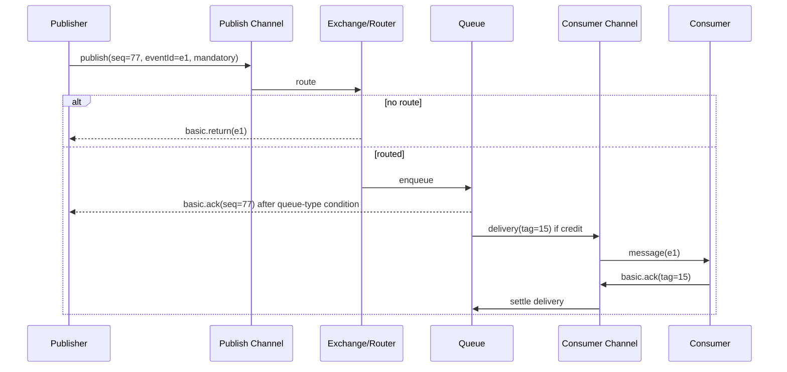

# 17｜Confirm、Return、Ack 与 Credit 状态机：四条独立反馈链

> 最常见的可靠性误解来自把多个“确认”合成一个。RabbitMQ 至少存在 Publisher Confirm、mandatory Return、Consumer Ack、Consumer/Link Credit(Prefetch) 四条方向不同的状态链。

## 1. 全链路坐标



三个 ID 作用域不同：Publisher seqNo 只在 Publish Channel；Delivery Tag 只在 Consumer Channel；eventId 是业务全局稳定标识。

## 2. Publisher Confirm 状态机

客户端 Pending 条目：

```text
CREATED → WRITTEN_TO_CHANNEL → ACKED
                         ├──→ NACKED
                         └──→ UNKNOWN(channel/connection lost or timeout)
```

超时不是 Broker Nack，而是客户端没有及时观察到最终结果。UNKNOWN 重发时必须保留 eventId，不能生成新业务事件。

Broker Confirm `multiple=true` 表示截至 deliveryTag 的 Channel 发布前缀。客户端对有序 Map 做 headMap 清理必须与 publish 加入 Pending 的顺序原子协调，避免 Ack 先到而 Pending 后放入造成永不清理。

## 3. Publish 与 Pending 注册竞态

错误模式：

```text
basicPublish()
pending.put(seq, msg)
```

在极快本地 Broker 上，Ack callback 可能先于 `put`，callback 删除不到，随后 pending 永久残留。正确模式是先获取 next seq、放入 Pending，再 publish；若 publish 同步抛错，再移除/标记。

仍需保证 Channel 不被其他线程插入 Publish 改变 seq 对应关系。

## 4. Return 与 Confirm 竞态

不可路由 mandatory 消息可能产生 Return，同时 Publish 本身获得 Confirm Ack。应用需要把 Return 的 message identity 与 Pending 关联，并定义完成条件：

```text
BrokerAccepted=true
Routed=false
=> 业务发布失败/进入补偿，不能因 Confirm Ack 判成功
```

Return callback 不应做阻塞数据库写，否则可能堵塞客户端 IO 线程。投递到有界业务 executor/Outbox 状态机处理。

## 5. Confirm Nack

Nack 说明 Broker 无法对 Publish 给出成功确认，但批量 Nack 的粒度可能大于业务单条。处理原则：

- 不在 callback 内递归 publish；
- 将对应 Pending 转为 RETRYABLE/FAILED；
- 分类 topology/permission/permanent error 与 transient error；
- 按业务 deadline 有界重试；
- 告警 Nack rate 与 oldest pending age。

## 6. Consumer Delivery 状态机

```text
READY
  → DELIVERED_UNACKED(channel, consumer, deliveryTag, redelivered?)
     ├─ ack → SETTLED/REMOVED
     ├─ nack(requeue) → READY(deliveryCount+1)
     ├─ nack(discard) → DLX/DROPPED
     └─ channel lost → READY/redelivery
```

Delivery Tag 不是 Message ID。重投同一 eventId 会获得新 Delivery Tag，可能到另一个 Consumer。

## 7. Multiple Ack 的连续前缀

Consumer 并发处理 tags 10、11、12：12 先完成，10/11 未完成。如果发送 `ack(12,multiple=true)`，Broker 会把 10～12 全部 settle，崩溃后 10/11 不再重投。

安全批量 Ack 需要维护连续完成前缀：

```text
done={10,12}, base=10 → ack only 10; next base=11
done={11,12}, base=11 → ack 12 multiple; base=13
```

若跨多个 Queue 共用 Channel，Delivery Tag 仍是 Channel 级序列，状态管理更复杂；消费 Channel 按 Queue/Worker 隔离更清晰。

## 8. Prefetch Credit

Broker 只有 credit > 0 才继续 Delivery；每次未确认投递消耗 credit，Ack/Reject/Channel close 归还/重算 credit。

```text
prefetch=50
delivered_unacked=50 → credit=0 → stop delivery
ack 20 → credit=20 → may deliver 20 more
```

Auto Ack 不建立相同未确认窗口，Broker 可尽快写 socket，背压落到 TCP/客户端内存，风险更大。

## 9. Credit 与公平性

两个 Consumer prefetch=1000，Broker 可能在第二个启动前就把大量消息放到第一个 Unacked。此后即使第二个空闲，也不能抢走第一个已 checkout 的消息，除非第一个断开/requeue。

低 prefetch 提高公平与故障恢复，增加网络/调度往返；高 prefetch 提高管线吞吐，增加囤积。应按处理并行度和延迟测量。

## 10. Single Active Consumer

Queue 只选择一个 active Consumer 投递，其他注册为 standby。active 取消/故障后 Broker 选新 Consumer。SAC 控制投递并发，但不能防止：

- active 业务成功、Ack 未提交后故障造成重投；
- 新 active 重做相同 eventId；
- Publisher 重发重复消息；
- Retry Queue 让后续消息绕过失败消息。

所以 SAC 是顺序/故障切换机制，不是 Exactly-Once。

## 11. Channel Recovery 与旧 Tag

连接恢复会创建新 Channel，Publisher seq 和 Consumer delivery tag 作用域重置。旧 Channel Pending/Unacked 不能把 tag 原样搬到新 Channel：

- Publisher Pending 作为 UNKNOWN 按 eventId 重发；
- Broker 将旧 Consumer Unacked requeue/redeliver；
- 新 Consumer 对新 delivery tag Ack。

客户端恢复库可能调整 delivery tag 映射细节，但业务绝不能持久化 tag 当全局位置。

## 12. 端到端状态表

| Publish Confirm | Routed | DB Effect | Consumer Ack | 最终风险 |
|---|---:|---:|---:|---|
| unknown | unknown | no | no | 重发可能在 Queue 重复 |
| ack | false(Return) | no | no | 不补偿则丢业务事件 |
| ack | true | success | lost | 重投，DB 需幂等 |
| ack | true | failed | acked early | 业务漏处理 |
| ack | true | success | ack | 正常，但对账仍防应用 bug |

## 13. 深度检查题

1. Pending 为什么必须在 `basicPublish` 前注册？
2. Confirm Ack + Return 为什么不矛盾？
3. Tag 12 完成为什么不总能 multiple Ack 到 12？
4. Prefetch=0/无限为什么可能把故障从 Broker 转移到 Consumer OOM？
5. 自动恢复后为何不能用旧 delivery tag Ack？

