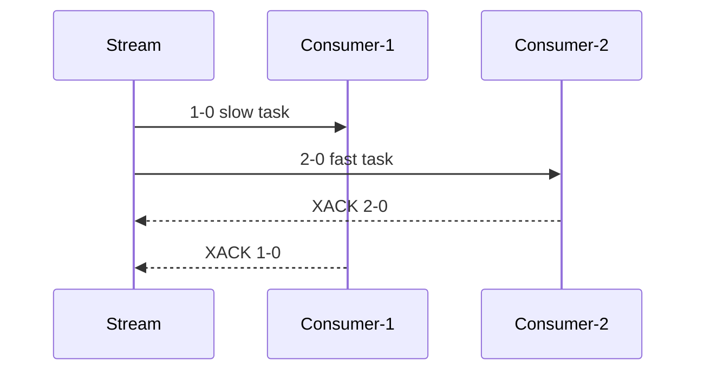

# Stream 模型与 ID 语义

## Stream 保存的不是“队列节点”

从逻辑看，Stream 是按 ID 有序的字段集合序列：

```text
1526919030474-0 => {type=created, order=O1}
1526919030474-1 => {type=paid,    order=O1}
1526919030475-0 => {type=created, order=O2}
```

条目不会因普通消费自动弹出。多个独立读者可以按各自位置回放；Consumer Group 又在日志之上添加“组游标 + 所有权 + 待确认”状态。因此它同时具有日志和任务分发两层语义。

## ID 的二元结构

ID 是 `<millisecondsTime>-<sequence>`。比较先看毫秒部分，再看序列部分。自动 ID `*` 通常使用当前毫秒；若同一毫秒多次写入，序列递增。如果系统时间回拨，Redis 仍必须生成大于当前最大 ID 的值，所以 ID 的时间部分只能视为生成线索，不能当权威事件时间。

关键不变量：对同一个 Stream，新条目 ID 必须严格大于当前最大 ID。显式写入更小或相等 ID 会失败。`0-0` 是特殊最小 ID，不能作为普通新条目写入。

### `ms-*` 的用途

现代版本可让调用者指定毫秒部分而由 Redis 生成序列。这适合希望粗略按外部时间分桶、又不想自己解决同毫秒冲突的场景，但仍要处理外部时间落后于当前最大 ID 的失败。

## 三种“时间”不可混淆

| 时间 | 来源 | 用途 | 风险 |
|---|---|---|---|
| Stream ID 时间 | Redis 生成或调用者指定 | 单流定位、范围扫描 | 时钟回拨、显式 ID、非业务发生时间 |
| event_time | 事件字段 | 业务排序、窗口计算 | 客户端时钟偏差、迟到事件 |
| processing_time | 消费者本地时间 | 延迟与超时 | 重试会改变处理时间 |

若业务要求同一订单严格按版本处理，应携带 `aggregate_id + aggregate_version`，在数据库以版本做条件更新。不要仅凭 Stream ID 推断跨生产者业务因果。

## 特殊 ID 的语境

- `XRANGE key - +`：`-`/`+` 是范围负无穷/正无穷。
- `XREAD STREAMS key $`：从调用时最后 ID 之后等待，只看未来条目。
- `XGROUP CREATE key group $`：组从创建时尾部开始，不消费历史。
- `XREADGROUP ... STREAMS key >`：读取从未投递给该组的新条目。
- `XREADGROUP ... STREAMS key 0`：读取当前消费者自己的 pending 历史，不是全组所有 pending。

同一个符号依赖命令语境，尤其不能把 `$` 持久化为通用 offset。客户端循环应保存上次实际返回 ID。

## 顺序能保证到哪里

单 key 中读取返回按 ID 有序，但端到端完成顺序仍可能变化：



若同一实体不可并行，可按实体 hash 到多个 stream/worker，或在消费端用版本栅栏。代价是热点实体限制吞吐。

## 与 List、Pub/Sub 的本质差异

| 能力 | List | Pub/Sub | Stream |
|---|---|---|---|
| 历史保留 | 手工保留 | 无 | 有序日志，支持裁剪 |
| 多读者回放 | 困难 | 不支持 | 支持 |
| 消费确认 | 应用自行实现 | 无 | Consumer Group PEL |
| 范围查询 | 位置操作 | 无 | 按 ID 范围 |
| 离线消费者 | 可积压 | 直接丢消息 | 回来后继续读 |

## 深度检查

1. 两个生产者在同一毫秒写入，顺序由谁决定？答案是 Redis 实际处理并分配 ID 的顺序，不是网络发送顺序。
2. 能否以 `event_time` 作为显式 ID？可以但风险高：迟到事件无法追加到已有最大 ID 之前，同毫秒冲突和时钟治理也要自行承担。
3. 为什么 Stream ID 不是 Kafka offset？它是可比较的二元 ID，并可能由调用者显式提供；Kafka offset 是分区日志内部连续位置。两者都只在局部日志范围内有序。

