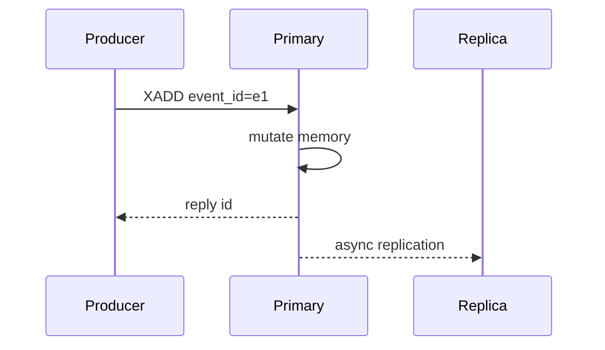

# XADD 写入、裁剪与删除

## 写入执行链

一次 `XADD` 可拆成：参数校验 → 查找/创建 key → 生成或验证 ID → 向尾部宏节点追加或创建新节点 → 更新长度与最后 ID → 可选裁剪 → 标记 key 修改 → 通知阻塞客户端 → 将确定性命令传播到 AOF/副本。

其中三个容易忽略的点：

- `NOMKSTREAM` 让 key 不存在时不创建，适用于防止拼错 key 产生垃圾流。
- 自动 ID 的最终值由主节点决定；向 AOF/副本传播时必须保证重放得到相同 ID，而不是让副本重新取时钟生成。
- 带裁剪的 `XADD` 在一个 Redis 命令边界内完成，但客户端超时仍可能不知道它是否已执行。

## 自动 ID 与显式 ID

```redis
XADD orders:* * event_id e-1 type created
XADD orders:* 1710000000000-* event_id e-2 type paid
XADD orders:* 1710000000001-0 event_id e-3 type shipped
```

自动 ID 避免生产者协调，但不能解决请求超时后的幂等：如果客户端超时并以新的 `event_id` 重试，会得到两条业务事件。应让 `event_id` 在首次调用前生成且重试保持不变；消费端仍需幂等。若必须阻止流内重复，可用 Lua/Function 将去重键检查与 XADD 原子化，但需为去重集合设计 TTL、内存和原子脚本耗时。

## 精确与近似裁剪

```redis
XADD s MAXLEN 100000 * f v
XADD s MAXLEN ~ 100000 * f v
XTRIM s MINID ~ 1710000000000-0
```

精确裁剪需找到严格边界，可能重写边界宏节点；近似裁剪倾向于删除完整宏节点，写放大更低，因此长度可能暂时超过阈值。`LIMIT` 可限制单次裁剪工作量，但意味着债务留给后续写入。

`MAXLEN` 表达“保留约 N 条”，流量变化时对应时间窗口会变化；`MINID` 表达“保留某 ID 之后”，更接近时间保留，但 ID 时间并非严格业务时间。二者都不是磁盘日志段策略，数据仍在 Redis 内存中。

## 保留策略计算

若峰值生产速率为 `R_peak` 条/秒，希望故障时至少保留 `T_recovery` 秒，并留安全系数 `S`：

```text
N_min = R_peak × T_recovery × S
```

还要满足最慢消费者恢复窗口，而不是只看正常平均速率。使用 `MAXLEN ~ N` 时再加入宏节点超限余量。若按时间使用 `MINID`，由治理任务计算 cutoff，并监控实际最老 ID。

## XDEL 的逻辑和物理层

`XDEL` 令条目不再由正常范围读取返回，但 listpack 可能先记录删除，待删除比例足够或整个节点淘汰时再紧缩。删除消息主体与处理消费组引用是不同问题，详见 [08_保留策略删除与悬空PEL.md](08_保留策略删除与悬空PEL.md)。

## 写入故障窗口



- 请求未到主：可安全重试，但客户端通常无法确定。
- 主已执行、响应丢失：重试可能重复。
- 主响应后、复制前宕机：failover 可能丢失已确认写。
- 副本收到但未持久化：进程/机器故障结果依配置而定。
- AOF everysec 尚未 fsync：OS/机器崩溃可能丢约一个同步周期的数据。

所以“XADD 成功”只说明主节点执行并响应，不自动等于多数派持久提交。

## 生产约束

1. 限制字段和值大小；大对象放对象存储，Stream 保存引用与校验值。
2. 给 key 数量设上界；不要每个用户建无限生命周期 Stream。
3. 同时配置保留上限和内存告警，避免积压把整个 Redis 实例拖入淘汰或 OOM。
4. MQ 数据最好使用独立实例，避免缓存淘汰策略、Lua 大脚本和热点 key 相互干扰。
5. 记录每次写入的业务事件 ID、返回 Stream ID、耗时和不确定结果。

## 深度面试追问

问：`XADD MAXLEN ~` 是不是先写后异步裁剪？

答：从命令语义看写入和本次裁剪处于同一命令执行边界，不应描述成后台异步线程；`~` 表示允许按内部节点粒度近似，不表示以后异步完成所有工作。`LIMIT` 或节点边界会让结果暂时超限。

