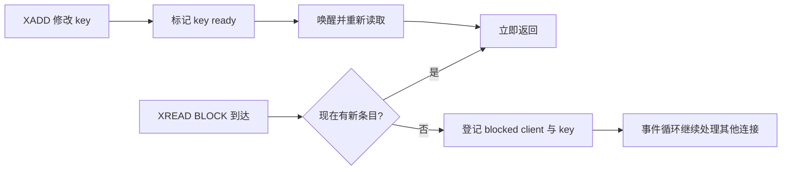

# 范围读取、阻塞读取与事件循环

## XRANGE 是日志扫描

`XRANGE key start end COUNT n` 从 rax 定位包含 start 的宏节点，再由 Stream iterator 解码条目，直到 end 或数量上限。起止 ID 可使用排除语法实现无重复分页：下一页从上一页最后 ID 的开区间继续，而不是自行给序列号加一。

```redis
XRANGE orders - + COUNT 100
XRANGE orders (1710000000000-42 + COUNT 100
```

大范围读取会占用 Redis 主线程生成响应并占用客户端输出缓冲区。分页不是只为网络，也是在控制单次命令的 CPU 公平性和内存峰值。

## XREAD 是多流增量读取

```redis
XREAD COUNT 100 BLOCK 5000 STREAMS s1 s2 0-0 0-0
```

`STREAMS` 后先列全部 key，再列一一对应的 ID。每个 ID 表示“只返回严格大于它的条目”。非组消费必须由客户端维护每个 stream 的最后 ID；若用 `$` 每轮调用，可能跳过调用间已到达的记录。

## BLOCK 没有阻塞 Redis 主线程

当当前没有数据时，服务端将客户端登记到所等待 key 的阻塞结构，暂停该客户端请求处理并回到事件循环。后续 `XADD` 修改 key 后触发 ready-key 处理，Redis 再检查被阻塞客户端并构造结果。



“连接被阻塞”与“服务器线程被阻塞”是两件事。但大量阻塞客户端仍消耗连接、客户端结构、订阅 key 索引和唤醒扫描成本。

## 为什么专用连接很重要

阻塞读取期间该连接不能承载普通请求。若从小连接池借连接执行无限 `BLOCK 0`，消费者数量很快耗尽连接池，健康检查、ACK 和业务命令都可能拿不到连接。

推荐：

- 每个阻塞消费循环使用专用长连接。
- ACK、claim、监控使用非阻塞连接池。
- 使用有限 BLOCK 超时，如 2—5 秒，以便检查关闭信号、拓扑变化和线程中断。
- 客户端关闭时先停止新读，再完成或保留当前处理，最后释放连接。

## COUNT 不是严格批大小承诺

`COUNT` 是本次希望返回的上限/提示，受可用数据和多流情况影响。批量越大，往返次数越少，但单次解码、网络包、业务事务和失败重放范围越大。应以端到端 P99 和单批处理时间选择，而不是只追求最大吞吐。

## 多流公平性

一个 XREAD 可等待多个流，但热流持续有数据时，冷流延迟、返回分配和客户端处理策略需实测。若业务需要严格租户公平，单命令多流并不能提供权重调度；可分连接、分 worker 或在应用层轮转，并防止热点流垄断批处理时间。

## 响应丢失与位置推进

非组 XREAD 不在服务端保存 reader offset。若客户端拿到响应后在持久化 last ID 前崩溃，会重复；若先保存 last ID 再完成业务，会丢处理。因此同样需要外部幂等或把 offset 与业务结果放入同一外部事务——但这只能协调外部库内状态，不能原子删除 Redis 数据。

Consumer Group 把这类位置和 pending 状态移入 Redis，但仍无法与外部副作用形成分布式事务。

## 慢查询与输出缓冲

排障时查看：

- `SLOWLOG`：大范围读取、超大 claim/trim 是否占线程。
- `CLIENT LIST`：阻塞客户端数量、年龄、输出缓冲。
- `INFO clients`：blocked clients。
- 网络吞吐和客户端反序列化时间。
- 单次返回消息数与字节数，而不仅是命令 QPS。

## 实验

启动 100 个 `BLOCK` 客户端并持续 XADD，记录命令延迟；然后让所有客户端等待同一个 key，再一次写入。观察惊群式唤醒和连接开销。再改为一个 Consumer Group 多消费者，比较“每个独立 XREAD 都收到”与“组内工作分发”的差别。

