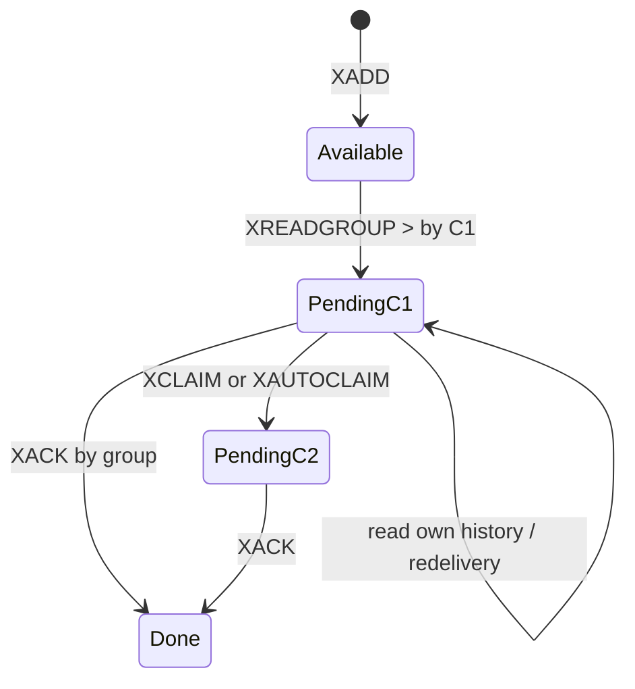

# Consumer Group 状态机

## 三层状态

Consumer Group 不是一个数字 offset，而是至少三层状态：

```text
stream
└── group payment-workers
    ├── last-delivered-id / entries-read / lag
    ├── group PEL: id -> delivery metadata + owner
    └── consumers
        ├── pay-01 -> consumer PEL
        └── pay-02 -> consumer PEL
```

消息主体仍属于 Stream；组只保存自己的消费进度和未确认状态。因此多个组可以独立读取同一条消息。

## 创建起点

```redis
XGROUP CREATE orders payment-workers 0 MKSTREAM
XGROUP CREATE orders audit-workers $ MKSTREAM
```

- `0`/`0-0`：组可消费已有历史。
- `$`：从创建时尾部之后消费，只处理未来数据。
- `MKSTREAM`：key 不存在时创建空 Stream。

生产部署要把创建组做成幂等初始化，并区分 `BUSYGROUP` 与真正错误。误用 `$` 会让已有数据永久不进入该组的新消息路径。

## `>` 的状态转换

`XREADGROUP GROUP g c ... STREAMS s >` 请求从未投递给组的新条目。服务端选择 last-delivered-id 之后的记录，推进组位置，并在非 `NOACK` 时为每条创建 PEL、归属消费者、记录投递时间和次数。

所以该命令会修改数据，官方将其视为写操作；在只读副本上不能把它当普通查询。它的状态需要进入 AOF、RDB 和复制流。



`Done` 只表示不再 pending，消息主体仍可被 XRANGE 和其他组读取，直到删除/裁剪。

## 读 pending 历史

当 ID 不是 `>`，XREADGROUP 读取的是该消费者自己的 pending 历史范围，主要用于消费者重启后先清理旧工作。它不是“从组游标任意回放”的等价方式，也不会自动取得其他消费者的 pending。

可靠循环通常分两条路径：

1. 恢复路径：读取或 claim 历史 pending，完成后 ACK。
2. 正常路径：使用 `>` 领取新消息。

只写第二条会让宕机消费者的 PEL 永久积压；每个消费者只读自己的历史又无法接管永久离线实例，因此需要 claim 协调器。

## last-delivered-id 不是 committed offset

Kafka 常把 committed offset 理解为下一次消费位置；Stream 的 last-delivered-id 表示组已投递到哪里，其中大量消息可能仍在 PEL，尚未完成。组看起来已经追上流尾，并不代表业务处理完毕。

必须同时观察：

- `lag`：尚未交付给该组的新条目估计数。
- PEL size：已交付但未 ACK 数量。
- oldest pending idle：最老未完成任务的停滞时间。
- delivery count：反复投递/claim 的异常信号。

健康完成度近似需要 `lag ≈ 0 && pending ≈ 0`，但还要看业务错误和幂等冲突。

## entries-read 与 lag 的边界

现代 Redis 用 entries-read 辅助估算 lag。删除、裁剪、任意设置组 ID 等情况可能让 lag 暂时不可精确计算或出现未知值。监控系统必须允许 unknown，而不是将其强制当 0。变更组游标前记录原因并校验 Stream 首尾 ID、组 ID 和 PEL。

## NOACK 的真实含义

`NOACK` 跳过 PEL 跟踪，性能略省，但消息一经投递就被组视为无需确认。消费者在收到后宕机，服务端没有 pending 记录可恢复。它适合允许丢失或消息本身可从别处重建的场景，不适合支付、订单等可靠任务。

## Consumer 生命周期

消费者名是状态标识，不应每次重启随机生成而永不清理，否则产生大量空消费者元数据。稳定实例可用可预测名称；弹性环境需定期识别 inactive 且 PEL 为空的消费者后 `XGROUP DELCONSUMER`。若 PEL 非空，先 claim/处理，不能直接把删除 consumer 当 ACK。

## 管理命令的危险性

- `XGROUP SETID` 可改变新消息投递起点，但不自动重做已有 PEL。
- `XGROUP DESTROY` 删除整个组和 PEL，不删除 Stream；这是破坏性操作。
- `DELCONSUMER` 影响消费者元数据及其 pending 归属语义，执行前检查版本行为和 PEL。
- 创建同名组失败不应被一概吞掉，需确认 key 类型、目标起点和配置一致。

## 深度问答

问：组中两个消费者能否同时正常拥有同一条 pending？

答：PEL 记录在某一时刻有一个 owner；claim 会转移 owner。但旧消费者可能已在 Redis 外执行任务，服务端转移不能取消其线程，所以业务层仍可能并发执行两次，幂等是必需的。

问：为什么 lag 为 0 仍报警？

答：last-delivered 已到尾部，而消息可能全部卡在 PEL。应结合 pending 数和 oldest idle。

