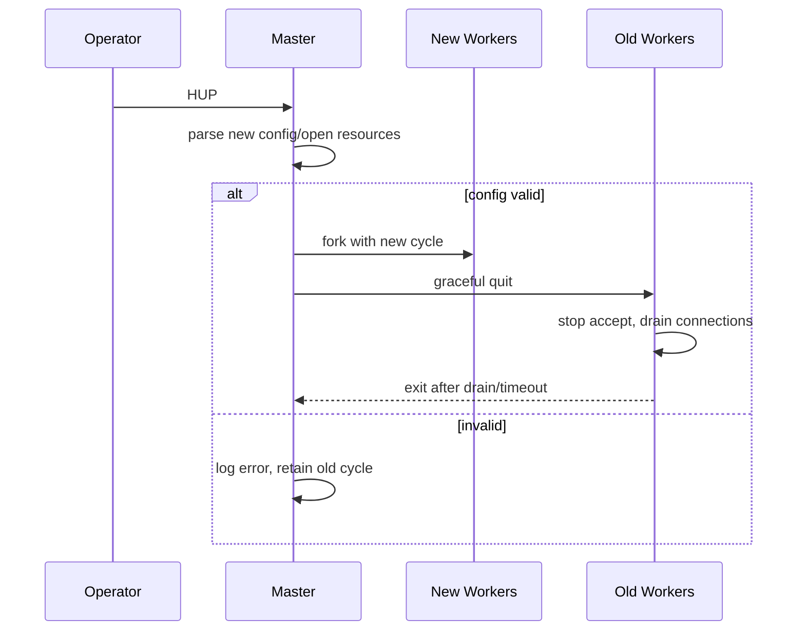

# Nginx 架构、进程模型与信号

## 1. 进程角色

典型进程树：

```text
master(root or privileged)
├── worker(unprivileged)
├── worker(unprivileged)
├── cache manager(optional)
└── cache loader(optional)
```

master 负责：

- 解析配置并创建 `ngx_cycle_t`。
- 打开监听 socket、日志和共享内存。
- fork worker 与辅助进程。
- 接收信号、重载配置和回收子进程。
- 在 worker 异常退出时按策略拉起。

worker 负责实际连接和请求处理。

权限分离意味着 master 可绑定低端口、读取私钥并准备资源，worker 再降权运行。

## 2. 为什么不是每连接一个进程/线程

阻塞式模型中，大量连接意味着大量线程栈、调度和上下文切换。

Nginx worker 使用非阻塞 fd 和事件通知：

```text
socket 暂不可读 -> 注册 read event -> 处理其他连接
socket 可读       -> handler 读取到 EAGAIN -> 再等待
```

单 worker 串行执行许多短 handler。

没有“每连接线程”，也不代表没有并发；并发体现在大量连接状态同时存在，CPU 在就绪事件间切换。

## 3. master 为什么持有监听 socket

master 在 fork 前打开监听 socket，worker 继承 fd。

好处：

- reload 时新 worker 复用现有监听端口，不需关闭再绑定。
- 旧 worker 可继续处理已建立连接。
- 新旧配置平滑交接。
- 绑定特权端口只需 master 权限。

使用 `reuseport` 时可为 worker 创建独立监听 socket，由内核分配连接；这改变 accept 竞争和负载分布，但不能替代应用容量治理。

## 4. worker_processes

`worker_processes auto` 通常以可用 CPU 为起点。

不是越多越好：

- CPU 密集 TLS/压缩适合接近核心数。
- 阻塞模块会让更多 worker 看似缓解，但根因仍是阻塞代码。
- worker 过多增加共享锁竞争、cache、调度和内存。
- 容器中要确认 CPU quota/affinity，而非只看宿主机核心。

## 5. worker 启动

概念路径：

```text
main
 -> ngx_init_cycle
 -> ngx_master_process_cycle
 -> ngx_start_worker_processes
 -> fork
 -> ngx_worker_process_cycle
 -> ngx_worker_process_init
 -> ngx_process_events_and_timers loop
```

worker 初始化：

- 设置环境、优先级、CPU affinity。
- 降权 setuid/setgid。
- 初始化模块 process hook。
- 建立进程间 channel。
- 注册监听事件。
- 进入事件循环。

## 6. 信号控制

常见信号语义：

| 信号/命令 | 目标 | 语义 |
|---|---|---|
| HUP / `-s reload` | master | 重新读取配置，启动新 worker，优雅关闭旧 worker |
| QUIT / `-s quit` | master/worker | 优雅退出，停止接新连接并排空 |
| TERM/INT / `-s stop` | master | 快速停止，连接可能中断 |
| USR1 / `-s reopen` | master | 重新打开日志，支持 logrotate |
| USR2 | master | 可执行文件热升级流程的一部分 |
| WINCH | master | 优雅关闭 worker，常用于热升级控制 |

生产操作必须区分 QUIT 和 TERM。

## 7. reload 的真实过程



新旧 worker 地址空间独立，各自持有对应配置对象。

旧 keepalive/长连接可能让旧 worker 长期存在。

`worker_shutdown_timeout` 可限制排空时间，但超时会终止剩余连接。

## 8. 配置验证不等于运行成功

`nginx -t` 能检查语法并尝试打开引用资源。

仍可能在 reload 后失败：

- DNS 结果变化。
- 动态证书/权限问题。
- upstream 业务不可用。
- 新配置消耗过多共享内存。
- location 逻辑正确但语义错误。
- 新 worker 启动后连接容量不足。

需要 canary、指标和快速 rollback。

## 9. worker 异常与请求

worker 崩溃时，其进程内连接全部断开。

master 可拉起新 worker，但不能恢复旧 TCP 状态。

客户端可能重试：

- GET 通常可重试。
- POST 可能已经到 upstream 并产生副作用。
- 上传可能只发送一部分。

所以“Nginx 自动拉起 worker”不等于请求无损。

## 10. cache manager/loader

proxy cache 文件主体在磁盘，key 元数据在共享内存 zone。

cache loader 在启动后逐步扫描已有 cache 文件，把 metadata 装入共享区，避免启动时一次扫描阻塞。

cache manager 周期性按 inactive、max_size、min_free 等约束删除文件。

它们是独立辅助进程，不处理普通 HTTP 请求。

## 11. 进程间共享什么

worker fork 后普通内存写时复制，配置对象逻辑只读。

跨 worker 状态需要显式共享内存：

- limit_req/limit_conn zone。
- upstream zone 和运行状态。
- TLS shared session cache。
- proxy cache keys zone。

共享区通常使用 slab 分配、原子操作和锁。

不能用 C 全局变量实现可靠跨 worker 计数。

## 12. 容器与 PID 1

容器中 master 应正确作为前台进程接收信号。

编排系统 termination：

1. endpoint 摘除有传播延迟。
2. 发送 TERM 还是 QUIT 取决于 entrypoint。
3. terminationGracePeriod 必须覆盖请求排空。
4. 长连接和 WebSocket 可能超过窗口。
5. preStop sleep 只能缓冲摘流传播，不能替代 readiness 和优雅信号。

如果容器直接快速 TERM，滚动发布仍会断流。

## 13. 源码导航

- `src/core/nginx.c`：main、参数、信号、初始 cycle。
- `src/core/ngx_cycle.c`：`ngx_init_cycle()`、配置和资源。
- `src/os/unix/ngx_process_cycle.c`：master/worker cycle。
- `src/os/unix/ngx_process.c`：fork、signal、channel。
- `src/event/ngx_event.c`：事件模块初始化。

阅读时记录每个 fd 在 master 创建还是 worker 创建、谁关闭以及 reload 是否复用。

## 14. 实验

```bash
ps -ef | grep nginx
nginx -t
nginx -s reload
kill -QUIT <old-worker-pid>
kill -USR1 <master-pid>
```

观察：

- reload 前后 master PID 不变。
- 新 worker PID 出现。
- 旧 worker 状态进入 shutting down。
- 长连接保持时旧 worker 继续存在。
- reopen 后新日志文件接收写入。

## 15. 面试追问

问：reload 为什么不丢监听端口？

答：master 持有/管理监听 socket，新 worker 继承或复用，旧 worker 停止 accept 但继续处理现有连接。

问：worker 数是否应该等于连接数？

答：不是。worker 是事件循环执行者，一个 worker 管理大量非阻塞连接；数量主要与 CPU、阻塞风险和负载模型相关。

