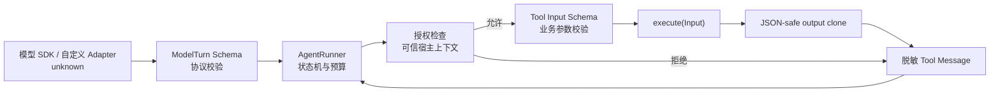
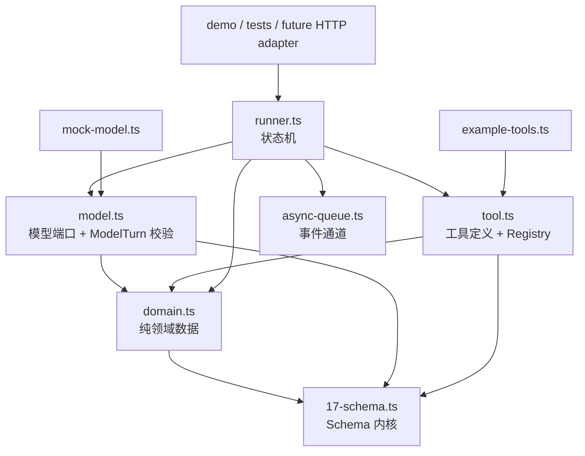
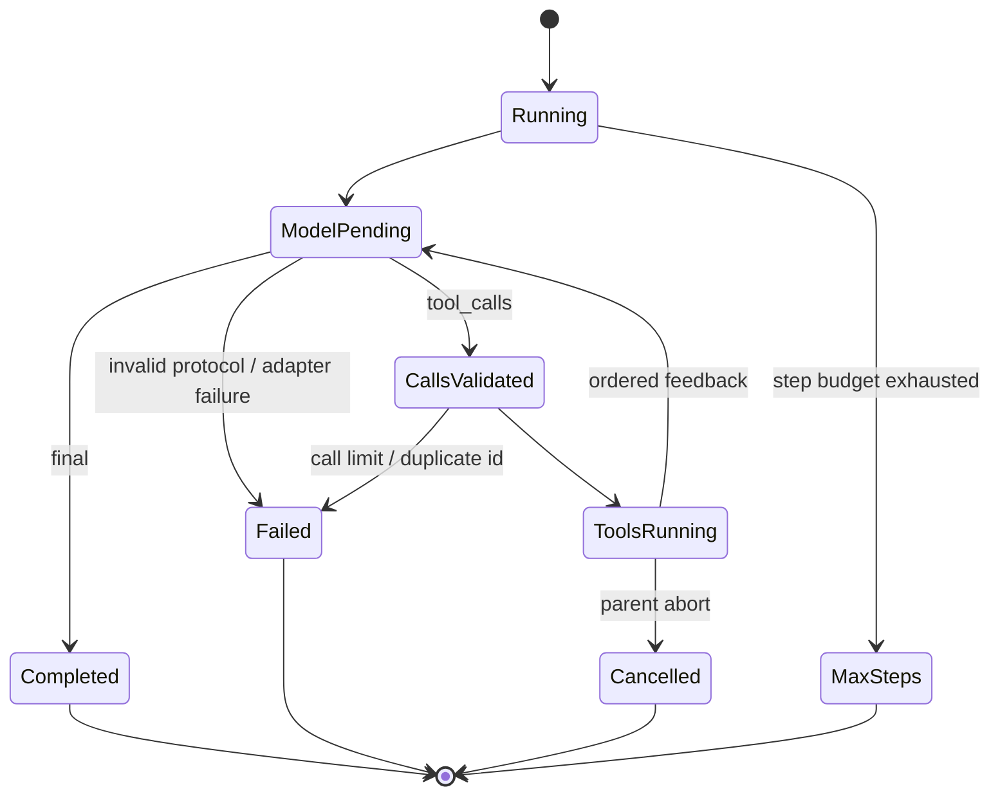

# 14 · 多模块 Agent Runtime：从不可信模型输出到有界状态机 ⭐⭐⭐

> Agent Runtime 最难的部分不是写一个 `while` 循环，而是回答这些问题：外部值何时才可信？工具能看到什么权限？一次回合最多制造多少工作？并发完成后如何保持 transcript 确定？失败应终止 Run，还是作为消息交还模型？

配套工程：[agent-runtime](../code/src/agent-runtime/README.md)。建议先运行：

```bash
cd Typescript/code
npm run lesson:agent-runtime
npm test
npm run typecheck
```

---

## 1. 先画信任边界，不要先画类图

案例中的数据不是同一可信等级：



边界的方向非常重要：

1. 模型适配器返回的是 `unknown`，不是已经可信的 `ModelTurn`。
2. 模型给出的工具名和参数仍是动态数据。
3. 权限来自宿主，不来自模型参数。
4. 工具实现也是故障边界；其返回类型通过编译，不等于运行时一定能安全 JSON 序列化。
5. 回填给模型的错误是公开协议，不等于内部异常对象。

这与 Java 后端中的 Controller DTO、Bean Validation、Service 权限和异常映射类似。不同点是：TypeScript 的接口和泛型在 JavaScript 运行时全部擦除，因此每个跨进程、跨包或动态插件边界都必须另外建立运行时证据。

---

## 2. 模块依赖：稳定协议向内，具体实现向外



[domain.ts](../code/src/agent-runtime/domain.ts) 只放跨模块稳定数据，不放执行逻辑。这不是把所有类型都扔进 `types.ts`；局部 worker 状态、辅助结果和配置仍留在实现附近。只有模型、Runner、工具和消费者共同依赖的协议才进入领域模块。

这样做避免：

- 模型、工具和 Runner 互相 import 形成初始化环；
- 更换 SDK 时领域类型被供应商类型污染；
- 测试为了构造一条消息而加载网络客户端；
- `.d.ts` 暴露大量实现细节。

TypeScript 使用结构类型。Mock 只要拥有正确的 `complete` 方法就满足 `ModelAdapter`，不需要像 Java 一样显式 `implements`；便利的代价是对象“看起来相同”就可赋值，所以运行时验证更不能省略。

---

## 3. 三种类型不要混为一谈

一个 Agent 边界通常同时存在三种表示：

| 层 | 例子 | 能证明什么 | 不能证明什么 |
|---|---|---|---|
| wire value | SDK response、JSON、模型 arguments | 目前只是 `unknown` | 字段、范围、唯一性都未知 |
| runtime schema | `Schema<ModelTurn>`、`Schema<SearchInput>` | 本次运行的值通过了规则 | 不能替代后续授权与业务状态 |
| static type | `ModelTurn`、`SearchInput`、泛型 I/O 关联 | Checker 能阻止源码中的误用 | 不能约束模型、旧 JS、类型断言或恶意实现 |

错误做法是让 SDK 泛型直接“宣布”外部值已经正确：

```typescript
// 危险：Promise<ModelTurn> 只是实现者的承诺，不是运行时证据。
interface ModelAdapter {
  complete(request: ModelRequest, signal: AbortSignal): Promise<ModelTurn>;
}
```

真实 SDK 可能升级字段，流式组装器可能漏片，自定义 adapter 可能写错，测试替身也能用断言绕过 Checker。正确端口是：

```typescript
interface ModelAdapter {
  complete(request: ModelRequest, signal: AbortSignal): Promise<unknown>;
}
```

Runner 随后调用 `parseModelTurn(raw)`。只有解析成功后的局部变量才是 `ModelTurn`。这叫 **parse, don’t cast**：证据在边界建立一次，内部不再反复防御同一件事。

---

## 4. `ModelTurn` 校验的不只是字段类型

[model.ts](../code/src/agent-runtime/model.ts) 将供应商响应归一化成两个分支：

```typescript
type ModelTurn =
  | { kind: 'final'; text: string; usage: TokenUsage }
  | { kind: 'tool_calls'; calls: readonly ToolCall[]; usage: TokenUsage };
```

Schema 还建立了静态声明看不出的运行时不变量：

- 对象默认拒绝未知字段，避免协议悄悄漂移；
- `final.text` 非空；
- `tool_calls.calls` 至少有一项；
- call `id` 和 `name` 不能是空白字符串；
- 同一 turn 内 call id 唯一；
- token 必须是非负安全整数。

最后一条经常被忽略。`number` 包含小数、负数、`NaN`、`Infinity` 和超过安全整数的值；即使单轮 usage 合法，多轮累加也可能越过 `Number.MAX_SAFE_INTEGER`。因此 [domain.ts](../code/src/agent-runtime/domain.ts) 的 `addUsage` 在每次累加后再次检查结果，而不是简单相加。

这里存在两层 call-id 规则：

1. `modelTurnSchema` 检查同一 turn 内唯一；这是单值结构约束。
2. Runner 的 `seenCallIds` 检查整个 Run 内唯一；这是跨时间状态约束。

Schema 适合验证一个值，状态机负责验证历史。不要为了“统一”把跨轮历史硬塞进纯 Schema。

---

## 5. 一个 Schema 同时驱动解析与模型描述

旧设计常写两份事实：

```typescript
inputHint: '{ query: string, limit?: 1..10 }'
parser: customParser
```

描述和解析器迟早会漂移：模型看到 limit 最大 10，代码却接受 100；字段改名后只更新一边。新设计让工具只接收一个 `Schema<Input>`：

```typescript
const searchInputSchema = transform(
  object({
    query: refine(
      transform(string({ minLength: 1 }), (value) => value.trim()),
      (value) => value.length > 0,
      'query 去除首尾空白后不能为空',
    ),
    limit: optional(number({ integer: true, minimum: 1, maximum: 10 })),
  }),
  (input) => ({ query: input.query, limit: input.limit ?? 3 }),
);
```

同一个对象提供：

- `safeParse(unknown)`：运行时证据；
- `Schema<Input>`：静态输入推断；
- `jsonSchema`：给模型 API 的工具描述。

`transform` 暴露了一个重要区别：JSON Schema 描述的是 **wire input**，而工具 `execute` 接收的是 **解析后的领域值**。例如 wire 中 `limit` 可缺省，领域对象中它一定是 number。

因此注册表有两条入口：

- `invokeDynamic(name: string, raw: unknown)`：模型调用，必须解析；
- `invokeKnown('search_docs', parsedInput)`：内部已知调用，直接执行领域值，不能再次把 transform 后的值当 wire input 解析。

“所有入口都重新 parse 一遍”看似更安全，实际会破坏非幂等 transform，例如字符串转 `Date`、ID 转值对象或默认值注入。

---

## 6. 工具注册表如何保留名称与 I/O 的相关性

工具定义同时携带运行时表示和幽灵类型：

```typescript
interface ToolDefinition<Name extends string, Input, Output extends JsonValue> {
  descriptor: ToolDescriptor & { name: Name };
  inputSchema: Schema<Input>;
  invokeRaw(raw: unknown, context: ToolContext): Promise<ToolExecutionResult<Output>>;
  invokeParsed(input: Input, context: ToolContext): Promise<ToolExecutionResult<Output>>;
  readonly __types?: { input: Input; output: Output };
}
```

`__types` 是 phantom field：对象不需要真的创建它，它只让条件类型在编译期取回 `Input` 和 `Output`。于是：

```typescript
registry.invokeKnown('sum', { values: [1, 2] });       // 正确
registry.invokeKnown('sum', { query: 'typescript' });  // 编译失败
```

工具 tuple 使用 `const` 泛型保留 literal name，而不是退化成 `string`。`createToolRegistry` 还递归计算重复名称：正常源码中的重复名在编译期失败；动态数组、JavaScript 调用或断言绕过后，构造器仍用 `Map` 做运行时拒绝。

这是双重门禁，不是重复劳动：

- 静态检查改善开发反馈；
- 运行时检查保护动态装配边界。

注册表内部仍有一个局部断言，因为 `Map<string, AnyTool>` 擦除了“键 K 对应具体 Tool K”的相关性。该断言由私有 Map、只在构造时写入、键来自 `descriptor.name`、重复名被拒绝等不变量支撑。成熟的 TypeScript 不是追求源码里绝对零 `as`，而是缩小不安全区并给它运行时证明。

---

## 7. 授权必须先于参数解析

工具上下文包括可信宿主授予的权限快照：

```typescript
type ToolContext = {
  runId: string;
  step: number;
  callId: string;
  signal: AbortSignal;
  grantedPermissions: ReadonlySet<string>;
};
```

Run 启动时复制 `grantedPermissions`，防止调用方在运行中修改原 Set 造成时序权限漂移。工具执行顺序是：

```text
cancel check
  → permission check
  → input schema parse
  → execute
  → output validation
```

为什么不先解析？假设未授权调用 `search_docs` 时传了错误字段。如果系统先返回 `/query must be string`、`/limit <= 10`，攻击者无需权限就能逐步探测内部工具协议。先授权后解析时，未授权者只得到稳定的 `FORBIDDEN`。

同时，回填模型的公开错误不包含 `requiredPermission`。内部事件保留完整 `ToolFailure` 供审计，模型只知道调用被拒绝，不能利用权限名构造社会工程提示。

注意：`ReadonlySet` 只是静态只读视图，运行时对象仍可能是可变 Set；所以 Runner 必须复制，而不是仅改变类型标注。

---

## 8. 为什么 `Output extends JsonValue` 仍然不安全

静态约束：

```typescript
type JsonValue =
  | string | number | boolean | null
  | readonly JsonValue[]
  | { readonly [key: string]: JsonValue };
```

只能排除明显的函数、`bigint` 等源码误用，排除不了：

### 8.1 `number` 比 JSON number 更宽

```typescript
const output: JsonValue = { score: Number.NaN }; // 静态合法
JSON.stringify(output);                          // {"score":null}
```

`NaN` 和 `Infinity` 会被静默改写成 `null`，这不是无损序列化。

### 8.2 递归类型不阻止循环对象

```typescript
const output: Record<string, JsonValue> = {};
output['self'] = output; // 静态合法
```

类型描述允许递归结构，但没有表达对象图必须无环。

### 8.3 结构类型不描述属性机制

一个对象可以静态看成 `Record<string, JsonValue>`，运行时却拥有：

- getter/accessor，读取时执行任意代码；
- symbol key，JSON 会忽略；
- 自定义原型和类实例；
- `__proto__` 等特殊键；
- 稀疏数组槽位和额外数组属性。

[tool.ts](../code/src/agent-runtime/tool.ts) 因此在输出进入 transcript 前执行深度验证和安全 clone：

1. 数字必须 `Number.isFinite`。
2. 只接受数组、plain object 和 null-prototype object。
3. 用 `Object.getOwnPropertyDescriptor` 读取数据属性，绝不执行 getter。
4. 拒绝 symbol key、accessor、稀疏数组和数组额外属性。
5. 用 active `WeakSet` 检测当前递归路径上的环。
6. 用 `Object.defineProperty` 写 clone，避免赋值触发 `__proto__` setter。

这里使用 **active set**，而不是“见过一次就永久保留”的 visited set。共享引用不是循环：

```typescript
const shared = { value: 1 };
const valid = { left: shared, right: shared };
```

遍历离开 `left` 后会从 active set 删除 shared，所以 `right` 仍可复制；只有从当前祖先路径再次到达同一对象才是环。安全 clone 最终也切断工具对已回填值的后续修改能力。

---

## 9. Runner 维护的是一组状态机不变量



[runner.ts](../code/src/agent-runtime/runner.ts) 的 `for` 循环必须始终保持：

- step 从 1 单调递增且不超过 `maxSteps`；
- 模型响应先解析，再累计 usage，再发 `model_completed`；
- 单轮 calls 不超过 `maxToolCallsPerTurn`；
- call id 在整个 Run 唯一；
- assistant tool-call 消息先进入 transcript，tool result 才能回填；
- 每个 result 的 `toolCallId` 和 `toolName` 对应原调用；
- final、failed、cancelled、max_steps 都只产生一个 `run_finished`；
- 事件队列在所有路径关闭。

几个预算解决不同风险：

| 预算 | 防止什么 | 为什么不能互相替代 |
|---|---|---|
| `maxSteps` | 模型无限“调用工具 → 再调用工具” | 一轮仍可能产生大量调用 |
| `maxToolCallsPerTurn` | 单次响应制造过量任务 | 合法数量仍可能同时压垮下游 |
| `maxToolConcurrency` | 同时在途 I/O、连接和内存过多 | 降并发不会减少总调用数量 |

生产系统通常还要加 Run deadline、单工具 timeout、token/cost budget 和租户级配额。这些预算不是同一个数字的不同名字。

---

## 10. 有界并发：完成顺序和回填顺序是两件事

旧实现用：

```typescript
Promise.all(turn.calls.map(execute));
```

`Promise.all` 会一次创建所有工作；如果模型生成几百个调用，连接池、文件句柄和内存压力在任何 Promise settle 前就已经发生。新实现创建最多 `maxToolConcurrency` 个 worker，共享一个单调 `nextIndex`：

```text
calls:   [0, 1, 2, 3, 4]
workers:  W0 W1

W0 -> 0 --------> 2 -> 4
W1 -> 1 -> 3
results slots 始终按 index: [r0, r1, r2, r3, r4]
```

JavaScript 单线程事件循环保证 worker 在两个 `await` 之间取得并递增 index 的同步片段不会被另一个 job 插入，因此这里不需要 Mutex。若索引分配跨 Worker Thread 或进程，就必须换成 `Atomics`、队列或数据库租约。

系统保留两种有意不同的顺序：

- `tool_completed` 事件按真实完成时间发出，供 UI、trace 和性能分析使用；
- tool messages 按原 calls 下标回填，保证下一轮 prompt 可复现。

把事件也强制排序会隐藏真实延迟；按完成顺序回填则会让相同模型响应因网络抖动形成不同 transcript。两者不能共用一个“顺序”概念。

worker 若意外 reject，父调度器会：记录第一个失败、abort sibling signal、等待所有 worker settle，再抛出原失败。这是结构化并发的 **cancel + join**。只 `Promise.race` 或发现失败立即 return 会留下仍在运行的孤儿任务。

工具声明的业务失败不 reject，而返回 `ToolExecutionResult`，因此不会误触发 sibling 取消；只有调度器或注册表违反自身契约时才走异常路径。

---

## 11. 取消是所有权协议，不是一个 boolean

每个 Run 拥有私有 `AbortController`：

- `run.cancel(reason)` 拥有写能力；
- 外部 parent signal 可单向转发到 Run；
- 模型、工具和 worker 只拿 `AbortSignal`；
- Run 结束后移除 parent listener；
- 工具并发组另建 child controller，用于“一个 worker 崩溃时取消兄弟”。

只把 Signal 交给子模块，避免某个工具直接取消父 Run 或无关兄弟。这个模式对应结构化并发中的所有权树。

但 `AbortSignal` 是协作式取消：它不能强行停止忽略 signal 的 Promise。具体数据库驱动、HTTP SDK 和工具循环必须主动：

- 把 signal 继续传给底层 API；
- 在 CPU 循环或阶段边界检查 `throwIfAborted()`；
- 取消时释放 listener、socket、timer 和 lease。

“函数签名带 signal”只证明通道存在，不证明实现遵守协议。

---

## 12. 事件流与最终结果为何分成两个通道

```typescript
type AgentRun = {
  events: AsyncIterable<AgentEvent>;
  result: Promise<AgentOutcome>;
  cancel(reason?: unknown): void;
};
```

事件适合 UI、日志、trace 和持久化；最终 Promise 适合 HTTP 状态、工作流分支和测试断言。若只返回 AsyncGenerator，调用方容易忽略 generator 的最终 return value；若只返回 Promise，又失去过程观察。

[async-queue.ts](../code/src/agent-runtime/async-queue.ts) 是单消费者队列：

- buffer 有值时 `next()` 立即得到值；
- buffer 为空时保存 waiter 的 resolve/reject；
- push 优先交付 waiter，否则进入 buffer；
- close 让 waiter 得到 `{ done: true }`；
- fail reject waiter；
- `for await` 提前 break 会调用 `return()`，只让观察者脱离，不取消 Run；
- 第二个迭代器会立即报错，避免两个消费者瓜分事件却误以为各自得到完整流。

队列用 `{ value: T }` 包装元素，因为 `Array.shift()` 的 `undefined` 同时可能表示“空队列”和合法的 `T = undefined`。

教学实现仍是无界 buffer。生产版必须明确选择：阻塞 producer、丢弃低优先级事件并计数、断开慢消费者，或写入外部 append-only 日志。背压策略取决于事件是否允许丢失，不能由一个通用队列暗自决定。

---

## 13. 内部失败与模型可见错误不是同一个对象

工具失败联合目前包括：

| code | 含义 | 模型可见信息 |
|---|---|---|
| `UNKNOWN_TOOL` | 名称未注册 | code + toolName |
| `INVALID_ARGUMENTS` | Schema 正常拒绝输入 | code + 脱敏 issues |
| `FORBIDDEN` | 缺少宿主权限 | 只有 code |
| `INVALID_OUTPUT` | 工具违反 JSON 输出契约 | 只有 code |
| `CANCELLED` | 父作用域取消 | 只有 code |
| `EXECUTION_FAILED` | Schema/execute/实现异常 | 只有 code |

Runner 不能直接 `JSON.stringify(error)`：`cause` 可能含 stack、文件路径、SQL、token 或循环对象，权限名也可能泄漏内部能力模型。序列化函数使用穷尽 `switch` 显式构造公开错误；新增 ToolFailure 分支而忘记序列化时，`never` 检查会让 typecheck 失败。

为什么 `INVALID_ARGUMENTS` 不直接让 Run failed？模型可能根据字段问题修正下一次调用。为什么 `INVALID_OUTPUT` 仍回填模型？从对话角度它是一项工具失败，模型可能换工具或给出降级回答；内部监控仍应把它记为实现缺陷。用户可见策略、模型恢复策略和运维告警等级是三个维度，不应只靠一个异常类表达。

---

## 14. 可测试性来自端口和握手，不来自时间猜测

Runner 注入 `ModelAdapter`、`ToolRegistry`、`Clock` 和 `createRunId`，所以测试无需 patch 全局时间或真实网络。[runner.test.ts](../code/src/agent-runtime/runner.test.ts) 当前覆盖：

| 测试 | 锁定的不变量 |
|---|---|
| 正常两轮 | usage 累计、事件 seq、授权工具、最终状态 |
| 非法 arguments | JSON Pointer、execute 不可达、错误回填 |
| 未授权 + 非法参数 | 授权先于解析，不泄漏字段和权限名 |
| 非法输出 | NaN、循环、getter 被拒绝，getter 不执行 |
| 非法 ModelTurn | 在 `model_completed` 和工具执行前失败 |
| calls 超限 | 一个工具也不启动 |
| 跨轮重复 call id | 第二次执行前失败 |
| worker pool | 在途数不超上限，回填仍按原顺序 |
| 取消 | reason 传播到阻塞模型 |
| maxSteps | 无限工具循环有明确终态 |
| AsyncQueue | 单消费者，观察者 break 不取消 Run |

并发测试不用 `setTimeout(10)` 猜“任务大概启动了”。它用 deferred Promise 握手：两个工具都报告 entered 后，测试才释放 gate。这使慢机器上仍确定，不产生时间型 flaky。

[type-contracts.ts](../code/src/agent-runtime/type-contracts.ts) 则用 `@ts-expect-error` 锁定：

- 注册名保持 `'sum' | 'search_docs'`，不退化为 string；
- 名称决定输入和输出类型；
- 未注册名称被拒绝；
- 重复 literal name 在编译期被拒绝。

运行时测试无法证明泛型推断，类型测试也无法证明 Schema、权限和取消真的工作。两条证据链必须同时存在。

---

## 15. 对 Java 后端开发者最容易误判的地方

### 15.1 interface 不是运行时接口

Java class 文件保留类和方法信息；TypeScript interface emit 后不存在。`instanceof ModelTurn` 没有意义，只能用 Schema、tag 或显式 validator。

### 15.2 `readonly` 不是不可变对象

它阻止当前静态视图写入，不会冻结 Set、数组和嵌套对象。跨异步边界需要 snapshot、clone 或真正 immutable 数据结构。

### 15.3 Promise 没有内建取消和父子关系

Java 的 executor/Future、虚拟线程或结构化并发库可能提供更强生命周期设施；原生 Promise 只是 eventual value。父任务必须自己传 Signal、取消并 join 子任务。

### 15.4 对象类型不等于 DTO

结构类型允许类实例、额外字段和特殊属性机制被赋给形状相容的类型。JSON 边界必须检查原型、属性描述符和序列化语义，而不只是 `typeof value === 'object'`。

### 15.5 异常和 Result 应按恢复责任选择

模型可修正的参数错误用 Result 回填；Runner 自身不变量破坏用 exception 进入 failed；取消根据 signal 单独形成 cancelled。不要把所有情况都 catch 成 `{ ok: false }`，也不要让所有工具错误击穿整个 Run。

---

## 16. 仍然有意保留的生产缺口

这个案例边界完整，但不是生产框架。下一层工程化需要具体策略：

### 模型适配层

- 增量流式片段的有限状态组装器；
- 供应商 tool-call 格式、finish reason 和 usage 的归一化；
- response/schema 版本；
- retry/fallback 只作用于幂等模型请求。

### 资源与预算

- Run deadline 与每工具 timeout；
- token、费用、输出字节和事件 buffer 上限；
- 租户级 rate limit 与 bulkhead；
- 对不配合取消的工具做进程/Worker 隔离。

### 一致性与副作用

- 幂等键不能只等于 call id；重放后 call id 可能变化；
- 写工具需要审批、参数摘要和 principal 绑定；
- side effect 成功但响应丢失时，要有去重/查询状态协议；
- 并发工具间若有依赖，应由显式 DAG 表达，不能赌数组顺序。

### 持久化与恢复

- append-only 事件与 schema version；
- transcript/snapshot 的原子提交边界；
- 多实例 worker lease 和 fencing token；
- 崩溃恢复时区分“未开始、在途未知、已完成”。

### 安全与可观测性

- principal/tenant 从认证上下文注入，绝不接受模型自报；
- 输入输出大小限制、敏感字段脱敏和审计策略；
- trace/span、provider request id、tool call id 的关联；
- 事件消费者背压和数据保留期限。

扩展时仍应保持：核心 Runner 不直接 import 某个模型 SDK、数据库客户端或 Web 框架。具体设施实现端口，状态机只依赖稳定协议。

---

## 17. 建议实验：每个实验都要写失败断言

1. **Run deadline**：用 `AbortSignal.any`/`timeout` 合并取消源，并验证 listener 清理。
2. **每工具 timeout**：证明 timeout 只取消当前工具还是整组工具，并写出明确策略。
3. **有界 AsyncQueue**：让 `push` 返回 Promise；验证消费者 break 后 producer 不会永久挂起。
4. **审批分支**：加入 `awaiting_approval`，让审批绑定工具名、规范化参数摘要和 principal。
5. **事件回放**：从事件重建 outcome，并拒绝 seq 缺口、重复终态和未知版本。
6. **SDK Adapter**：喂入缺片、重复 tool-call delta、usage 缺失和未知 finish reason。
7. **幂等写工具**：模拟“副作用成功、响应丢失”，验证重试不重复写入。
8. **动态插件装载**：从 JavaScript/配置加载重复名工具，证明运行时门禁仍有效。
9. **属性测试**：生成任意对象图，验证 JSON output validator 永不执行 getter、永不死循环。
10. **压力测试**：让模型返回上限数量 calls，测量并发 1/4/16 下的吞吐、峰值内存和取消延迟。

每个实验至少回答：谁拥有资源？什么值已经验证？预算在哪里扣减？失败由谁恢复？终止时等待了哪些子任务？如果答不清楚，代码即使能跑也还没有形成可靠协议。

---

## 一句话总结

可靠 Agent Runtime 的本质，是把动态世界逐层收敛成可证明的不变量：模型响应从 `unknown` 解析，Schema 同时驱动 wire 描述与领域输入，权限先于解析，输出做 JSON 安全 clone，Runner 用多维预算和唯一 ID 约束历史，有界 worker pool 同时保留真实事件顺序与确定 transcript，最终再用运行时测试和类型契约分别验证两条证据链。
