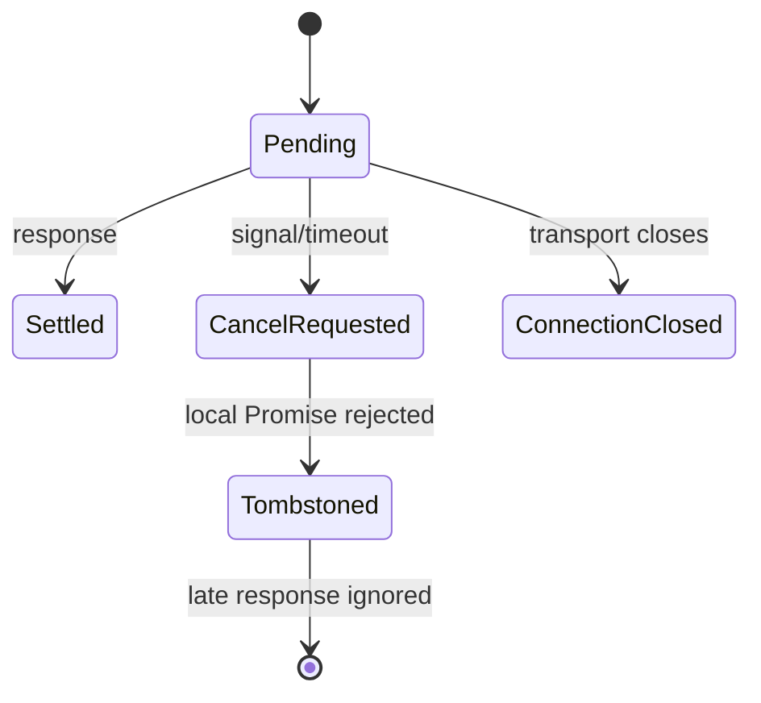
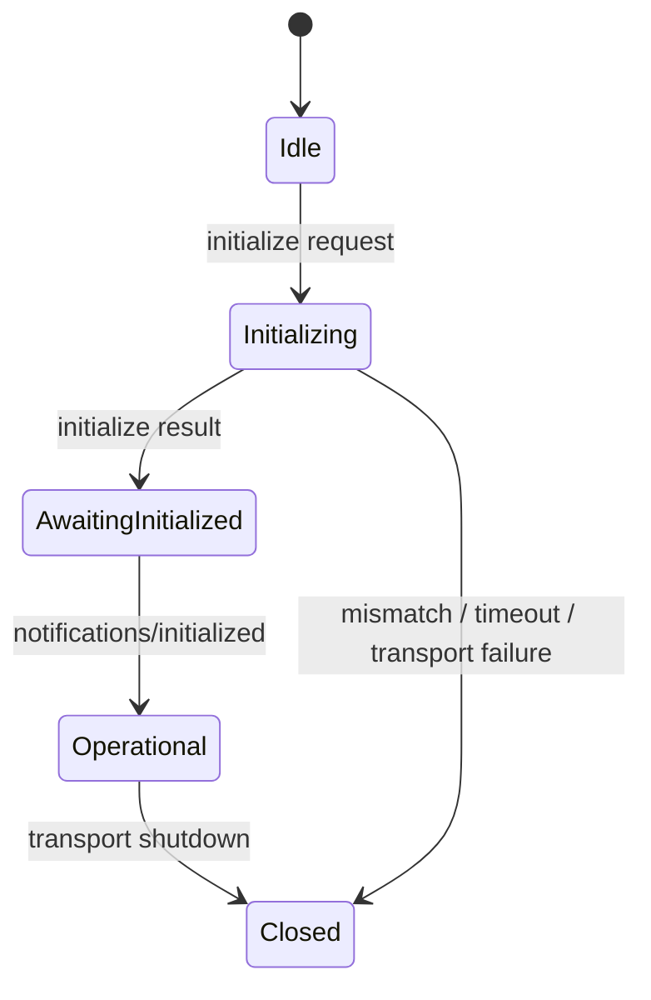

# 26 · JSON-RPC 2.0 与 MCP：从 wire message 到有生命周期的 Agent 协议 ⭐⭐⭐

> MCP 不是“几个工具接口的类型定义”。它把 JSON-RPC 消息、双向请求、传输、初始化、能力协商、取消、进度和 Agent primitives 组合成一个有时间约束的协议。只复制官方 interface，无法得到正确的运行时。

配套代码：[第 33 课协议实验室](../code/src/33-mcp-protocol/README.md)。

规范基线：本文在 **2026-07-19** 核对官方 latest，当前指向 **`2025-11-25`** revision。MCP 仍在演进，写生产 adapter 时必须固定 revision，而不是把 `latest` 当作可复现依赖：

- [MCP Lifecycle 2025-11-25](https://modelcontextprotocol.io/specification/2025-11-25/basic/lifecycle)
- [MCP Transports 2025-11-25](https://modelcontextprotocol.io/specification/2025-11-25/basic/transports)
- [MCP Cancellation 2025-11-25](https://modelcontextprotocol.io/specification/2025-11-25/basic/utilities/cancellation)
- [MCP Tools 2025-11-25](https://modelcontextprotocol.io/specification/2025-11-25/server/tools)
- [MCP Schema Reference 2025-11-25](https://modelcontextprotocol.io/specification/2025-11-25/schema)
- [JSON-RPC 2.0 Specification](https://www.jsonrpc.org/specification)

---

## 1. 为什么 Agent 开发必须理解协议层

调用官方 SDK 很容易形成错觉：

```typescript
const result = await client.callTool({ name, arguments });
```

这一行背后至少存在：

```text
业务调用
  → method/params 静态关联
  → params 运行时编码与验证
  → request id 分配
  → pending Promise 注册
  → transport framing / HTTP request
  → 并发、乱序、重连、重复投递
  → response id 关联
  → result/error 互斥验证
  → method-specific result 校验
  → 超时、取消、关闭与资源清理
  → MCP 生命周期和 capability 门禁
```

如果不了解这些层，常见事故包括：

- 把 response 到达顺序当 request 顺序；
- timeout 后只停止 `await`，远端仍在执行付费工具；
- transport 断开后 pending Map 永不清理；
- initialization 前调用未协商能力；
- 把 tool execution error 和 JSON-RPC protocol error 混成一个异常；
- stdout 打一行日志，直接破坏 stdio framing；
- Streamable HTTP 本地服务未校验 Origin，暴露 DNS rebinding 攻击面；
- 看到 TypeScript interface 就跳过 wire validation。

本章不追求重写完整 SDK，而是实现一个小而严格的协议内核，让每个隐藏状态可观察、可故障注入。

---

## 2. 三张图：值、类型和时间

协议正确性来自三种不同证据。

### 2.1 wire value

Transport 收到的值可能来自 JSON、SSE、stdio、旧 SDK 或恶意 peer，静态上只能是 `unknown`：

```text
unknown
  → JSON-safe object graph
  → JSON-RPC message shape
  → method-specific Schema
  → trusted domain value
```

### 2.2 static relationship

同一编译图中的调用应该让 method 决定 params/result：

```typescript
request('multiply', { left: 2, right: 3 })
// Promise<{ value: number }>
```

这是泛型和 indexed access type 解决的问题。

### 2.3 temporal state

单个 response 合法，仍不代表它属于当前连接：

- id 是否存在于 pending Map？
- 是否已经响应过？
- 是否已取消，因网络竞态才迟到？
- session 是否已完成初始化？
- capability 是否协商过？
- transport 是否已经进入 closed？

这些是历史状态，必须由状态机和 Map 证明，Schema 无法单独完成。

---

## 3. JSON-RPC 的消息代数

JSON-RPC 2.0 定义 request、notification 和 response。把它写成判别联合时，真正的判别不只是某个 `kind` 字段，而是字段存在性：

```typescript
type Request = {
  jsonrpc: '2.0';
  id: string | number;
  method: string;
  params?: JsonObject | JsonValue[];
};

type Notification = {
  jsonrpc: '2.0';
  method: string;
  // 没有 id，而不是 id: undefined/null
  params?: JsonObject | JsonValue[];
};

type Response =
  | { jsonrpc: '2.0'; id: RequestId; result: JsonValue }
  | { jsonrpc: '2.0'; id: RequestId | null; error: RpcError };
```

关键规则：

1. `jsonrpc` 必须严格等于 `"2.0"`。
2. Notification 是 **缺少 id member** 的 request；Server 不能回复 notification。
3. params 若存在，只能是 structured value：array 或 object。
4. Response 必须且只能包含 result/error 之一。
5. Response id 用于关联 request，不用于排序。
6. 无法识别 request id 的 protocol error response 可使用 null id。

课程还选择拒绝未知的 JSON-RPC 顶层字段，这是面向固定 MCP revision 的硬化策略，比通用 JSON-RPC 互操作实现更严格。需要 vendor extension 时，应先在 adapter 层按版本明确归一化，不能把任意额外字段直接扩散进核心状态机。

通用 JSON-RPC 允许 request id 为 string、number 或 null，但规范不建议 request 使用 null，也不建议 number 带小数。MCP schema 把 `RequestId` 收紧为 `string | number`。课程进一步要求 number 是安全整数，避免 IEEE-754 舍入让两个不同 wire ID 在 JavaScript 中坍缩成同一值。

### `id?:` 为什么容易写错

```typescript
type BadRequest = { id?: string | number };
```

在 `exactOptionalPropertyTypes` 关闭时，`{ id: undefined }` 也可能进入该类型；JSON.stringify 会删除 undefined，运行时变成 notification。课程使用两个独立分支，并用 `Object.hasOwn` 判断 member 是否存在。

---

## 4. 为什么先验证 JSON 对象图

`JSON.stringify(value)` 没抛异常不代表能无损、安全编码：

| JavaScript 值 | JSON.stringify 行为 | 风险 |
|---|---|---|
| `NaN` / `Infinity` | 改成 null | 值被静默篡改 |
| object 中 `undefined`/function | 删除属性 | 字段悄悄消失 |
| array 中 `undefined` | 改成 null | 数组语义变化 |
| symbol key | 忽略 | 隐藏状态未进入 wire |
| getter | 执行 getter | 验证/日志触发副作用 |
| cycle | 抛异常 | 请求注册后才失败可能泄漏 pending |
| class instance | 只序列化 enumerable own props | 原型语义丢失 |

[jsonrpc.ts](../code/src/33-mcp-protocol/jsonrpc.ts) 先执行 JSON-safe clone：

- number 必须 finite；
- 只接受 array 与 plain/null-prototype object；
- 拒绝循环、稀疏数组、symbol、hidden property 和 accessor；
- 通过 descriptor 取值，不执行 getter；
- 通过 `defineProperty` 写 clone，不触发特殊 setter；
- active WeakSet 只检测当前祖先路径，允许合法共享引用。

之后再验证 JSON-RPC 字段互斥。这样错误发生在 pending request 注册或 handler 副作用之前。

这里准确的保证是“不读取 accessor/getter”，不是“面对任意 JavaScript 对象绝不执行代码”。`Proxy` 可以为 `ownKeys`、`getOwnPropertyDescriptor`、`getPrototypeOf` 安装 trap，而 JavaScript 没有通用、跨运行时的可靠 Proxy 判别。若输入来自同进程不可信插件，真正的隔离边界应是 JSON 文本、structured-clone 支持的 IPC 或独立进程，而不是只靠反射式 validator。

### JSON.parse 也不是完整安全证明

`JSON.parse` 确实不会生成 getter、symbol 或循环，但仍可能出现 JavaScript 无法无损表示的巨大 number：

```typescript
JSON.parse('1e400'); // Infinity
```

课程会在 parse 后再次检查 finite number。另一方面，标准 `JSON.parse` 会对重复 object key 采用后值覆盖；若安全协议需要拒绝重复键，必须使用能报告 duplicate key 的 parser，而不是在 parse 后检查——信息已经丢失。

---

## 5. stdio framing：字节边界不是消息边界

MCP stdio transport 规定：

- Client 启动 Server 子进程；
- stdin/stdout 传 UTF-8 JSON-RPC；
- 每条消息以 newline 分隔，消息本身不能含真实换行；
- Server 可向 stderr 写日志；
- stdout 不能写任何非 MCP message。

JSON string 中的换行会由 JSON encoder 写成 `\n` 两个字符，所以完整 JSON 文本仍是一行。

真实 stream chunk 可能：

- 在一个中文 UTF-8 字符的 3 个 byte 中间切开；
- 半条 JSON；
- 多条 JSON；
- 只包含 `\r`，下个 chunk 才是 `\n`。

[StdioJsonRpcDecoder](../code/src/33-mcp-protocol/transport.ts) 因而持有一个 `TextDecoder(..., { fatal: true })` 并使用 `{ stream: true }`，再从累计文本中寻找 LF。它还拒绝：

- 空消息行；
- 超过配置上限的未完成行；
- EOF 时没有 newline delimiter 的残帧；
- 非法 UTF-8；
- 非法 JSON/JSON-RPC。

课程测试一次只喂一个 byte，确保多字节字符一定被拆分。用 `chunk.toString()` 或每 chunk 新建 TextDecoder 都会产生 replacement character。

### 背压属于 Transport 契约

```typescript
interface RpcTransport {
  send(message: JsonRpcMessage): Promise<void>;
}
```

`send` 不能是 void。Node writable 的 buffer 满时必须等待 drain；HTTP POST 可能在写 body 或读取 response 时失败。Promise 表达“消息已被 transport 接受”的异步边界，但它不一定表示远端已经处理。

---

## 6. Typed method table：保存 method → params/result 的相关性

课程用 Schema table 保存协议：

```typescript
const methods = {
  multiply: {
    params: object({ left: number(), right: number() }),
    result: object({ value: number() }),
  },
} as const;
```

Client 签名：

```typescript
request<Name extends keyof Methods & string>(
  method: Name,
  params: Infer<Methods[Name]['params']>,
): Promise<Infer<Methods[Name]['result']>>;
```

这里的核心不是“用了泛型”，而是 `Name` 同时索引 params 和 result，保留三者相关性。若先把 method widen 成 string，或把 table 擦成 `Record<string, AnyMethod>`，调用端就只剩 unknown。

### 为什么 response 仍要 Schema

泛型只证明当前源码如何调用 `request`，不证明远端真的返回 number：

```json
{"jsonrpc":"2.0","id":1,"result":{"value":"six"}}
```

Client 先按 JSON-RPC 解析，再用 `Methods['multiply'].result` 解析 payload。错误只拒绝这一个 request；消息本身仍是合法 JSON-RPC，所以不必一定关闭连接。

### Schema 不等于双向 Codec

第 17 课 Schema 可以 transform：wire string → Date。RPC method table 却同时用同一 schema 做：

- Server 接收 params；
- Client 发送 params 前验证；
- Client 接收 result；
- Server 发送 result 前验证。

若 transform 不是幂等，重复 safeParse 会改变值。因此课程明确要求 method table 使用 **identity wire schema**。领域值需要真正的双向 codec：

```typescript
interface Codec<Domain> {
  decode(wire: unknown): Domain;
  encode(domain: Domain): JsonValue;
}
```

不要因为一个库把 validator 命名为 schema，就假设它天然可双向编码。

---

## 7. Client correlator：Map 才是 RPC 的核心状态

发两个并发 request：

```text
send id=1 multiply(2,3) ───────────────┐
send id=2 multiply(4,5) ───────┐       │
                               ▼       ▼
receive id=2 result=20         receive id=1 result=6
```

正确实现：

```typescript
Map<RequestId, {
  method: string;
  resolve(result): void;
  reject(error): void;
  cleanup(): void;
}>
```

步骤必须是：

1. 分配不会重用的 connection-local ID。
2. 在 send 前注册 pending，防止同步/极快 response 先到。
3. send 失败时 rollback pending。
4. response 到达按 id 查 Map，而不是 shift 队列。
5. settle 前删除 pending 并清 timer/listener。
6. transport close 时拒绝并清空全部 pending。

### pending 上限不是性能优化

恶意或故障 peer 可以永不响应。如果 Map 无上限，Client 持有 resolve/reject、闭包、params 关联上下文和 timer，最终变成内存泄漏。`maxPending` 是资源安全边界；达到上限应在 send 前失败。

### 未知与重复 response id

- unknown id 可能是跨 session 消息、实现 bug 或注入攻击；课程关闭连接。
- settled id 再次响应说明 duplicate delivery 或 peer bug；课程关闭连接。

Streamable HTTP resumability 可能重投 SSE event。生产 transport 应先按 SSE event id 去重，再把 JSON-RPC message 交给 correlator；不能让协议层猜 transport replay 语义。

---

## 8. 取消：一种允许竞态的分布式状态转换

MCP 普通 request 的取消通知：

```json
{
  "jsonrpc": "2.0",
  "method": "notifications/cancelled",
  "params": { "requestId": 7, "reason": "user stopped" }
}
```

官方规则包括：

- 只能指向同方向、仍被认为在途的 request；
- Receiver 应停止处理、释放资源、不再发送 response；
- unknown/已完成/畸形取消应忽略；
- Sender 应忽略取消后仍迟到的 response；
- client 不能取消 initialize；
- task-augmented request 使用 `tasks/cancel`，不是该 notification。

因此取消不是简单 `pending.delete(id)`：



Client 保存有界 cancelled tombstone，区分：

- 合法的取消竞态迟到 response：忽略；
- 从未见过的 response：协议错误；
- 已正常 settle 后重复 response：协议错误。

Server 用 in-flight Map 从 request id 找 AbortController。Handler 只拿 Signal，不拿 Controller，取消所有权仍在 dispatcher。Handler 若忽略 Signal，JavaScript 无法强行终止它；生产环境可能需要 Worker/进程隔离。

### timeout 与取消

生命周期规范建议所有 sent request 都有 timeout；普通 request 超时后发送取消并停止等待。initialize 是特殊情况：取消规范禁止 client 取消 initialize，因此课程的策略是：

```text
initialize timeout
  → reject local initialization
  → close connection
  → 不发送 notifications/cancelled
```

关闭 transport 是终止初始化工作和清理状态的唯一明确所有权边界。

---

## 9. Server dispatcher：错误必须落在正确层

Server 收到 request 后：

```text
decode JSON-RPC
  → duplicate / in-flight budget
  → method lookup
  → params Schema
  → AbortController + handler
  → result Schema + JSON-safe encode
  → response
```

课程使用的错误：

| code | JSON-RPC 含义 | 示例 |
|---:|---|---|
| `-32600` | Invalid Request | 字段组合非法 |
| `-32601` | Method not found | method 未注册 |
| `-32602` | Invalid params | method Schema 拒绝 |
| `-32603` | Internal error | handler/encoder 实现异常 |
| `-32000` | Server-defined | in-flight 达上限 |
| `-32002` | 教学 MCP 状态错误 | capability method 调用过早 |

Notification 永远没有 response。其处理异常只能进入本地日志/metrics，不可以“补发一个 error response”。Cancellation notification 更严格：未知、已完成或 malformed 都忽略，以容纳网络竞态。

### 输入失败与工具失败不同

MCP tools 指南区分：

- unknown tool、协议/参数问题：JSON-RPC error；
- 工具业务执行失败：正常 `tools/call` result，带 `isError: true`。

这样 LLM 能看到工具失败内容并尝试修正，而协议错误仍由 Client SDK 分类处理。课程不会把原始 exception cause/stack 回传，只返回稳定文本。

---

## 10. MCP 生命周期比 JSON-RPC 多了什么

JSON-RPC 本身是 stateless RPC 数据协议；MCP 在 connection/session 上增加严格生命周期：



初始化阶段交换：

- protocol version；
- client/server capabilities；
- implementation name/version 等信息。

Client 发送它支持的较新版本。Server 支持时回相同版本；否则回它支持的另一个版本。Client 不支持 Server 选择时应断开。HTTP 后续请求还必须携带协商后的 `MCP-Protocol-Version` header。

初始化成功 response 后，Client 必须发送 `notifications/initialized`。在此之前：

- Client 不应发送 ping 以外的 request；
- Server 不应发送 ping/logging 以外的 request。

### 两边都必须门禁

只在 SDK Client 类中检查 `state === operational` 不够。恶意、旧版或手写 peer 可以绕过 Client。Server 的 `tools/list`/`tools/call` handler 也要独立验证 state。

### Capability 不是“字段存在”

```typescript
Object.hasOwn(capabilities, 'tools')
```

只证明 key 存在，不能证明 value 是 capability object；`{ tools: null }` 也会通过。课程至少验证它是非数组 JSON object。完整实现还应按 revision 解析 sub-capability，例如 `listChanged`。

Operation 阶段只能使用成功协商的 capability。看到 Server 实现了某 method，不等于当前 session 已获准调用。

---

## 11. Tools：模型控制不等于模型授权

MCP Server 声明 tools capability 后，Client 可调用：

- `tools/list`：发现 tool metadata 与 inputSchema；支持 cursor pagination；
- `tools/call`：传 name/arguments，得到 content、structuredContent 或 error result；
- `notifications/tools/list_changed`：仅在 capability 声明 listChanged 后使用。

当前规范对 tool name 建议：1～128 字符、大小写敏感、只使用 ASCII 字母数字与 `_-.`，同一 Server 内唯一。课程在定义时 fail-fast，并在 registry 构造时拒绝动态重名。

Tool inputSchema 是 JSON Schema object；没有参数的工具推荐 `{ type: "object", additionalProperties: false }`。最新规范还支持 outputSchema、annotations、icons 和 task support。本课程只实现 text content 子集，避免一个浅类型声称支持未实现的 image/audio/resource/structured content。

最重要的安全原则：**模型选择调用工具，不代表模型拥有授权工具副作用的能力**。Host 仍应：

- 展示哪些工具暴露给模型；
- 对写操作提供用户确认；
- 从可信 principal/tenant 上下文做授权；
- 把 tool annotations 视为不可信提示，除非 Server 本身可信；
- 限制输入/输出大小、速率和费用。

MCP 解决互操作协议，不替应用替用户做风险决策。

---

## 12. stdio 与 Streamable HTTP 不能只换一个 Transport 类名

### 12.1 stdio

stdio 通常是一 Client 启动一子进程，生命周期和 OS process 绑定：

1. Client 关闭 child stdin；
2. 等待退出；
3. 超时后 SIGTERM；
4. 再超时后 SIGKILL。

凭证通常从受控环境传给进程。官方 authorization flow 不适用于 stdio；不要把 OAuth bearer token 打进命令行或日志。

### 12.2 Streamable HTTP

`2025-11-25` 的标准 HTTP transport 是 Streamable HTTP，已经替代 `2024-11-05` 的旧 HTTP+SSE transport。Server 提供一个同时支持 POST/GET 的 MCP endpoint：

- Client 每个 JSON-RPC message 使用新 POST；
- Accept 同时声明 `application/json` 与 `text/event-stream`；
- Request 的 response 可以是一个 JSON object，也可以是 SSE stream；
- GET 可打开 Server → Client 的独立 SSE stream；
- disconnect 不等于 cancellation；取消必须显式通知；
- SSE event id/Last-Event-ID 可用于恢复和重投；
- 一个 JSON-RPC message 不能广播到多个并行 SSE stream。

### 12.3 Session

Server 可在 initialize response 用 `MCP-Session-Id` header 分配 session。Client 后续请求必须带回：

- Server 对已终止 session 返回 HTTP 404；
- Client 收到 session 404 后必须重新 initialize；
- Client 可用 DELETE 请求主动终止 session；Server 可返回 405 表示不支持。

Session ID 是 bearer-like security material，应安全存储、禁止日志泄漏，并使用不可预测值。

### 12.4 HTTP 安全不是可选附录

官方 transport 明确要求/建议：

- 校验 Origin，非法 Origin 返回 403，防 DNS rebinding；
- 本地 Server 只绑定 `127.0.0.1`，不要默认 `0.0.0.0`；
- 实施认证；
- 校验 protocol-version/session header；
- 防 session hijacking。

因此内存/stdio transport 通过测试，不能证明 HTTP adapter 安全。Transport 端口只隔离依赖，不会自动提供安全性质。

---

## 13. 双向 RPC：完整 MCP 不是普通 REST Client

MCP Server 除了回复 tools/resources，还可主动向 Client 发 request，例如：

- sampling：请求 Client/LLM 生成消息；
- elicitation：请求用户或外部交互；
- roots：请求 Client 提供根目录。

所以完整连接两端都可能同时扮演 requester 与 responder：

```text
Client Request ───────────────> Server Dispatcher
Client Correlator <──────────── Server Response

Client Dispatcher <──────────── Server Request
Client Response ───────────────> Server Correlator
```

课程的 `JsonRpcClient`/`JsonRpcServer` 各实现单方向角色，方便理解。生产实现可在同一 Transport 上组合两个方向，但 message router 必须先按 request/notification/response 分类，不能让两个 subscriber 竞争消费同一条消息。

这与传统 HTTP Client 的最大心智差异是：Server 不是永远被动，connection 上存在双向 in-flight Map 和双向 capability/授权边界。

---

## 14. Batch、Tasks 与 Progress：不要用旧抽象硬套

### JSON-RPC batch

通用 JSON-RPC 支持 array batch：Server 可并发执行，response array 顺序不保证与 request 一致，notification 没有 response。空 batch 是 Invalid Request。

课程故意拒绝 array root，没有实现 batch。支持 batch 不只是 `array.map(handle)`：还要处理：

- batch 内单项非法；
- notification-only batch 不返回空 array；
- response 任意顺序；
- batch 级 parse error 与 item error；
- 并发上限和总 payload 上限。

### MCP experimental tasks

`2025-11-25` 新增实验性 tasks，提供 durable request、状态轮询与结果获取。Task cancellation 使用 `tasks/cancel` request，不能复用普通 cancellation notification，因为 task 需要返回最终 task state。

### Progress 不是无限续命

Lifecycle 指南允许收到关联 progress 时重置 inactivity timeout，但仍应有绝对 maximum timeout。否则恶意 peer 可以持续发进度，永久占用 pending、连接和费用预算。

这些概念分别解决“批处理”“持久任务”“过程观测”，不能压成一个 `longRunning: true` boolean。

---

## 15. 测试协议不能靠 sleep 和 happy path

[protocol.test.ts](../code/src/33-mcp-protocol/protocol.test.ts) 当前证明：

| 测试 | 证据 |
|---|---|
| result/error 同时存在 | message algebra 拒绝非法状态 |
| hostile getter | decoder 检查 descriptor，不执行 getter |
| 每次一个 UTF-8 byte | incremental decoder 保留字符状态 |
| 两请求反序响应 | id Map 而非 FIFO 关联 |
| unknown/duplicate response | connection protocol fault |
| local cancellation + late response | tombstone 正确处理竞态 |
| hostile notification params | 发送边界也不执行 getter 或发出坏消息 |
| transport close | pending 全拒绝、Map 清零 |
| 错误 result payload | method result Schema 仍执行 |
| MCP initialization | initialize/initialized/capability 状态推进 |
| Server pre-init guard | 不依赖 Client 自觉 |
| version mismatch | 不发 initialized，关闭 connection |
| tool cancellation | Signal 到 handler、无迟到 response |
| tool name/duplicate | 动态注册 fail-fast |

并发/取消测试使用 Deferred handshake，等 handler 明确报告 entered 后才 abort，不用 `setTimeout(10)` 猜测任务是否启动。

负向类型测试另外证明：

- method 缺 params 字段时编译失败；
- result 字段不会错误 widen；
- literal method 与 I/O 相关性保留。

运行时和类型测试覆盖不同命题，不能互相替代。

---

## 16. Java 后端开发者的迁移对照

| Java/RPC 心智 | TypeScript/Node 对应 | 需要额外小心 |
|---|---|---|
| DTO class + Bean Validation | interface/type + Schema | interface emit 后消失 |
| CompletableFuture Map | Promise resolver Map | Promise 无内建取消/父子关系 |
| Jackson ObjectMapper | JSON.parse/stringify | getter、NaN、重复 key、对象图语义 |
| Servlet/RPC interceptor | Transport + dispatcher middleware | 双向 MCP 不能假定单向 HTTP |
| Executor 限流 | maxPending/maxInFlight/worker pool | Promise 创建本身就可能启动工作 |
| Thread interruption | AbortSignal | 纯协作式，无法强停忽略者 |
| connection/session state | MCP lifecycle union | 状态跨 await，需显式防重复迁移 |
| exception mapper | JSON-RPC error serializer | cause/stack 不得直接上 wire |

尤其不要把 `Promise` 等同于 Java Thread/Future。Promise 只表示 eventual value；它不拥有执行资源，也不能停止底层操作。取消和 cleanup 必须由应用协议补足。

---

## 17. 从课程内核到生产 SDK 的缺口

### 完整消息面

- JSON-RPC batch；
- 双向 request dispatcher；
- resources/prompts/roots/sampling/elicitation；
- logging/progress/completion；
- tasks 与 task-related metadata；
- 完整 content block、structuredContent/outputSchema。

### Transport

- 子进程 spawn、stdin backpressure、stderr、exit escalation；
- Streamable HTTP POST/GET/SSE；
- SSE resumability、event-id 去重与重放窗口；
- session/header/version 状态；
- request body、line、event 与总连接 byte budget。

### 安全

- HTTP Origin/DNS rebinding 防护；
- OAuth/resource metadata 与 scope；
- session hijacking 防护；
- principal/tenant 绑定；
- tool approval、参数摘要和审计；
- URI/resource path 与 SSRF/本地文件边界。

### 可靠性

- deadline 与 progress-aware inactivity timeout 的双预算；
- transport reconnect 与非幂等 request 策略；
- pending/in-flight/tombstone metrics；
- durable task/idempotency store；
- schema revision 与兼容性 fixture；
- fuzz/property tests 与真实 SDK conformance tests。

协议扩展必须从状态和故障语义开始，不能只向 interface 增加 optional 字段。

---

## 18. 建议实验

1. **Bidirectional router**：同一 transport 组合两个 correlator/dispatcher，证明消息只路由一次。
2. **Batch**：支持混合 request/notification/invalid item，并限制 batch 并发与总大小。
3. **stdio process adapter**：加入 stdin drain、stderr 捕获和 EOF/SIGTERM/SIGKILL 关闭升级。
4. **Streamable HTTP**：复用第 24 课 SSE parser，实现 POST JSON/SSE 两种 response。
5. **Replay dedupe**：按 SSE event id 去重，区分 transport replay 与重复 JSON-RPC response。
6. **Progress timeout**：分别实现 inactivity timeout 与 absolute deadline，证明 progress 不能无限续命。
7. **Codec**：为 URL/Date/品牌 ID 写显式 encode/decode，移除 identity Schema 限制。
8. **Capability type-state**：让初始化结果在类型层产生只暴露已协商方法的 facade，并保留运行时门禁。
9. **Fuzz decoder**：随机生成对象图、accessor、稀疏数组和畸形字段，验证 decoder 不读取 accessor；另写 Proxy trap 用例明确同进程反射边界。
10. **Conformance fixtures**：按固定 MCP revision 保存官方消息 fixture，升级 revision 时做差异审计。

每个实验都要回答：消息何时取得运行时证据？哪个 Map 持有未完成状态？取消后是否还有迟到消息？transport 关闭清理了谁？重放与重复调用怎样区分？如果这些问题没有测试，类型再漂亮也只是协议外观。

---

## 一句话总结

JSON-RPC 提供消息代数和 request-id 关联，MCP 再增加版本、capability、初始化、双向 Agent primitives、取消和 transport 语义。可靠 TypeScript 实现必须同时维护三条证据链：`unknown` wire 值经过 runtime Schema，literal method 保留 params/result 静态相关性，pending/in-flight/tombstone/session 状态机证明跨时间不变量。
