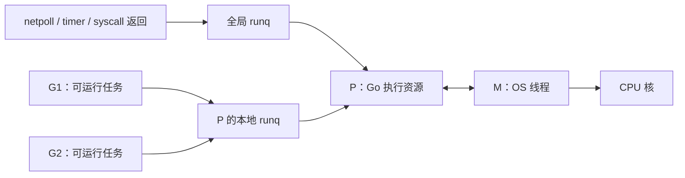
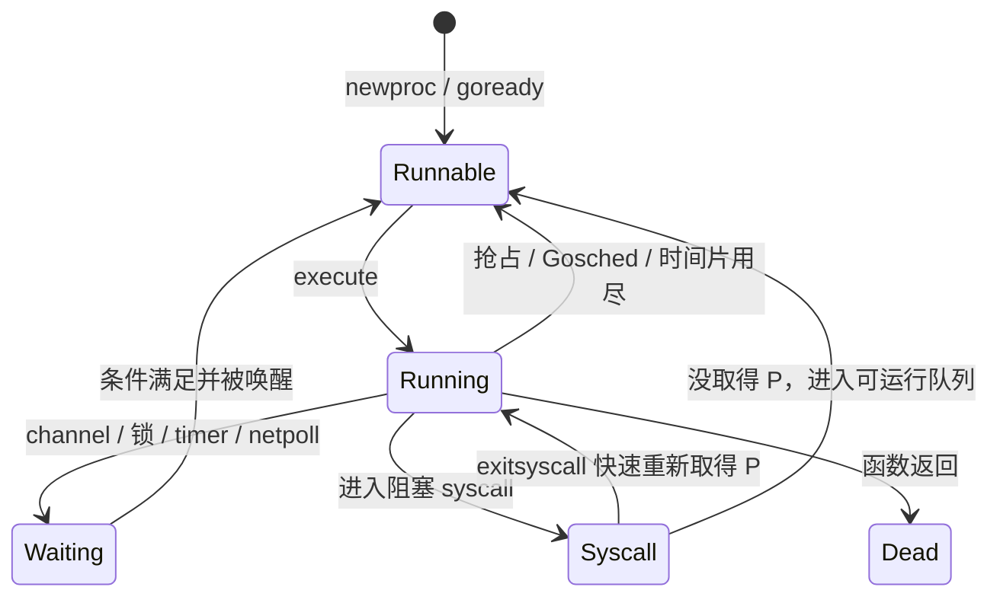
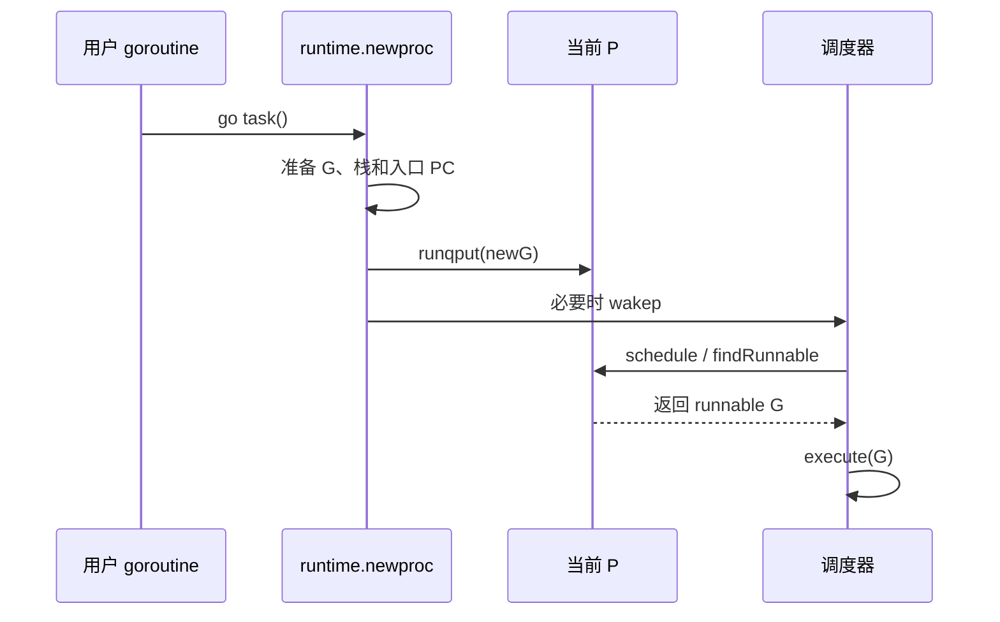
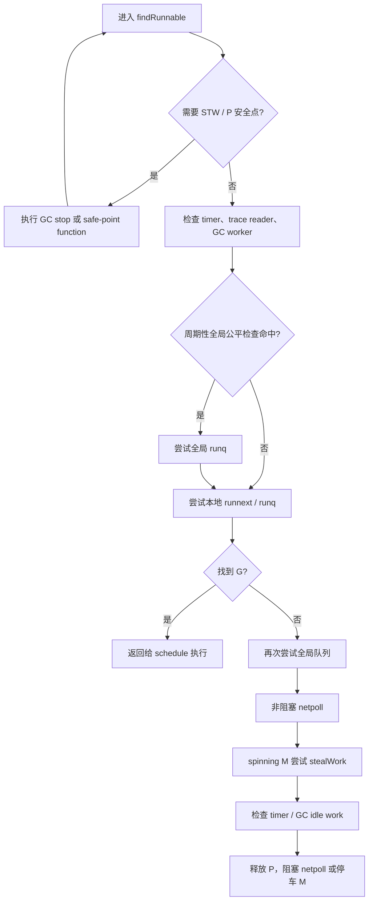
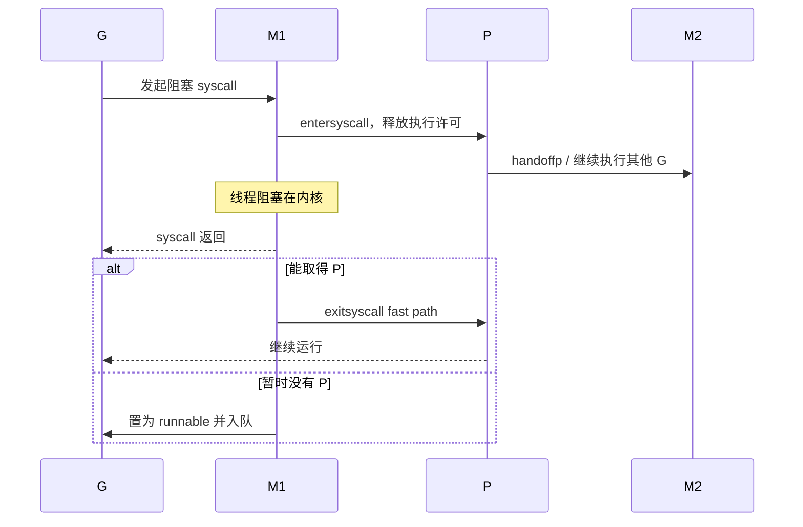
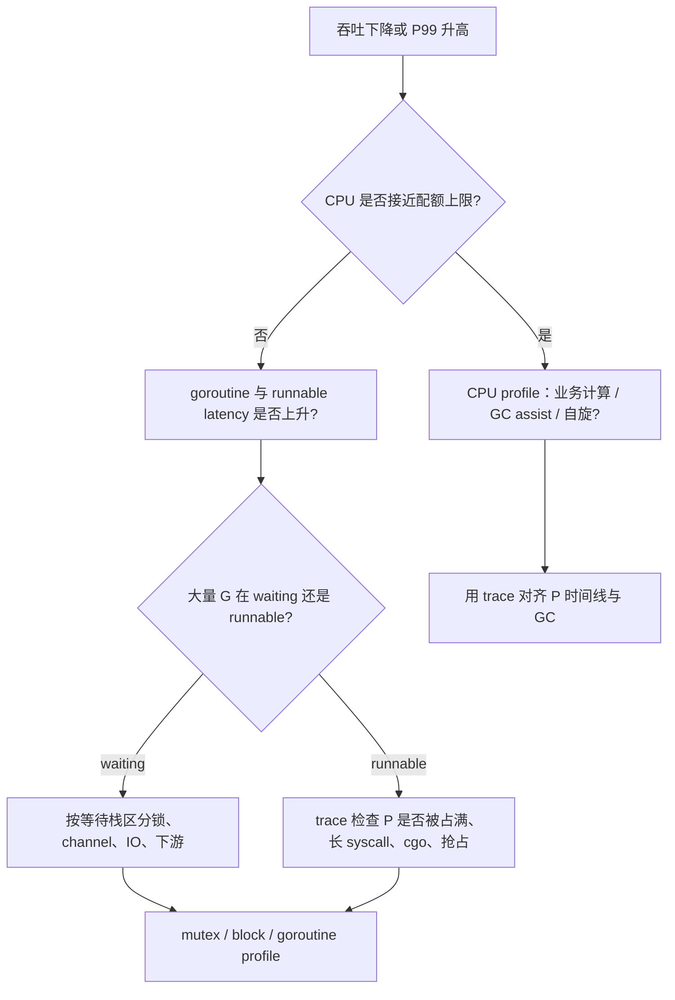

# 21 · Go runtime 调度器源码：从 `go` 语句到 G 真正运行 ⭐⭐⭐

> 本章以 Go 1.26.4 为源码基线。`go` 语句、channel 同步和内存模型属于语言保证；G/M/P、每个 P 的 256 槽本地队列、`runnext`、`sysmon` 等都属于当前 runtime 实现，未来版本可以调整。

配套代码：[`go/code/29_runtime_scheduler`](../code/29_runtime_scheduler/)

## 1. 先把三个容易混淆的概念分开

- **并发（concurrency）**：程序能同时管理多个尚未完成的任务。
- **并行（parallelism）**：某一时刻确实有多个 CPU 核在执行这些任务。
- **调度（scheduling）**：runtime 决定哪个 goroutine 在什么执行资源上运行，以及何时让出资源。

启动十万个 goroutine 只说明程序有很高的并发度，并不意味着十万个任务同时并行。Go 调度器做的核心工作，是把数量很大的 goroutine 映射到数量有限的 OS 线程与 CPU 执行许可上。



这张图最重要的不是名词，而是两个约束：

1. 普通 Go 代码只有在 **M 绑定 P** 时才能运行。
2. `GOMAXPROCS` 主要决定 P 的数量，因此限制同一时刻并行执行 Go 代码的上限；它既不是 goroutine 上限，也不是 OS 线程上限。

## 2. G、M、P 到底各保存什么

### 2.1 G：可被暂停和恢复的执行状态

`runtime/runtime2.go` 中的 `g` 不只是“一个函数”。它需要保存：

- 连续栈范围 `stack.lo`、`stack.hi` 与栈保护值 `stackguard0`；
- 恢复执行所需的 `sched` 上下文；
- 当前状态、等待原因和开始等待的时间；
- 当前关联的 M、创建者、入口 PC；
- panic/defer 链、channel 等待记录 `sudog`；
- GC assist 债务、抢占标志以及 profiler/trace 状态。

因此 goroutine “轻量”是相对线程而言，不代表零内存、零调度成本。一个等待中的 G 仍可能通过栈和字段间接保留大量业务对象。

常见状态可用下面的简化图理解：



注意：状态名是 runtime 内部状态的教学化简。`goready` 只会把 G 变成 runnable 并入队，不承诺它立即获得 CPU。

### 2.2 M：承载实际指令执行的 OS 线程

M 对应 machine。它持有当前运行的 G、调度栈 `g0`、信号栈、线程本地状态、当前绑定的 P，以及 syscall、cgo、profile 等状态。

为什么需要 `g0`？调度、扩栈、GC 等 runtime 工作不能继续依赖一个可能正在移动或空间不足的普通 goroutine 栈，因此会切换到每个 M 的系统调度栈执行。

M 的数量可以大于 `GOMAXPROCS`。例如多个 M 同时阻塞在系统调用或 cgo 中，runtime 仍可能创建或唤醒其他 M，让空闲 P 继续执行 Go 代码。

### 2.3 P：调度与分配的局部性载体

P 可以理解为“执行 Go 代码所需的一组资源许可”，但它不等于 CPU 核。当前 `p` 中包含：

- 本地可运行队列 `runq`，Go 1.26.4 中有 256 个槽；
- 一个优先候选 `runnext`；
- 与 P 绑定的 `mcache` 和页缓存；
- timer、sudog cache、defer pool；
- GC worker、assist 与 trace 统计。

把这些高频资源放到 P 上，可以让当前拥有 P 的 M 在常见路径上少碰全局锁。这也是 P 不只是“CPU 数量计数器”的原因。

## 3. `go f()` 之后发生了什么

编译器会把 `go f(args...)` 降低为 runtime 创建 goroutine 的调用。源码阅读主线是 `runtime/proc.go` 中的 `newproc` 与 `newproc1`。

可以把过程拆成五步：

1. 在调用方求值函数与参数，构造要执行的函数值。
2. 取得或分配一个空闲 G，并准备初始栈。
3. 在新 G 的栈和调度上下文中写入入口信息，使其第一次被调度时从目标函数开始。
4. 把状态从新建/空闲状态转成 runnable。
5. 优先放进当前 P 的本地队列，必要时唤醒执行资源。



“创建 goroutine 很快”通常来自 G 复用、小栈和本地入队快路径。若任务极细，创建、排队、原子操作、唤醒与结果汇总仍可能比业务计算本身更贵。

## 4. 本地队列、全局队列与 `runnext`

### 4.1 为什么先放本地队列

如果每次创建和唤醒 G 都争抢一个全局队列锁，多核下这个锁会成为热点。本地 runq 由对应 P 主导访问，能改善：

- 锁竞争；
- 缓存局部性；
- 生产者刚创建的任务被附近执行资源消费的概率。

但本地化会引入公平与负载不均问题，所以还需要全局队列和 work stealing。

### 4.2 `runnext` 不是无条件最高优先级

当前 P 还有一个 `runnext` 槽。某个 G 唤醒了与自己紧密配合的另一个 G 时，runtime 可以让被唤醒者继承当前剩余时间片，降低 ping-pong 通信延迟。

这是一种吞吐/延迟优化，不是业务优先级机制。业务不能通过反复唤醒来构造可靠的优先级调度。

### 4.3 本地队列满了怎么办

Go 1.26.4 的 `runqputslow` 不只是把新 G 单独扔进全局队列。它会取出本地队列的一批 G，与新 G 一起打乱后，把其中一部分批量转移到全局队列。这样做同时达到两个目的：

- 给本地队列腾空间；
- 让其他 P 有机会取得这些工作。

### 4.4 为什么不会永远只吃本地任务

`findRunnable` 当前会周期性检查全局队列。源码中每逢 `schedtick % 61 == 0` 会优先尝试一次全局队列，以避免两个 goroutine 在本地持续互相唤醒而让全局任务长期饥饿。

`61` 是版本实现，不是可依赖常数；应该记住的是：**局部性优化必须配合公平性补偿**。

## 5. `findRunnable`：调度器真正的“找活”主线

`schedule` 负责进入调度循环，`findRunnable` 负责从多个来源寻找下一只 G。它不是简单地执行“本地 → 全局 → steal”三行逻辑，而是要同时协调 GC、安全点、timer、trace 和 netpoll。

Go 1.26.4 的主线可以抽象为：



流程会随版本变化，但阅读时应抓住四类工作源：

1. **普通 runnable G**：本地/全局队列与其他 P。
2. **时间事件**：timer 到期。
3. **IO 事件**：netpoll 返回 ready 的 fd。
4. **runtime 工作**：GC worker、trace reader、finalizer 等。

### 5.1 work stealing 为什么通常偷“一批”

空闲 P 若每次只偷一个任务，会频繁跨核同步；如果一次偷光，又可能让受害 P 立刻变空。当前策略倾向于转移一部分工作，在均衡与局部性之间折中。

stealing 也会查看其他 P 的 timer。空闲执行资源不仅能搬运 runnable G，也要避免某个 P 的定时任务被长期忽略。

### 5.2 spinning M 为什么要限量

刚暂时找不到工作时，M 可以先处于 spinning 状态，短暂主动寻找任务，避免马上睡眠又立即被唤醒。但如果大量 M 同时自旋，会白白烧 CPU。当前实现会根据忙碌 P 数量限制 spinning M，体现经典权衡：

- 自旋多：唤醒延迟低，空闲 CPU 浪费高；
- 自旋少：CPU 省，但突发任务可能需要内核唤醒线程。

这解释了为什么“CPU 使用率高”有时并不等于“业务计算很多”，还要看 profile 和 trace 中 runtime/自旋所占比例。

## 6. `gopark` 与 `goready`：阻塞的是 G，不一定是线程

当 channel、锁、timer 或 netpoll 条件不满足时，常见模式是：

1. 在同步对象的锁保护下登记等待信息；
2. 调用 `gopark`，把当前 G 从 running 转为 waiting；
3. M 继续调度其他 G；
4. 条件满足后，另一个执行者调用 `goready`；
5. 原 G 变成 runnable 并重新入队。

必须理解两个边界：

- `gopark` 通常停车 G，不等于当前 OS 线程一定睡眠；只有整个 M 找不到工作时，线程才可能停车。
- `goready` 只保证重新具备被调度资格，不保证“唤醒后立刻运行”，因此不能用它推导严格实时性。

## 7. 系统调用为什么不会必然卡住所有并行度

### 7.1 阻塞 syscall 的交接

进入可能阻塞的系统调用时，runtime 通过 `entersyscall` 保存 G 的 syscall PC/SP 等信息，并让调度器知道这个 M 可能长时间不可用。必要时 P 会与该 M 分离，转交给其他 M。

系统调用返回时：

- `exitsyscall` 若快速拿回原 P 或空闲 P，可以直接继续运行；
- 拿不到 P 时，G 转为 runnable，由其他执行资源稍后接手；
- 原 M 可能进入空闲或退出路径。



这不意味着阻塞 syscall 没成本：它仍占着 OS 线程；大量慢文件 IO、cgo 或不可轮询 syscall 会造成线程数量上升。

### 7.2 网络 IO 为什么通常更省线程

网络 fd 通常设为非阻塞。读写遇到 would-block 时，G 登记到 runtime netpoll 并停车；M/P 去执行其他工作。内核报告 fd ready 后，netpoll 再把 G 变回 runnable。

所以“一连接一 goroutine”通常不是“一连接一线程”。但一连接仍有 fd、缓冲区、goroutine 栈、定时器和业务状态成本，仍须限流。

## 8. `sysmon`、协作抢占与异步抢占

`sysmon` 是不依赖普通 P 执行的 runtime 监控线程。它负责或协助：

- 检查长时间运行的 G 并请求抢占；
- 处理长时间 syscall 中的 P；
- 推动 netpoll 与 timer；
- 参与强制 GC、scavenger 等 runtime 周期工作。

早期 Go 更依赖函数入口的栈检查作为协作抢占点。一个没有函数调用的长循环可能长时间占用 P。Go 1.14 起，支持的平台可通过信号请求异步抢占。

异步抢占并不是在任意指令上随意搬走 G。编译器生成的安全点、寄存器/栈指针信息和 runtime 的异步安全点处理共同保证：

- GC 能正确识别活指针；
- 栈可以被可靠扫描；
- runtime 的不可抢占临界区不被破坏。

因此 `runtime.Gosched()` 通常不应被当作普通业务循环的“必要正确性补丁”。如果删除 `Gosched` 就死锁，往往说明同步协议本身有问题。

## 9. `LockOSThread` 到底锁住了什么

`runtime.LockOSThread` 把调用它的 G 固定到当前 M。典型用途包括：

- 依赖线程局部状态的 C 库；
- GUI 主线程要求；
- 操作系统要求在同一线程完成的一组调用。

它不等于锁定 P，更不等于独占 CPU。被锁定 G 阻塞时，runtime 仍需想办法让 P 服务其他任务。风险主要来自生命周期：

- 忘记 `UnlockOSThread` 会长期限制调度器迁移自由；
- 锁线程后执行无界阻塞，会占住 M；
- 与 cgo 回调、线程本地状态组合时，关闭顺序更复杂。

配套示例在独立 goroutine 中锁定并用 `defer` 解锁，特意不读取/依赖线程 ID，因为业务正确性不应建立在 runtime 私有映射上。

## 10. 配套实验如何映射到原理

### 10.1 `RunCPUWorkload` 为什么使用固定 worker 数

[`scheduler.go`](../code/29_runtime_scheduler/scheduler.go) 没有为每个 task 创建一个 goroutine，而是创建 `min(Parallelism, Tasks)` 个 worker，再通过原子计数领取任务。它演示的是**有界并发**：

- goroutine 数量受 `Parallelism` 控制；
- `atomic.Int64` 只分配任务编号，不保护复杂共享状态；
- 每个 worker 在本地累计结果，减少共享原子热点；
- `context` 取消后仍返回已完成的部分统计。

最终 checksum 与 worker 数无关，用于证明正确性不能依赖实际调度顺序。

### 10.2 四组 Benchmark 应该怎样读

- `Parallelism1` 与 `GOMAXPROCS`：观察 CPU 工作随并行度变化，而不是预设一定线性加速。
- `FineGrainedTasks` 与 `CoarseGrainedTasks`：观察任务粒度过小时，领取任务和协调成本占比上升。
- `ns/op`：一轮完整 workload 的时间，不是单次 goroutine 切换时间。
- `allocs/op`：帮助发现为任务拆分引入的额外分配。

在不同 CPU、虚拟机配额、后台负载和 Go 版本上，比例都可能不同。可信结论必须来自同机、同负载、足够样本的对照。

### 10.3 建议实验

```powershell
cd go/code

# 观察稳定指标
go run ./29_runtime_scheduler -mode=metrics

# 固定任务总量，只改变并行度
go run ./29_runtime_scheduler -mode=cpu -tasks=10000 -parallelism=1 -iterations=10000
go run ./29_runtime_scheduler -mode=cpu -tasks=10000 -parallelism=8 -iterations=10000

# 观察队列、M/P/G 状态；输出较多，只开短窗口
$env:GODEBUG='schedtrace=1000,scheddetail=1'
go run ./29_runtime_scheduler -mode=cpu -tasks=20000 -parallelism=64 -iterations=20000
Remove-Item Env:GODEBUG

# Benchmark 与时间线
go test ./29_runtime_scheduler -run '^$' -bench '.' -benchmem -count=5
go test ./29_runtime_scheduler -trace $env:TEMP\scheduler.trace
go tool trace $env:TEMP\scheduler.trace
```

## 11. 从生产症状反推调度问题



几个典型证据组合：

| 现象 | 更可能的解释 | 下一步证据 |
|---|---|---|
| CPU 满、run queue 长、业务热点明显 | 工作量真实超出 CPU 能力 | CPU profile、扩容或削减计算 |
| CPU 满、GC assist 高 | 分配速率过高，mutator 在还 GC 债 | allocs/heap profile、GC 指标 |
| CPU 不满、大量 G 等锁 | 临界区或共享热点限制并行 | mutex profile、持锁调用链 |
| M/线程数上涨，P 利用率不高 | 慢 syscall、cgo 或锁线程 | trace、系统调用跟踪、线程栈 |
| goroutine 上涨且多为 runnable | CPU 配额不足或调度饥饿 | runnable latency、GOMAXPROCS、容器配额 |
| goroutine 上涨且多为 waiting | 生命周期泄漏或下游阻塞 | 多次 goroutine profile 差分 |

## 12. 常见错误认识

### 误区一：GOMAXPROCS 等于线程数

它主要控制 P 数。线程数还会受到 syscall、cgo、`LockOSThread`、runtime 后台线程等影响。

### 误区二：goroutine 切换一定只需要某个固定纳秒数

切换成本取决于是否要停车/唤醒线程、队列位置、缓存、竞争、trace/race 是否开启等。脱离场景的固定数字没有工程意义。

### 误区三：select 随机，所以调度公平

select 的 case 选择和 goroutine 调度是不同层次。语言不保证严格公平、最大等待时间或业务优先级。

### 误区四：网络使用 netpoll，所以可以无限并发

netpoll 主要节省等待期间的线程。下游容量、fd、内存、定时器、队列和重试风暴仍然存在。

### 误区五：goroutine 多就是调度器有问题

数量只是结果。要结合状态、等待原因、增长趋势和 runnable latency 判断。十万个短暂等待的 G 与一万个永久泄漏的 G 完全不同。

## 13. 高频面试题：用推导回答，而不是背一句话

### Q1. G、M、P 的关系是什么？

G 保存可暂停任务的状态，M 是真正执行指令的 OS 线程，P 持有执行普通 Go 代码所需的调度和分配资源。调度时 M 取得一个 P，再从队列得到 G 执行。G 阻塞后，M/P 可以转去执行别的 G；M 阻塞在 syscall 时，P 还可以转交给别的 M。

### Q2. 为什么引入 P，而不是直接让线程调度 goroutine？

如果高频调度队列、内存分配缓存、timer 等都由线程或全局结构直接共享，会出现大量锁竞争；线程又可能因为 syscall 长期阻塞，持有局部资源不易交接。P 把“可移交的 Go 执行资源”和 OS 线程分离，既形成局部快路径，也允许阻塞线程把执行能力交出去。

### Q3. `GOMAXPROCS` 到底限制什么？

它决定可同时服务 Go 代码的 P 数，因此近似限制并行执行 Go 代码的上限。它不限制 goroutine 总数，也不直接限制 OS 线程总数。syscall/cgo 中的线程、runtime 线程可以让实际线程数高于它。

### Q4. 为什么同时需要本地和全局 runq？

本地队列降低全局锁竞争并保留缓存局部性；全局队列承担溢出、跨 P 分发和公平性补偿。只有本地队列会导致工作分布不均，只有全局队列会让多核频繁争用同一热点。

### Q5. work stealing 如何改善负载均衡？

当一个 P 没有本地工作时，它会尝试从其他 P 取得一部分 runnable G。批量偷取可以摊薄同步成本，又避免一次偷光破坏受害 P 的局部性。它只能做通用负载均衡，不能理解业务优先级或下游容量。

### Q6. `gopark` 会阻塞 OS 线程吗？

通常先阻塞当前 G。M 返回调度循环后可以执行其他 G；只有 M 最终找不到工作，或进入内核/cgo 阻塞路径时，线程才可能睡眠。回答“会”或“不会”都太绝对，必须区分 G 停车与 M 停车。

### Q7. 网络 IO 与普通阻塞 syscall 的调度差异是什么？

可轮询 socket 通常设为非阻塞，would-block 后把 G 停在 netpoll，不长期占 M。普通文件或某些系统调用不能使用 readiness 模型，调用线程可能真实阻塞；runtime 会尽量把 P 交给其他 M，但被阻塞的线程仍有成本。

### Q8. sysmon 为什么可以在没有 P 时运行？

它的职责之一就是在普通 Go 执行资源陷入长 syscall、长循环或调度停滞时推动系统继续前进。如果 sysmon 自己也必须先获得普通 P，监控与救援能力会和被监控资源一起受阻。

### Q9. 异步抢占解决了什么，又不能保证什么？

它让没有函数调用的长计算循环也有机会被打断，改善调度延迟和 GC STW 等待。但它不提供实时调度、严格时间片或业务公平 SLA；runtime 仍要选择安全点，并避开不可抢占临界区。

### Q10. goroutine 越多吞吐越高吗？

只在并发度低于瓶颈容量、且增加并发能隐藏等待或利用空闲 CPU 时可能提高。超过容量后，会增加栈和对象保留、队列等待、缓存失效、调度和下游竞争，吞吐可能持平甚至下降，P99 通常先恶化。

### Q11. `LockOSThread` 的使用边界是什么？

只在 API 明确要求线程亲和性时使用，并把锁定范围和 goroutine 生命周期做成结构化、可关闭的边界。它绑定 G 与 M，不是获得 CPU 独占；忘记解锁或在锁定后无界阻塞会增加线程和关闭复杂度。

### Q12. 怎样证明一次延迟是调度问题？

先证明请求时间窗口内存在 runnable G 长时间拿不到 P，而不是锁、IO 或下游等待。再用 trace 的 G 状态与 P 时间线、schedtrace 队列快照、CPU/GC/锁 profile 解释 P 被谁占用。只有“goroutine 很多”不能建立因果链。

## 14. 源码阅读路线

建议按调用关系读，而不是从文件第一行顺序读：

1. `runtime/runtime2.go`：`g`、`m`、`p` 字段和状态。
2. `runtime/proc.go`：`newproc` → `runqput` → `schedule` → `findRunnable` → `execute`。
3. `runtime/proc.go`：`runqputslow`、`runqget`、`stealWork`、`globrunqgetbatch`。
4. `runtime/proc.go`：`entersyscall`、`exitsyscall`、`handoffp`、`sysmon`。
5. `runtime/preempt.go` 与 `runtime/signal_*.go`：异步抢占请求和平台信号路径。
6. `runtime/netpoll.go`、`runtime/netpoll_*.go`：IO readiness 如何转成 runnable G。
7. `runtime/metrics/description.go`：指标语义，避免只猜名字。

## 15. 练习：把理解变成可验证结论

1. 固定总计算量，逐步把 `Parallelism` 从 1 调到 `2 × GOMAXPROCS`，画出吞吐与 `ns/op` 曲线。
2. 把任务切得更细，观察原子任务领取和 goroutine 协调何时开始主导成本。
3. 在 trace 中找到 worker 从 runnable 到 running 的时间，区分“任务执行慢”和“排队久”。
4. 给 workload 加一个慢 syscall 或 cgo 实验，对比 OS 线程数和 P 时间线。
5. 故意创建一个无消费者的 channel 等待泄漏，比较两次 goroutine profile 的相同等待栈数量。

## 本章总结

Go 调度器不是一句“G 由 M 在 P 上运行”就能概括。真正需要掌握的是：G 保存可迁移执行状态，P 提供本地化执行资源，M 承载 OS 指令；runq、stealing、netpoll、syscall 交接和抢占共同把大量并发映射到有限并行资源。生产中最重要的结论仍然是——并发必须有界，正确性不能依赖调度顺序，性能结论必须由 trace/profile/metrics 形成证据链。
