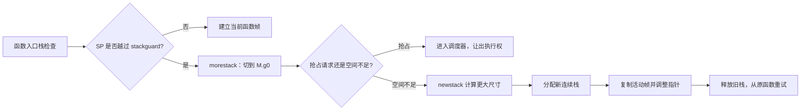
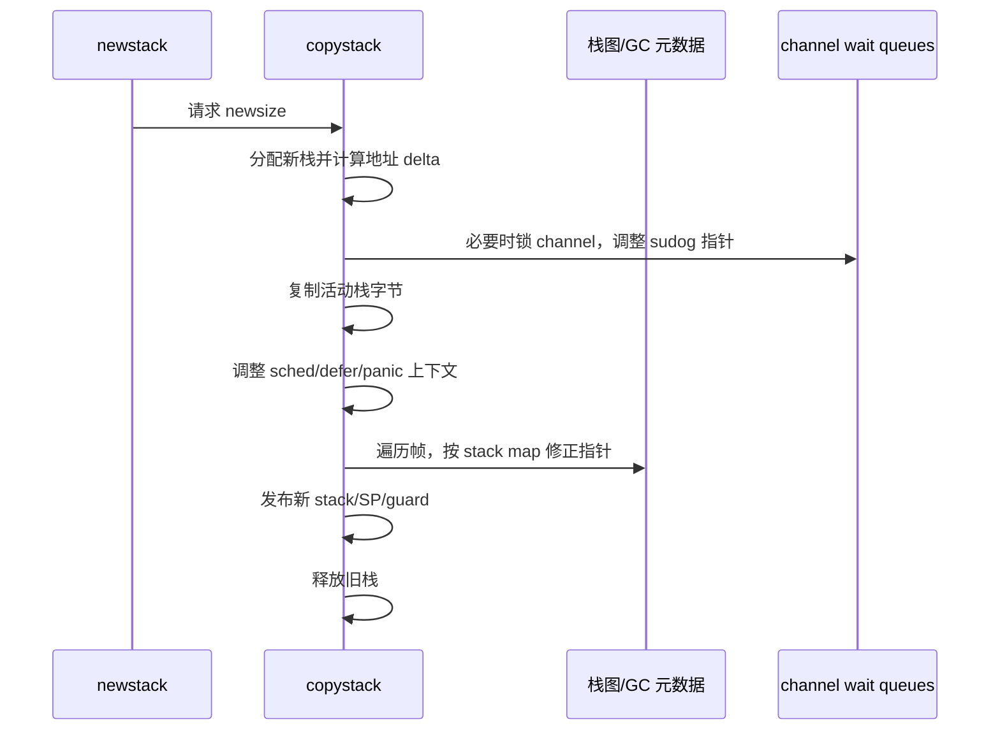
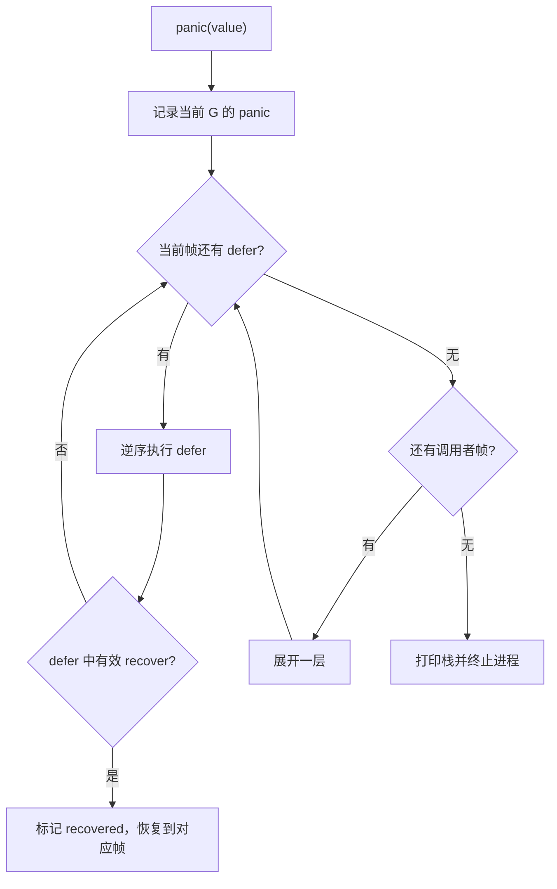

# 22 · goroutine 连续栈与 Go ABI：扩栈、栈图、defer 和 panic 展开 ⭐⭐⭐

> 本章以 Go 1.26.4、amd64 为主线。goroutine 栈能够按需增长是可观察能力；初始分配大小、寄存器分配、栈帧布局和私有 runtime 函数都不是 Go 兼容性承诺。

配套代码：[`go/code/30_goroutine_stack_abi`](../code/30_goroutine_stack_abi/)

## 1. 为什么不能只说“goroutine 初始栈是 2 KB”

`runtime/stack.go` 中当前确实有 `stackMin = 2048`，但实际最小分配还会加入平台需要的 `stackSystem`，再向上取整到 2 的幂。

例如 Go 1.26.4 当前实现中，Windows 为某些系统用途额外保留栈空间。因此“所有平台都精确分配 2 KB”并不正确。真正稳定的理解应当是：

1. goroutine 不像典型线程那样一开始就预留一个很大的固定栈；
2. runtime 从较小的连续栈开始，并根据实际调用深度扩容；
3. 实现常数受 GOOS、GOARCH 和版本影响，业务不能依赖。

goroutine 可以创建很多，主要得益于小栈、按需扩缩和调度元数据复用；但每个 G 仍有栈、`g` 结构、引用对象和等待资源，所以“很多”不等于“无限”。

## 2. 连续栈的整体心智模型

现代 Go 使用可复制的连续栈。栈空间不够时，不是在旧栈尾部简单追加一段，而是申请更大的连续区域，复制仍在使用的部分，并修正所有指向旧栈的受跟踪指针。



这里有一个非常重要的推论：**Go 指针能在栈移动后继续有效，不是因为地址没有变，而是因为编译器和 runtime 知道哪些位置是指针并一起修正。**

## 3. 函数入口的栈检查在检查什么

对可能扩栈的函数，编译器通常在入口生成一个 stack split prologue。概念上类似：

```text
newSP = SP - frameSize
if newSP < g.stackguard0 {
    morestack(...)
    retry current function
}
```

真实汇编还要处理大栈帧、栈溢出和寄存器保存，不能把这段伪代码当成固定指令序列。

`g.stackguard0` 正常情况下指向栈底上方的保护位置；runtime 也可以把它设置成特殊值来请求协作抢占。于是同一套函数入口检查既能发现空间不足，也能成为一种安全抢占入口。

### 3.1 为什么 `morestack` 不能继续用当前 G 栈

触发扩栈时，当前栈已经被判定空间不足；继续在它上面运行复杂逻辑会再次溢出。汇编入口会保存必要上下文并切换到 M 的 `g0` 调度栈，再执行 `newstack`。

这也是阅读 runtime 汇编时经常看到 `systemstack`、`g0` 的原因：某些底层操作必须脱离普通、可移动的 G 栈。

### 3.2 `//go:nosplit` 不是普通性能优化开关

标记为 `nosplit` 的函数不走常规栈检查。它适合：

- 扩栈本身依赖的最底层路径；
- 信号、调度或 runtime 锁相关的严格受控代码；
- 必须保持特定调用帧相邻关系的内部实现。

链接器会检查 nosplit 调用链的栈预算。业务代码不应为了省几条指令随意使用；一旦调用链超出预算，轻则构建失败，重则破坏 runtime 安全假设。

## 4. `newstack` 如何决定增长并搬迁

`runtime/stack.go` 明确说明栈增长采用乘法策略，以获得摊还常数成本。主线可以理解为：

1. 确认当前确实是普通 G 在请求扩栈，而不是禁止扩栈的 runtime 状态。
2. 区分 `stackPreempt` 等特殊保护值与真正的空间不足。
3. 根据旧栈大小和即将进入的函数帧计算新大小，通常按倍数增长，直到能容纳需要的帧。
4. 检查是否超过进程允许的最大栈限制，防止无限递归耗尽地址空间。
5. 把 G 状态切换到栈复制安全状态，调用 `copystack`。
6. 更新 SP/guard/调度上下文，回到原调用点重新执行函数入口。

倍增不会让总复制量无限放大。假设活动数据量依次从 `S` 增至 `2S`、`4S`、`8S`，历次复制总量小于最终容量的两倍，这就是摊还分析的意义。

不过单次扩栈仍可能造成可见尾延迟。攻击者可控的超深递归、巨大局部数组和突然加深的调用链都值得限制。

## 5. `copystack` 为什么比 `memmove` 复杂得多

复制活动栈字节只是第一步。runtime 还必须处理所有可能指向旧栈的位置：

- 当前 G 的调度上下文、defer 和 panic 链；
- 栈帧中的 Go 指针；
- 指向栈上收发值的 channel `sudog.elem`；
- 某些 runtime 保存的上下文与寄存器状态。

当前源码中的核心过程可以抽象为：



### 5.1 channel 等待为什么会影响扩栈

阻塞发送者或接收者的 `sudog` 可能暂时保存一个指向该 G 栈上元素的指针。此时另一个 goroutine 可能正在通过 channel 把值写入这块栈内存。

所以复制栈不能只扫自己的字段。`copystack` 会根据 `activeStackChans` 等状态，与相关 channel 锁协作，避免值传递和地址调整并发破坏数据。这正好说明 runtime 各子系统不是孤立章节：channel、栈复制与调度在 `sudog` 上汇合。

### 5.2 为什么普通 Go 指针安全，`uintptr` 却危险

编译器为栈帧生成指针位图，runtime 能识别并修正 `*T`、slice data 指针等活指针。`uintptr` 只是整数，不再是 GC 跟踪的指针：

```go
p := &value
u := uintptr(unsafe.Pointer(p))
// 中间发生函数调用、扩栈或 GC
p2 := (*int)(unsafe.Pointer(u)) // 不能因为“以前可用”就认为安全
```

当前 Go GC 不移动普通堆对象，但 goroutine 栈会移动；并且 `uintptr` 也不能维持对象存活。使用 `unsafe` 时必须遵守语言与 `unsafe.Pointer` 文档允许的转换模式，而不是靠当前实验地址猜测。

## 6. 栈为什么还能收缩

深调用返回后，如果永远保留峰值栈，偶发的一次深递归就会让大量 goroutine 长期占用大栈。当前 `shrinkstack` 会在安全时机检查：

- 不能低于平台最小栈分配；
- 当前使用量（连同 nosplit 保护空间）小于现有栈约四分之一时，才考虑缩为一半；
- G 必须处于可安全拥有/扫描其栈的状态；
- channel 停车窗口、系统调用等特殊状态可能禁止收缩。

“四分之一”和“缩一半”是 Go 1.26.4 当前策略。业务只应依赖栈由 runtime 管理，不能依赖函数一返回栈就立即变小。

## 7. 栈图、安全点与精确 GC

机器字本身不携带类型。某个 `0x12345678` 可能是整数，也可能是地址。编译器必须为每个可扫描帧生成元数据，描述：

- 哪些参数、局部栈槽和 spill 槽是指针；
- 在某个 PC 位置，哪些变量仍然存活；
- 调用链怎样展开；
- 哪些位置可以安全暂停和扫描。

这些信息共同服务于：

1. **精确 GC**：只把真正的指针当成对象图边。
2. **栈复制**：只调整需要调整的栈内指针。
3. **抢占**：在能可靠恢复且能扫描的状态暂停 G。
4. **traceback/profile**：根据 PC/SP 和函数元数据还原调用帧。

优化编译会让变量只存在于寄存器，或提前判定死亡；因此 debugger 中“看不到某个局部变量”并不说明源代码没执行。

## 8. 寄存器 ABI：参数进寄存器后，为什么仍然需要栈

Go 1.17 起，主要平台的 Go 内部调用约定逐步改用寄存器传参与返回，这套约定通常称为 ABIInternal。与汇编、反射或跨边界适配时还会遇到 ABI0/包装器。

寄存器 ABI 的目标是减少把参数反复写入内存的成本，但它不意味着函数没有栈帧。栈仍用于：

- 超出寄存器容量的参数和返回值；
- 局部变量、地址被取走的值；
- 寄存器 spill 与保存；
- defer/panic、调试、profile；
- GC 需要的稳定栈槽与元数据；
- 调用其他函数所需的对齐和临时空间。


### 8.1 为什么不要背“第几个参数一定在哪个寄存器”

寄存器分配取决于 GOARCH、类型布局、编译器版本、内联和调用边界。可靠做法是保留一个 `//go:noinline` 的稳定函数，再观察当前构建产物。

配套代码中的 `AddSix` 与 `CallAddSix` 就是锚点：前者避免被内联，后者提供容易定位的调用点。即便如此，也应把汇编结论标注为“Go 1.26.4/windows-amd64 当前产物”。

## 9. 逃逸分析和扩栈不是一回事

两个问题经常被混淆：

- **逃逸分析**回答：一个值能否安全放在某个栈帧里，还是必须延长到堆上。
- **栈增长**回答：整个 goroutine 的连续栈是否有足够空间容纳调用链。

一个放在栈上的局部变量，在扩栈时会随栈一起移动；它不因此“逃逸到堆”。一个堆对象的局部指针变量则可能位于栈上，扩栈时仅调整这只指针变量所在的位置。

常见逃逸原因包括：

- 返回局部变量地址；
- 闭包在创建函数返回后继续引用捕获变量；
- 接口装箱或间接调用让编译器无法证明生命周期；
- 对象过大，不适合栈；
- 编译器分析预算或跨包信息不足。

“用了 `new` 就在堆上”“闭包一定逃逸”都不准确，必须看：

```powershell
go build -gcflags='-m=2' ./30_goroutine_stack_abi
```

### 9.1 闭包捕获的是值还是变量

配套 `MakeCounter` 中的闭包需要在外层函数返回后继续读写 `value`，所以捕获状态必须拥有足够长的生命周期。不同闭包调用共享同一个捕获单元，而两次 `MakeCounter` 创建的捕获单元彼此独立。

若循环里需要每次迭代独立快照，要明确区分“捕获同一变量”与“复制当前值”。现代 Go 对 `for` 循环变量语义已有演进，阅读旧面试题时必须标注 Go 版本。

## 10. `defer` 并不只有一种实现

语言语义是稳定的：

- defer 语句执行时会求值函数值与参数；
- 所属函数返回或 panic 展开时，按后进先出执行；
- defer 可以读取/修改命名返回值；
- `recover` 只有在正确的 deferred call 上下文中才生效。

但编译器/runtime 可以用不同实现满足语义：

1. **开放编码 defer**：编译器用位图和直接调用展开常见固定 defer，正常返回路径不必每次操作传统链表。
2. **栈上 `_defer`**：某些能静态确定生命周期的 defer 记录可放在栈上。
3. **堆上 `_defer`**：循环、动态控制流或其他复杂情况可能需要分配和链接记录。

因此“defer 很慢，热点里绝不能用”是过时且过度概括的结论。应该先保证资源释放正确，再对真实热点做 Benchmark，并结合汇编/逃逸输出判断是哪条实现路径。

## 11. panic 展开与 recover 的准确边界

当 `panic(v)` 发生时，runtime 大致执行：

1. 在当前 G 上建立 panic 状态；
2. 从当前帧向外查找并执行 defer；
3. defer 中若有效调用 `recover`，标记该 panic 已恢复；
4. 恢复到相应函数的 defer 返回路径，终止继续展开；
5. 若没有恢复，打印当前及其他相关 goroutine 栈并终止进程。



需要牢牢记住：

- panic 展开只沿**发生 panic 的那只 G**的调用栈。
- 父 goroutine 无法用自己的 defer 捕获子 goroutine panic。
- `recover` 不是任意位置调用都有效，普通函数里直接调用会返回 nil。
- `runtime.throw`、并发 map 等某些 fatal error 不属于可恢复业务 panic，通常会直接终止进程。
- `panic(nil)` 在现代 Go 中也有明确的非 nil panic 表示，不能用旧版本的模糊经验写协议。

配套 `InvokeWithRecovery` 把恢复边界放在同一 G 内，并返回捕获值；生产库若选择 recover，通常还必须记录完整栈并把错误转换到明确边界，不能静默吞掉。

## 12. 配套实验怎样读

### 12.1 递归与迭代

`RecursiveSum` 和 `IterativeSum` 保证结果相同，但资源路径不同：

- 递归每层需要调用帧，深度增加可能触发多次扩栈；
- 迭代通常维持固定帧大小；
- 编译器优化、内联和具体函数体会影响实际差距；
- Go 不承诺尾调用优化，不能假设尾递归自动变循环。

配套代码设置 `MaxTeachingDepth`，因为“不受控深度”本身就是生产安全问题。

### 12.2 `CaptureStackAtDepth`

递归到指定深度后逐步扩大 buffer 调用 `runtime.Stack`，只返回栈文本，不把栈地址泄漏到调用方。`runtime.KeepAlive(marker)` 让教学帧保持可观察，避免优化让实验意图消失。

栈文本是诊断快照，不适合被解析成稳定业务协议：函数名、内联帧、路径和格式都可能随版本变化。

### 12.3 建议命令

```powershell
cd go/code

go run ./30_goroutine_stack_abi -depth=128
go run ./30_goroutine_stack_abi -depth=4096
go test ./30_goroutine_stack_abi -run '^$' -bench '.' -benchmem -count=5

# 逃逸和内联证据
go build -gcflags='-m=2' ./30_goroutine_stack_abi

# 当前平台 ABI 证据
go build -o $env:TEMP\stack_abi.exe ./30_goroutine_stack_abi
go tool objdump -s 'main\.CallAddSix' $env:TEMP\stack_abi.exe
go tool objdump -s 'main\.AddSix' $env:TEMP\stack_abi.exe
Remove-Item -LiteralPath $env:TEMP\stack_abi.exe
```

比较递归 Benchmark 时，应同时查看 `allocs/op`：扩栈由 runtime 管理，不一定表现为普通堆分配次数，不能只凭 `allocs/op == 0` 就说递归“没有内存成本”。

## 13. 工程风险与设计准则

| 场景 | 风险 | 更稳妥的做法 |
|---|---|---|
| 解析攻击者可控的树/表达式 | 超深递归触发大栈甚至栈上限 | 限制深度，必要时改显式栈迭代 |
| 大数组作为局部变量 | 单帧巨大，突然触发扩栈 | 评估堆分配或复用，结合逃逸输出 |
| 把局部地址存成 `uintptr` | 扩栈/GC 后失去跟踪 | 遵守 `unsafe.Pointer` 允许模式，不跨安全点保存 |
| 每次请求创建大闭包 | 捕获状态逃逸并保留大对象 | 缩小捕获集，传明确参数 |
| 用 panic 表示普通校验失败 | 控制流和资源边界不清 | 返回 error；仅在明确边界 recover |
| 为省开销删除 defer | 异常路径泄漏资源 | 先正确，Benchmark 证明后再优化 |

## 14. 高频面试题：带机制推导的回答

### Q1. goroutine 栈和线程栈的本质差异是什么？

goroutine 栈由 Go runtime 管理，可按需复制扩缩，并能随 G 在不同 M 间迁移；线程栈由 OS/线程运行时管理，通常有更大的固定预留区并绑定线程。差异不仅是初始大小，还包括谁管理、是否可移动、如何扫描和与调度单元的绑定关系。

### Q2. Go 栈是分段栈还是连续栈？

现代 Go 是可复制的连续栈。空间不足时申请更大连续区域并复制活动部分。早期实现曾使用分段栈，但会在栈边界反复调用时产生 hot split 等问题；回答时要标注历史与当前实现。

### Q3. 扩栈为什么必须有编译器参与？

编译器负责插入栈检查，生成每个 PC 的栈图、活跃指针和展开信息；runtime 才能在空间不足时发现问题，并在复制后准确修正指针。只靠 runtime 看一串机器字无法可靠区分整数和地址。

### Q4. 栈增长后，之前取得的 Go 指针为什么仍有效？

因为它仍是受跟踪的 Go 指针，runtime 在复制栈时会根据元数据调整指向旧栈的引用。转换成 `uintptr` 后就变成普通整数，不再享受这套跟踪和保活保证。

### Q5. `nosplit` 为什么不能随便用？

它跳过普通扩栈检查，只能依赖预留的 nosplit 栈预算。调用链过深会破坏“剩余空间足以执行底层救援代码”的假设。它主要是 runtime 正确性工具，不是通用微优化注解。

### Q6. 寄存器 ABI 是否让栈帧消失？

不会。参数优先进入寄存器只减少部分内存传递；局部变量、spill、超额参数、defer、调用对齐、GC 和调试元数据仍需要栈。具体函数是否有帧必须看当前编译产物。

### Q7. 栈上的对象一定比堆上快吗？

通常栈分配只需调整 SP，回收随函数返回，GC 压力较低；但“大对象放栈”可能增加清零、扩栈和复制成本。性能不是简单二分，仍需结合对象大小、调用深度、逃逸与 profile。

### Q8. 闭包一定导致堆分配吗？

不一定。如果闭包不逃出当前可证明的生命周期，编译器可能把环境留在栈上或直接内联。若闭包返回、存入全局或跨 goroutine 使用，捕获状态更可能逃逸。以 `-m=2` 输出为准。

### Q9. defer 现在还慢吗？

语言语义有固定成本，但实现有开放编码、栈记录和堆记录多条路径。简单固定 defer 常被优化得很轻；循环中动态 defer 可能更贵。不能用早期版本的单一结论代替当前 Benchmark。

### Q10. 为什么父 goroutine recover 不到子 goroutine 的 panic？

recover 只参与当前 G 的 panic/defer 展开。父子 goroutine 只有创建关系，没有共享调用栈。要隔离子任务 panic，必须在子 goroutine 自己的入口处建立 defer/recover 边界。

### Q11. 栈什么时候收缩？

不保证函数返回后立即收缩。当前 runtime 会在能安全拥有 G 栈的时机检查利用率，低于阈值才复制到较小栈。具体阈值与时机是实现细节，因此不能靠观察地址变化编写正确性逻辑。

### Q12. 如何定位“stack overflow”或异常深栈？

先从崩溃栈确认递归调用链与输入，再检查是否缺少终止条件、深度限制或图结构去重。对正常但很深的算法，改显式栈迭代；对单帧过大，结合 `-m=2`、汇编与编译器诊断检查局部对象布局。

## 15. 源码阅读路线

1. `runtime/runtime2.go`：`g.stack`、`stackguard0`、`sched`、defer/panic 字段。
2. `runtime/stack.go`：常量 → `newstack` → `copystack` → `adjustframe` → `shrinkstack`。
3. `runtime/asm_*.s`：`morestack` 和 g0 切换入口。
4. `runtime/panic.go`：`deferproc`、`deferreturn`、`gopanic`、`gorecover`。
5. `internal/abi` 与 `cmd/compile/internal/abi`：当前 ABI 数据结构与规则。
6. `cmd/compile/internal/ssa`：栈检查、开放编码 defer、去除/保留变量的优化过程。
7. `runtime/stkframe.go`、`runtime/symtab.go`：栈展开与 PC 元数据。

## 16. 进阶练习

1. 分别在 Windows 与 Linux 构建同一程序，观察最小栈与汇编差异，不把某平台结果推广成语言保证。
2. 增加一个 64 KiB 局部数组的 noinline 函数，观察入口栈检查与逃逸分析如何变化。
3. 把 `MakeCounter` 改成不逃逸的立即调用闭包，对比 `-m=2` 输出。
4. 在循环里注册 defer，与显式清理比较 Benchmark；再把 defer 移到独立函数，观察开放编码路径。
5. 启动一个发生 panic 的子 goroutine，分别在父、子 G 放 recover，验证恢复边界。

## 本章总结

goroutine 栈的低成本来自编译器与 runtime 的协作：函数入口检查发现空间不足，`morestack/newstack` 在 g0 上扩容，栈图让 `copystack` 能安全修正指针，安全点同时服务 GC 与抢占。寄存器 ABI、逃逸、defer 和 panic 又建立在同一套帧与元数据之上。真正该掌握的不是某个固定栈大小或寄存器编号，而是这套可验证、会随版本演进的机制。
