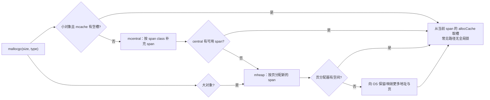
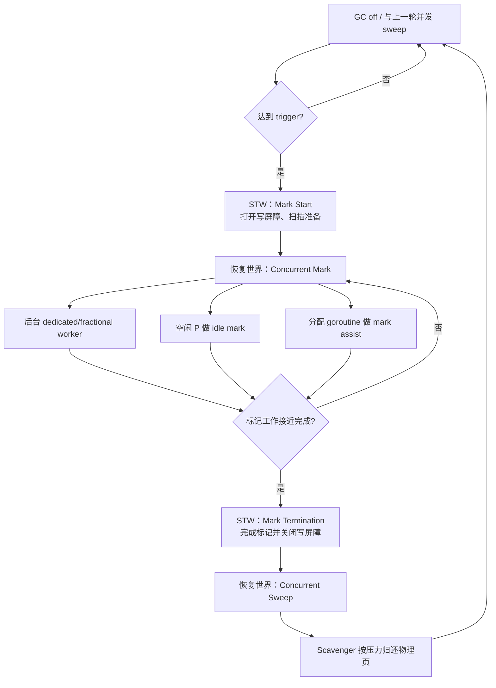
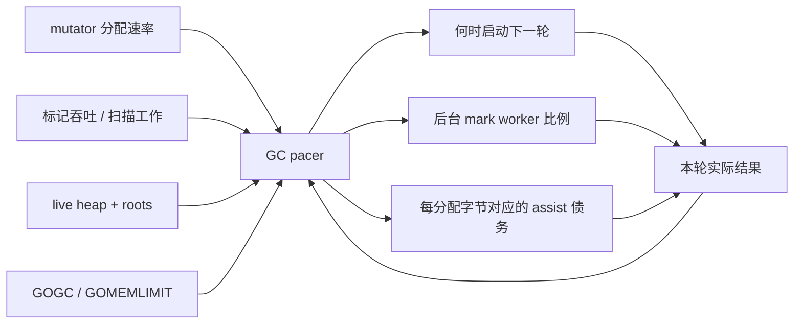
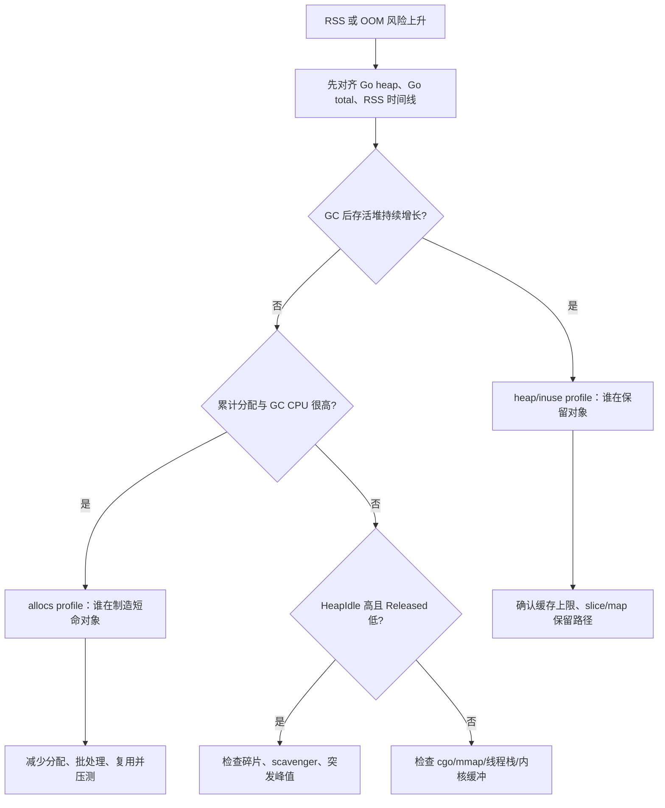

# 23 · Go 分配器与 GC pacer：从 size class 到 GOMEMLIMIT ⭐⭐⭐

> 本章以 Go 1.26.4 为源码基线。可达对象不会被回收是语言/runtime 语义；32 KiB 小对象边界、size class 表、pacer 参数和内部字段都是当前实现，不应成为业务协议。

配套代码：[`go/code/31_allocator_gc_pacer`](../code/31_allocator_gc_pacer/)

## 1. 先区分四个完全不同的“内存高”

排查 Go 内存问题时，最常见的错误是看到 RSS 高就直接得出“GC 没回收”或“内存泄漏”。至少要拆成四个维度：

| 维度 | 它回答什么 | 典型证据 |
|---|---|---|
| 分配速率 | 每秒创建了多少新对象/字节 | allocs profile、`/gc/heap/allocs:*` |
| 存活堆 | GC 后还有多少对象可达 | heap/inuse profile、`/memory/classes/heap/objects:bytes` |
| Go 管理内存 | runtime 从 OS 管理了多少内存 | `runtime/metrics` memory classes、`MemStats.Sys` |
| 进程 RSS | OS 认为当前驻留了多少物理页 | 容器/系统指标、进程监控 |

它们之间没有一一对应关系：

- 分配速率很高，但对象很快死亡：存活堆不大，GC CPU 可能很高。
- 分配速率不高，但缓存没有上限：存活堆持续增长。
- `HeapAlloc` 已下降，但空闲页还留给 Go 复用：RSS 不一定同步下降。
- cgo、mmap、线程栈和内核 socket buffer 会增加 RSS，却不属于普通 Go heap。

后续所有 allocator/GC 调优，都应该先说明自己在优化哪一个维度。

## 2. 分配器的三层局部性

Go 当前小对象分配器可用 `mcache → mcentral → mheap → OS` 理解，但这不是每次分配都要完整走一遍的固定调用链。



### 2.1 `mcache` 为什么跟 P 绑定

当前每个 P 持有一个 `mcache`。正在执行 Go 代码的 M 独占绑定某个 P，因此常见分配路径可以访问 P 的本地 span，不需要多个线程同时锁同一个 cache。

如果 cache 跟 G 绑定，会有海量 cache 且迁移回收复杂；如果跟 M 绑定，M 进入 syscall 时资源不容易随 P 转交。绑定 P 正好与“可移交的 Go 执行资源”保持一致。

### 2.2 `mcentral` 管理的不是单个对象

`mcentral` 按 span class 组织 mspan。mcache 用尽时，向 central 取得的是一整个仍有空槽的 span，而不是每次只拿一个对象。一次锁竞争换来后续多次无锁/低竞争分配，这叫摊薄成本。

central 还要区分已扫描/未扫描、部分空闲/全满等状态，并与并发 sweep 协作，确保不会把尚未清扫的 span 当成已清扫空间复用。

### 2.3 `mheap` 与页分配器

`mheap` 管理全局页、arena、span 元数据和 central。Go 1.26.4 当前页粒度是 8192 字节；堆由多个 arena 组成，arena 旁边有指针位图和地址到 span 的映射。

大对象直接按页向 mheap 路径申请 span，绕过普通小对象 size class。这样避免把一个大对象切进不合适的小对象 span，也减少内部碎片。

## 3. size class、span class 与内部碎片

### 3.1 为什么不是每个字节大小一个 class

如果 1、2、3……32768 字节都维护独立 class，元数据和可用 span 会极度碎片化。当前实现把 32 KiB 及以下的小对象向上取整到约 70 个 size class。

例如请求 25 字节，真实槽可能属于更大的 class。差值是内部碎片：

```text
单对象内部碎片 = classSize - requestedSize
总内部碎片 ≈ 同类存活对象数 × 单对象内部碎片
```

但 class 设计会控制浪费比例，并选择合适的 span 页数，使每个 span 能容纳合理数量的对象。

不要为了“卡 size class”盲目调整业务结构。字段顺序、指针数量、缓存局部性和可读性通常比省几个字节更重要；只有 profile 证明对象数量巨大时，布局优化才可能显著。

### 3.2 scan 与 noscan 为什么也属于 class

两个对象即使大小相同，只要一个包含指针、另一个不包含指针，GC 扫描成本就不同。runtime 的 span class 会编码 size class 与 noscan 信息：

- **scan span**：对象可能含指针，标记阶段要按类型布局扫描。
- **noscan span**：对象不含指针，不需要沿其内容继续遍历对象图。

这解释了为什么指针密集结构会同时影响分配布局、GC 扫描量和缓存行为。

### 3.3 tiny allocator 的真实边界

当前 tiny allocator 针对非常小的 **noscan** 对象，把多个小对象塞进一个 tiny block，以减少槽和元数据浪费。它不是“所有小于 16 字节的对象都合并”，因为：

- 含指针对象不能走同一简单路径；
- 对齐要求会影响能否放入剩余空间；
- 逃逸分析可能让对象根本不进入堆分配器；
- 阈值和实现会随版本变化。

## 4. 从 `make([]byte, n)` 到一个对象槽

以一个发生堆逃逸的小 slice backing array 为例：

1. 编译器知道大小或生成运行时大小计算，并做溢出检查。
2. 进入 `mallocgc(size, typ, needzero)`；对纯字节 backing array，通常是 noscan 类型。
3. 若是 tiny/小对象，选 size class 和当前 P 的 mcache span。
4. 从 span 的空闲位图/缓存中找槽，必要时清零。
5. 更新 heap live、profile sample 和 GC assist 账户。
6. 若分配让 GC 债务为负，当前 G 可能被要求做 mark assist。

### 4.1 “零值保证”不等于每次都立即清整页

Go 保证新分配对象对程序可见时是零值。runtime 可以通过延迟清零、复用已知为零的槽、只清需要部分等方式满足语义，避免为从未使用的页做无效工作。

### 4.2 分配快路径也不是零成本

即使命中 mcache，仍可能包含：

- class 选择与空闲槽查找；
- 指针/非指针路径判断；
- 清零；
- race/asan/msan、profile 等构建模式的额外逻辑；
- heap live 与 GC assist 记账。

所以“无锁”不能等价成“免费”。减少不必要分配依然是稳定优化方向。

## 5. GC 周期：并发标记不代表完全没有 STW

Go 使用并发、精确、非分代、当前普通堆对象不移动的 tracing GC。一个周期可简化为：



STW 仍存在，但主要集中在 mark start/termination 等阶段，目标是很短。长尾停顿不一定来自 STW：mark assist、调度排队、扫大对象、page fault 也可能增加请求延迟。

## 6. 三色标记与混合写屏障

### 6.1 三色只是一种不变量表达

- **白色**：本轮还未证明可达。
- **灰色**：已发现，但它指向的对象尚未全部扫描。
- **黑色**：已发现且它的出边已经扫描完。

从根集合开始，把可达对象由白变灰、再扫描成黑。标记结束后仍为白的对象就是不可达候选。

### 6.2 mutator 并发修改对象图会造成什么问题

假设扫描器已把对象 A 扫成黑色，业务 goroutine 随后执行：

```text
A.new = B
oldReferenceToB = nil
```

如果 B 仍是白色，且扫描器不会重新扫描 A，就可能漏掉实际可达的 B。并发标记必须拦截指针写入来维护不变量。

### 6.3 Go 写屏障不是 CPU memory barrier

Go 当前采用混合写屏障思想。编译器在 GC 标记阶段可能为堆指针写入插入 barrier，把被覆盖的旧指针和/或新指针纳入标记工作，配合“新分配对象直接标黑”等规则，让并发标记不漏对象。

GC 写屏障解决的是**对象图可达性**；CPU memory barrier 与 Mutex/atomic 解决的是**goroutine 间可见性和有序性**。二者名字相似，问题完全不同。

### 6.4 为什么某些 runtime 代码写 `nowritebarrier`

写屏障本身可能需要 runtime 支持、分配或调度；在扩栈、调度、GC 关键路径里递归触发会破坏不变量。因此 runtime 使用 `//go:nowritebarrier`、`//go:nowritebarrierrec` 限制某些函数及调用链。它们同样不是业务优化注解。

## 7. pacer：GC 不是简单“堆到两倍就启动”

### 7.1 GOGC 的基本目标

常见近似说法是：

```text
nextHeap ≈ liveHeap × (1 + GOGC / 100)
```

但 Go 1.26.4 当前 `gcController.commit` 还把上一轮可扫描栈和全局变量作为非堆根扫描工作的一部分。源码中的目标可概括为：

```text
gcPercentGoal = markedHeap
              + (markedHeap + lastStackScan + globalsScan) × GOGC / 100
```

随后还会应用最小堆、memory limit、sweep 距离等约束。所以 `GOGC=100` 不是“每分配 100 MB 触发”，也不永远精确等于堆翻倍。

### 7.2 trigger 为什么必须早于 goal

goal 是希望本轮标记完成时不要越过的目标，不是开始标记的点。GC 需要一段 runway：如果等堆到 goal 才启动，并发标记期间业务还在继续分配，必然超出目标。

pacer 根据：

- 上轮/本轮预估扫描工作；
- mutator 分配速率；
- 标记吞吐；
- 期望分给后台 GC 的 CPU 比例；
- 当前 heap live 与 goal；

计算 trigger、assist ratio 和后台 worker 配额。它本质上是反馈控制器，不是固定阈值 if 语句。



## 8. mark assist：为什么分配热点会突然变慢

如果业务分配速度超过后台标记进度，只靠后台 worker 可能赶不上 heap goal。runtime 给每个 G 维护 `gcAssistBytes`：

- 正值表示尚有分配信用；
- 分配会消耗信用；
- 变成负值时，G 需要扫描一定标记工作来偿还债务；
- 完成工作后换回新的分配信用。

这形成背压：制造 GC 工作最快的分配者不能无限领先于回收者。

生产表现可能是 CPU profile 中 runtime GC/scan 上升，请求延迟变高，但 STW 指标并不大。这时只盯 pause time 会漏掉真正成本。

优化方向通常是减少分配速率、缩小存活对象图、提高对象复用收益；盲目调大 GOGC 可能只是用更多内存换暂时更少 GC。

## 9. GOMEMLIMIT 是软目标，不是进程硬限额

`debug.SetMemoryLimit`/`GOMEMLIMIT` 告诉 runtime 尝试把它管理的内存控制在一个软目标内。它会影响 heap goal，并在接近限制时更积极 GC/scavenge。

但它不是硬墙：

- 活跃堆本身如果已超过限制，GC 不能回收仍可达对象；
- goroutine 栈、runtime 元数据也占 Go 管理内存；
- cgo、mmap、线程栈、动态库、内核缓冲不一定被该限制完整覆盖；
- 高速并发分配与回收有反馈延迟；
- runtime 会避免把全部 CPU 都花在无效 GC 上。

容器内的典型设置应预留：

```text
容器内存上限
- 非 Go 内存
- 内核/socket/page cache 波动
- runtime 无法瞬时回收的余量
= GOMEMLIMIT 的候选值
```

不能把 GOMEMLIMIT 直接设成容器 limit 后期待永不 OOM。

## 10. sweep、scavenger 与 RSS 为什么不同步

### 10.1 sweep 回收“对象槽”

标记结束后，未标记对象所在槽可重新分配。并发 sweep 按 span 工作：

- span 仍有活对象：清出死亡槽，回到 central/mcache 可复用路径；
- span 全部空闲：页面回到 mheap；
- 分配线程需要 span 时，也可能主动 sweep 来满足请求。

完成 sweep 只说明 Go 可以复用这些地址，不等于物理页已还给 OS。

### 10.2 scavenger 回收“物理页”

scavenger 识别长期不需要或内存压力下可释放的空闲页，通过平台机制把物理内存归还 OS。虚拟地址可能仍保留，未来重新使用时会再触发页面提交或 page fault。

理解几个指标：

- `HeapAlloc`：当前已分配且未回收的堆对象字节近似。
- `HeapInuse`：用于小/大对象 span 的页，包含 span 内未被对象填满的空间。
- `HeapIdle`：已向 OS 取得、当前不用于对象 span 的页。
- `HeapReleased`：`HeapIdle` 中已归还给 OS 的部分。

所以 GC 后常见顺序是：`HeapAlloc` 先降，`HeapIdle` 上升，`HeapReleased` 和 RSS 随后才可能变化。

## 11. 三类常见内存滞留

### 11.1 backing array 滞留

```go
small := huge[:10]
return small
```

只保留 10 个元素的 slice header，仍会让整个巨大 backing array 可达。若结果生命周期长且原数组很大，应复制真正需要的部分。

### 11.2 span 碎片

一个 span 中只剩少量长寿命对象，也不能把整 span 页面归还。大量“少数存活、分散在很多 span”的对象会让 `HeapInuse - HeapAlloc` 增大。

### 11.3 容器/队列已消费槽仍保留指针

自制 slice 队列只移动 head，却不清零已消费元素，会让 backing array 继续引用对象。配套 `CondQueue` 正是通过写入零值避免这种保留。

无界 map、按用户 ID 永不淘汰的缓存、timer/context 未取消，也属于可达性泄漏：GC 正确地认为对象仍被业务引用。

## 12. `sync.Pool` 能做什么，不能做什么

Pool 适合跨请求临时复用、创建成本可控且可随时重建的对象。例如短命 buffer。它的契约包括：

- Pool 中对象可在任意 GC 周期被丢弃；
- 不提供容量、TTL、命中率和持久性保证；
- Get/Put 之间没有业务所有权协议；
- 放回前必须重置，尤其要清除敏感数据和大引用；
- 不要把稀有超大 buffer 与普通 buffer 混在同一个无界池里。

Pool 不是数据库连接池、缓存或资源配额器。连接等外部资源需要显式上限、健康检查和关闭生命周期。

## 13. 配套实验如何解释

### 13.1 `AllocateAndRetain`

[`allocator.go`](../code/31_allocator_gc_pacer/allocator.go) 创建指定数量的 `[]byte`，每 `KeepEvery` 个保留一个：

- `allocated` 表示逻辑上请求过的总字节，不等于 RSS 增量；
- `retained` 决定实验结束时仍保持可达的 backing array 数量；
- 首尾写 marker，避免实验被优化成无意义分配；
- 参数乘法做溢出检查，防止教材代码本身制造错误。

改变 `KeepEvery` 可以分别控制分配总量和存活比例。例如总分配相同，`KeepEvery=1` 与 `KeepEvery=100` 对下一轮扫描工作完全不同。

### 13.2 `WithGCSettings` 为什么要恢复全局设置

`debug.SetGCPercent` 和 `debug.SetMemoryLimit` 修改进程级 runtime 设置，不是当前 goroutine 局部变量。配套代码先保存旧值，并用 defer 恢复，防止一个测试污染后续测试。

生产程序一般在启动阶段统一设置，不要让并发请求各自临时修改。

### 13.3 Benchmark 对应什么问题

- small vs large：观察 size class 快路径和大对象页分配差异。
- pointer-rich vs pointer-free：主要观察对象布局、分配和潜在扫描成本，单个短 Benchmark 不等同完整 GC 成本。
- direct buffer vs pooled buffer：验证具体对象、具体负载下 Pool 是否真减少分配。

### 13.4 建议命令

```powershell
cd go/code

go run ./31_allocator_gc_pacer -objects=100000 -size=256 -keep-every=10
go run ./31_allocator_gc_pacer -objects=100000 -size=256 -keep-every=1

$env:GODEBUG='gctrace=1'
go run ./31_allocator_gc_pacer -objects=1000000 -size=128 -keep-every=100
Remove-Item Env:GODEBUG

go test ./31_allocator_gc_pacer -run '^$' -bench '.' -benchmem -count=5
go test -race ./31_allocator_gc_pacer
```

单次 before/after 快照受后台 GC、其他 goroutine、页复用和采样时机影响。正确方法是重复、控制变量、观察趋势，而不是用一次差值反推精确 allocator 常数。

## 14. 内存事故诊断流程



建议保留的证据：

1. 相同负载下多轮 GC 后的 heap 曲线，而非单点。
2. heap profile 的对象类型、分配栈和 retain 路径。
3. allocs profile 的累计热点。
4. `/gc/heap/goal:bytes`、GC CPU、assist、pause 分布。
5. `HeapIdle/Released` 与进程 RSS。
6. Go 版本、GOGC、GOMEMLIMIT、容器限制与非 Go 内存估算。

## 15. 常见误区

### 误区一：`new` 一定在堆，值变量一定在栈

语法不决定位置。逃逸分析和对象大小/上下文决定实际分配。

### 误区二：GC 后 RSS 不降就是泄漏

对象槽可复用、页仍在 Go heap、碎片、scavenger 延迟、非 Go 内存都可能让 RSS 不立即下降。

### 误区三：把 GOGC 调低一定更安全

更低 GOGC 通常用更多 CPU 换更小堆；在分配压力极高时，频繁 assist 可能恶化延迟和吞吐。必须与 GOMEMLIMIT、负载和 SLO 一起压测。

### 误区四：Pool 一定提升性能

小对象可能本来就在栈上；Pool 会增加共享、类型断言、清理和生命周期复杂度。只有 allocs/CPU/延迟都证明收益才值得保留。

### 误区五：无指针对象不会被 GC 管

noscan 表示不需要扫描其内容寻找下一层指针，不表示对象不参与标记和回收。它仍需从根或其他对象被证明可达。

## 16. 高频面试题：从数据流解释

### Q1. Go 小对象分配为什么快？

对象大小被映射到 size class，当前 P 的 mcache 持有对应 span，常见路径只需从本地空闲位图取得槽并做必要清零/记账，避免全局锁。mcache 用尽才批量向 mcentral 补充，锁成本被后续多次分配摊薄。

### Q2. mcache、mcentral、mheap 的关系是什么？

mcache 是 per-P 快路径；mcentral 按 span class 在多个 P 之间组织可用 span；mheap 以页为单位管理全局地址空间、span 和向 OS 扩展。不是每次 malloc 都穿过三层，命中 mcache 时不会访问后两层。

### Q3. 32 KiB 以上为什么通常算大对象？

当前实现的小对象 class 覆盖到 32 KiB。更大对象若塞进固定小对象 span，会造成严重碎片，因此直接按所需页数走 mheap。32 KiB 是版本实现，不是语言常量。

### Q4. size class 会带来什么空间浪费？

请求尺寸向上取整到 class size，产生内部碎片；span 中少量对象长期存活又会造成 span 级碎片。优化时要同时看对象数、`HeapInuse-HeapAlloc` 和布局，不能只看单对象 `sizeof`。

### Q5. 写屏障解决什么问题？

并发标记时 mutator 仍会改变引用关系。写屏障把相关旧/新指针纳入标记工作，维持可达对象不会被漏标的不变量。它不是 CPU 内存屏障，也不提供 data race 同步。

### Q6. 什么是 mark assist？

分配会产生新的标记工作。若某 G 分配过快、assist 信用耗尽，runtime 要求它执行一部分扫描工作，再允许继续分配。这把 GC 成本反馈给制造工作者，防止后台标记永远追不上 heap goal。

### Q7. `GOGC=100` 精确表示什么？

它表达相对上一轮存活工作量的增长比例。当前目标还会考虑可扫描栈和全局变量、最小堆、memory limit 等，因此只能近似理解为“允许堆相对增长约 100%”，绝不是每 100 MB 或每 100 秒 GC。

### Q8. `GOMEMLIMIT` 为什么不是硬限制？

GC 只能回收不可达对象，不能删除活跃业务数据；并且进程还有 cgo、mmap、线程栈等非 Go 管理内存。pacer 也有反馈延迟和 CPU 限制，所以它是 runtime 尽力遵守的软目标。

### Q9. GC 后 `HeapAlloc` 降了，RSS 为什么可能不降？

sweep 先让对象槽可复用，空闲页可能仍由 mheap 持有；scavenger 之后才尝试把物理页归还 OS。碎片和 OS 统计也会造成差异，应同时看 HeapIdle、HeapReleased 与非 Go 内存。

### Q10. `sync.Pool` 为什么不能当缓存？

runtime 可以在 GC 周期丢弃对象，Pool 没有容量、TTL、键和命中保证。缓存需要明确的保留与淘汰语义，Pool 只承诺临时复用机会。

### Q11. 怎样区分泄漏与正常缓存？

二者在 GC 看来都可达。要看多轮稳定负载后存活堆是否持续无界增长、profile 中的保留者是谁，以及业务结构是否有明确容量/TTL。若缓存达到上限后平台化，通常是容量设计；若随请求历史无限增长，则是泄漏式保留。

### Q12. 优化 Go 内存的优先级是什么？

先用 profile 找累计分配热点和存活保留者；再减少无意义分配、缩短生命周期、给缓存设上限、清除大 backing array 引用。最后才考虑对象布局、Pool 和 GOGC/GOMEMLIMIT 微调，并用吞吐、P99、GC CPU、峰值内存共同验收。

## 17. 源码阅读路线

1. `runtime/malloc.go` 文件头：先读官方对 allocator 层级与页/arena 的总说明。
2. `runtime/malloc.go`：`mallocgc`、tiny/small/large 分支。
3. `runtime/sizeclasses.go`、`runtime/msize.go`：size class 生成结果与映射。
4. `runtime/mcache.go` → `mcentral.go` → `mheap.go`：span 从 P 到全局页的流动。
5. `runtime/mgc.go`：GC phase、mark worker 和周期切换。
6. `runtime/mgcmark.go`、`runtime/mbarrier.go`、`runtime/mbitmap.go`：扫描、写屏障和对象元数据。
7. `runtime/mgcpacer.go`：`commit`、`trigger`、`heapGoal`、assist ratio。
8. `runtime/mgcsweep.go`、`runtime/mgcscavenge.go`：对象槽回收和物理页归还。
9. `runtime/metrics/description.go`：稳定观测指标的定义。

## 18. 进阶练习

1. 保持总分配字节相同，改变对象大小，观察对象数、size class 与 GC 扫描成本。
2. 用相同字节数构造指针密集对象和 `[]uint64`，比较 heap/CPU profile，而不是只看 Benchmark `ns/op`。
3. 让小 slice 长期引用 64 MiB backing array，再用复制修复，比较 heap profile。
4. 在容器内逐步降低 GOMEMLIMIT，观察 heap goal、GC CPU、assist 和吞吐如何变化。
5. 给 `sync.Pool` 加入超大 buffer，再按尺寸分池/拒收大对象，对比峰值内存。

## 本章总结

Go 内存系统是一条反馈链：编译器的逃逸决定对象是否进入堆，allocator 用 per-P cache、span 与 size class 降低分配竞争，GC 用并发标记和写屏障维护可达性，pacer 用 trigger、worker 与 assist 让标记追上分配，sweep/scavenger 再分别回收对象槽和物理页。排障时必须把分配速率、存活堆、Go 管理内存和 RSS 分开，调优才不会把一个问题误当成另一个问题。
