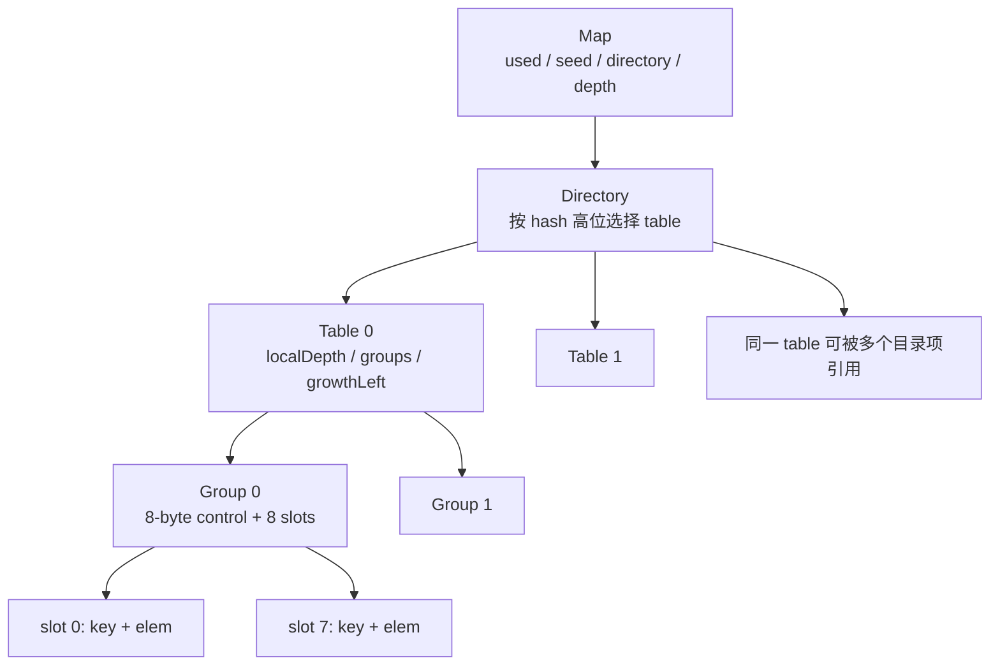
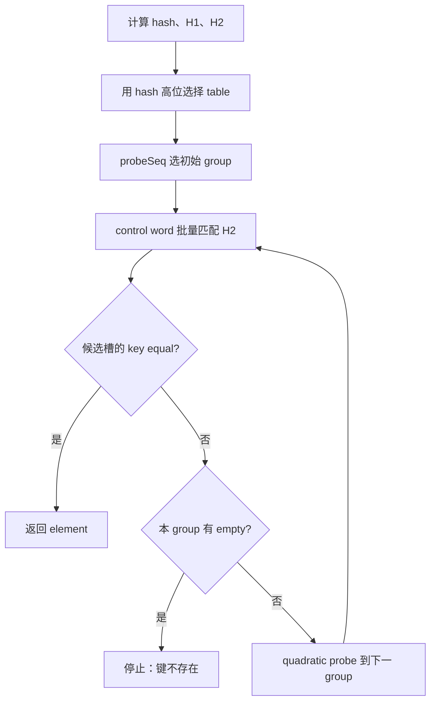
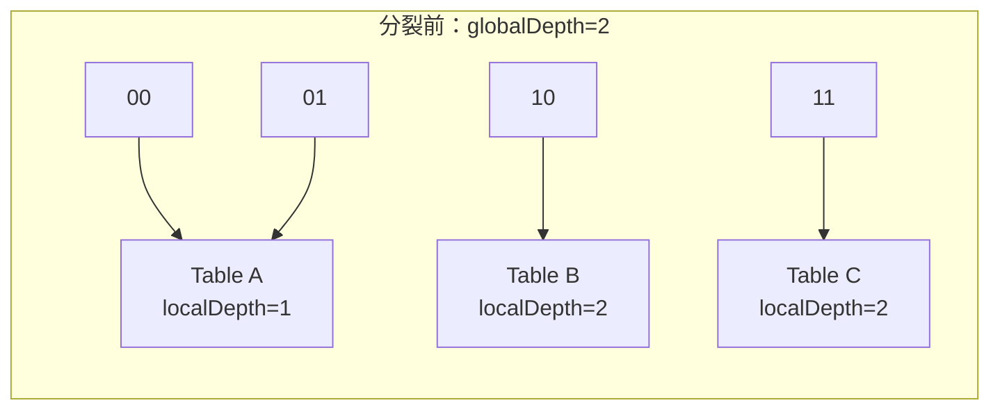

# 24 · Go 1.26 Swiss Table map：control word、探测、分裂与迭代 ⭐⭐⭐

> Go 1.24 起，内置 map 的主实现迁移到 Swiss Table。本章以 Go 1.26.4 的 `internal/runtime/maps` 为基线。map 的公开语义由语言规范保证；group 数量、control 编码、目录和增长算法都是实现细节。

配套代码：[`go/code/32_map_swiss_table`](../code/32_map_swiss_table/)

## 1. 版本边界：为什么旧的 `hmap/bmap` 图已经不够

很多面试资料仍用 `hmap → buckets → bmap → overflow` 解释所有 Go map。这个模型适用于 Go 1.23 及更早的经典实现，但不能继续当作 Go 1.24+ 的当前源码图。

新版设计基于 Swiss Table，并为 Go 的增长和迭代语义加入了多 table、directory 与 extendible hashing。迁移目标主要包括：

- 用连续 group 和紧凑 control word 改善缓存局部性；
- 一次筛选多个槽，减少逐槽分支和昂贵键比较；
- 通过 fingerprint 快速排除绝大多数不可能的键；
- 把大 map 拆成多个有大小上限的 table，使一次增长只重排其中一部分。

旧模型不是“完全没价值”，它适合解释历史演进；面试时第一句应该先问或说明 Go 版本。

## 2. 从顶层到槽位：新版 map 的结构



Go 1.26.4 源码中的术语：

- **slot**：一对 key/element 的存储位置。
- **group**：8 个 slot 加一个 8 字节 control word。
- **control byte**：对应一个 slot，表示 empty/deleted/full；full 时携带 7 位 H2。
- **table**：由一个或多个 group 组成的完整开放寻址哈希表。
- **directory**：table 指针数组，用 hash 高位选择 table。
- **Map**：顶层对象，记录元素数、随机 seed、目录深度、写状态等。

这里没有旧实现的 overflow bucket 链。碰撞通过同一 table 内的开放寻址探测解决。

## 3. control word：为什么 8 个字节很关键

每个 group 的 control word 正好包含 8 个 control byte，与 8 个 slot 一一对应：

```text
control word
+------+------+------+------+------+------+------+------+
| ctrl0| ctrl1| ctrl2| ctrl3| ctrl4| ctrl5| ctrl6| ctrl7|
+------+------+------+------+------+------+------+------+
    |                                                     |
    v                                                     v
  slot0                                                 slot7
```

当前编码：

```text
empty   = 1 0 0 0 0 0 0 0  (0x80)
deleted = 1 1 1 1 1 1 1 0  (0xfe)
full    = 0 h h h h h h h  (低 7 位是 H2)
```

### 3.1 一次匹配 8 个 H2

查找时，runtime 把目标 H2 复制/组合后与整个 control word 做位运算，得到“哪些槽的 7 位 fingerprint 相等”的 bitset。在 amd64 上，部分操作会被编译器 intrinsic 替换成高效指令。

这不是说“一条 SIMD 指令就完成整个 map lookup”。它只快速筛出候选槽；每个候选仍必须执行完整键相等比较。

### 3.2 7 位 fingerprint 有碰撞为什么仍然正确

两个不同 hash 的低 7 位相同概率约为 `1/128`。H2 只是前置过滤器：

```text
H2 不同  -> 一定不是目标键，跳过昂贵比较
H2 相同  -> 可能是目标键，继续执行 key equal
key equal -> 才算真正命中
```

因此 H2 冲突只影响性能，不影响正确性。

## 4. H1、H2 与随机 seed

Go 1.26.4 对完整 hash 做逻辑拆分：

- `H1 = hash >> 7`：上面的高位部分，用于 table/group 定位与探测。
- `H2 = hash & 0x7f`：低 7 位，放入 control byte。

每个 map 有随机 seed，具体类型的 hasher 会把 seed 纳入计算。这样既降低可预测碰撞攻击，也使不同 map/不同运行的布局和迭代顺序不稳定。

hash 的职责不是保证唯一，而是把键尽量均匀分散；equal 才最终确定键相同。类型元数据中会关联对应的 hash/equal 逻辑。

## 5. 查找：为什么遇到 empty 就能停，遇到 deleted 不能停

table 是开放寻址结构。H1 先给出初始 group，如果没找到，就沿 quadratic probe sequence 访问后续 group，直到命中或发现可证明不存在的 empty。



### 5.1 quadratic probing 的直觉

真实实现按 group 而不是逐槽线性前进。探测步长逐渐增长，可写成类似：

```text
group(i) = (start + i*(i+1)/2) mod groupCount
```

group 数是 2 的幂，probe sequence 与掩码配合覆盖所需空间。不要把配套教学代码的“逐槽线性探测”误认为 runtime 原样实现。

### 5.2 empty 为什么提供“不存在证明”

插入某键时，它会占据探测路径上第一个可用位置。如果查找沿同一探测序列遇到了从未使用的 empty，就说明当初插入若存在，必然已经出现在它之前；因此可以停止。

### 5.3 deleted 为什么不能提供证明

deleted 表示这里以前有元素，后面的槽可能因为碰撞而越过它。如果把 deleted 改成 empty，查找会提前停止并漏掉后续键。

```text
初始位置       后续位置
[K1] [K2] [K3] [empty]

删除 K1 后若写 empty：查 K3 在第一格就错误停止
删除 K1 后写 deleted：查找继续，能找到 K3
```

真实 Go 实现还有一项优化：如果被删除槽所在 group 本身仍有 empty，说明探测不会依赖该槽跨过整组，可以直接标 empty；只有可能破坏探测链时才需要 tombstone。

## 6. 插入：已有键、tombstone 与负载上限

插入要同时解决“是否已经存在”和“放在哪里”：

1. 计算 hash/H1/H2，选择 table 与初始 group。
2. 对 H2 候选执行 key equal；命中则更新 element，不增加 `used`。
3. 记录探测路径上遇到的首个 tombstone。
4. 遇到 empty 时，优先复用之前的 tombstone，否则使用 empty。
5. 若 table 的 `growthLeft` 不允许继续插入，先 grow/rehash/split，再重试。

Go 1.26.4 平均每 group 最大负载为 7/8，必须保留 empty 来保证 probe termination。小 map 的单 group 特例可以填满 8 槽，因为它没有跨 group 探测序列。

### 6.1 为什么“容量 8”不等于稳定装 8 个元素

普通 table 要维持负载上限和至少一个终止 empty；目录、table 数、具体 hash 分布也会影响增长。`make(map[K]V, hint)` 的 hint 是预计元素数，不是精确 bucket/slot 数承诺。

## 7. 删除：还必须清理 key/value 引用

删除不只是改 control byte。如果 key 或 value 含指针，slot 继续保留旧值会让 GC 认为对象可达。runtime 必须根据类型布局清理相应存储。

删除后的 control 状态取决于探测不变量：

- 可安全截断探测链：标 empty；
- 仍需保持链连续：标 deleted，并增加 tombstone；
- map 变空或 clear：可重置更多元数据与 seed。

tombstone 太多会让 miss lookup 走更长探测路径。table 在适当时机会 rehash/prune 或增长，把活元素重新放置并消除墓碑。

## 8. small map：最多一组时为什么能特殊处理

顶层 `Map.dirPtr` 有双重含义：

- `dirLen > 0`：指向 table 指针目录；
- `dirLen == 0`：small map，直接指向单个 group。

small map 最多容纳当前一组 8 个 slot，不需要 directory、table 元数据和跨组 probe。第一次写入时才可能真正分配 group；如果空 map 从未写入，可以完全避免这次存储分配。

small map 中没有跨组探测链，所以删除可以直接标 empty，不需要 tombstone。这是“相同语义、不同规模用不同内部表示”的典型优化。

业务不能通过 `unsafe` 固化该布局，因为编译器还可能把某些 map/group 放在栈上，版本也可继续调整。

## 9. 增长：为什么单个大表翻倍仍然不够好

开放寻址的 probe sequence 依赖 group 数量。一旦 table 容量变化，元素理想位置和探测路径都会变化，因此一个 table 增长时通常要重新插入它的所有元素。

如果整个大 map 只有一个无限增长的 table，一次翻倍会搬运全部键，产生巨大瞬时延迟。Go 的方案是限制单 table 大小，并用 extendible hashing 把大 map 切成多个 table。

### 9.1 table 内翻倍

map 开始时通常只有一个 table。在 table 不超过 `maxTableCapacity` 前，增长可创建容量翻倍的新 table，再把旧元素按新 probe sequence 重排。

### 9.2 table 分裂

达到单 table 上限后，不再继续翻成一个更大的 table，而是根据额外一位 hash 把旧 table 分成 left/right 两个 table。一次只重排这个局部 table，而不是整个 map。

### 9.3 directory 与 global/local depth

- `globalDepth`：当前目录索引使用 hash 的多少个高位；目录长度是 `1 << globalDepth`。
- `localDepth`：某个 table 已经按多少个高位被细分。
- 多个目录项可以指向同一个 localDepth 较小的 table。



如果要分裂的 table 满足 `localDepth == globalDepth`，现有目录没有额外索引位，必须先把目录翻倍；否则只需替换指向旧 table 的相关目录项。

这让增长具有“局部增量”性质：单个 table 内仍然要整体 rehash，但最大重排规模被 table 上限约束。

## 10. 迭代为什么是实现中最复杂的部分之一

语言规范对迭代给出的关键语义：

1. 顺序不保证，并且不同遍历可以不同。
2. 尚未访问的 entry 若被删除，不能再返回。
3. 迭代期间新增 entry 可能返回，也可能不返回。
4. 已有 key 的 value 被修改时，若返回该 key，应得到最新 value。
5. 同一 entry 不能因为增长被返回两次。

### 10.1 没有增长时

iterator 可以随机选择起点/偏移，再依次遍历 directory、table、group 与 slot。随机化阻止业务无意依赖物理布局。

### 10.2 table 增长时

如果 iterator 直接切到 replacement table，新 probe sequence 会改变槽位，难以判断哪些 entry 已返回。当前策略的核心是：

- iterator 保留正在遍历的旧 table 引用；
- 继续用旧 table 的 key 顺序避免重复；
- 对选中的 key 去新 table 重新 lookup，确认是否删除并取得最新 value；
- 新增到 replacement table 且旧表没有的 key 可以被跳过，规范允许；
- table split 和 directory grow 时调整后续目录索引。

还有一个高级边界：某些键不自反，例如 `NaN != NaN`。重新 lookup 自己也可能失败，迭代器必须有额外逻辑处理。源码 `Iter.Next` 的复杂度正来自“实现优化必须同时满足宽松但精确的语言语义”。

## 11. 键的 comparable、hash 与 equal

map key 的静态类型必须 comparable。常见情况：

- 整数、指针、channel：比较和 hash 相对直接。
- string：hash/比较成本与内容长度、公共前缀有关，runtime 可使用平台加速。
- struct/array：按字段/元素布局组合 hash 与 equal；padding 不应被当作业务比较内容。
- interface：先考虑动态类型，再调用动态类型对应的 hash/equal；若动态值实际不可比较，运行时会 panic。
- float：`NaN` 不等于自身，可以作为 key 写入，但普通 lookup 用同一个 NaN 值也无法按相等规则找回，迭代/删除语义需要格外理解。

键应保持逻辑不可变。Go 中可作为 key 的值类型本身按值复制；不要通过指针指向的外部可变内容，误以为 map 会感知其业务字段变化。

## 12. 并发访问：runtime 检测不是同步协议

当前 `Map.writing` 会在写操作中切换，增加检测并发写、读写重叠的概率，runtime 可能报：

- `concurrent map writes`
- `concurrent map read and map write`
- `concurrent map iteration and map write`

但这些 fatal 检测不是完整 data race detector：

- 没报错不代表没有竞态；
- fatal 不能 recover，不能作为重试控制流；
- 语言内存模型仍要求通过 Mutex、channel 所有权转移或其他同步建立 happens-before；
- 并发只读只有在 map 已被安全发布且之后绝无写入时才安全。

`sync.Map` 也不是“加锁 map 的全能更快版”，它对写一次读多、不同 key 独立写等模式有专门优化，普通固定 key 集共享状态常用 `map + RWMutex/Mutex` 更清晰。

## 13. 配套教学模型与真实 runtime 的差异

[`table.go`](../code/32_map_swiss_table/table.go) 是为了可读性构造的泛型教学表，不是 runtime 复刻。必须明确差异：

| 维度 | 教学 `Table` | Go 1.26.4 runtime map |
|---|---|---|
| group | 常量用于负载计算，实际按单槽 slice 存储 | 8 槽 group + 8-byte control word |
| control 匹配 | 每次检查一个 byte | 一次位运算筛选整组 H2 |
| probe | 逐槽线性探测 | 按 group quadratic probing |
| 删除 | 非空时统一 tombstone | 能安全截断时可直接 empty |
| 增长 | 整张教学表翻倍 | table 翻倍或分裂，directory 可增长 |
| small map | 无特殊表示 | 单 group 直连优化 |
| hash | 显式传入教学 hasher | 类型 hasher + map seed |
| 并发检测/迭代 | 未实现 | 满足语言语义并有内部检测 |

教学模型保留的关键不变量是：

- H2 只是过滤，最终必须 key equal；
- deleted 不能无条件当 empty；
- 负载过高要 rehash/grow；
- grow 必须重插活元素并清除 tombstone。

### 13.1 Fuzz 为什么比几个示例测试更重要

状态机 Fuzz 把随机字节解释为 Set/Get/Delete 操作，同时维护一个内置 map 作为 oracle。每一步都比较：

- 返回值与存在性；
- 删除结果；
- 长度；
- 多轮增长和碰撞后的最终状态。

这种测试特别适合哈希表，因为 bug 往往只在“碰撞 → 删除 → tombstone 复用 → 再增长”的长操作序列中出现。

## 14. 实验与 Benchmark

```powershell
cd go/code

go run ./32_map_swiss_table
go test -race ./32_map_swiss_table
go test ./32_map_swiss_table -fuzz FuzzSwissTable -fuzztime 10s
go test ./32_map_swiss_table -run '^$' -bench '.' -benchmem -count=5
```

Benchmark 的正确解读：

- 教学表和内置 map 的差距不能用来评价 Swiss Table，因为教学表没有真实 group 匹配和目录优化。
- hit/miss 的 probe 长度不同，应分别测。
- string 键需模拟真实长度、公共前缀和命中率。
- 预分配 hint、装载量、删除比例会改变结果。
- race、CPU 架构、Go 版本都会影响绝对数字。

要研究生产 map 热点，应直接 benchmark 业务键值类型，并用 CPU profile 看 hash/equal/grow 是否真占比高。

## 15. 工程设计建议

1. 已知规模时给合理 `make(map[K]V, hint)`，减少早期增长；hint 不必追求精确槽数。
2. 热路径优先选择短小、稳定、比较便宜的键，必要时把复杂对象转换成明确 ID。
3. 不依赖迭代顺序；对外输出需稳定时，提取 key 后显式排序。
4. 并发协议先选所有权或锁，不把 runtime fatal 当保护。
5. 大量删除后若 map 长期存活且内存/lookup 退化，评估重建新 map；先用 profile/benchmark 证明。
6. map value 含大对象时，理解值复制成本；指针又会增加 GC 扫描和共享可变性，需权衡。
7. 使用 `any`/interface 作为 key 前，确认所有动态值可比较，并评估动态 hash/equal 成本。

## 16. 高频面试题：回答当前实现，也说明语言边界

### Q1. Swiss Table 相比旧 bucket map 的核心收益是什么？

它把 8 个槽的状态和 7 位 fingerprint 压在一个 control word 中，一次位运算即可筛选整组候选，减少逐槽分支和键比较；group/slot 连续布局也改善缓存局部性。Go 又通过多 table 目录限制一次增长的重排规模。

### Q2. control byte 保存什么？

最高位区分 full 与特殊状态；full 时低 7 位保存 H2，特殊编码表示 empty 或 deleted。8 个 control byte 构成一组 control word，与 8 个 key/value slot 对应。编码属于 Go 1.26.4 实现，不是规范。

### Q3. H2 相等为什么还要比较 key？

H2 只有 7 位，不同完整 hash 有约 1/128 概率共享同一 fingerprint。H2 只能快速排除不匹配项；相等关系仍由键类型的 equal 函数决定。

### Q4. 为什么 deleted 不能总改成 empty？

开放寻址查找遇到 empty 会停止。如果被删槽后面还有因碰撞而继续探测的键，改 empty 会让查找提前结束。只有能证明本 group 已有其他 empty、不会破坏探测链时，真实实现才可直接标 empty。

### Q5. 新版 map 如何增长？

单 table 未达到上限时可容量翻倍并 rehash；达到上限后分裂为两个 table，用更多 hash 高位区分。顶层 directory 采用 extendible hashing，必要时翻倍，并允许多个目录项指向同一 table。

### Q6. 为什么 table 增长必须重新排列元素？

probe sequence 使用 group count 的掩码。容量变化会改变初始 group 和后续序列；直接按旧槽复制会让新查找路径找不到元素，所以要按 hash 重插。

### Q7. small map 做了什么优化？

最多一组时，Map 可让 `dirPtr` 直接指向 group，省掉 directory/table 层；没有跨组探测，因此可装满 8 槽且删除无需 tombstone。第一次写入前还可延迟分配。

### Q8. map 迭代为什么无序，增长时如何避免重复？

规范不承诺顺序，实现会随机起点并受 seed/布局影响。增长时 iterator 保留旧 table 作为 key 顺序来源，避免重排后重复；再到新 table 查询 key 是否仍存在并获取最新 value。

### Q9. map 并发只读安全吗？

前提是 map 已通过同步安全发布，并且此后没有任何并发写、删除或 clear。只要有写，就需要同步。所谓 runtime concurrent map panic 只是部分检测，不能替代正确同步或 race detector。

### Q10. `make(map, hint)` 会精确分配 hint 个槽吗？

不会。hint 表示预计元素数量，runtime 要按负载上限、group/table 容量、small map 和目录策略选择布局。它的价值是减少增长，不提供可观察容量 API。

### Q11. interface key 有什么额外风险和成本？

hash/equal 要先读取动态类型，再执行该类型的算法；装箱和间接访问可能增加成本。静态接口可比较不代表任意动态值都可比较，若装入 slice/map/function 等不可比较值，hash 或比较时会 panic。

### Q12. 怎样证明一次 map 优化有效？

用真实键值类型、容量、读写比、hit/miss、删除比例写基准，固定 Go 版本和机器；查看 allocs 与 CPU profile 中 hash/equal/grow 的占比。若需要稳定输出，还应把排序成本纳入端到端测试，而不是只测 lookup。

## 17. 源码阅读路线

1. `internal/runtime/maps/map.go` 文件头：完整术语、probe、growth 与 iteration 设计说明。
2. `internal/runtime/maps/group.go`：control 编码、`matchH2`、`matchEmpty` 和 bitset。
3. `internal/runtime/maps/table.go`：`Get` → `PutSlot` → `Delete` → `rehash/grow/split`。
4. `internal/runtime/maps/map.go`：small map、directory 选择、`installTableSplit`。
5. `internal/runtime/maps/runtime.go`：与 runtime hash、fatal 检测的边界。
6. `internal/runtime/maps/iter.go`：增长、删除、NaN 等条件下的迭代语义。
7. `internal/abi/map*.go`：group slots、MapType、key/elem 布局常量。
8. `cmd/compile/internal/walk` 与 reflect map 路径：编译器如何降低内置 map 操作。

## 18. 进阶练习

1. 给教学表传入恒定 hash，强制所有 key 碰撞，验证 Get/Delete 在多轮增长后仍正确。
2. 修改教学 Delete：无条件写 empty，构造最小反例证明探测链断裂。
3. 给教学表实现按 group 的 quadratic probing，再用同一 Fuzz oracle 回归。
4. 对内置 map 分别测整数、短字符串、长公共前缀字符串和 interface key。
5. 边迭代边删除/新增，写只断言规范保证而不断言具体顺序的测试。
6. 使用 NaN 作为 key，观察赋值、lookup、迭代与 delete 的差异，并解释 equal 语义。

## 本章总结

新版 Go map 的关键不是换了几个结构名，而是从“bucket 链”转为“control word 批量过滤 + 开放寻址 group 探测”，再用 directory 与 table 分裂控制增长成本。正确理解要同时抓住 H1/H2、empty/deleted 探测不变量、small map、extendible hashing 和复杂迭代语义；配套教学表只能验证核心不变量，不能冒充 runtime 或用于推导真实性能。
