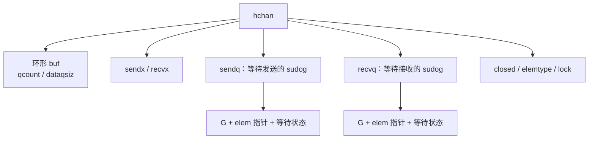
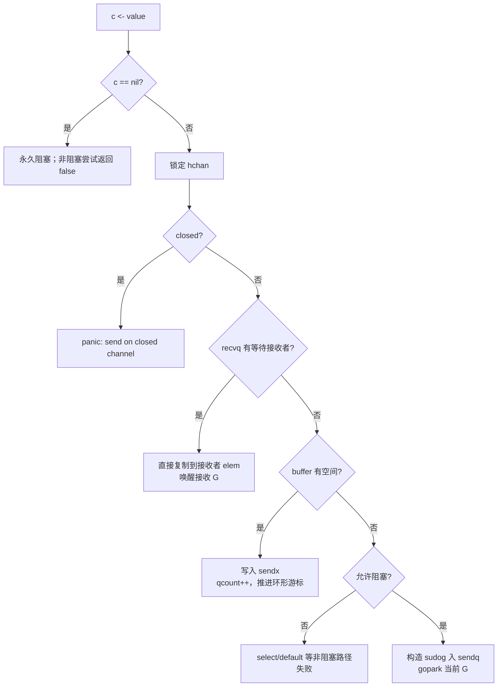
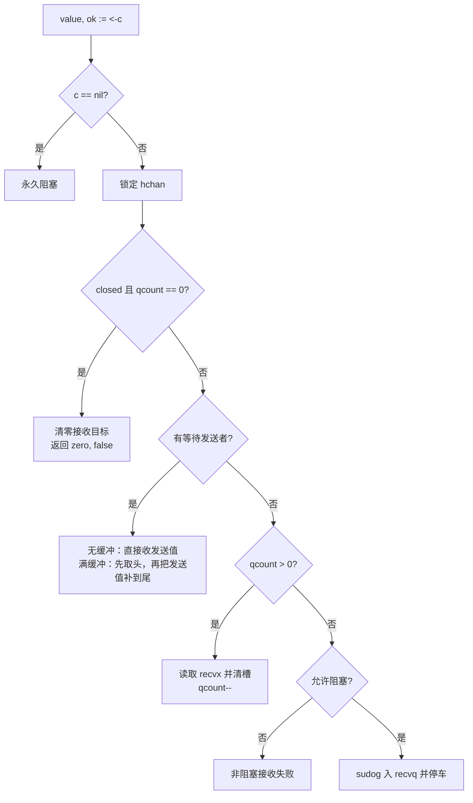
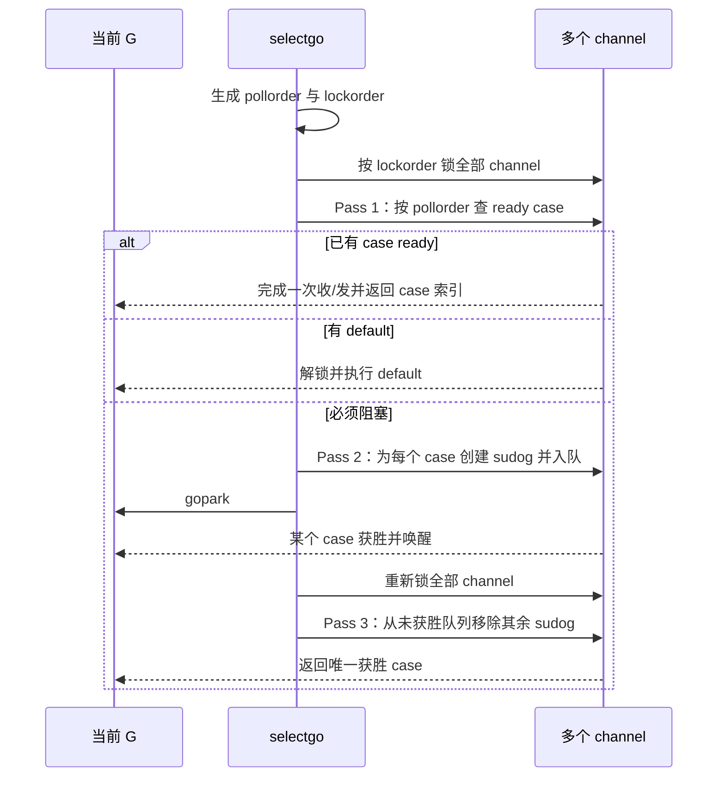

# 25 · channel、select 与 runtime semaphore：从协议到停车唤醒 ⭐⭐⭐

> 本章基于 Go 1.26.4。发送/接收/关闭、nil channel、内存模型同步关系属于语言与标准库契约；`hchan`、`sudog`、等待队列、Mutex 状态位和 semaphore treap 属于当前实现。

配套代码：[`go/code/33_channel_select_semaphore`](../code/33_channel_select_semaphore/)

## 1. channel 不是“带锁队列”这么简单

channel 同时承担三种职责：

1. **数据传递**：把一个类型化元素从发送方交给接收方。
2. **同步**：发送、接收和关闭建立 Go 内存模型规定的 happens-before 关系。
3. **调度协作**：条件不满足时把 G 停车，条件满足后再变为 runnable。

buffered channel 确实包含环形队列和锁，但无缓冲 channel 没有业务数据队列，核心是发送者/接收者 rendezvous。select 又要求一只 G 同时登记到多个 channel，并保证只有一个 case 获胜。因此只把 channel 看成 `Mutex + slice` 会漏掉大部分难点。

## 2. `hchan` 中每个字段解决什么问题

Go 1.26.4 的 `runtime/chan.go` 中，`hchan` 关键字段可分组理解：

| 类别 | 字段 | 作用 |
|---|---|---|
| 缓冲区 | `buf`、`dataqsiz`、`qcount` | 环形数组、容量、当前元素数 |
| 游标 | `sendx`、`recvx` | 下次写入/读取槽位 |
| 类型 | `elemtype`、`elemsize` | 类型化复制、清零和 GC 扫描 |
| 生命周期 | `closed` | 关闭状态，channel 不能重新打开 |
| 等待者 | `sendq`、`recvq` | 阻塞发送/接收的 sudog 队列 |
| 互斥 | `lock` | 保护 hchan 与相关 sudog 字段 |



### 2.1 runtime 维护的关键不变量

普通情况下 `sendq` 和 `recvq` 至少有一个为空；如果已经有等待接收者，新发送者应直接完成配对，而不是再去等待。无缓冲 channel 被同一个 select 同时收发是特殊例外。

对 buffered channel：

- `qcount > 0` 时，通常不应还有普通 recv waiter；已有元素就可以先满足接收者。
- `qcount < dataqsiz` 时，通常不应还有普通 send waiter；有空间就可以先写入。

这些不变量缩小了发送/接收的状态组合，也是源码快速分支成立的基础。

### 2.2 `make(chan T, n)` 如何分配

当前 runtime 会根据 element 是否含指针选择布局：

- 无缓冲或零大小元素：只需 hchan 主体/同步地址。
- element 不含指针：hchan 与 buffer 可以放在一块分配中，GC 无需扫描 buffer 内指针。
- element 含指针：hchan 与类型化 buffer 分开分配，让 GC 按 element 类型扫描。

这是性能实现细节，但给工程一个稳定启示：channel 中长期缓冲大量指针，会增加对象保留和 GC 扫描工作。

## 3. `sudog`：为什么它不是 goroutine 本身

G 表示整个 goroutine；`sudog` 表示 G 在某一个同步对象上的一次等待关系。它大致关联：

- 等待的 G；
- 对应 channel/信号量地址；
- 待发送或接收元素的地址；
- 等待队列链接；
- 是否来自 select、是否成功、profile 时间等。

同一只 G 在 select 中可能同时等待多个 channel，因此需要多个 sudog。一个 channel 也有许多等待 G，因此等待记录不能直接塞进 G 的单一字段。

`sudog.elem` 可能指向 G 的栈上变量。这就是上一章扩栈时必须与 channel 锁协作的原因：值正在被另一只 G 直接复制时，不能同时无保护地移动该栈地址。

## 4. 发送主线：直接交付、写 buffer 或停车

`chansend` 可以按优先级理解：



### 4.1 为什么有等待接收者时可以绕过 buffer

即便是 buffered channel，只要此时 buffer 为空且已经有接收者等待，发送方可以直接把 element 复制到接收者目标地址，无需先写 buffer 再读出。这减少一次内存中转。

直接复制完成后，runtime 先在锁保护下完成状态修改，再解锁并 `goready` 接收 G。唤醒不代表接收者已经执行，只代表它重新进入 runnable 状态。

### 4.2 buffer 写入为什么要类型化复制

元素可能包含指针，runtime 需要用 `typedmemmove` 等路径，让 GC 写屏障和类型布局正确生效。简单 `memcpy` 不能覆盖并发 GC 下所有要求。

### 4.3 阻塞发送怎样避免丢唤醒

发送 G 在持有 channel 锁时把 sudog 放入 `sendq`，随后由 `gopark` 的 commit 回调原子地完成解锁和停车交接。接收/关闭操作也在同一锁下检查队列，因此不会出现“条件已经满足，但 waiter 还没登记就睡死”的窗口。

这与 Cond、semaphore 的共同主题一致：**登记等待与释放保护锁必须形成不可丢失的协议。**

## 5. 接收主线：比发送多一个“关闭且已排空”状态

`chanrecv` 的主要分支：



### 5.1 满 buffer + 等待发送者的巧妙交换

当 buffer 已满，发送者在 `sendq` 等待；接收者到来时：

1. 接收者取得 `recvx` 位置的旧元素；
2. 直接把等待发送者的值写入同一槽；
3. 推进 `recvx`，并让 `sendx = recvx`；
4. 唤醒发送者。

整个过程保持 buffer 仍为满状态，却同时完成一次 receive 和一次被阻塞 send，避免先减计数再增计数的多余状态。

### 5.2 为什么读完要清空槽

若 element 含指针，已消费槽仍保存旧值会继续保留对象。`typedmemclr` 清除引用，既满足后续零值复用，也避免 GC 滞留。这与自制 slice 队列必须清零已出队元素完全相同。

## 6. close 的完整语义与所有权

`close(c)` 不是“发送一个特殊值”。它修改 channel 生命周期状态并唤醒两类等待者：

- 所有接收者：如果没有缓冲数据，返回零值和 `ok=false`；已有 buffer 仍先被正常读完。
- 所有发送者：被唤醒后发现发送失败并 panic。

其他边界：

- close nil channel 会 panic；
- 重复 close 会 panic；
- 接收关闭 channel 永远不会阻塞；
- 不能通过 `len(c)==0` 推导 channel 已关闭；
- 没有无竞态的通用 `isClosed(c)` 检查后再发送，因为状态可在检查后立刻变化。

### 6.1 谁应该关闭 channel

关闭权应属于能证明“以后不会再有发送”的协议拥有者，通常是：

- 唯一发送者；
- 管理全部发送 worker 的协调者，在 `Wait` 全部完成后关闭；
- 拥有整个流生命周期的上游组件。

接收者通常不知道其他发送者是否还会发送，所以“接收方关闭以通知不想收了”容易制造 send-on-closed。停止接收应使用 context、独立 done 信号或明确取消协议。

## 7. channel 在内存模型中的同步含义

channel 不只是“运行起来碰巧可见”。Go 内存模型规定了同步关系，常用三条：

1. 一次发送在对应接收完成之前同步发生。
2. 关闭 channel 在因关闭而返回零值的接收之前同步发生。
3. 对容量 C 的 channel，第 k 次接收在第 k+C 次发送完成之前同步发生；这使 buffered channel 可作为计数信号量建模。

例如：

```go
var result int
done := make(chan struct{})
go func() {
    result = 42
    close(done)
}()
<-done
fmt.Println(result) // close/receive 建立可见性
```

如果只是 `time.Sleep` 等待另一个 G “大概写完”，没有同步事件，仍是 data race。

## 8. nil channel 不是无用状态

对 nil channel：

- 直接发送永久阻塞；
- 直接接收永久阻塞；
- close 会 panic；
- select 会忽略对应 case，因为它永远不 ready。

最后一点很有用，可以动态控制状态机：

```go
var out chan<- Item
var next Item
if len(queue) > 0 {
    out = downstream
    next = queue[0]
}

select {
case item := <-input:
    queue = append(queue, item)
case out <- next: // queue 为空时 out=nil，此分支被禁用
    queue = queue[1:]
case <-ctx.Done():
    return ctx.Err()
}
```

这种写法比额外布尔判断更贴近 select 状态机，但要保证至少还有一个可能 ready 的退出 case，否则所有 case 为 nil 会永久阻塞。

## 9. select：为什么需要 poll order 和 lock order 两套顺序

编译器会把小型、可静态简化的 select 改写成普通收发/default；一般多 case select 进入 `runtime.selectgo`。

select 同时面对两个问题：

- 多个 ready case 不能永远偏爱源码最前面的 case；
- 一次操作可能需要锁多个 channel，所有 G 必须用一致顺序避免 ABBA 死锁。

因此 runtime 生成：

- **pollorder**：case 的随机排列，用于检查 ready，降低固定位置偏好。
- **lockorder**：按 channel 地址排序的稳定加锁顺序；同一 channel 的 case 只锁一次。

### 9.1 `selectgo` 的三遍流程



Pass 3 不能省略，否则 quiet channel 的等待队列会不断积累已经由别的 case 唤醒的废 sudog。

### 9.2 为什么随机轮询不等于严格公平

随机化只减少固定源码顺序偏好。规范不保证：

- 各 case 长期精确 50/50；
- 某 case 在 N 次内一定被选中；
- goroutine 调度与 channel waiter 严格 FIFO；
- 实时最大等待时间。

配套 `MeasureReadySelect` 只统计分布，测试只断言总次数正确，不断言固定比例。若业务需要权重、公平队列或优先级，必须显式建模。

## 10. runtime semaphore：它解决的是“不丢睡眠/唤醒”

`runtime/sema.go` 开头特别提醒：不要把它当作业务计数信号量，而应把它理解为 sync 原语竞争慢路径中的 sleep/wakeup 配对机制，即使 wake 发生在 sleep 之前也不能丢失。

### 10.1 快路径与慢路径

`semacquire`：

1. 原子检查计数，能减一就直接成功。
2. 失败后找到 semaphore 地址对应的 `semaRoot`。
3. 在 root 锁下先增加 waiter 数，再次检查计数，关闭 missed wakeup 窗口。
4. 仍失败才把 sudog 入队并 `goparkunlock`。

`semrelease`：

1. 先原子增加计数。
2. 若 `nwait==0`，直接返回。
3. 否则锁 root，找到该地址的 waiter 并出队。
4. 解锁后 `goready`；饥饿 handoff 模式下还可把 ticket 和剩余时间片直接交给 waiter。

### 10.2 为什么有 251 个 root 和 treap

每个同步对象单独分配内核 semaphore 会很贵。当前 runtime 把地址哈希到 251 个 `semaRoot`：

- 顶层 treap 按不同 semaphore 地址组织等待者，查找约 O(log n)；
- 同一地址的多个 waiter 再组成 O(1) 操作的链；
- cache-line padding 降低相邻 root 假共享。

251 和 treap 是实现细节。应记住的是：runtime 用共享等待表把大量用户态同步地址映射到 goroutine 停车队列。

### 10.3 Go semaphore 与 futex 的关系

Go semaphore 排队/唤醒的是 G；Linux futex 最底层让 OS 线程在某个内存字上睡眠。大多数 Mutex 竞争只需停车 G，M 可以运行其他 G；当整个 M 没有工作或 runtime 内部锁等待时，平台实现才可能使用 futex 等内核原语。

所以二者目标相似但层次不同，不能说 `sync.Mutex` “就是一个 futex”。Windows 和 macOS 也有完全不同的底层线程等待机制。

## 11. `sync.Mutex`：正常模式与饥饿模式的权衡

当前 Mutex 只有 `state int32` 与 `sema uint32` 两个核心字段。state 编码 locked、woken、starving 和 waiter 数。

### 11.1 fast path

无竞争时，`Lock` 用一次 CAS 把 0 改成 locked；`Unlock` 原子清 locked。它们可以被内联，不进入 runtime semaphore。

### 11.2 normal mode

被唤醒 waiter 与刚到达且已经在 CPU 上运行的新 G 竞争锁。新 G 可能更容易赢，这通常吞吐更好，也允许短临界区快速复用缓存。

### 11.3 starvation mode

当前实现中，waiter 超过约 1 ms 仍未取得锁，会推动 Mutex 进入 starvation 模式：

- 新到 G 不再抢占，也不自旋，排到队尾；
- Unlock 把所有权直接 handoff 给队头 waiter；
- waiter 在等待时间变短或成为最后一个 waiter 时退出饥饿模式。

1 ms 是 Go 1.26.4 当前常数，不是 SLA。设计目标是用略低吞吐换取极端竞争下更好的尾延迟和无界饥饿防护。

## 12. RWMutex、Cond 与 WaitGroup 的共同底座

### 12.1 RWMutex

RWMutex 用原子读者计数和两个 semaphore 协调：写者到来后阻止新读者进入，等待已有读者离开；读者则在写者持有/等待的协议下停车。它不适合所有“读多写少”：

- 临界区极短时，额外状态可能不如 Mutex；
- 长读锁会显著推迟写者；
- 不能从 RLock 安全升级为 Lock；
- 仍需 Benchmark 和 mutex profile。

### 12.2 Cond

Cond 表达“受同一 Locker 保护的 predicate 发生变化”。标准用法：

```go
c.L.Lock()
for !condition() {
    c.Wait()
}
consume()
c.L.Unlock()
```

`Wait` 会原子地加入 notify list、释放 Locker、停车；被 Signal/Broadcast 唤醒后重新取得 Locker再返回。

必须用 `for`，不只是因为底层可能有“虚假唤醒”。更实际的原因是：Signal 只表示状态可能改变；轮到当前 waiter 重新拿锁时，条件可能已被另一个 waiter 消费，或者多个状态变化合并成一次通知。

Signal 不要求调用方持锁，但修改 predicate 必须受锁保护；通常在锁内修改并决定通知，才能让协议更易审计。

### 12.3 WaitGroup

Go 1.26.4 当前 WaitGroup 把 task counter 与 waiter count 压在一个原子状态中，计数归零时通过 runtime semaphore 唤醒所有 Wait。

正确规则：

- 正计数的 `Add` 通常必须发生在启动 goroutine 之前，避免 Wait 已看到 0。
- 计数不能减成负数。
- 上一轮所有 Wait 返回后才能开始下一轮从 0 增加。
- 首次使用后不能复制。
- 新版可优先用 `WaitGroup.Go(f)` 组合 Add/go/Done；其契约要求 `f` 不得 panic。

WaitGroup 只表示“任务完成”，不传播 error、结果或取消。需要结构化错误传播时应结合 context 和明确结果通道/错误组。

## 13. 配套 `CondQueue` 的协议审计

[`concurrency.go`](../code/33_channel_select_semaphore/concurrency.go) 的 `CondQueue` 展示了一个正确的 predicate 循环：

```text
predicate = 队列非空 OR 已关闭
```

### 13.1 Push

1. 加锁；2. 检查 closed；3. append；4. Signal 一个消费者；5. 解锁。

Signal 一个即可，因为一次 Push 只新增一个 item；即便唤醒后调度延迟，其他 Push 还会继续 Signal。

### 13.2 Pop

1. 加锁。
2. `for empty && !closed { Wait() }`。
3. empty 且 closed：返回零值/false。
4. 否则取 item，清零已消费槽，推进 head。
5. 全部消费后释放 backing array；head 很大时压缩，避免无界前缀滞留。

这里同时演示同步正确性与 GC 生命周期正确性。只移动 head 而不清零，会让队列底层数组继续引用已消费对象。

### 13.3 Close

Close 在锁内把 closed 设为 true，再 Broadcast 唤醒全部消费者。消费者会先 drain 已有 item，最后返回 false；后续 Push 返回 `ErrQueueClosed`，而不是 panic。

这是自定义 API 的选择，与 channel close 后发送 panic 不同。协议优劣要根据调用边界决定，但必须写清楚并测试。

## 14. 如何选择 channel、Mutex、Cond 与 atomic

| 问题形态 | 首选倾向 | 原因 |
|---|---|---|
| 任务/数据所有权在 goroutine 间转移 | channel | 协议、背压和生命周期可一起表达 |
| 短临界区保护多个字段不变量 | Mutex | 直接、开销低、易维护原子性 |
| 大量 waiter 等待复杂 predicate | Cond | 在同一锁下反复检查条件，避免轮询 |
| 单个独立计数/标志且内存顺序明确 | atomic | 避免锁，但组合不变量很难 |
| 等待一组任务结束 | WaitGroup | 明确计数完成语义，不传数据 |
| 限制并发槽位 | buffered channel 或专用 limiter | 获取/释放 token 可表达容量 |

“用 channel，不要用锁”不是 Go 的规则。错误 channel 协议可能比一个 Mutex 更难证明、更多 goroutine 泄漏。

## 15. 诊断竞争与阻塞

```powershell
cd go/code

go test -race ./33_channel_select_semaphore
go test ./33_channel_select_semaphore -run '^$' -bench '.' -benchmem -count=5
go run ./33_channel_select_semaphore -iterations=100000

# 在真实服务/测试上采集阻塞和锁竞争
go test -blockprofile $env:TEMP\block.out -mutexprofile $env:TEMP\mutex.out ./...
go tool pprof -http=:0 $env:TEMP\block.out
go tool pprof -http=:0 $env:TEMP\mutex.out
```

- race detector 找未同步的内存访问，不证明业务无死锁。
- block profile 采样 channel、select、Cond 等阻塞时间。
- mutex profile 重点归因锁竞争造成的等待。
- goroutine profile 看到当前谁还在等待，适合泄漏快照。
- trace 展示什么时候 park、谁 unblock、G 等了多久。

测试并发协议应断言消息不丢、关闭能收敛、超时可退出、无 send-on-closed，而不是用 `time.Sleep` 猜执行顺序。

## 16. 高频面试题：把 fast path 和阻塞协议都讲清楚

### Q1. 无缓冲 channel 怎样传值？

发送方与接收方必须 rendezvous。后到的一方在 hchan 锁下从对方等待队列取出 sudog，把 element 直接从发送方地址复制到接收方目标地址，再唤醒对方；没有持久业务 buffer。

### Q2. buffered channel 满时，发送者发生什么？

若没有等待接收者且 buffer 无空位，阻塞发送会创建 sudog 入 sendq，然后 gopark 当前 G。后续接收者取走一个值时，可以把该发送者的值直接补到腾出的槽并唤醒它。

### Q3. close 后为什么还能读到值？

close 只禁止后续发送并标记生命周期结束，不丢弃已缓冲元素。接收先 drain buffer，只有关闭且 buffer 为空时才持续返回零值和 `ok=false`。

### Q4. 为什么通常由发送方关闭？

关闭需要证明未来不会再发送。发送协议拥有者通常掌握所有 producer 的生命周期；单个接收者一般无法证明其他 producer 已结束。多发送者场景应由协调者等待全部结束后关闭。

### Q5. sudog 与 G 有什么区别？

G 是 goroutine 的完整执行状态；sudog 是它在某个同步对象上的一次等待记录。select 可让一个 G 同时拥有多个 sudog，分别挂在多个 channel 队列，最终只保留获胜者。

### Q6. select 内部为什么要给 channel 排序？

一个 select 要同时检查/登记多个 channel，必须锁住它们的一致快照。若不同 G 按源码顺序加锁，可能形成 ABBA 死锁；按 channel 地址构造统一 lockorder 可避免。另有随机 pollorder 用来降低固定 case 偏好。

### Q7. select 是公平的吗？

当多个 case 同时 ready 时，当前实现用伪随机 pollorder 选择，避免总选第一个；但语言不承诺严格公平、比例或最大等待时间。需要公平/优先级时要在业务层显式排队。

### Q8. `gopark` 为什么不会丢掉刚发生的唤醒？

waiter 在同步对象锁下登记，park commit 与解锁形成原子交接；唤醒方也在同一保护协议下检查/出队。semaphore 则先登记 waiter、再复查计数，覆盖 wake 早于 sleep 的竞态窗口。

### Q9. Go runtime semaphore 等于 Linux futex 吗？

不等于。runtime semaphore 管理 goroutine 层的等待地址和 sudog，Linux futex 是 OS 线程睡眠原语。Go 在更底层需要睡眠 M 时可能使用 futex，但 channel/Mutex waiter 首先是 G。

### Q10. Mutex 为什么需要饥饿模式？

正常模式允许已在 CPU 上的新 G 抢赢刚唤醒 waiter，吞吐好但极端情况下老 waiter 反复失败。超过当前阈值后进入 starvation，Unlock 直接 handoff 队头，用一些吞吐换有界尾部等待倾向。

### Q11. Cond 为什么必须在 for 中 Wait？

通知只表示 predicate 可能变化。Wait 返回并重新取得锁前，另一个 waiter 可能已消费资源；Broadcast 也会让多个 waiter 为少量资源竞争。重新检查 predicate 才是正确性依据。

### Q12. channel 可以替代所有锁吗？

不能。channel 擅长所有权转移、流和背压；多个字段的短共享不变量用 Mutex 更直接。强行引入 owner goroutine 可能增加排队、上下文切换和关闭复杂度。选择依据是问题模型和证据，不是口号。

## 17. 源码阅读路线

1. `runtime/chan.go` 文件头不变量与 `hchan`。
2. `runtime/chan.go`：`makechan` → `chansend`/`send` → `chanrecv`/`recv` → `closechan`。
3. `runtime/runtime2.go`：`sudog`、`g.waiting`、channel 栈指针相关字段。
4. `runtime/select.go`：`selectgo` 的 pollorder、lockorder 和三遍流程。
5. `runtime/sema.go`：`semacquire1`、`semrelease1`、`semaRoot.queue/dequeue`、notify list。
6. `internal/sync/mutex.go`：Mutex fast/slow path 与 starvation handoff。
7. `sync/rwmutex.go`、`sync/cond.go`、`sync/waitgroup.go`：标准库状态机。
8. Go Memory Model：channel 与锁的 synchronizes-before 规则。

## 18. 进阶练习

1. 给 `CondQueue` 增加有界容量，再添加 `notFull` predicate，证明生产/消费不会丢唤醒。
2. 故意把 `Pop` 的 for 改成 if，用多个消费者构造失败测试，再恢复正确实现。
3. 给 channel 发送 1 MiB 值与发送 `*Value` 做对照，比较复制、GC 与共享可变性成本。
4. 实现多 producer 协调关闭：每个 producer 不关 channel，由 coordinator 等 WaitGroup 后关闭。
5. 用 trace 查找一次阻塞 send 的 park/unblock 配对，并定位唤醒它的 receive。
6. 分别用 Mutex 和单 owner goroutine 保护计数器，在低/高竞争下比较吞吐与 P99。

## 本章总结

channel、select、Mutex、Cond 最终都在解决同一个底层难题：条件不满足时怎样安全登记 waiter、停车 G，并在状态变化后不丢失地唤醒。但它们表达的上层协议不同。掌握 `hchan` 的直接交付/环形 buffer/等待队列、select 的三遍登记清理、semaphore 的防丢唤醒，以及 Mutex 的正常/饥饿权衡，才能既回答源码面试题，也能写出可关闭、可诊断、无泄漏的并发程序。
