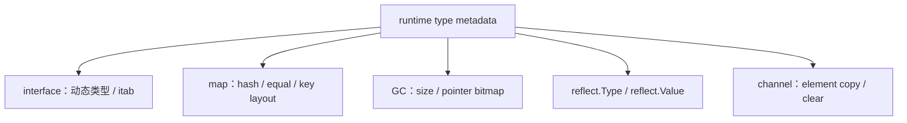
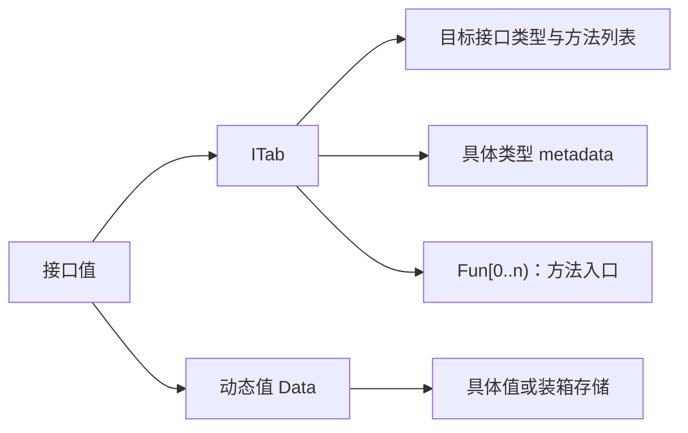
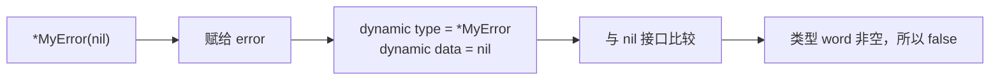
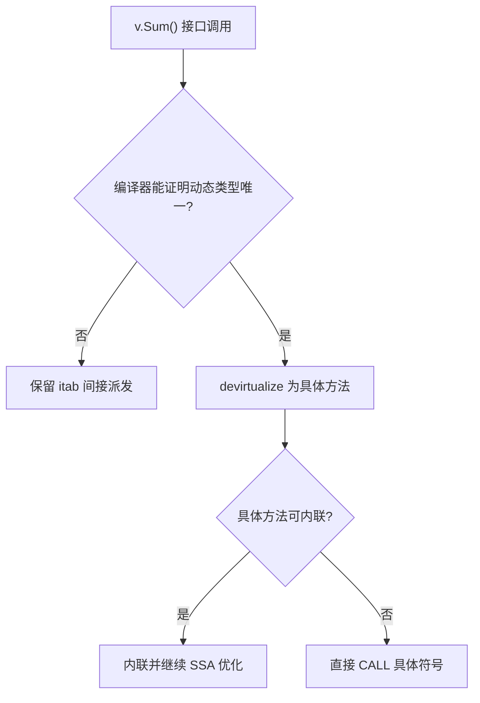
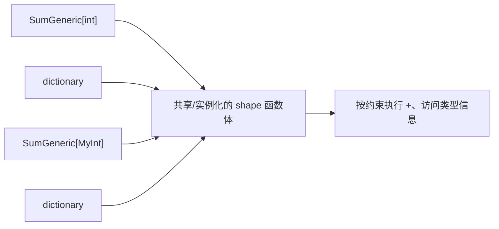
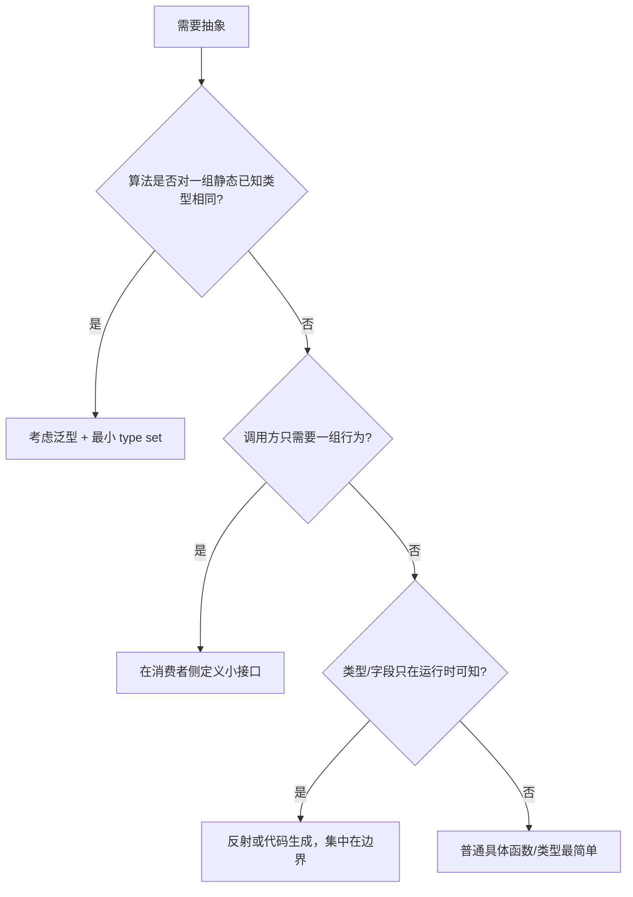

# 26 · interface、泛型与 runtime 类型系统：装箱、itab、shape 和反射 ⭐⭐⭐

> 本章以 Go 1.26.4 为实现基线。接口满足关系、类型断言、type set 与泛型语义由语言规范保证；`abi.EmptyInterface`、`ITab`、shape、dictionary、去虚拟化和符号命名属于当前编译器/runtime 实现。

配套代码：[`go/code/34_interface_generics_runtime`](../code/34_interface_generics_runtime/)

## 1. 三种抽象解决的不是同一个问题

先用一句准确的边界区分 interface、generics 和 reflection：

| 机制 | 类型信息主要在哪个阶段 | 擅长解决 | 主要代价/风险 |
|---|---|---|---|
| interface | 编译期检查满足，运行时携带动态类型 | 行为多态、解耦调用方与实现 | 装箱、动态派发、typed nil、宽接口 |
| generics | 编译期 type set 约束与实例化 | 同一算法覆盖一组静态已知类型 | API/约束复杂度、实例代码和字典 |
| reflection | 运行时读取/操作类型和值 | schema 未知、序列化、框架边界 | 运行时检查、panic 边界、优化空间小 |

它们可以组合，但不能互相完全替代：

- 泛型不能在编译时处理“运行到这里才知道有哪些字段”的任意 schema。
- 反射能写出通用代码，却不能提供泛型那样的静态运算约束和 IDE 类型提示。
- interface 表达方法行为，不适合直接表达 `~int | ~int64` 这类运算 type set。

## 2. 先理解 runtime 类型元数据

程序中的每个运行时类型都有一份类型描述。Go 1.26.4 的 `internal/abi.Type`/runtime `_type` 记录或关联：

- size、alignment、kind；
- 指针数据范围与 GC bitmap；
- hash、比较函数；
- 名称、包路径和方法信息；
- 构造 slice/map/chan/function 等复合类型所需的额外描述。

编译器、runtime、reflect 和 GC 都会使用这套元数据：



因此 interface 并不是在运行时“通过字符串方法名查函数”。编译器和 runtime 使用结构化、可缓存的类型与方法元数据。

## 3. 空接口值：动态类型与动态数据

空接口 `any` 没有方法要求。当前实现可概念化为两个机器字：

```go
type EmptyInterface struct {
    Type *Type
    Data unsafe.Pointer
}
```

不要把它当成可 `unsafe` 固化的公开 struct；正确的心智模型是：

```text
interface value = (dynamic type, dynamic value)
```

例如：

```go
var x any = int64(42)
```

- 静态类型：`any`
- 动态类型：`int64`
- 动态值：`42`

Data word 有时指向一份装箱存储，有些 direct-interface 类型可直接编码在该 word 中；小整数等转换还可能复用 runtime 静态区。具体路径由类型 flag、架构和编译器决定，不能简单说“接口一定分配”或“8 字节以内一定直接存”。

## 4. 非空接口：`ITab` 把具体类型接到接口方法集

对包含方法的接口，当前概念布局是：

```go
type Interface struct {
    Tab  *ITab
    Data unsafe.Pointer
}
```

ITab 关联：

- 目标接口类型；
- 具体动态类型；
- type switch 用 hash；
- 按接口方法顺序排列的函数入口数组。



### 4.1 `getitab` 怎样建立方法映射

当需要把具体类型 T 转成接口 I 时，runtime/链接器必须确认 T 的方法集满足 I，并得到方法入口：

1. 用接口类型与具体类型的 hash 查全局 itab table；常见命中路径可无锁读取。
2. 未命中时加锁再检查，避免重复创建。
3. `itabInit` 同步遍历按名称排序的接口方法和具体方法，匹配名称、签名与包可见性。
4. 成功时填入 `Fun`；失败时 `Fun[0]==0`，可作为负结果缓存。
5. 一结果断言失败会构造包含缺失方法信息的 `TypeAssertionError`；逗号 ok 路径返回失败而不 panic。

全局 itab table 当前使用开放寻址和增长，但这只是缓存实现。业务要记住的是：接口满足关系在编译期能确定时由编译器验证，动态断言时 runtime 仍可能需要查表和缓存。

## 5. typed nil：必须同时看类型和数据

接口只有在动态类型和动态数据都为空时才等于 nil：

```text
(nil, nil)          == nil
(*MyError, nil)     != nil
([]byte, nil)       != nil
```

典型 bug：

```go
type MyError struct{}
func (*MyError) Error() string { return "failed" }

func work() error {
    var err *MyError
    return err // 转成 error 后动态类型是 *MyError
}

fmt.Println(work() == nil) // false
```



最稳妥的 API 规则是：成功时直接 `return nil`，不要先构造一个 typed-nil 指针再返回接口。

### 5.1 怎样通用判断 typed nil

配套 `IsTypedNil` 先判断接口本身是否 nil，再只对 Chan、Func、Interface、Map、Pointer、Slice 调用 `reflect.Value.IsNil`。这是必要的，因为：

- `ValueOf(nil)` 得到 Invalid Value，直接 IsNil 会 panic；
- int、string、struct 等 kind 不支持 IsNil；
- “零值”不等于“nil 值”。

通用 typed-nil 判断主要适合框架边界。业务代码若频繁需要它，通常意味着接口返回契约不够清晰。

## 6. 接口装箱：什么时候复制、什么时候分配

把具体值赋给接口需要形成一份足够长寿命的动态值。runtime 有 `convT`、`convTnoptr`、`convT16/32/64`、`convTstring` 等多条转换路径。

可能出现：

- 值直接放入接口 data word（类型允许 direct iface）；
- 指向已有对象；
- 把值复制到新分配的装箱对象；
- 复用只读静态小值；
- 编译器内联/逃逸分析后完全消除某些通用转换。

所以这些结论都不可靠：

- “接口永远两次指针间接访问”；
- “赋给 interface 必然堆分配”；
- “小值永远不分配”。

判断当前代码应使用：

```powershell
go build -gcflags='-m=2' ./34_interface_generics_runtime
go test ./34_interface_generics_runtime -run '^$' -bench '.' -benchmem
```

接口导致的真正成本可能来自装箱分配、动态方法调用阻止内联、动态 hash/equal、缓存局部性，而不是某个固定纳秒常数。

## 7. 动态派发与去虚拟化

调用：

```go
func SumViaInterface(v IntSummer) int { return v.Sum() }
```

在真正动态的情况下，runtime/生成代码通过 itab 的方法槽找到入口，并把 data 作为 receiver 传入。这是间接调用，编译器通常难以内联未知目标。

但如果调用点能证明动态类型只有 `IntValues`，编译器可能：

1. 去虚拟化为 `IntValues.Sum` 具体调用；
2. 进一步内联方法；
3. 消除临时接口和装箱；
4. 对循环继续做 bounds-check elimination 等优化。



这也是 microbenchmark 容易误导的原因：基准写得太简单时，编译器可能已经知道所有动态类型，测到的是优化后的具体调用，而不是生产中的真实接口边界。

## 8. 方法集：为什么 `T` 和 `*T` 满足的接口可能不同

方法集规则的核心：

- `T` 的方法集包含 receiver 为 `T` 的方法。
- `*T` 的方法集包含 receiver 为 `T` 和 `*T` 的方法。

编译器有时能对可寻址值自动取地址调用指针 receiver 方法：

```go
v.Method() // 语法可被改写成 (&v).Method()
```

但接口满足关系看方法集，不会因为“某处可自动取地址”就把 `T` 当成实现了只在 `*T` 上的方法接口。

为什么这样设计？指针 receiver 可能需要修改对象或依赖身份，接口中保存一个 T 值副本时无法保证可寻址与原对象身份。

工程上要避免为了“值和指针都满足”机械复制方法。先决定类型语义是值对象还是有身份的可变对象，再一致选择 receiver。

## 9. 类型断言、type switch 与缓存

### 9.1 断言不是字符串比较

```go
v, ok := x.(Target)
```

主要判断动态类型是否与 Target 相同，或是否满足 Target interface。失败路径：

- 两结果形式返回零值、false；
- 单结果形式 panic `TypeAssertionError`。

interface-to-interface 断言可能需要 `getitab`；concrete 断言可比较类型指针并复制/取出数据。

### 9.2 type switch

type switch 为多个候选目标生成分派逻辑。Go 1.26.4 在支持的平台还可能维护 interface switch/type assertion cache，让后续相同动态类型不必重复走完整 runtime 慢路径。

缓存更新是优化，不改变语义；不能依赖“第一次慢、以后一定 O(1)”写 SLA。

### 9.3 接口比较的 panic 边界

两个接口可比较时：

1. 动态类型不同：不相等。
2. 动态类型相同：用该动态类型 equal 比较动态值。
3. 若动态类型本身不可比较（如 slice、map、func），比较会 panic。

```go
var a any = []int{1}
var b any = []int{1}
_ = a == b // panic: comparing uncomparable type []int
```

接口类型在语法上可比较，不代表它可能承载的所有动态值都能安全比较。

## 10. 泛型的第一层：type set 是编译期规则

配套约束：

```go
type Signed interface {
    ~int | ~int8 | ~int16 | ~int32 | ~int64
}
```

含义：

- `|` 是类型并集；
- `~int` 包含底层类型为 int 的所有定义类型；
- `T Signed` 让函数体可以使用所有集合成员共同支持的操作，例如 `+`；
- 这种包含类型项的非 basic interface 主要用作 constraint，不能像普通行为接口那样随意作为运行时变量类型。

泛型不是把所有类型都擦成 `any` 再反射。编译器在实例化点知道 T 必须来自 type set，能静态检查运算和返回类型。

## 11. 泛型的第二层：当前 shape + dictionary 实现

语言只规定实例化后的行为，不规定生成机器码的方式。理论上编译器可以：

- 为每个具体类型完整复制一份代码（monomorphization/stenciling）；
- 做类型擦除，所有操作走运行时字典；
- 采用混合策略。

Go 当前实现大体采用 **shape 代码共享 + dictionary**：

- 表示/指针形态相近的一组类型可共享一个 shape 版本的函数体；
- 调用点传入 dictionary，提供类型大小、运算、方法、转换等实例信息；
- 某些操作仍能被静态化、内联或生成包装器；
- 不同底层表示可能产生不同 shape 代码。



这张图是理解模型，不是符号级 ABI 承诺。`go.shape.*`、`.dict.*` 等符号命名和共享粒度都可能变化。

### 11.1 为什么泛型不保证一定比 interface 快

泛型通常带来更好的静态类型信息，但性能取决于：

- shape 代码是否需要 dictionary 间接操作；
- 函数是否内联；
- 约束方法调用是否能静态解析；
- interface 路径是否已被去虚拟化；
- 数据布局、边界检查和向量化机会；
- 实例代码带来的 instruction cache 压力。

“泛型零成本”“泛型一定字典慢”都过度概括。配套四种 Sum 路径就是用同一语义做证据对照。

## 12. `comparable` 的两个层次

`comparable` 约束允许使用 `==`/`!=`，也常用于 map key。需要区分：

- **严格可比较的具体类型**：比较不会因动态内容 panic。
- **接口类型满足 comparable 约束后的动态值**：接口自身语法可比较，但动态值仍可能触发运行时不可比较 panic，具体规则随 Go 版本演进过。

写通用容器时，最好让 key 类型明确 `comparable`，但若 K 本身可能是 interface，仍要理解动态值边界。

## 13. reflection：Type 与 Value 是两套问题

- `reflect.Type` 描述类型：Kind、字段、方法、size、assignability 等。
- `reflect.Value` 描述一个运行时值及其可操作性：是否有效、是否可设置、是否可取接口、是否为 nil。

### 13.1 安全反射检查顺序

通用代码应按顺序缩小状态空间：

1. `ValueOf(input)` 后先 `IsValid`。
2. 检查 `Kind` 或精确 `Type`。
3. 仅对支持的 kind 调用 `IsNil`、`Elem`、`Len`、`Int` 等。
4. 修改前检查 `CanSet`；转回接口前考虑 `CanInterface`。
5. 对 slice/array/map 做长度和 key/value 类型检查。
6. 把 panic 边界转换成明确 error，而不是让用户输入击穿进程。

配套 `SumViaReflect` 只接受 slice/array，随后确认 element kind 在有符号整数范围，才逐项调用 `Int`。它拒绝 `[]uint`，因为把无符号大值塞入 int64 可能改变语义。

### 13.2 `Kind` 相同不等于 Type 相同

`type UserID int64` 与 `int64` 的 Kind 都是 Int64，但它们是不同定义类型。框架若需要保留业务类型身份，不能只检查 Kind；反之若只关心底层可执行操作，Kind/type set 可能足够。

## 14. 配套四条求和路径如何比较

[`dispatch.go`](../code/34_interface_generics_runtime/dispatch.go) 提供：

1. `SumConcrete([]int)`：完全具体。
2. `SumGeneric[T Signed]([]T)`：编译期 type set。
3. `SumViaInterface(IntSummer)`：行为接口，方法内部再具体求和。
4. `SumViaReflect(any)`：运行时检查 slice/array 与 element kind。

`CallConcrete/Generic/Interface/Reflect` 使用 `//go:noinline` 作为观察锚点，但被调函数内部仍可能内联或去虚拟化。建议组合工具：

```powershell
cd go/code

go test ./34_interface_generics_runtime
go test ./34_interface_generics_runtime -run '^$' -bench '.' -benchmem -count=5
go build -gcflags='-m=2' ./34_interface_generics_runtime

go build -o $env:TEMP\dispatch.exe ./34_interface_generics_runtime
go tool nm $env:TEMP\dispatch.exe | Select-String 'CallConcrete|CallGeneric|CallInterface|CallReflect|dict|shape'
go tool objdump -s 'main\.CallInterface' $env:TEMP\dispatch.exe
Remove-Item -LiteralPath $env:TEMP\dispatch.exe
```

### 14.1 怎样避免错误 Benchmark

- 四条路径必须做相同业务工作；反射路径若多做校验，差值包含校验成本，这是合理但要说明。
- 输入在 benchmark 外准备，避免把构造分配算入某一路。
- 结果写入包级 sink 或保证可观察，防止整段被消除。
- 同时看 `allocs/op`、`-m=2` 和 objdump，不只看 ns/op。
- production 接口可能有多个动态类型，microbenchmark 只有一个类型时更容易被去虚拟化。

## 15. API 设计决策



实践原则：

- 能用具体类型解决时，不为“未来可能复用”过早抽象。
- 接口定义在消费者侧，保持一到几个真正需要的方法。
- 泛型约束只暴露算法需要的操作，不把所有类型塞入巨大 union。
- 反射集中到序列化/框架边界，内部尽快转换成具体类型。
- 不在公共 API 中无意义传播 `any`，否则静态类型信息会在系统各层丢失。

## 16. 常见误区

### 误区一：interface 就是两个指针，所以复制永远只有 16 字节

接口头可能是两个 word，但动态值可能需要额外装箱、复制或保留大对象；方法调用和 GC 成本也不在头部大小里。

### 误区二：typed nil 是 Go bug

这是 `(dynamic type, dynamic value)` 模型的直接结果。保留动态类型，才能知道该调用哪个方法、怎样格式化和反射。

### 误区三：泛型会为每种类型复制完整代码

当前编译器会使用 shape/dictionary 等混合策略；具体共享和实例化粒度会变化。要看当前构建符号，而不是套 C++ 模板结论。

### 误区四：interface 一定比泛型慢

接口可能被去虚拟化并内联；泛型也可能需要字典间接操作。真实差异由调用上下文和优化决定。

### 误区五：reflect 慢，所以绝对不能用

反射在运行时未知 schema 的边界是合适工具。问题是把它放进每元素热循环、缺少类型检查或让 panic 泄漏，而不是反射本身“禁止使用”。

## 17. 高频面试题：兼顾语义与实现

### Q1. 空接口和非空接口在当前实现上有什么区别？

空接口概念上保存动态类型与动态数据；非空接口的第一个 word 指向 ITab，ITab 同时关联目标接口、具体类型和方法入口。二者语义上都携带动态类型和值，但行为接口还需要方法映射。

### Q2. typed nil 为什么不等于 nil？

`(*T)(nil)` 装入接口后，动态类型是 `*T`，只有动态数据为空；nil 接口要求类型和值都为空。比较先看到类型 word 非空，因此结果为 false。

### Q3. ITab 解决什么问题？

它缓存“具体类型 T 如何满足接口 I”，包括两类类型元数据和按接口方法顺序排列的入口。调用方无需每次按名称搜索方法；失败满足关系也可缓存，避免重复做完整匹配。

### Q4. 接口装箱一定会分配吗？

不一定。取决于动态值的表示、生命周期、是否 direct iface、是否已有地址、编译器内联和逃逸分析。用 `-m=2` 和 `allocs/op` 判断具体调用点。

### Q5. 接口调用一定是间接调用吗？

语言语义允许动态类型变化；若编译器无法证明目标，就通过 ITab 间接派发。若调用点能证明唯一动态类型，可以去虚拟化成直接调用并进一步内联。

### Q6. `T` 和 `*T` 为什么可能只有后者实现接口？

`T` 的方法集不含只定义在 `*T` 上的方法，`*T` 的方法集同时含值/指针 receiver 方法。接口满足看方法集，不采用普通调用语法中的自动取地址便利。

### Q7. 泛型一定为每种实例生成一份机器码吗？

不一定。Go 当前让表示相近的实例共享 shape 函数体，并通过 dictionary 提供类型相关操作；部分实例仍可能生成不同代码或包装器。语言不保证实现策略。

### Q8. shape 和 dictionary 分别是什么？

shape 是编译器用于共享一类底层表示的内部类型形态；dictionary 是实例调用时携带的类型操作/元数据集合。二者都是编译器实现，不应通过 linkname 或符号名构造业务依赖。

### Q9. 泛型能完全替代反射吗？

不能。泛型要求调用点在编译期有满足约束的静态类型；反射用于运行时才知道类型、字段或 schema 的场景。代码生成是二者之外的另一种边界方案。

### Q10. 为什么接口比较可能 panic？

接口比较在动态类型相同时需要比较动态值。如果动态类型是 slice、map、func 等不可比较类型，无法完成相等运算，因此 panic。接口头可比较不代表所有动态内容可比较。

### Q11. `reflect.Value.IsNil` 为什么不能随便调用？

只有 Chan、Func、Interface、Map、Pointer、Slice 支持 nil；Invalid Value 或 int/struct 等其他 kind 调用会 panic。通用反射代码必须先 IsValid，再检查 Kind。

### Q12. 怎样选择 concrete、generic、interface、reflect？

具体类型最简单时优先具体函数；一套算法覆盖静态类型集用泛型；调用方依赖小行为集合用接口；运行时未知 schema 用反射/代码生成。最后用 API 清晰度、编译结果和真实 profile 验证，而不是只看抽象“高级程度”。

## 18. 源码阅读路线

1. `internal/abi/type.go`：`Type`、`Kind`、`InterfaceType`、方法元数据。
2. `internal/abi/iface.go`：`ITab`、`EmptyInterface`。
3. `runtime/runtime2.go`：runtime 使用的 `iface/eface` 视图。
4. `runtime/iface.go`：`getitab`、`itabInit`、conv/assert/switch cache。
5. `reflect/type.go`、`reflect/value.go`：公开反射 API 如何桥接 runtime 类型。
6. `cmd/compile/internal/noder`、`types2`：泛型类型检查、实例化和 dictionary 构造。
7. `cmd/compile/internal/ssa`：接口去虚拟化、内联和后续优化。
8. `cmd/link`：方法可达性、wrapper 和最终符号处理。

## 19. 进阶练习

1. 让接口调用点接收两种动态类型，比较单类型与多类型时 `-m=2`/objdump 的去虚拟化差异。
2. 分别把小 int、大 struct、指针和 string 装入 `any`，用 Benchmark 检查 allocs，而不是猜 data word 布局。
3. 给 `SumGeneric` 增加自定义定义类型 `type Score int64`，验证 `~int64` 的意义。
4. 写一个只允许精确 `int64`、不允许定义类型的约束，对比 `~` 的 API 差异。
5. 构造接口中装 slice 的比较 panic，并在公共边界改成显式类型检查。
6. 用反射实现同一求和，但把每次 Kind 检查移到循环外，比较边界检查设计对性能的影响。

## 本章总结

interface 的核心是 `(dynamic type, dynamic value)` 与 ITab 行为映射；泛型的核心是编译期 type set，并由当前 shape/dictionary 策略落成机器码；反射则把 runtime 类型元数据暴露成受检查的 Type/Value API。真正精通不是背“接口两个 word、泛型零成本”，而是能解释装箱、typed nil、方法集、断言缓存、去虚拟化与字典，并用编译器输出和 Benchmark 判断具体代码走了哪条路径。
