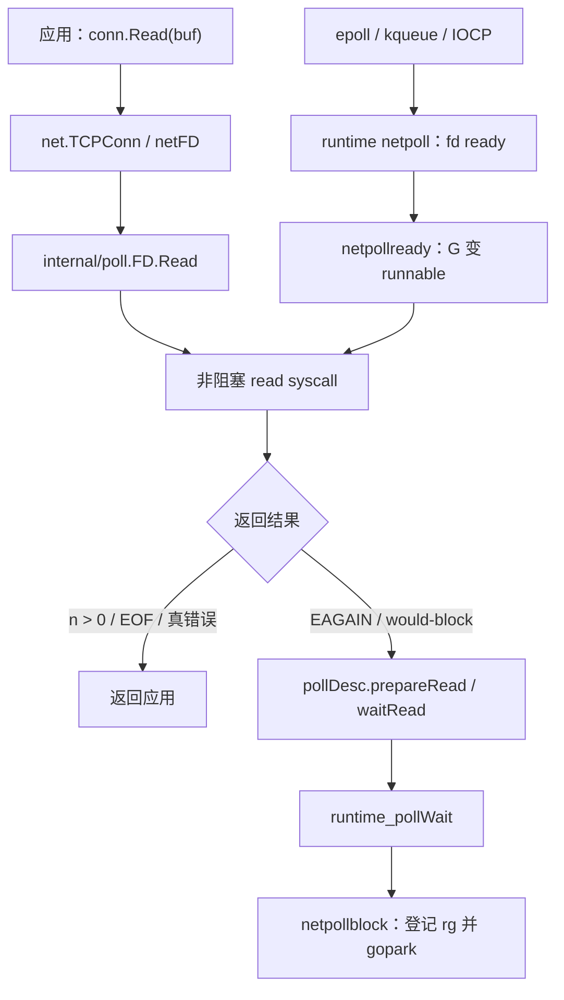
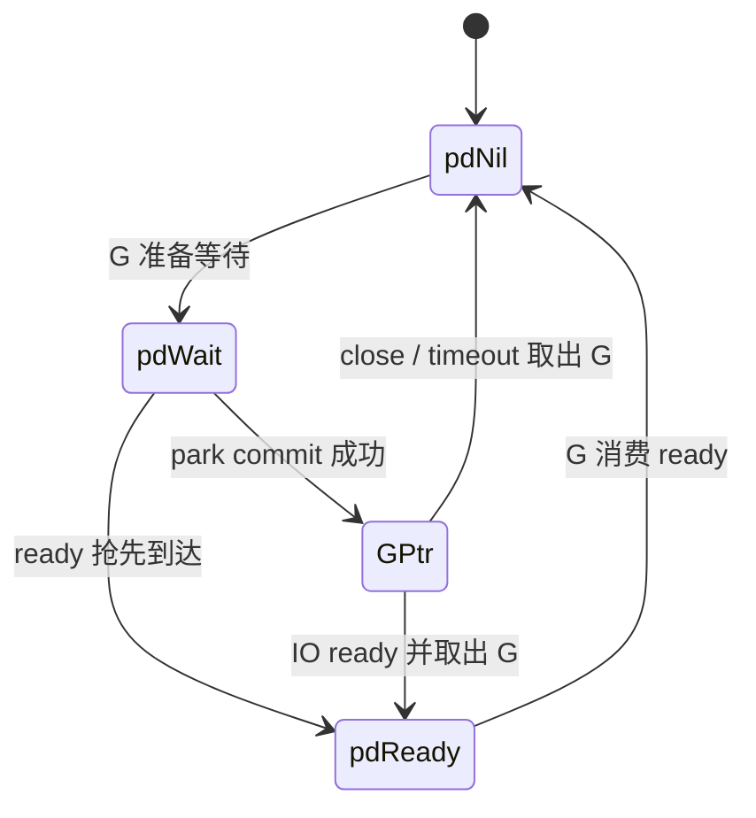
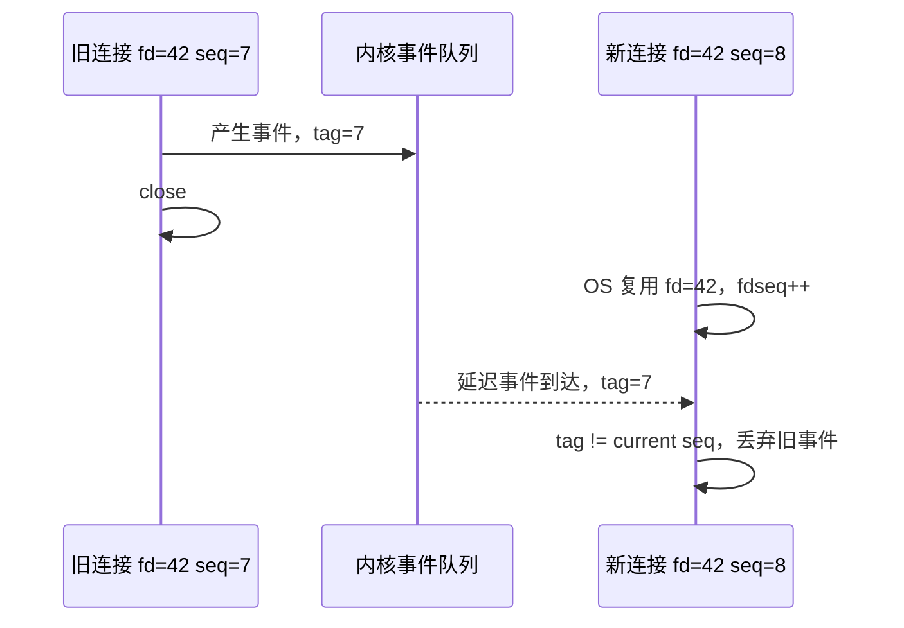
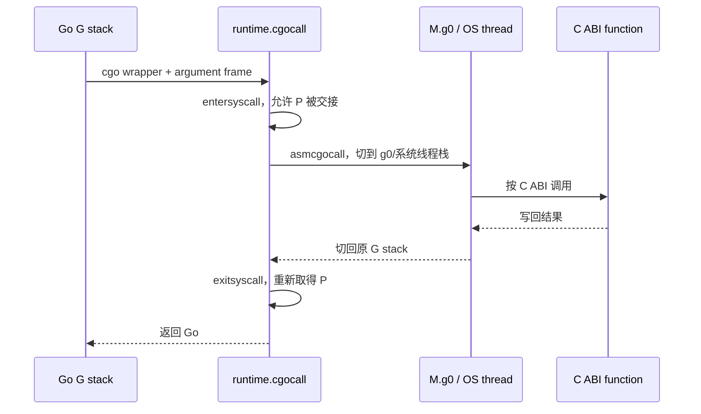

# 27 · syscall、cgo 与 runtime netpoll：从 `Read` 到内核再回来 ⭐⭐⭐

> 本章以 Go 1.26.4 为基线，Linux epoll 作为源码主线，同时对照 Windows IOCP 与 BSD/macOS kqueue。`net.Conn`、deadline 和 io.Reader/io.Writer 契约是公开 API；`pollDesc` 状态、fd sequence、平台 netpoll 入口属于当前实现。

配套代码：[`go/code/35_syscall_cgo_netpoll`](../code/35_syscall_cgo_netpoll/)

## 1. 先区分四种“IO 阻塞”

一句“Go IO 不阻塞线程”过于宽泛。至少要分：

| 场景 | 常见 runtime 路径 | 等待时是否长期占 M |
|---|---|---|
| 可轮询 socket/pipe | nonblocking fd + netpoll | 通常只停 G，不长期占 M |
| 普通文件/某些设备 | 阻塞 syscall | 可能占 M，P 可被交给其他 M |
| DNS/系统库/cgo | 外部 C 调用 | 可能占 M，并增加 OS thread |
| 用户态锁/channel | gopark + runtime queue | 通常只停 G |

netpoll 的价值主要是把大量**等待网络就绪**的 G 聚合到少量内核 poller 上。它不能让磁盘、C 库或任意 syscall 自动变成异步，也不减少连接本身的 fd、缓冲、状态和业务内存。

## 2. 从 `net.Conn.Read` 到 runtime 的分层

以 TCP read 为例，调用链可概括为：



关键点：被唤醒后通常要**重新执行 read**。ready 只说明操作现在可能前进，不等于一定读满 buffer，也不等于连接仍未关闭。

## 3. nonblocking fd 为什么还能提供“阻塞式 API”

对用户而言，`conn.Read` 可以一直等到有数据或 deadline；底层 fd 却通常被设成 nonblocking。两层通过循环桥接：

1. 先直接尝试 read，数据已到时无需经过 poller。
2. 得到 EAGAIN，说明此刻无数据，不能让 OS 线程在 read 上睡眠。
3. 把当前 G 注册到 pollDesc 的 read waiter。
4. `gopark`，M/P 去执行其他 G。
5. 内核 poller 报 ready 后唤醒 G。
6. G 再次 read；若仍 EAGAIN，再次等待。

这是一种“同步编程接口 + runtime 异步等待实现”。用户代码保持线性控制流，不需要手写 callback/event loop。

## 4. `pollDesc`：读写各自一个二进制等待状态

Go 1.26.4 的 runtime `pollDesc` 主要包含：

- 固定生命周期内的 fd 与 `fdseq`；
- 读等待状态 `rg`、写等待状态 `wg`；
- closing 与 error 摘要；
- read/write deadline 及 timer/sequence；
- 与 poll cache、平台事件关联所需字段。

`rg/wg` 当前可处于：

```text
pdNil   ：没有 waiter，也没有 pending readiness
pdReady ：ready 通知已先到，下一次 waiter 可以直接消费
pdWait  ：G 正准备提交停车，但还未把自身指针放入
G ptr   ：某个 G 已经阻塞在该读/写方向
```



### 4.1 `pdWait` 解决什么竞态

危险窗口是：read 已返回 EAGAIN，但 G 尚未真正睡下时，内核 ready 事件先到。若只存“有没有睡眠 G”，通知会因无人可唤醒而丢失，随后 G 永久睡眠。

`pdWait/pdReady` 协议让 ready 可以先存成 pending 状态；park commit 则用 CAS 把 `pdWait` 改成 G 指针。两者谁赢都不会丢通知。这与 runtime semaphore 的“wake 可以先于 sleep”是同一类问题。

### 4.2 为什么每个方向通常只允许一个 waiter

pollDesc 的 `rg/wg` 各只能保存一只等待 G。`net.Conn` 文档允许方法并发调用，但具体 FD 层会用 read/write 锁串行化同方向操作。若绕开 `net`/`internal/poll` 直接对同一 fd 建立多个 runtime waiter，会破坏内部假设。

## 5. scheduler 与 netpoll 在哪里接上

netpoll 不是独立用户 goroutine event loop，它嵌入 runtime 调度器：

- `findRunnable` 在本地/全局队列为空后可做一次非阻塞 netpoll，取得刚 ready 的 G。
- 没有其他工作时，某个 M 可以在 netpoll 中按下一个 timer deadline 阻塞。
- `sysmon` 也会推动 netpoll，避免 poller 长期无人处理。
- 新 runnable 工作或更早 timer 到来时，`netpollBreak` 唤醒阻塞的 poller。
- 平台 `netpoll` 返回 G 列表，调度器把它们注入 runnable 队列。


这解释了为什么诊断网络延迟既要看 socket/下游，也要看调度：fd 已 ready 后，G 仍可能在 runnable queue 排队。

## 6. Linux epoll：Go 当前怎样使用 readiness

Go 1.26.4 Linux 后端在 `runtime/netpoll_epoll.go`：

- 创建 epoll fd 和用于打断 poller 的 eventfd；
- 注册 fd 时监听 read/write/hangup/error，并使用 edge-triggered 标志；
- epoll event data 中带 pollDesc 指针与 fd sequence tag；
- `epollwait` 一次取一批事件，转换成 read/write mode；
- `netpollready` 取出对应 waiter G，返回调度器。

### 6.1 edge-triggered 为什么要求“读到 EAGAIN”

边沿触发通知的是状态变化。如果只读一小部分就停，而 fd 仍保持可读，内核未必再次产生新边沿。Go 的 internal/poll read 循环和上层调用必须正确处理短读/EAGAIN，不能把一次 event 当成“一条完整业务消息”。

### 6.2 epoll ready 不等于成功

一个事件可能表示：

- 有数据可读；
- 对端半关闭/关闭；
- socket error；
- 写缓冲暂时可用；
- 事件在调度到当前 G 前已被其他操作消费。

所以真正 read/write 才能返回最终 `n, err`。ready 是尝试许可，不是业务结果。

## 7. kqueue 与 IOCP：不能把 netpoll 永远画成 epoll

### 7.1 kqueue

macOS/BSD kqueue 用 filter/event 监听读写 readiness、timer、signal 等内核事件。Go runtime 把读/写 filter 映射成统一 pollDesc waiter。

### 7.2 Windows IOCP

IOCP 更接近“异步操作完成通知”：先发起 overlapped IO，内核完成后把 completion packet 投递到 completion port。它不是简单询问 fd 当前可读/可写。

### 7.3 runtime 统一的是什么

平台后端都要实现类似：

- init/open/close；
- poll 一批事件；
- break 一个阻塞 poll；
- 把平台结果映射到 read/write waiter G。

统一的是“G 等待 IO、ready/completion 后重新 runnable”的调度语义，不是统一所有内核细节。

## 8. fd 复用：旧事件为什么可能打到新连接

OS 关闭 fd 42 后，很快可能把数字 42 分给另一个 socket。内核队列里如果还有旧 fd 的延迟事件，仅比较数字就可能错误唤醒新连接。

当前 pollDesc 使用 `fdseq`，平台事件携带对应 sequence/tag：



deadline timer 也有 read/write sequence，重设 deadline 或复用 pollDesc 后，旧 timer callback 会因 sequence 不匹配而被忽略。

这一机制保护 runtime 内部；业务层仍要防止自己把裸 fd 交给多个拥有者并重复关闭。

## 9. deadline 与 context：谁真正唤醒阻塞的 G

`SetReadDeadline/SetWriteDeadline` 经 internal/poll 进入 runtime，为 pollDesc 设置绝对 deadline 与 timer。timer 到期后：

1. 在锁下确认 sequence 仍匹配，排除旧 timer。
2. 标记 read/write deadline 已过期并发布摘要状态。
3. 从 `rg/wg` 取出 waiter G。
4. 把 G 变为 runnable；它返回时把 runtime error 转成 `os.ErrDeadlineExceeded`/`net.Error` 语义。

context 本身不会神奇地打断任意已经阻塞的裸 Read。标准 `DialContext`/`ListenConfig` 会集成取消；对已建立连接，常见做法是：

- 根据 context deadline 设置 conn deadline；
- context 取消时主动 Close 或把 deadline 设为当前时间；
- 协议层所有循环都处理返回 error 并退出。

配套 loopback 从 parent 建 2 秒 timeout，并把 deadline 同时设置到服务端和客户端 conn，确保 read/write 不会无限挂住。

## 10. syscall 状态交接：阻塞线程时怎样保住 P

不能使用 netpoll 的阻塞 syscall 走调度器 syscall 协议：

1. `entersyscall` 保存 G 的 syscall PC/SP，使 GC 能扫描它。
2. M 进入 syscall 状态，P 可以被 sysmon/调度器交给其他 M。
3. syscall 返回后，`exitsyscall` 尝试拿回原 P 或空闲 P。
4. 取得 P 就直接继续；否则 G 变 runnable，M 等待后续安排。

阻塞 syscall 不会必然冻结全程序，但仍占一条 OS 线程。高并发普通文件 IO、NFS 异常、设备调用都可能使线程数激增，进而受系统线程/虚拟内存限制。

### 10.1 `syscall.RawSyscall` 为什么危险

某些 raw 路径不会告诉 runtime 调用可能阻塞，调度器无法及时交接 P。除非明确理解平台 ABI 与阻塞性质，否则应优先使用标准库、`x/sys` 高层封装或正常 Syscall 路径。

直接 syscall 还要自行处理 EINTR、EAGAIN、fd 生命周期、指针活性和平台差异，通常不应散落在业务层。

## 11. cgo：不只是“Go 调一个 C 函数”

Go → C 当前主线：



C 调回 Go 更复杂：外部线程可能没有现成 M/G，runtime 要取得/创建 M、建立 g0 与 goroutine 栈、重新进入 GOMAXPROCS 记账，并在返回时恢复 C 栈与线程状态。

### 11.1 为什么长 cgo 调用增加线程

`cgocall` 会 `entersyscall`，使 P 能服务其他 Go G；但执行 C 的 M 仍占一条 OS 线程。若大量 goroutine 同时进入长 C 调用，runtime 为维持 Go 并行度可能创建/唤醒更多 M。

所以 cgo 并发必须单独限流，并监控：

- cgo call 数/时长；
- OS thread 数；
- C 侧锁/阻塞；
- Go/C 内存占用；
- callback、signal 与线程局部状态。

### 11.2 cgo 调用开销来自哪里

- Go ABI 与 C ABI wrapper/参数 frame；
- G 栈与 g0/系统栈切换；
- syscall/GOMAXPROCS 状态记账；
- pointer check、race detector；
- callback 与线程绑定；
- C 调用本身阻塞或破坏 cache。

固定空函数基准只能测最低边界，不能代表传大结构、字符串复制、回调和阻塞调用。

## 12. cgo pointer rules：GC 必须知道 Go 指针在哪里

核心目标是：C 不能让 Go GC 失去对 Go 指针和对象移动/存活约束的控制。当前可用以下工程规则理解：

1. 传给 C 的 Go 对象在调用期间会按规则保持 pinned；C 只能在允许的内存范围访问。
2. C 不得在调用返回后继续保存普通 Go 指针；确需跨调用保存时，要用 `runtime.Pinner` 显式 pin 可 pin 的对象，并严格管理 Unpin 生命周期。
3. 指向 Go 内存的指针若所指区域还包含未 pin 的 Go 指针，通常不能传给 C。
4. map、chan、func 等包含 runtime 内部 Go 指针的值不能直接交给 C 长期操作。
5. C 内存不能随意长期保存未 pin 的 Go 指针；回调句柄通常使用 `runtime/cgo.Handle`，让 C 保存整数 token，而不是 Go 地址。
6. Go string/slice header 含 Go 指针，不能把 header 当稳定 C 结构长期保存；需要明确复制或在调用期传 data+len。

`GODEBUG=cgocheck`/实验检查能发现一部分违规，`GOEXPERIMENT=cgocheck2` 可做更强检查；`unsafe` 可以绕过检查但不会让代码变正确。

## 13. 短读、短写与 framing：网络正确性的基本功

`io.Reader.Read(p)` 允许 `0 < n < len(p)`；`io.Writer.Write(p)` 在返回 `n < len(p)` 时应伴随非 nil error，但现实 wrapper/测试 double/自定义 writer 可能暴露各种短写。协议不能假设一次调用完成整个消息。

配套 loopback 使用 4 字节大端长度前缀：

```text
+------------------+----------------------+
| uint32 payload n | n bytes payload      |
+------------------+----------------------+
```

- `writeFull` 循环直到 header/payload 全部写完，检测零进展。
- `io.ReadFull` 精确读满 4 字节 header 与 payload。
- 解析长度前检查 1 MiB 上限，防止恶意 peer 让程序分配任意大内存。
- 读写和 accept 都由 deadline/close 收敛。

这是对“TCP 是字节流，不保留消息边界”的直接处理。一次 Write 与一次 Read 没有一一对应关系。

## 14. 配套实验的三层含义

### 14.1 `LoopbackRoundTrip`

它通过真实 loopback TCP 观察标准 `net` 栈，重点不是吞吐，而是验证：

- listener、client、server connection 都有明确 Close；
- context 取消与 deadline 能结束等待；
- framing 能处理短读/短写；
- server goroutine 用容量 1 的结果 channel，避免错误路径反向泄漏；
- payload 上限在发送端和接收端都检查。

### 14.2 `RunPlatformPoll`

Linux build-tag 文件用 `pipe + epoll` 直接观察一次 readiness；它绕开了标准 netpoll，只是内核模型实验：

- pipe read fd 设 nonblocking；
- epoll 注册 EPOLLIN；
- goroutine 写一个字节；
- EpollWait 收到事件后读走数据。

非 Linux 文件只报告平台模型（Windows IOCP、BSD/macOS kqueue）并返回 unsupported，不伪造“跨平台 raw epoll”。交叉编译只能证明 Linux 代码能构建，不能证明它已在 Linux 内核实际运行。

### 14.3 `CGOAdd`

真实 `import "C"` 只在 `CGO_ENABLED=1` 且显式 `-tags=cgo_lab` 时编译；默认 stub 返回 `ErrCGOLabDisabled`。这样普通 `go test ./...` 不要求安装 C toolchain，也让 cgo 边界是显式选择。

## 15. 实验命令与正确解读

```powershell
cd go/code

go run ./35_syscall_cgo_netpoll -mode=loopback -payload-size=4096
go run ./35_syscall_cgo_netpoll -mode=platform
go test -race ./35_syscall_cgo_netpoll
go test ./35_syscall_cgo_netpoll -run '^$' -bench '.' -benchmem -count=5

# 有 C 编译器时显式开启
go test -tags=cgo_lab ./35_syscall_cgo_netpoll
go run -tags=cgo_lab ./35_syscall_cgo_netpoll -mode=cgo

# 验证默认无 cgo 依赖
$env:CGO_ENABLED='0'
go test ./35_syscall_cgo_netpoll
Remove-Item Env:CGO_ENABLED
```

loopback Benchmark 包含 listen/dial/accept/调度和协议分配，不是纯 netpoll syscall 延迟；它更接近端到端正确性基准。要测吞吐，应复用连接、批量消息并报告 payload bytes/s。

## 16. 生产网络与 cgo 设计准则

1. 所有外部 IO 都要有 deadline 或可实际打断的取消路径。
2. 同时限制连接数、in-flight 请求数、每连接队列和单消息大小。
3. TCP 协议必须 framing，并处理短读、短写、EOF、半关闭和重试边界。
4. 不在 EAGAIN 上忙循环；使用标准 net/internal poller。
5. cgo 集中在小 package，Go/C 所有权、内存复制和线程亲和性写进 API。
6. 长 cgo 调用设独立 semaphore/worker pool，不能把 goroutine 便宜等同线程便宜。
7. 不把裸 fd 分散给多个组件；一个明确 owner 负责 close/deadline。
8. 诊断同时看应用错误、fd/连接、goroutine 状态、OS thread、syscall 与下游时间线。

## 17. 常见误区

### 误区一：Go 一连接一 goroutine，所以就是一连接一线程

等待网络时 G 通常停在 netpoll，M 去执行其他 G；只有 ready 后才需要执行线程。连接仍有其他资源成本，不能无限创建。

### 误区二：netpoll 就是 epoll

netpoll 是 runtime 跨平台接口。Linux 用 epoll，macOS/BSD 用 kqueue，Windows 用 IOCP 等不同模型。

### 误区三：fd ready 后 Read 一定成功并读满

ready 只表示可能前进；可能短读、EAGAIN、EOF、error 或已被并发操作消费。消息边界必须由协议处理。

### 误区四：context 能自动取消任意 IO

只有 API 主动集成 context，或取消动作触发 deadline/Close，才能打断已阻塞调用。把 ctx 传到外层函数但内部忽略，不会产生取消能力。

### 误区五：cgo 只是一次普通函数调用

它跨 ABI、栈、调度与 GC 指针边界；长调用还占线程，callback 更复杂。必须作为独立容量和故障域管理。

## 18. 高频面试题：把内核事件与 G 状态连起来

### Q1. Go 网络 goroutine 为什么通常不独占线程？

socket fd 被设为 nonblocking。Read 得到 EAGAIN 后，G 登记到 pollDesc 并 gopark；M/P 继续运行其他 G。epoll/kqueue/IOCP 报告事件后，runtime 再把该 G 置为 runnable。

### Q2. netpoll 与 epoll 是什么关系？

netpoll 是 runtime 的平台无关调度接口，epoll 是 Linux 后端。其他平台实现相同“等待者 G ↔ IO 事件”语义，但内核模型和系统调用不同。

### Q3. pollDesc 的 `rg/wg` 为什么有 pdWait 状态？

它覆盖“G 正准备睡，但 ready/timeout 已先到”的竞态。通知可把 pdWait 改为 pdReady，park commit 则 CAS 为 G 指针；谁先发生都不会丢唤醒。

### Q4. fd ready 为什么不等于 Read 一定有业务数据？

readiness 也可能来自 EOF、hangup、error；edge event 到 G 运行之间状态还能变化，其他 goroutine也可能消费。必须再次 syscall，以 `n, err` 为最终结果。

### Q5. 普通文件 IO 为什么可能占线程？

很多文件系统/设备不提供与 socket 相同的 readiness 语义，read 本身会阻塞内核线程。runtime 能把 P 交给其他 M，但这条 M 仍被占用。

### Q6. deadline 怎样唤醒 netpoll 中的 G？

pollDesc 为读写方向维护 timer 和 sequence。timer 到期标记 deadline error，从 rg/wg 原子取出 G 并 goready；G 恢复后从 runtime poll wait 得到 timeout 错误。

### Q7. 为什么要有 fd sequence？

OS 会复用 fd 数字，pollDesc 也会复用。事件携带旧 sequence 时与当前不符就被丢弃，防止旧连接的延迟事件唤醒新连接。

### Q8. IOCP 与 epoll 的主要模型差异？

epoll 主要报告“现在可能可读/可写”的 readiness，应用再执行 IO；IOCP 主要投递异步 IO 已完成的 completion。runtime 把两者都映射为等待 G 的恢复，但底层不是同一种 API。

### Q9. cgo 为什么会让 OS thread 数增加？

C 调用在当前 M 的系统线程上执行，并通过 entersyscall 释放 P。为让 P 继续执行其他 Go G，runtime 可能创建/唤醒额外 M；许多并发长 C 调用就会积累线程。

### Q10. C 可以保存 Go 指针吗？

普通情况下不能在调用返回后保存。跨调用必须使用允许的显式 pin，并确保所指内存不含未 pin Go 指针；更常见的安全方案是复制到 C 内存或用 `runtime/cgo.Handle` 传整数句柄。

### Q11. 为什么一次 Write 不能假设写完？

io.Writer 契约允许短写/错误，TCP 又只是字节流。协议必须循环推进剩余 slice，并处理零进展；接收端用长度前缀或其他 framing 还原消息。

### Q12. 如何诊断 netpoll/cgo 延迟？

先按 goroutine stack 区分 IO wait、syscall、cgo；再用 trace 看 Network wait 与 runnable delay，用 fd/连接/deadline 指标和系统调用跟踪确认内核状态。cgo 还要看 OS thread 与 C 侧 profile。只看 Go CPU profile 可能遗漏阻塞在内核/C 的时间。

## 19. 源码阅读路线

1. `net/fd_posix.go`、`net/net.go`：公开 Conn 到 netFD。
2. `internal/poll/fd_unix.go`、`fd_poll_runtime.go`：非阻塞 read/write 与 runtime bridge。
3. `runtime/netpoll.go`：pollDesc 状态、wait/unblock、deadline 与 fdseq。
4. `runtime/netpoll_epoll.go`：Linux init/open/poll/break。
5. `runtime/netpoll_kqueue.go`、`runtime/netpoll_windows.go`：对照不同平台模型。
6. `runtime/proc.go`：`findRunnable` 如何调用 netpoll；`entersyscall/exitsyscall`。
7. `runtime/cgocall.go` 与 `runtime/asm_*.s`：Go/C 栈和调度状态切换。
8. `cmd/cgo/doc.go`、`runtime/pinner.go`、`runtime/cgo/handle.go`：pointer/pinning/handle 规则。

## 20. 进阶练习

1. 把 loopback 改成长连接发送 1000 帧，验证 framing 在粘包/拆包下仍正确。
2. 自定义每次只写 1 byte 的 Writer，证明 `writeFull` 能完成 header 与 payload。
3. 服务端故意不响应，分别用 deadline、Close、只取消 context 比较哪种真正打断 Read。
4. 在 Linux 实机运行 raw epoll，切换 ET/LT 并故意不读到 EAGAIN，观察事件差异。
5. 写一个受 semaphore 限制的长 cgo 调用实验，比较无限并发与有界并发的线程数。
6. 用 `runtime/cgo.Handle` 把 Go callback context 传给 C，再正确 Delete，避免保存 Go 指针。

## 本章总结

Go 网络栈的关键链路是：nonblocking syscall 遇到 EAGAIN，pollDesc 用无丢唤醒状态登记 G，平台 epoll/kqueue/IOCP 把事件交回 runtime，调度器再让 G runnable。不能 poll 的 syscall 与 cgo 则通过 P/M 交接维持 Go 并行度，但会占线程。掌握 fd sequence、deadline、短读短写和 cgo pointer rules，才能把“goroutine 很轻”落实成真正安全、有界、可取消的 IO 系统。
