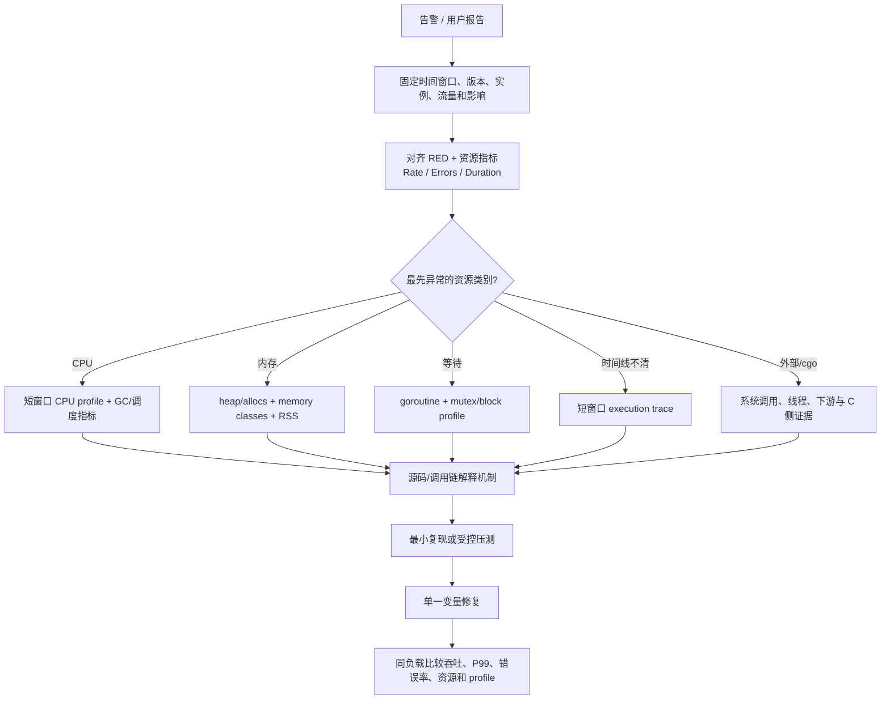
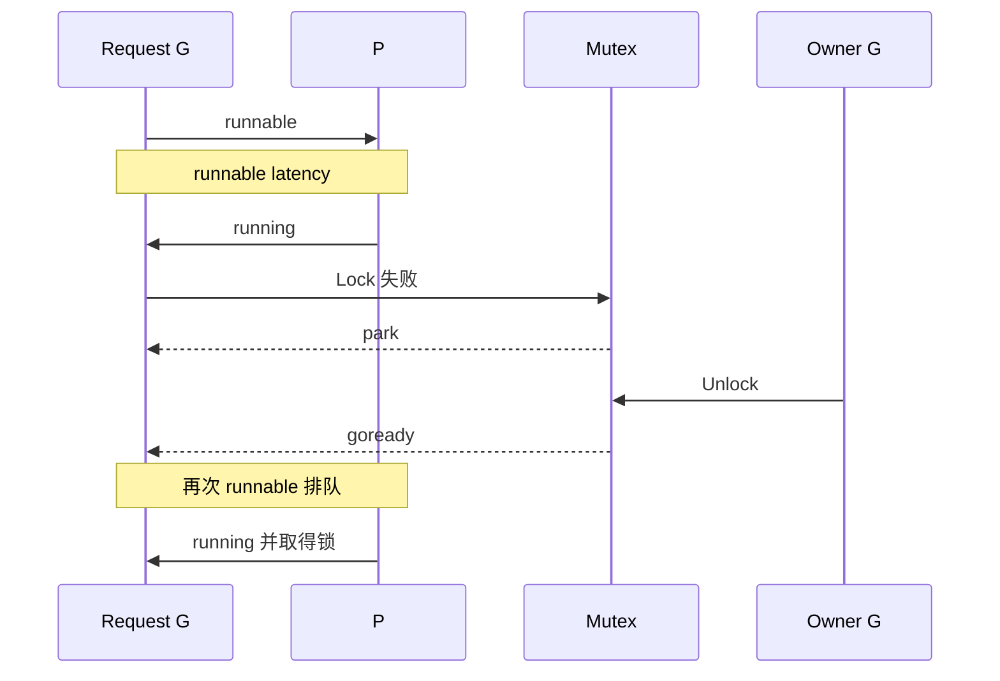
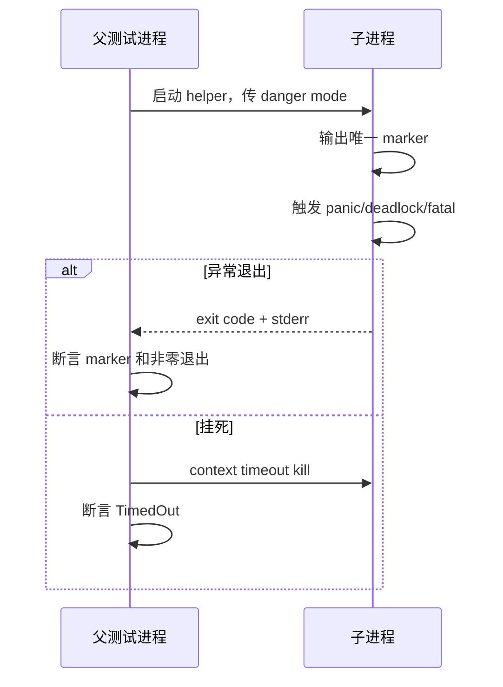

# 28 · Go runtime 综合事故诊断：从症状到可复现证据链 ⭐⭐⭐

> 本章不是工具命令清单，而是一套分诊方法：先固定影响和时间窗口，再判断资源类别，选择最低成本证据，建立机制解释，最后用同负载回归。配套危险场景全部通过子进程隔离，避免 panic/deadlock 杀死测试进程。

配套代码：[`go/code/36_runtime_forensics`](../code/36_runtime_forensics/)

## 1. 性能事故最难的不是“没有数据”，而是数据无法建立因果

常见但无效的结论：

- “goroutine 有十万，所以是 goroutine 泄漏。”
- “CPU 100%，所以要增加 GOMAXPROCS。”
- “GC 后 RSS 没降，所以 GC 有 bug。”
- “mutex profile 有这个函数，所以锁一定在这里持有太久。”
- “trace 里看到 netpoll，所以网络库慢。”

这些都只有相关性，没有回答：

1. 异常发生在哪个时间窗口？
2. 用户影响是什么：吞吐、P50/P99、错误率还是 OOM？
3. 哪种资源先偏离基线？
4. profile/trace 覆盖的窗口是否与事故重合？
5. 代码机制能否解释指标变化？
6. 修复后同样负载下是否回归改善？

真正的诊断产物应该是一条可复核证据链，而不是一张“看起来很红”的火焰图。

## 2. 一套通用分诊流程



### 2.1 第一现场必须记录什么

- 精确起止时间、时区、实例/容器 ID。
- Go 版本、GOOS/GOARCH、构建 commit、配置和 feature flag。
- GOMAXPROCS、CPU quota、GOGC、GOMEMLIMIT。
- 请求率、并发、payload 分布、P50/P95/P99、错误率。
- goroutine、OS thread、fd、连接池/队列长度。
- heap goal/live、分配速率、GC CPU、pause、assist。
- 下游延迟/错误与重试次数。

没有这些上下文，即使 profile 本身准确，也可能采到了错误负载或错误实例。

## 3. 先理解每种工具“统计的到底是什么”

| 工具 | 最适合回答 | 不能单独回答 |
|---|---|---|
| runtime/metrics | 当前/累计 runtime 数值与直方图 | 具体哪条业务调用链造成 |
| CPU profile | 采样窗口内 CPU 时间花在哪些栈 | wall-clock 等待、单次极短尖峰 |
| heap/inuse | 当前存活对象由哪些分配栈产生 | 谁在未来释放、非 Go 内存 |
| allocs | 累计分配热点 | 当前仍保留多少 |
| goroutine profile | 快照时各 G 的调用栈/等待点 | 完整时间顺序、谁唤醒谁 |
| mutex profile | 锁竞争造成的等待归因 | 所有无竞争 Lock、业务 predicate |
| block profile | channel/select/Cond 等阻塞采样 | 当前正在等待的完整数量 |
| execution trace | G/P/M/GC/IO 的时间线与因果 | 长时间低成本持续监控 |
| schedtrace/gctrace | runtime 周期文本快照 | 稳定结构化业务指标 |
| OS/eBPF/perf | 内核、线程、syscall、C/系统全景 | Go 类型与业务语义 |

最有效的方法通常是两种证据交叉：metrics 指明“哪类资源变了”，profile/trace 指明“哪条栈和时间线解释它”。

## 4. runtime/metrics：为什么比只读 MemStats 更适合持续观测

`runtime/metrics` 提供带单位的稳定名称，例如配套代码读取：

- `/sched/goroutines:goroutines`
- `/memory/classes/heap/objects:bytes`
- `/gc/heap/objects:objects`
- `/gc/heap/goal:bytes`

还可关注：

- `/sched/latencies:seconds`：G 进入 runnable 后等待执行的分布。
- `/sched/pauses/total/gc:seconds`：GC STW pause 直方图。
- `/cpu/classes/gc/*:cpu-seconds`：GC worker/assist 等 CPU 类别。
- `/gc/heap/allocs:*`、`/gc/heap/frees:*`：累计分配/释放。
- `/memory/classes/*`：Go 管理内存组成。

### 4.1 指标读取的三个坑

1. **先检查 Kind**：值可能是 Uint64、Float64 或 Float64Histogram，不能猜。
2. **累计量要算 rate**：两次采样差值除以时间，不能直接把累计 CPU seconds 当瞬时占比。
3. **直方图要按 bucket 解读**：平均值会隐藏长尾；导出系统还要防止 bucket/label 基数爆炸。

指标名称会随 Go 演进增加/弃用，升级时应通过 `metrics.All()` 或官方描述检查兼容性。

## 5. CPU profile：采样热点不等于 wall-clock 调用次数

CPU profiler 按频率采样正在 CPU 上执行的线程栈。某函数占 30%，更接近“采样窗口内约 30% CPU 样本经过它”，不是它被调用了 30% 次。

### 5.1 flat 与 cum

- **flat**：样本直接落在该函数自身指令。
- **cum**：样本落在该函数及其所有下游调用。

例子：

```text
handler -> decode -> hash
        -> database
```

handler 的 cum 可能高，但 flat 很低，说明它是入口聚合者；真正计算热点在 decode/hash。优化 handler 函数壳没有意义，应沿调用图找到高 flat 或可削减的下游 cum。

### 5.2 CPU 满但 profile 看不到业务热点

逐项排查：

- GC worker/mark assist 是否占比高；
- runtime 调度、自旋、锁竞争是否消耗 CPU；
- 计算是否在 cgo/C/内核，Go 栈只能看到边界；
- 容器 CPU throttling 是否让 wall time 高但进程 CPU 样本少；
- profile 是否覆盖真正尖峰；
- 函数是否被内联，热点归到调用者或内联帧；
- 多实例中是否采错实例。

### 5.3 CPU profile 的安全使用

- 采集受控短窗口，通常数十秒足够形成样本。
- 同一进程 CPU profile 是全局资源，不要并发启动多个采集者。
- 文件可能包含函数名、路径和业务标签，按敏感诊断数据管理。
- 对短尖峰可自动触发环形/限时采集，但要有冷却、磁盘和并发上限。

## 6. heap 与 allocs：一个看“留下”，一个看“经过”

Go heap profile 可按 object/space、inuse/alloc 维度观察：

- `inuse_space`：当前仍存活对象的字节，适合大内存保留。
- `inuse_objects`：当前仍存活对象数量，适合小对象海量保留。
- `alloc_space`：累计分配字节，适合高分配速率。
- `alloc_objects`：累计对象数，适合频繁小分配。

### 6.1 为什么 heap profile 不是精确对象清单

内存 profile 是采样的，默认采样率由 `runtime.MemProfileRate` 控制。pprof 会按采样权重估算，短程序或少量对象误差较大。调低采样间隔会增加运行开销，生产不能随意设成每次分配都采。

### 6.2 如何证明“可达性泄漏”

合理证据链：

1. 稳定/相同负载下，多轮 GC 后 inuse heap 仍单调增长。
2. heap profile 中同一对象类型和分配栈持续增大。
3. 查看引用者/代码路径，找到无上限 map、slice backing array、timer、goroutine 栈等保留原因。
4. 加容量/释放/复制修复后，同负载曲线达到平台且 profile 热点下降。

单次 RSS 增长或单张 heap profile 不能完成证明。

### 6.3 Go heap 不高但 RSS 高

检查：

- HeapIdle 与 HeapReleased 差值、span 碎片。
- goroutine/OS thread 栈。
- cgo malloc、C 库 arena。
- mmap 文件/匿名内存。
- JIT/动态库（若嵌入外部 runtime）。
- 内核 socket buffer/page cache 与监控口径。

此时需要 OS 级内存 map、C allocator profile 或容器指标，继续调 GOGC 可能完全无效。

## 7. goroutine profile：数量必须和等待原因一起看

goroutine 多的常见合理原因：流量峰值、长连接、worker pool、后台任务。泄漏的关键是**负载回落后，某类相同等待栈数量仍持续增长且生命周期无法结束**。

### 7.1 差分方法

1. 在相近负载下间隔采两到三次 goroutine profile。
2. 按规范化调用栈和 wait reason 聚合，而不是按 goid。
3. 观察哪些栈只增不减。
4. 对照请求/context/timer/连接生命周期。
5. 找到创建点；可在受控环境启用 traceback ancestors 或 trace。

常见泄漏栈：

- 永远没人发送/接收的 channel；
- select 缺少 context.Done；
- server goroutine 向无接收者结果 channel 发送；
- 网络调用无 deadline；
- Mutex/Cond predicate 永远无法满足；
- ticker/timer 未 Stop 或拥有者无法退出；
- retry goroutine 每次失败再创建一只。

### 7.2 runnable 很多与 waiting 很多不同

- 大量 **runnable**：CPU/P 不足、cgroup throttling、长 G 占用、GC/调度竞争。
- 大量 **waiting**：锁、channel、IO、timer 或生命周期阻塞。
- 大量 **syscall**：文件/cgo/内核阻塞和线程增长。

这三者的修复方向完全不同。

## 8. mutex 与 block profile：等待时间该归给谁

### 8.1 mutex profile

Mutex profile 采样锁竞争造成的等待，并尽量把代价归因到导致其他 G 等待的 unlock/持锁路径。高 cum 入口不一定是直接持锁热点，要沿调用图理解。

典型问题：

- 临界区内做 IO/日志/序列化；
- 一个全局锁保护本可分片的数据；
- 锁内调用用户 callback；
- RWMutex 长读者阻塞写者；
- 锁顺序反转或嵌套过深。

### 8.2 block profile

block profile 覆盖 channel send/receive、select、Cond、部分同步等待。它记录**已经结束的阻塞事件**的采样统计；当前仍永久阻塞的 G 可能尚未形成完整事件，因此还要配合 goroutine profile。

### 8.3 采样率本身有成本

- `runtime.SetMutexProfileFraction(n)` 约每 n 次竞争事件采一个。
- `runtime.SetBlockProfileRate(rate)` 控制阻塞纳秒采样目标。

采样越密，数据更细但开销越高。生产要设置有限窗口并在结束后恢复原策略；不要长期为了“以后可能用”开最高采样。

## 9. execution trace：回答“什么时候、谁让谁继续”

pprof 把时间窗口聚合成调用图；trace 保留时间顺序，能看到：

- G 从 runnable 到 running 的延迟；
- P/M/G 时间线与抢占；
- channel/锁/网络/syscall 等状态转换；
- GC STW、mark worker、assist；
- goroutine 创建、阻塞和唤醒关系；
- user task/region/log（若业务显式埋点）。



一段请求 wall time 可以被拆为 runnable 等待、同步阻塞、IO wait、GC assist 与真正 on-CPU 时间。CPU profile 只能覆盖最后一部分。

### 9.1 trace 为什么不能无限开

trace 事件量和运行开销高，文件随并发/事件速率快速增长；解析大 trace 也很重。建议：

- 先用 metrics/profile 缩小问题；
- 只采能覆盖异常的短窗口；
- 生产设置文件上限、并发门禁和访问控制；
- 使用 user region 只标记关键请求阶段，不把高基数数据写进 trace。

## 10. GODEBUG 文本：适合临时验证，不适合脆弱解析

### 10.1 schedtrace

```powershell
$env:GODEBUG='schedtrace=1000,scheddetail=1'
go run ./36_runtime_forensics -scenario=cpu -duration=5s -workers=64
Remove-Item Env:GODEBUG
```

它能观察 P/M/G、run queue、spinning/idle/syscall 等周期快照。适合回答 runnable 是否积压、线程/syscall 是否异常；输出格式属于诊断实现，不建议作为长期监控协议解析。

### 10.2 gctrace

```powershell
$env:GODEBUG='gctrace=1'
go run ./36_runtime_forensics -scenario=alloc -duration=5s -workers=8
Remove-Item Env:GODEBUG
```

关注每轮时刻、STW/并发 mark CPU、heap before/after/goal、P 数等。不要只看 pause：高 allocation/assist 可能让请求慢而 pause 很小。

升级 Go 版本后，文本字段和含义可能变化；长期仪表盘优先 runtime/metrics。

## 11. 六类事故的逐步剧本

### 11.1 CPU 满、吞吐不升

1. 先查 CPU quota/throttling，确认“100%”是一个核还是全部配额。
2. CPU profile 区分业务计算、runtime、GC、序列化/压缩、hash。
3. 看 allocation rate 与 GC assist，排除“分配制造的 CPU”。
4. trace 看 runnable latency、P 是否持续忙、是否有长 G/抢占问题。
5. 若 profile 边界在 cgo/syscall，用 OS/C profiler 下钻。
6. 修复后同 RPS 比 CPU/request、吞吐、P99，而不是只看总 CPU 降没降。

### 11.2 CPU 不满但 P99 很高

1. goroutine profile 按 wait reason 聚合。
2. mutex/block profile 找竞争和 channel 等待。
3. trace 把请求拆成 IO wait、runnable wait、锁等待。
4. 对齐连接池、数据库池、下游队列与 deadline。
5. 检查限流器是否排队但没有暴露 queue latency。

低 CPU 往往说明程序在等，不是“性能很好”。

### 11.3 goroutine 持续增长

1. 同负载多次 profile 差分。
2. 聚合相同 stack/wait reason，找单调增长组。
3. 检查每只 G 的退出事件是否结构化绑定 context/Close。
4. 找创建点与等待点是否属于同一 owner。
5. 构造取消/错误/下游不响应测试，验证最终回到基线。

### 11.4 堆或 RSS 增长

1. 对齐 heap objects、Go total、RSS。
2. 强制 GC 只用于受控诊断，观察多轮 inuse 趋势，不作为生产修复。
3. heap profile 找 retain 分配栈；allocs 找 churn。
4. 检查缓存上限、slice backing、map、goroutine 栈、timer。
5. Go heap 正常则转向 cgo/mmap/thread/kernel。

### 11.5 锁竞争

1. mutex profile 找等待贡献最大的 unlock/调用链。
2. trace 看锁等待与 runnable 延迟是否叠加。
3. 测临界区长度与 waiter 数，不只测 Lock 次数。
4. 优先把 IO/callback 移出锁，缩短不变量范围；再考虑分片/无锁。
5. 用 race/正确性测试保证优化没破坏同步。

### 11.6 线程暴涨或 cgo 卡住

1. 同时看 goroutine 的 syscall/cgo 状态和 OS thread 数。
2. 检查慢文件 IO、DNS、C 锁、`LockOSThread`、回调。
3. OS stack/perf 找真正阻塞点；Go CPU profile 可能没有样本。
4. 给外部调用限流/超时/隔离，避免每请求无界进入 C。

## 12. panic、fatal、deadlock 为什么必须隔离

### 12.1 panic

业务 panic 可在同一 G 的 defer 中 recover，但库边界应谨慎：

- 记录 panic value 与完整 stack；
- 转成明确 error/失败响应；
- 不让状态已部分修改的对象继续被复用；
- 父 G 不能 recover 子 G panic。

### 12.2 fatal/throw

runtime 检测到不可恢复不变量破坏时会 throw/fatal，例如部分并发 map 错误、栈损坏、all goroutines asleep deadlock。普通 recover 无法保证捕获，进程会退出。

### 12.3 为什么测试要启动子进程

若在 `go test` 进程内直接触发 fatal/deadlock，整个 package 测试会被终止，无法断言退出码和日志。正确模式：



配套 `RunChild` 使用 `exec.CommandContext`、CombinedOutput、明确 timeout 与 exit code，既保护父进程，也让危险实验可自动回归。

## 13. 配套四个安全事故场景

[`scenario.go`](../code/36_runtime_forensics/scenario.go) 所有场景都由 context timeout 收敛：

### 13.1 CPU

多个 worker 做位旋转与原子计数，模拟真实 CPU 饱和。它可在 CPU profile 中形成业务热点，也能在 worker 远大于 P 时观察 runnable latency。

### 13.2 alloc

每次分配 1 KiB，但只用 64 槽环保留最近对象：

- 分配速率持续很高；
- 存活集有界；
- 适合区分 allocs 热点与 heap 泄漏。

若去掉固定环改成无限 append，才会同时制造可达性增长。

### 13.3 mutex

多个 worker 竞争同一 Mutex 更新 counter，临界区极短。增加 worker 通常会看到竞争上升，却不一定提高 operations。它适合解释 contention 与吞吐饱和。

### 13.4 block

多个 sender 通过无缓冲 channel 向单 receiver 发送，展示 rendezvous 阻塞和 backpressure。block profile/trace 能看到发送等待；它不是数据丢失实验。

### 13.5 运行时快照

`ReadRuntimeSnapshot` 在场景前后读取 goroutine、heap object bytes/count、heap goal 和 NumGC。快照用于上下文，不把单次差值当稳定结论。

## 14. `RunWithDiagnostics` 的资源管理设计

配套代码可同时写 CPU profile 与 trace：

1. 只有显式路径非空才创建文件。
2. 任一步启动失败都清理已启动资源。
3. 结束时先停止 trace、关闭 trace file，再停止 CPU profile、关闭 profile file。
4. 场景 error 与诊断清理都不应遗漏。

CPU profiler 和 trace 是进程级全局设施，生产包装器还应增加 Mutex/单例门禁，防止两个管理请求同时启动采集。

建议使用临时目录：

```powershell
cd go/code

$cpu = Join-Path $env:TEMP 'forensics-cpu.pprof'
$trace = Join-Path $env:TEMP 'forensics.trace'
go run ./36_runtime_forensics -scenario=cpu -duration=3s -workers=8 -cpu-profile $cpu -trace $trace

go tool pprof -http=:0 $cpu
go tool trace $trace

Remove-Item -LiteralPath $cpu,$trace
```

### 14.1 pprof HTTP 端点的生产安全

若服务引入 `net/http/pprof`：

- 只监听管理网/loopback，放在认证授权之后；
- 不直接暴露公网；
- 限制采集时长、并发和频率；
- 记录审计日志；
- profile 可能包含路径、函数、label 等敏感信息；
- `/debug/pprof/profile?seconds=N` 会占用全局 CPU profiler。

诊断能力本身也是攻击面和资源消耗点。

## 15. 一份可直接执行的证据矩阵

| 用户症状 | 第一批低成本指标 | 第二批定向证据 | 常见错误结论 |
|---|---|---|---|
| P99 上升、CPU 满 | CPU、throttle、GC CPU、runnable latency | CPU profile + trace | 直接加 goroutine |
| P99 上升、CPU 低 | queue/pool、G wait reason、下游 | goroutine + block/mutex + trace | 认为机器有余量所以不是服务问题 |
| OOM/RSS 上升 | heap objects、Go total、RSS、threads | heap/allocs + OS memory map | 只调 GOGC |
| goroutine 上升 | 状态分布、创建/完成速率 | 多次 goroutine profile 差分 | 只看总数 |
| 锁等待 | mutex wait、临界区指标 | mutex profile + trace | 立刻换 RWMutex |
| 网络超时 | deadline、连接池、下游、fd | trace + syscall/packet evidence | 看到 IO wait 就怪 netpoll |
| 线程上升 | OS thread、syscall/cgo、LockOSThread | thread stack + C/system profiler | 认为 GOMAXPROCS 会限制线程 |

## 16. 修复如何验收：性能、正确性与成本必须一起看

至少比较：

- throughput / requests per CPU-second；
- P50/P95/P99/max，不只平均值；
- error、timeout、取消与重试率；
- goroutine、thread、fd、queue；
- alloc rate、live heap、GC CPU、assist、pause；
- profile 中目标热点/等待是否下降；
- race、单元、故障注入和数据一致性测试。

固定：

- 相同二进制/除目标改动外的 commit；
- 相同 CPU quota、GOMAXPROCS、GOGC/GOMEMLIMIT；
- 相同请求数据分布、连接复用和下游响应；
- 预热时间和统计窗口；
- 多次重复与置信区间。

一个锁优化若吞吐提高却引入 race，不是成功；一个内存优化若让 P99 因 GC assist 激增，也不是成功。

## 17. 常见诊断反模式

### 反模式一：一次打开所有 profile 和 trace

额外开销会互相影响，文件巨大，因果更难判断。先 metrics/goroutine 缩小，再选定向工具。

### 反模式二：在生产手动 `runtime.GC()` 当修复

它只能触发一次周期，不能修复无界可达对象；还可能制造 STW/CPU 波动。最多用于受控实验验证“对象是否仍可达”。

### 反模式三：用 `time.Sleep` 复现并发问题

Sleep 只改变概率，不建立同步。用 barrier/channel、可控 fake、synctest 或事件 hook 构造确定时序。

### 反模式四：只看火焰图颜色/宽度

必须确认 sample type、单位、flat/cum、采集窗口和基线。不同 profile 类型的“宽”含义不同。

### 反模式五：优化 runtime 函数名而不是业务原因

看到 `mallocgc` 应继续找谁在分配；看到 `semacquire` 应找哪个锁/predicate；看到 `netpollblock` 应找哪个 fd 和下游。runtime 帧通常是机制边界，不是根因本身。

## 18. 高频面试题：把工具选择说成推理过程

### Q1. pprof 与 trace 如何选择？

先问问题是否需要时间顺序。CPU/内存/锁的聚合热点优先 pprof；G 为什么等待、谁唤醒、P 在某段时间做什么用 trace。通常先用低成本 profile 缩小范围，再用短 trace 下钻因果。

### Q2. CPU profile 的 flat 与 cum 有什么区别？

flat 是样本直接落在函数自身，cum 包含所有下游。高 cum 低 flat 表示入口/聚合者，应继续沿调用图找真实热点；高 flat 表示函数本身消耗 CPU。

### Q3. goroutine 很多为什么不能直接判定泄漏？

数量与负载、长连接和 worker 设计相关。泄漏需要证明负载回落后某类相同等待栈持续增长，并且没有符合协议的退出事件。多次 profile 差分比单次总数有意义。

### Q4. mutex profile 和 block profile 的区别？

mutex profile 专注锁竞争等待及其归因；block profile 采样 channel、select、Cond 等更广阻塞。二者主要记录已完成等待，当前永久等待还要看 goroutine profile。

### Q5. heap 与 allocs profile 的区别？

heap/inuse 回答现在还活着什么，适合泄漏和缓存；allocs 回答历史上总共创建了什么，适合分配 churn 和 GC 压力。短命对象可能在 allocs 很宽，却不出现在 inuse 热点。

### Q6. CPU 满但 Go CPU profile 没热点怎么办？

先确认采集窗口和 CPU quota，再看 runtime/GC 样本；若 CPU 在 cgo、内核或其他进程，Go profiler可能只显示边界，需要 perf/eBPF/C profiler。也要排查容器 throttling 造成 wall time 变长。

### Q7. 怎样证明内存泄漏？

在可比负载下观察多轮 GC 后 live heap 持续增长，用 heap profile 找到稳定增长的对象类型/分配栈，再从代码确认无界引用路径。修复后同负载达到平台才形成闭环。

### Q8. trace 为什么不适合长期一直开？

它记录细粒度事件，数据量和运行开销随并发快速增长，分析也需要大量内存。它适合短、定向窗口；长期趋势交给 metrics 和采样 profile。

### Q9. recover 能抓住 runtime fatal 吗？

通常不能。recover 只参与当前 G 的普通 panic 展开；runtime throw/fatal 会终止进程。测试这类行为应在子进程中断言退出与日志，生产依靠进程隔离和 supervisor 重启。

### Q10. schedtrace 能回答什么？

它给出某时刻 P/M/G、run queue、spinning/idle/syscall 等快照，适合验证 runnable 堆积、线程/syscall 异常。它不是完整时间线，也不应把文本格式当稳定 API。

### Q11. 性能修复为什么必须用同负载验收？

吞吐、延迟和资源受流量、payload、CPU quota、Go 版本影响。不同负载下数字不可归因到改动；只有控制变量并同时比较正确性/错误率，才能排除“少做了工作所以更快”。

### Q12. runtime 指标为什么要保留 Go 版本和环境？

调度、GC、map 和编译器会持续演进，GOOS/GOARCH、GOMAXPROCS、容器限制也改变行为。没有版本/环境，profile 符号、指标阈值和优化结论无法复现。

## 19. 源码与工具阅读路线

1. `runtime/metrics/description.go`、`value.go`：指标类型与定义。
2. `runtime/pprof`、`runtime/mprof.go`、`runtime/cpuprof.go`：profile 采样和输出。
3. `runtime/trace` 与 `runtime/trace*.go`：用户 API 与 runtime 事件。
4. `runtime/proc.go`：调度状态、schedtrace、sysmon。
5. `runtime/mgc*.go`：GC phase、pacer、assist、sweep/scavenge。
6. `runtime/sema.go`、`internal/sync/mutex.go`：锁 profile 归因与等待。
7. `net/http/pprof`：HTTP 采集端点和参数。
8. `cmd/pprof`、`cmd/trace`：查看器如何解释数据。

## 20. 进阶练习：构建自己的 runtime 排障手册

1. 分别运行 CPU/alloc/mutex/block 场景，预测哪个 profile 会最明显，再用证据验证。
2. alloc 场景保持有界 ring 与改成无限 append，对比 allocs 和 inuse 的不同。
3. 把 mutex 临界区加入 1 ms 工作，观察 throughput、mutex profile 和 trace 的联动。
4. 让 block 场景 receiver 变慢，观察 sender wait 与 goroutine 数如何变化。
5. 写一个带 context 但底层不响应取消的假 IO，再用 Close/deadline 修复泄漏。
6. 给 HTTP 服务加受保护的 pprof 管理端，加入并发门禁、最大 duration 和审计日志。
7. 编写事故模板，强制填写版本、窗口、基线、假设、证据、反证、修复与回归数据。

## 本章总结

runtime 排障的核心不是熟记 `go tool pprof`，而是把“用户症状 → 资源类别 → 合适采样工具 → 调用栈/时间线 → runtime 机制 → 最小复现 → 同负载回归”串成闭环。metrics 负责趋势，pprof 负责聚合热点，trace 负责时序因果，OS 工具补足内核/cgo；任何单一截图都不能替代完整证据链。
